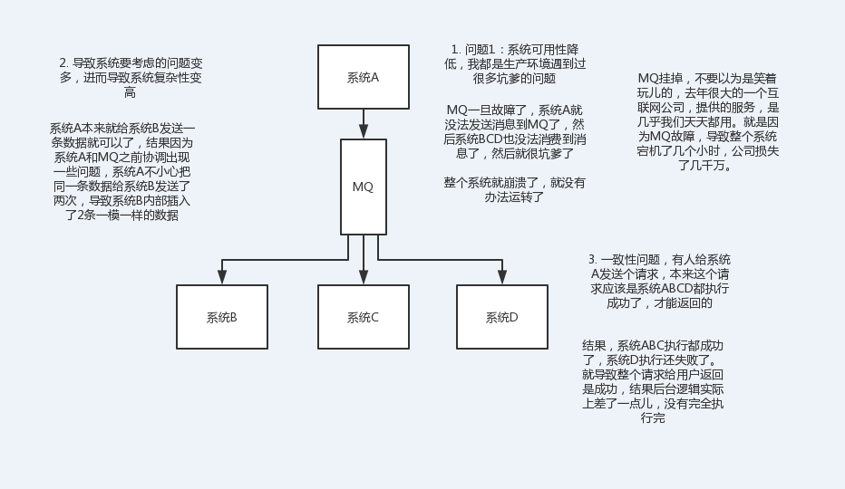

# 为何使用消息队列？使用消息队列的优缺点？

## 为何使用消息队列

1、服务解耦

2、异步处理

3、削峰填谷

面试一般最重要的就是要说清这3点。

其他：

4、连接流计算任务和数据

5、用于将消息广播给大量接收者

6、日志处理

## 使用消息队列带来的优点

与为何使用MQ类似，主要是为了：

- 解耦
- 异步
- 削峰填谷

### 缺点

　#### 1. 系统可用性降低

系统引入的外部依赖越多，越容易挂掉，如果MQ出问题，整个系统可能挂掉。

#### 2. 系统复杂性提高

可能出现如下问题：

- 消息重复消费
- 消息丢失
- 消息积压
- 如何保证消息传递的顺序性
- 如何保证消息队列的高可用

#### 3. 一致性问题

A处理完直接返回成功，但是BCD中，C失败了，导致数据不一致。

## 参考资料

- 中华石杉 java面试突击第一季