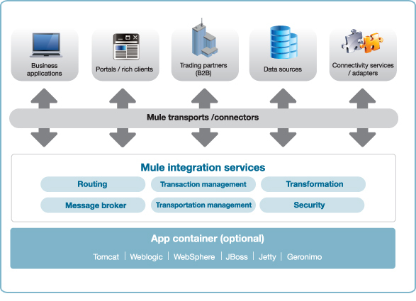
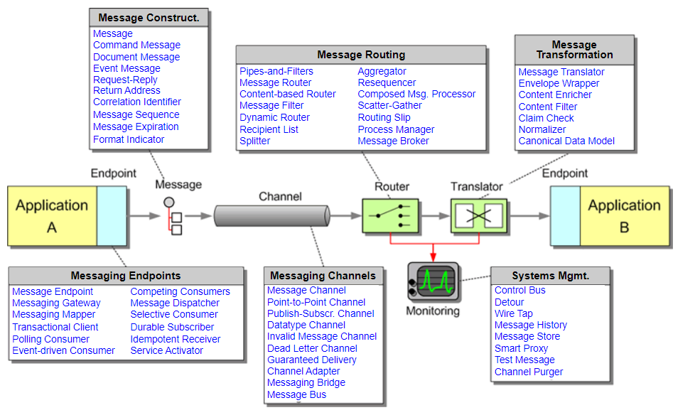
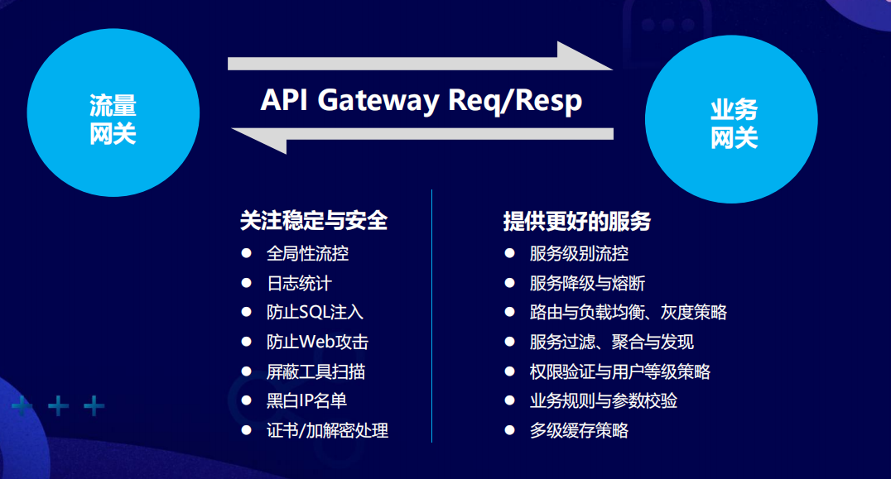

# EIP、ESB、API网关学习笔记

## 目标

说明EIP、ESB、API网关：

- 基本概念
- 相互之间的区别与联系
- 使用场景
- 常见框架

主要是知识整理，做个笔记，摘抄内容会给出出处。

## 预备知识

### SOA

在聊EIP ESB这些知识前，首先要了解什么是SOA。

> SOA是面向服务架构，是一种建设企业IT生态系统的架构指导思想。SOA的关注点是服务。
>
> 服务最基本的业务功能单元，由平台中立性的接口契约来定义。
>
> 通过将业务系统服务化，可以将不同模块解耦，各种异构系统间可以轻松实现服务调用、消息交换和资源共享。


借用一下来自[02.SOA架构与落地方式](https://zhuanlan.zhihu.com/p/97815644)  的内容：

- 从宏观角度：强调整个企业IT生态环境是一个大的整体。各个系统的服务拆解成不同粒度的服务，而这些服务又可以组装到一起，实现更复杂的业务逻辑
- 从研发角度：从代码的复用，扩展到服务的复用
- 从管理角度：从更高层次对整个企业内的IT系统进行管理。

落地方式：

- 分布式服务化

  - 相关技术dubbo, Spring Cloud, ICE等

- ESB集中式管理

  - > 传统企业的IT内部遗留系统包袱较重，资源整合很大一部分是需要打通新旧技术体系的任督二脉，所以更偏重于以**ESB**作为基础支撑技术，以整合集成为核心，将各个新旧系统的业务能力逐渐的在ESB容器上聚合和集成起来。比较流行的商业ESB有IBM的WMB和oracle的osb，开源esb有mule、servicemix、jbossesb、wso2esb和openesb。

## 基本概念

### 什么是ESB？

> ESB是一个集成的容器，是一个集中式的服务总线。通过ESB，可以**实现集成业务处理，监控系统间消息流动，管理系统间交互的业务服务**。ESB的关注点是**集成**，核心概念是**服务和消息**，主要方式是**协议适配和中介处理**。
>
> 系统与系统间的交互方式是服务。服务与服务之间，以及服务内部传递的都是消息。通过各种不同的协议适配，将各种不同平台的异构服务接入到ESB，转换成消息流。再通过各种中介处理：路由、转换、增强、分支、聚合等等。最后再将消息转换成适当形式，发送到指定的目的地或返回给调用方。
>
> 一般来说，**ESB本身的模型就是管道和过滤器**。管道就是各种传输和消息传递。各种中介处理，就是过滤器。可以比拟成自来水管和各种阀门的关系。

ESB的核心内容：

- 服务元数据管理
- 协议适配
- 中介服务
- 治理与监控
- 安全性
- **事务管理**、高性能、高可用、高可靠性、高稳定性等等。



比较流行的商业ESB有IBM的WMB和oracle的osb，开源esb有mule、servicemix、jbossesb、wso2esb和openesb。

### 什么是EIP？

> EIP（Enterprise Integration Patterns，企业集成模式）是集成领域的圣经，也是各种MOM消息中间件和ESB的理论基础。我们在MQ和ESB中常见的各种概念和术语，基本都是来自于EIP，比如消息代理、消息通道、消息端点、消息路由、消息转换、消息增强、信息分支、消息聚合、消息分解、消息重排等等，并在《**企业集成模式：设计、构建及部署消息传递解决方案**》一书中详细的描述了它们的内容与特点。

《**企业集成模式：设计、构建及部署消息传递解决方案**》还提供了一个官方网站，里面非常详细的介绍了65种messaging patterns， 参见这里：https://www.enterpriseintegrationpatterns.com/patterns/messaging/



EIP的直接实现一般叫EIP框架，开源的知名EIP框架有两个：**Camel**和S**pring integration**。**EIP可以作为ESB的基础骨架，在这个基础上填充其他必要的部分，定制出来一个ESB容器**。


### 什么是API网关？

>API网关是一个服务器，是系统的唯一入口。从面向对象设计的角度看，它与外观模式类似。API网关封装了系统内部架构，为每个客户端提供一个定制的API。它可能还具有其它职责，如身份验证、监控、负载均衡、缓存、请求分片与管理、静态响应处理。
>
>API网关方式的核心要点是，所有的客户端和消费端都通过统一的网关接入微服务，在网关层处理所有的非业务功能。通常，网关也是提供REST/HTTP的访问API。服务端通过API-GW注册和管理服务。

一般分为流量网关、业务网关，两者的作用：



注：引自 第7届MAD技术论坛-百亿流量API网关的设计与实现-kimmking-v1.0

常见网关以及性能比较可以参考：

- [API Gateway性能比较：NGINX vs. ZUUL vs.Cloud Gateway vs. Linkerd(译)](https://www.cnblogs.com/sunsky303/p/9025448.html)
- [如何评价 spring cloud gateway? 对比 zuul2.0 主要的优势是什么? - kimmking的回答 - 知乎](https://www.zhihu.com/question/280850489/answer/909248442)


## 相互之间的区别与联系

- EIP可以作为ESB的基础骨架，在这个基础上填充其他必要的部分，定制出来一个ESB容器。
- SOA是一种理念、一种指导思想，并未规定实现方式。目前主要有两种实现方式：
  - 中心化实现方式：ESB
  - 去中心化实现方式：微服务。在实现微服务时，往往需要API网关作为服务的入口，在网关层处理所有的非业务功能。

## 适用场景

### EIP适用场景

可以实现项目集成、，典型的比如说：

- 消息汇聚
- 消息分发
- 消息转换
- 规则引擎
- 。。。。。

典型的框架就是apache camel。

可以参考https://camel.apache.org/components/latest/eips/enterprise-integration-patterns.html   的案例。

具体一点的例子：

比如我们打算将消息队列从RabbitMQ在线迁移到Kafka，要求不能停线上服务、用户无感知。

- 原有项目集成camel, 消息的发送与接收都改成通过camel进行

  - 集成camel设置路由规则、谓词，比如下面这样，通过消息中的标签header.foo的值动态决定转发路径。header.foo可以通过动态配置中心配置。

  - ```java
    RouteBuilder builder = new RouteBuilder() {
        public void configure() {
            from("direct:a")
                .choice()
                    .when(simple("${header.foo} == 'rabbitmq'"))
                		//比如默认发送给RabbitMQ
                        .to("direct:rabbitmq")
                    .when(simple("${header.foo} == 'kafka'"))
                		//发送给Kafka
                        .to("direct:kafka")
                    .otherwise()
                		//报错
                        .to("direct:other");
        }
    };
    ```

- camel都改造完、上线后，动态配置中心里header.foo先配置成rabbitmq， 使得原有路径不动；

- 进行迁移操作时，直接修改动态配置中心即可。

参见：https://camel.apache.org/components/latest/eips/message-router.html

其他的例子：比如说ActiveMQ与RabbitMQ使用camel集成， 参见 https://blog.csdn.net/KimmKing/article/details/24427383

camel官方提供的示例：https://github.com/apache/camel-examples/tree/master/examples


### ESB适用场景

参见https://blog.csdn.net/aeaiesb/article/details/107661866

包括：

- 应用集成
- 数据集成
- 服务平台
- 平台协同

### API网关适用场景

参考上面的`什么是API网关`中的截图。


## 常见框架

EIP：apache camel, spring integration

ESB：比较流行的商业ESB有IBM的WMB和oracle的osb，开源esb有mule、servicemix、jbossesb、wso2esb和openesb。

API网关：

	- 业务网关：zuul, spring cloud gateway
	- 流量网关：OpenResty, Kong


## 参考资料

- [SOA、EIP与ESB](https://www.zhihu.com/column/SOAESB)
- [ESB（企业服务总线）相关知识点总结](https://www.jianshu.com/p/10ec5b86296f)
- [API Gateway性能比较：NGINX vs. ZUUL vs.Cloud Gateway vs. Linkerd(译)](https://www.cnblogs.com/sunsky303/p/9025448.html)
- [如何评价 spring cloud gateway? 对比 zuul2.0 主要的优势是什么? - kimmking的回答 - 知乎](https://www.zhihu.com/question/280850489/answer/909248442)
- [Apache Camel系列(1)----使用场景](https://www.cnblogs.com/zengbiaobiao2016/p/5480992.html)
- [API网关跟ESB的联系与区别](https://blog.csdn.net/aeaiesb/article/details/107661866)

