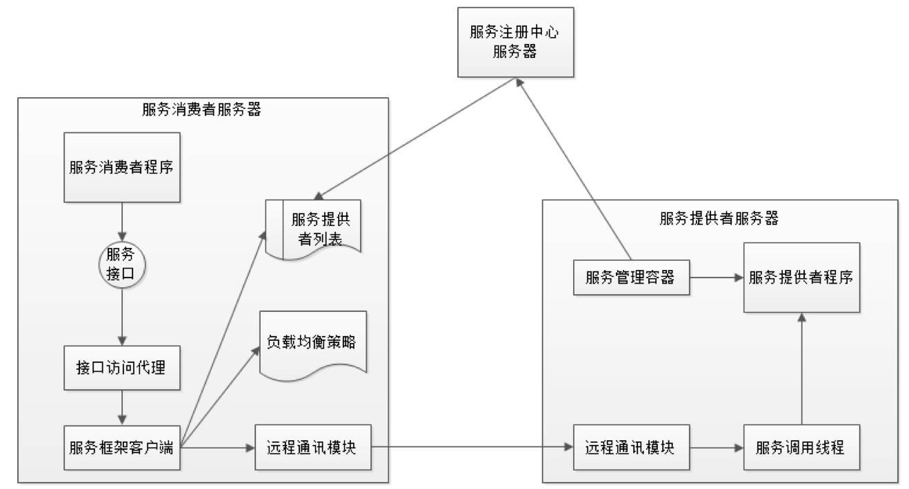

# 架构训练营week10课后作业

## 作业一：

（至少完成一个）

- 根据微服务框架 Dubbo 的架构图，画出 Dubbo 进行一次微服务调用的时序图。
  
- 关于微服务架构（中台架构、领域驱动设计、组件设计原则），你有什么样的思考和认识？


### Dubbo微服务调用时序图

```sequence
Title: Dubbo微服务调用时序图
Consumer->ConsumerProxy: 调用Producer.serviceX
Note over ConsumerProxy,Register: 一般客户端会定期从register拉取
ConsumerProxy->Register: 请求Producer实例列表
Register-->ConsumerProxy: 返回所有Producer实例列表
ConsumerProxy->ConsumerProxy: 根据负载均衡\n选出要请求的实例
ConsumerProxy->ConsumerProxy:序列化请求数据
ConsumerProxy->ProducerProxy: 调用远程通信模块，发送请求\n（目前使用Netty居多）
ProducerProxy->ProducerProxy: 反序列化
ProducerProxy->Producer:请求传递给Producer
Producer->Producer: 调用serviceX，获得结果
Producer-->ProducerProxy:请求结果返回给ProducerProxy
ProducerProxy-->ProducerProxy:将结果序列化
ProducerProxy-->ConsumerProxy:调用远程通信模块，返回结果
ConsumerProxy-->ConsumerProxy:将结果反序列化
ConsumerProxy-->Consumer:返回结果
```

