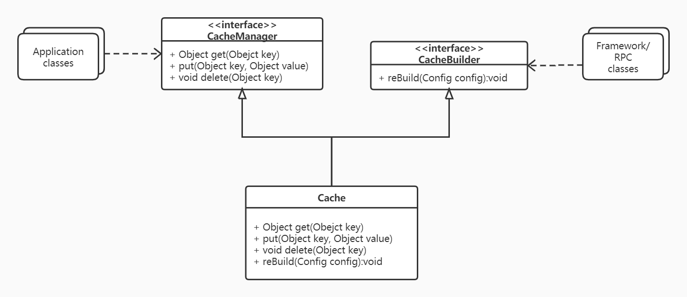

# 架构训练营week2课后作业

## 作业1：请描述什么是依赖倒置原则，为什么有时候依赖倒置原则又被称为好莱坞原则？

依赖倒置原则（Dependence Inversion Principle）是程序要依赖于抽象接口，不要依赖于具体实现。简单的说就是要求对抽象进行编程，不要对实现进行编程，这样就降低了耦合。

倒置的是模块或包的依赖关系。

好莱坞原则即：Don't call me, I'll call you.

之所以别名是好莱坞原则，因为依赖倒置原则将层次依赖关系倒转，这在框架开发中尤其明显，典型的比如spring/netty等著名框架。框架负责定义规范/接口/依赖关系/生命周期，框架使用者只需要在理解框架的处理流程后，实现一部分框架所要求的业务逻辑，框架自己去调用、而不是框架使用者去调用。

## 作业2：请用接口隔离原则优化 Cache 类的设计，画出优化后的类图。

**提示**：cache 实现类中有四个方法，其中 put get delete 方法是需要暴露给应用程序的，rebuild 方法是需要暴露给系统进行远程调用的。如果将 rebuild 暴露给应用程序，应用程序可能会错误调用 rebuild 方法，导致 cache 服务失效。按照接口隔离原则：不应该强迫客户程序依赖它们不需要的方法。也就是说，应该使 cache 类实现两个接口，一个接口包含 get put delete 暴露给应用程序，一个接口包含 rebuild 暴露给系统远程调用。从而实现接口隔离，使应用程序看不到 rebuild 方法。

解答：

