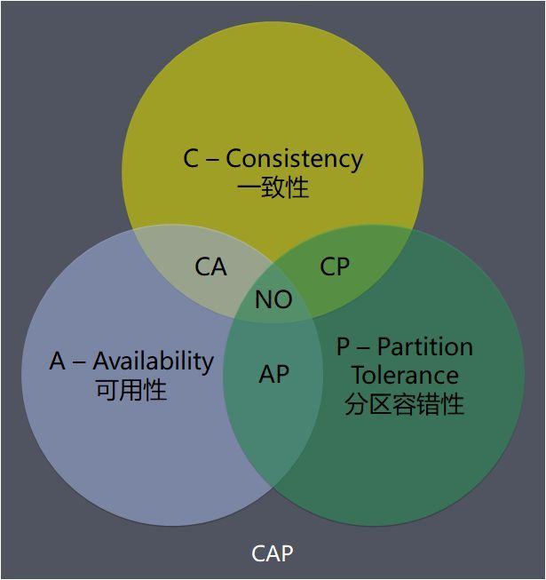

# 架构训练营week6课后作业

## 作业一（至少完成一项）：

1. 请简述 CAP 原理。
2. 针对 Doris 案例，请用 UML 时序图描述 Doris 临时失效的处理过程（包括判断系统进入临时失效状态，临时失效中的读写过程，失效恢复过程）。

## 1. 请简述CAP原理

CAP理论主要针对的是分布式系统，CAP分别表示：

- Consistency 一致性
  - Every read receives the most recent write or an error.
  - 对某个指定的客户端来说，读操作保证能够返回最新的写操作结果，或是返回一个错误。
  - 个人理解：一致性强调客户端每次能读操作，无论是在从分布式系统的哪个节点上读取，要么能读到最新数据（the most recent write），要么就是报错或是等待直到分布式系统达成一致后才能读取。比如说，对于zookeeper集群，如果在读取数据时，刚刚向zookeeper写入了一个数据、而zookeeper集群还没有将这个新数据同步到所有节点，那么此时的读取操作就会失败
- Availability 可用性
  - Every request receives a (non-error) response, without the guarantee that it contains the most recent write.
  - 个人理解：向分布式系统发起请求时，每次请求都能得到一个响应，即便系统中有服务器宕机，也不会报错或是没有响应。但另一方面，返回的响应数据不一定是最新的，可能有延迟。
- Partition Tolerance 分区容错性
  - The system continues to operate despite an arbitrary number of messages being dropped (or delayed) by the network between nodes.
  - 个人理解：即使因为网络原因，部分服务器节点之间消息丢失或者延迟了，系统依然应该是可以操作的

CAP理论最关键的一个论点就是：在一个系统中，最多只能同时满足CAP3个特性中的2个，不能3个同时满足。对于分布式系统而言，由于必须满足分区容错性P，那么系统在设计时，就只能在可用性A、一致性C之间做出取舍。这个结论也经常用如下形式的图来表示。



该理论模型最有价值的地方在于，既然我们知道了CAP理论，那么我们在设计一个分布式系统时，就不用再去耗费精力尝试设计一个同时满足C、A、P的系统，因为已经证明这是不可能的，我们只需要选取其中的两个目标作为系统的设计目标。

下面简单列举下常见分布式系统对于CAP理论的支持：

| 满足的特性 | 常见案例                                                    |      |
| ---------- | ----------------------------------------------------------- | ---- |
| CP         | Zookeeper, Etcd, Consul, Hbase,redis集群, Nacos（基于raft） |      |
| AP         | Eureka, Cassandra,DynamoDB, Nacos（AP模式）                 |      |
| CA         | 单机mysql                                                   |      |


## 2. 用 UML 时序图描述 Doris 临时失效的处理过程

注：由于时间不太充裕，apache doris源码没法一一推敲，只能根据课上讲解内容、自己的一些猜测来画序列图，尽量保证逻辑上是能走通的。

说明：下面图中

应用服务器：读写数据的客户端

存储服务器1：一直正常的服务端

存储服务器2：发生故障、又恢复的服务端

仲裁服务器：判断服务端是否失效

临时服务器：发生临时失效时的备份服务器


### 1、系统判断进入临时失效

下面这过程中，如果"应用服务器写入存储服务器"这个过程，不是由客户端自己去找出需要写的两个服务器，而是采用类似kafka的思路，只写入一个leader、由这个leader自己去负责写入多个副本，那序列图就又不一样。

不过从已有的ppt、文档来看，下图应该是比较贴近实际的。

```sequence
应用服务器 -> 存储服务器1 : 1:写入数据val
存储服务器1 --> 应用服务器 : 1:写入成功
应用服务器 -> 存储服务器2 : 1:写入数据val
存储服务器2 --> 应用服务器 : 1:写入失败
应用服务器 -> 存储服务器2 : 2:重试写入数据val
存储服务器2 --> 应用服务器 : 2:重试写入失败
应用服务器 -> 仲裁服务器 : 3:提交仲裁请求，告知存储服务器2可能失效
仲裁服务器 --> 应用服务器 : 3:收到，仲裁后告知临时服务器地址信息
应用服务器 -> 临时服务器 : 4: 写入数据val
临时服务器 -> 应用服务器 : 4: 写入成功


```

### 2、临时失效中的读写过程

临时失效的服务器不参与正常读写。

```sequence
应用服务器 -> 存储服务器1 : 1: 读取数据(只从正常服务器读取)
存储服务器1 --> 应用服务器 : 1: 返回数据
应用服务器 -> 存储服务器1 : 2: 写入数据val
存储服务器1 --> 应用服务器 : 2: 写入成功
应用服务器 -> 临时服务器 : 2: 写入数据val(故障恢复前，写入临时服务器)
临时服务器 --> 应用服务器 : 2: 写入成功

```


### 3、失效恢复过程

恢复过程：

1、恢复后，写操作会同步写给已恢复的服务器；

2、临时服务器中已保存的内容会同步给已恢复的服务器，所有同步操作完成后，会告知仲裁服务器，然后就可以恢复到正常读写。

```sequence
仲裁服务器 -> 应用服务器 : 0: 存储服务器2已恢复
仲裁服务器 -> 临时服务器 : 0: 存储服务器2已恢复
应用服务器 --> 仲裁服务器 : 0: 收到
临时服务器 --> 仲裁服务器 : 0: 收到
应用服务器 -> 存储服务器1 : 1:写入数据val
存储服务器1 --> 应用服务器 : 1:写入成功
# 发生故障的存储服务器2恢复后，重新可以接受读写情况
应用服务器 -> 存储服务器2 : 1:故障回复后的写操作，\n同步发给已恢复的服务器
存储服务器2 --> 应用服务器 : 1:写入成功
临时服务器 -> 存储服务器2 : 2: 故障恢复后，将迁移故障期间写入数据\n同步到已恢复的服务器
存储服务器2 --> 临时服务器 : 2: 同步成功
临时服务器 -> 仲裁服务器 : 3: 存储服务器2已同步完成
仲裁服务器 --> 临时服务器 : 3: 收到
临时服务器 -> 应用服务器 : 3: 存储服务器2已回复
应用服务器 --> 临时服务器 : 3: 收到
应用服务器 -> 存储服务器1 : 4:写入数据val
存储服务器1 --> 应用服务器 : 4:写入成功
应用服务器 -> 存储服务器2 : 4:写入数据val
存储服务器2 --> 应用服务器 : 4:写入成功
```

