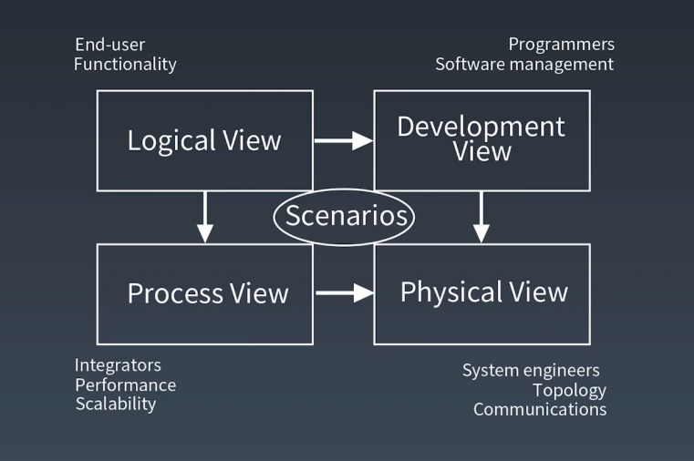
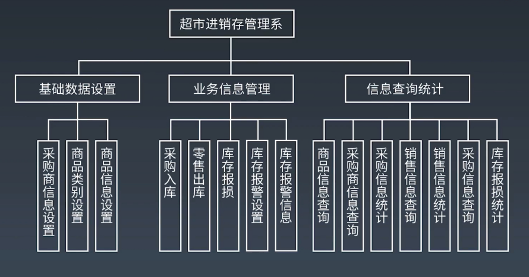
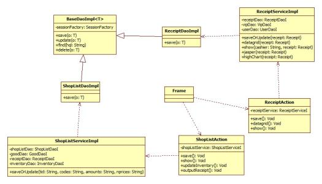
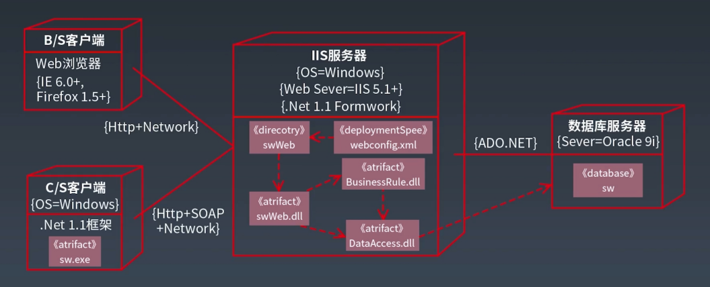
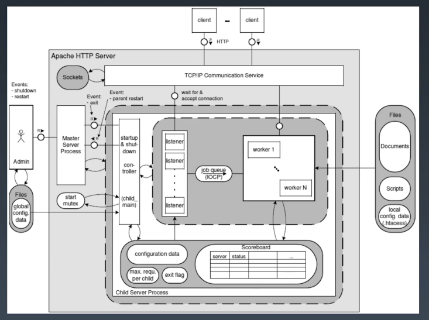
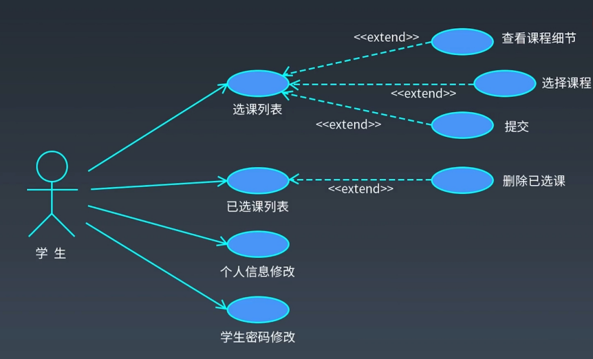
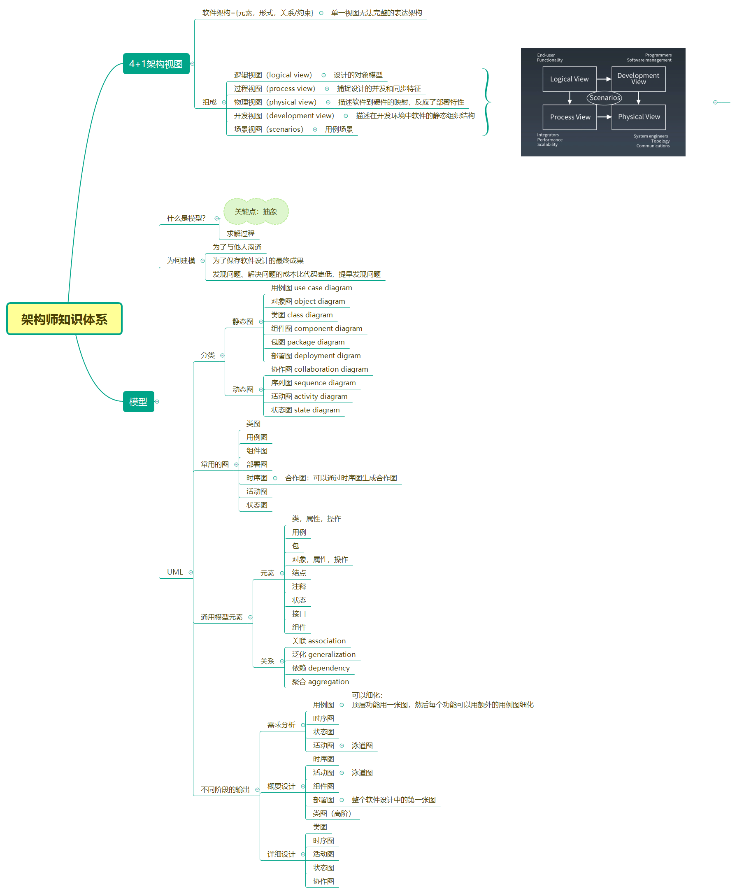

## 4+1视图

### 为何需要4+1视图？

单一视图无法完整的表达架构

### 4+1视图的组成

#### 逻辑视图（logical view）

设计的对象模型

用途：开发组织划分，成本/进度的评估

典型范例：功能模块图

#### 开发视图（development view）

描述在开发环境中软件的静态组织结构

用途：指导开发组织设计与开发实现

典型：类图

#### 物理视图（physical view）

描述软件到硬件的映射，反应了部署特性

示例：

#### 过程视图（process view）

捕捉设计的并发和同步特征

#### 场景视图（scenarios）

用例场景

## 使用UML进行软件架构设计与建模

### 什么是建模

关键点：**抽象**

### 为何建模？

- 为了与他人沟通
- 为了保存软件设计的最终成果
- 发现问题、解决问题的成本比代码更低，提早发现问题

### UML

Unified Modeling Language

#### 不同场景下各种图的使用

## 本周学习内容思维导图

