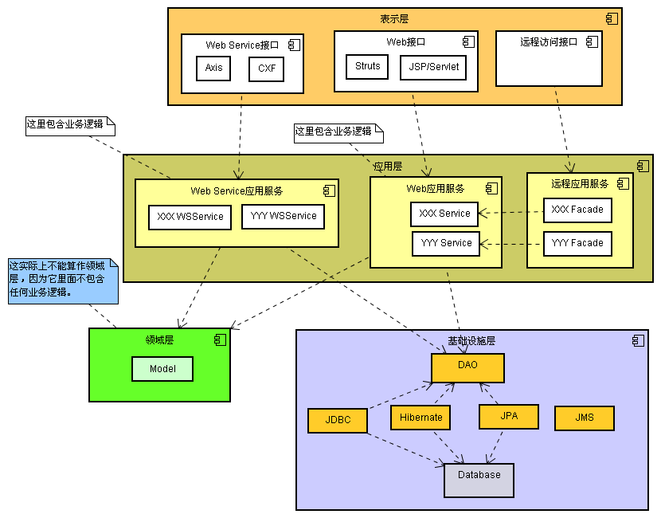
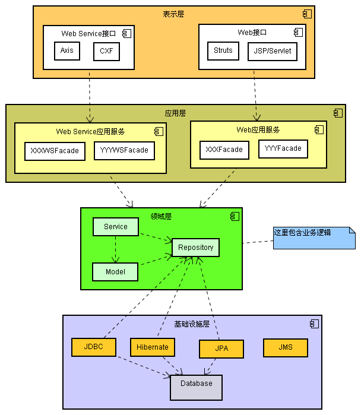

# 有关编程语言，面向对象，框架设计

[TOC]

## 编程语言

重点：抽象

编程语言发展过程 -> 抽象层级越来越高

## 面向对象

### 基本概念

万物皆为对象

### 面向对象编程

特征：封装，继承，多态

### 面向对象分析

领域模型：领域模型是对领域内的概念类或现实世界中对象的可视化表示。又称概念模型、领域对象模型、分析对象模型。它专注于分析问题领域本身，发掘重要的业务领域概念，并建立业务领域概念之间的关系。

- 贫血模型：领域对象里只有get和set方法（POJO），所有的业务逻辑都不包含在内而是放在Business Logic层。
  - 典型：spring框架实际上鼓励的就是贫血模型
  - 
- 充血模型：大多业务逻辑和持久化放在Domain Object里面，Business Logic只是简单封装部分业务逻辑以及控制事务、权限等
  - 

### 面向对象设计

目标：高内聚、低耦合

设计原则：

- 开闭原则Open/Closed Principle
- 依赖导致原则Dependency Inversion Principle
- Liskov替换原则
- 单一职责员原则Single Responsibility Principle
- 接口分离原则Interface Segregation Principle

#### 框架设计

核心：依赖倒置原则/好莱坞原则

- Don't call me, I'll call you

##### 个人理解

框架的作用是封装比较常见、公共的操作（比如IO、网络通讯等），将这些细节封装起来。这满足面向对象的封装特性。

而设计出来的框架最终要给其他开发者来使用，如果需要约束其他开发者的行为，就需要用到依赖倒置原则，以Java为例，可以通过抽象类、接口的方式，我们在框架中定义好生命周期/流程，仅开放出容许其他开发者使用的扩展点，既能约束使用框架者的行为，同时也让框架可以灵活扩展。

#### 典型案例

- JDK AQS，可以很方便的实现自定义锁
- Netty ChannelPipeline机制：编写各种各样的handler，实现各种功能
- Dubbo重写SPI机制
- RocketMQ队列选择策略可以通过实现MessageQueueSelector接口自定义策略
- spring提供的各种扩展点
- 。。。

