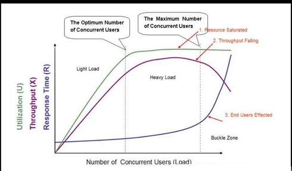
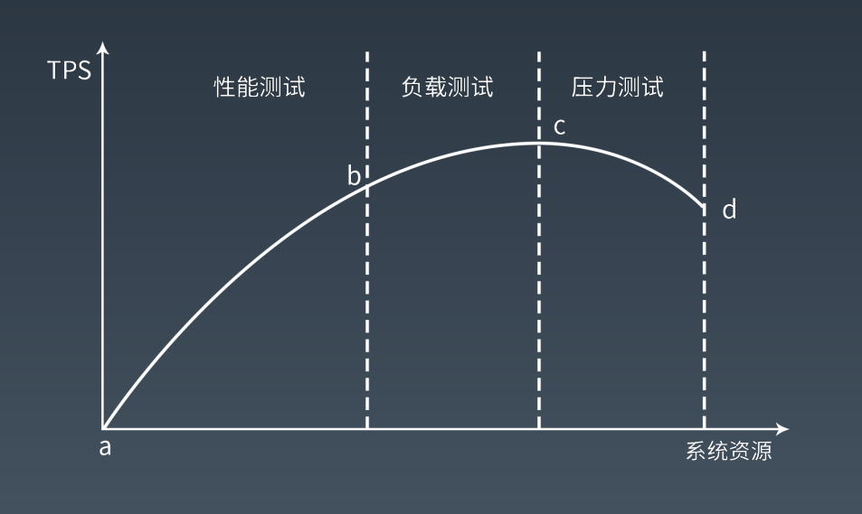
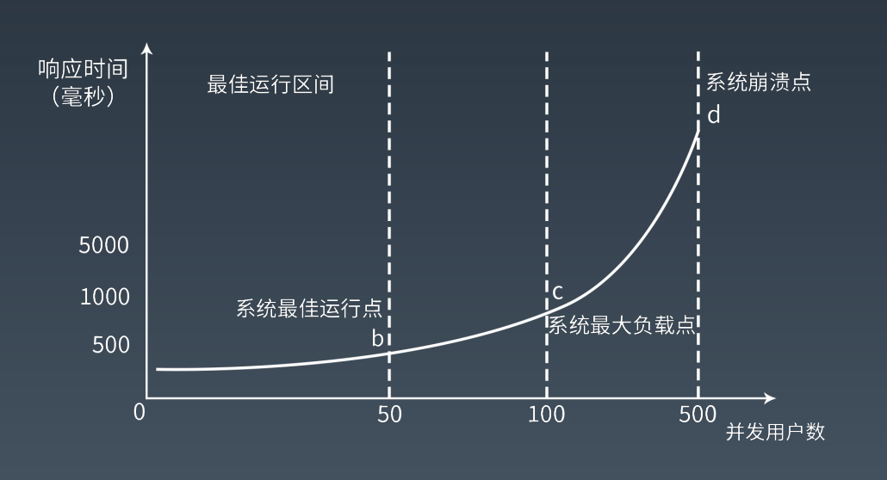
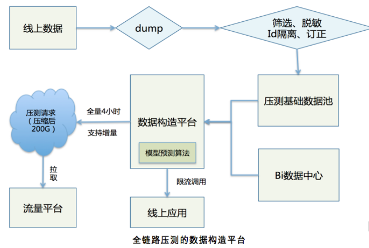

## 性能测试

性能测试是性能优化的前提和基础，也是性能优化结果的检查和度量标准。

不同视角下：

- 主观视角：用户感受到的性能
- 客观视角：性能指标衡量的性能


### 性能测试指标

主要指标：

- 响应时间
  - 应用系统从发出请求开始到收到最后响应数据所需要的时间
- 并发数
  - 系统能够同时处理请求的数目
  - 反映系统的负载能力
  - 注意与在线用户数（当前登录系统的用户数）、系统用户数（可能访问系统的总用户数）区分
  - 例：天猫双十一，在0点左右的在线用户数可能在千万数量级，但阿里官方给出的数据是TPS到达了54万，这是说某一时刻天猫淘宝系统中同时处理的（事务）并发数是54万。而不是说天猫整个系统的最大并发数能达到千万级别，不要闹笑话。
- 吞吐量
  - 单位时间内系统处理的请求的数量，体现件系统的处理能力。对于网站，可以用“请求数/秒”或是“页面数/秒”来衡量，也可以用“访问人数/天”或是“处理的业务数/小时”等来衡量。
  - TPS（每秒事务数）也是吞吐量的一个指标，此外还有HPS（每秒HTTP请求数），QPS（每秒查询数）等。
- 性能计数器等。
  - 描述服务器或操作系统性能的一些数据指标。包括 System Load、对象与线程数、内存使用、CPU 使用、磁盘与网络 I/O 等指标。
  - 系统监控的重要参数，需要设置报警阈值。

### 重点内容：响应时间、并发数、吞吐量的关系

```text
吞吐量 = ( 1000 / 响应时间ms ) × 并发数
```



注意不同阶段的响应时间、并发数、吞吐量是如何变化、原因。

个人理解如下：

```
随着并发压力增加，吞吐量会先升高，达到峰值后会逐步降低，如果负载过高可能导致系统崩溃、那此时的吞吐量就会是0。相应的，根据上面公式可以看出，吞吐量一定的时候，并发数增加，分给单个线程的资源变少，会导致系统响应时间变长，如果并发过高、系统崩溃，那此时的响应时间就是无限了~.~

原因：
- 在并发数较低时，系统负载能力要高于当前并发数量，资源比较充足，此时并发数逐渐增加，系统仍能迅速处理，因而吞吐量会逐步增大，此时响应时间不会有太大变化，但由于资源逐步紧缺，响应时间会有缓慢增加的趋势；
- 当并发数到达一定数量、超过系统负载能力，此时系统吞吐量到达最大值，并发数继续增大时，吞吐量不会有明显变化，但响应时间开始明显增加；
- 一旦并发数超过某个阈值，将导致系统崩溃，无法及时处理用户请求，导致服务雪崩，性能急剧下降，吞吐量下降，响应时间快速上升。
```


## 性能测试方法

具体可细分为：

- 性能测试
  - 个人理解：验证是否能达到性能预期
- 负载测试
  - 个人理解：找出系统的安全临界值
- 压力测试
  - 个人理解：超过安全负载，继续施压，直至系统崩溃，找到系统最大压力承受能力
- 稳定性测试
  - 个人理解：模拟线上，运行较长时间，检测系统是否能稳定提供服务






## 全链路压测

全链路压测其实指的就是在特定的业务场景下，将相关的链路完整的串联起来同时施压，尽可能模拟出真实的用户行为，当系统整站流量都被打上来的时候，必定会暴露出性能瓶颈，才能够探测出系统整体的真实处理能力，以及有指导的在大促前进行容量规划和性能优化，这便是线上实施全链路压测的真正目的。

### 全链路压测的挑战

- 数据构造：压测数据怎么构造？如何确保压测流量能走完所有流程、没有死角？
- 数据隔离：在线上真实环境模拟时，如何确保对线上无影响？
- 流量构造：如何模拟线上请求？大促所带来的巨大流量怎样制作出来？

#### 数据构造

个人理解：

- 线上用户数据记录日志，日志导出，经过筛选、脱敏等步骤，作为压测基础数据，然后结合BI提供的数据，通过数据构造平台生成压测数据，然后流量平台读取这些压测数据，生成相应的模拟请求。



#### 数据隔离

- 逻辑隔离
  - 真实数据与测试数据存放到一起，通过标识符区分开。
  - 缺点：可能污染线上数据
- 虚拟隔离
  - 在所有写数据的地方做 mock，并不真正的写进去。
  - 缺点：mock 对压测结果的准确性会产生干扰
- 物理隔离
  - 所有写数据的地方对压测流量进行识别，判断一旦是压测流量的写，就写到隔离的位置，包括存储、缓存、搜索引擎等等。

#### 流量构造

示例：天猫双十一全链路压测的流量平台

- master＋slave 结构
- master：负责的整个平台的运转控制、命令发送、数据收集、决策等。
- slave：部署在全球各地的 cdn 节点上，从而模拟从全球各地过来的用户请求。

## 性能优化

### 两个基本原则

- 你不能优化一个没有测试的软件
- 你不能优化一个你不了解的软件

### 性能测试主要指标

- 响应时间
- 并发数
- 吞吐量
- 性能计数器

### 性能优化的一般方法

- 性能测试，获得性能指标
- 指标分析，发现性能与资源瓶颈点
- 架构与代码分析，寻找性能与资源瓶颈关键所在
- 架构与代码优化，优化关键技术点，平衡资源利用
- 性能测试，进入性能优化闭环

### 系统性能优化的分层思想

- 机房与骨干网络性能优化
  - 异地多活的多机房架构
  - 专线网络与自主 CDN 建设
- 服务器与硬件性能优化
  - 使用更优的 CPU，磁盘，内存，网卡，对软件的性能优化可能是数量级的，有时候远远超过代码和架构的性能优化。
  - 比如从机械硬盘替换成SSD，网卡从1Gbps换成10Gbps
- 操作系统性能优化
  - 系统参数调优
- 虚拟机性能优化
  - JVM GC的选用
- 基础组件性能优化
  - 数据库连接池，web服务器、MQ等等，选用不同的组件，以及组件的不同版本，都可能导致系统性能发生变化。
- 软件架构性能优化
  - 缓存
    - 使用redis，或是本地缓存
  - 异步
    - 例如：Netty
  - 集群
    - 例如：Kafka，ZooKeeper
- 软件代码性能优化
  - 遵循面向对象的设计原则与设计模式编程
  - 并发编程
  - 资源复用
    - 池化技术
  - 异步编程


## 操作系统

### CPU核数有限，如何支持并发处理多任务？

进程分时执行，CPU时间片

### 进程的运行期状态

- 运行
- 就绪
- 阻塞

### 进程与线程

太简单了，此处掠过。

### 线程栈

此处实际上说的是基于栈的计算模型，JVM内部就是这样。

### 线程安全

### 临界区

### 阻塞导致高并发系统崩溃

阻塞导致线程既不能继续执行，也不能释放资源。进而导致资源耗尽。最终导致系统崩溃。

此处可以延伸的知识：分布式系统中：服务超时可能导致服务雪崩。

避免服务雪崩：熔断、降级、限流

线上可选用的框架：Hystrix, Sentinel

### 避免阻塞引起的崩溃

- 限流：控制进入计算机的请求数，进而减少创建的线程数。
- 降级：关闭部分功能程序的执行，尽早释放线程。
- 反应式：异步；无临界区（Actor 模型）
  - 和分布式系统通过MQ进行解耦、削峰限流的思路很类似


## 锁

### CAS

CAS 是一种系统原语，原语的执行必须是连续的，在执行过程中不允许被中断

**Java通过CAS原语在对象头中修改Mark Word实现加锁。**

### 偏向锁 轻量级锁 重量级锁

- 偏向锁：指一段同步代码一直被一个线程所访问，那么该线程会自动获取锁，降低获取锁的代价
- 轻量级锁：指当锁是偏向锁时，被另一个线程所访问，偏向锁就会升级为轻量级锁，其他线程会通过自旋的形式尝试获取锁，不会阻塞，提高性能
- 重量级锁：指当锁是轻量级锁时，另一个线程虽然自旋，但自旋不会一直持续下去，当自旋到一定次数时，还没获取到锁，就会进入阻塞，该锁膨胀为重量级锁，重量级锁会让其他申请的线程进入阻塞，性能降低

#### 延伸知识

硬件层面是通过缓存一致性协议、或是总线锁机制来实现锁。

### 各种锁

- 公平锁与非公平锁
- 可重入锁
- 独享锁/互斥锁/排它锁：一次只能被一个线程持有     共享锁：可以被多个线程持有
- 读写锁
- 乐观锁与悲观锁
  - 悲观锁认为对于同一个数据的并发操作，一定是会发生修改的，哪怕没有修改，也会认为修改。因此对于同一个数据的并发操作，悲观锁采取加锁的形式。悲观的认为，不加锁的并发操作一定会出问题
  - 乐观锁则认为对于同一个数据的并发操作，是不会发生修改的。在更新数据的时候，检查是否已经被修改过，如果修改过，就放弃。
- 分段锁
  - 设计目的是细化锁的粒度，当操作不需要更新整个数组的时候，就仅仅针对数组的一段进行加锁操作。
  - 示例：JDK ConcurrentHashMap LongAdder
- 自旋锁
  - 尝试获取锁的线程不会立即阻塞，而是采用循环的方式去尝试获取锁，这样的好处是减少线程上下文切换的消耗，缺点是循环会消耗 CPU。