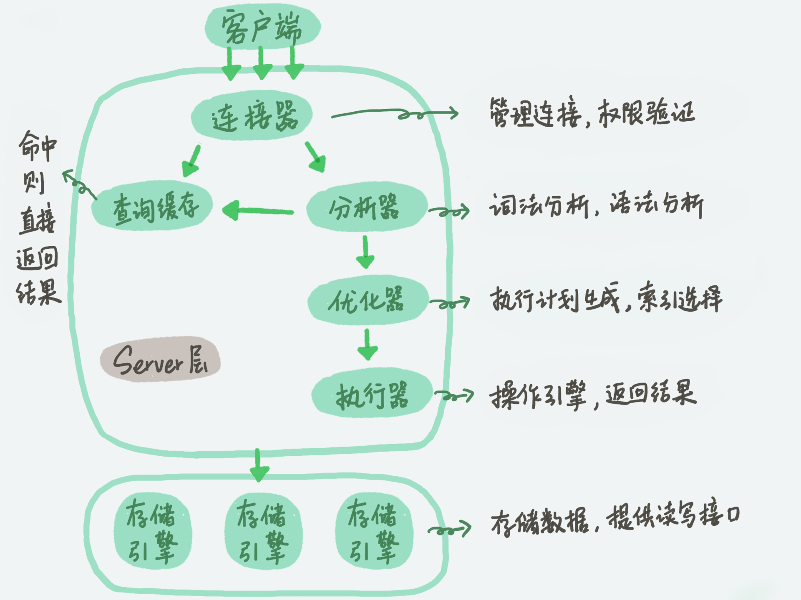
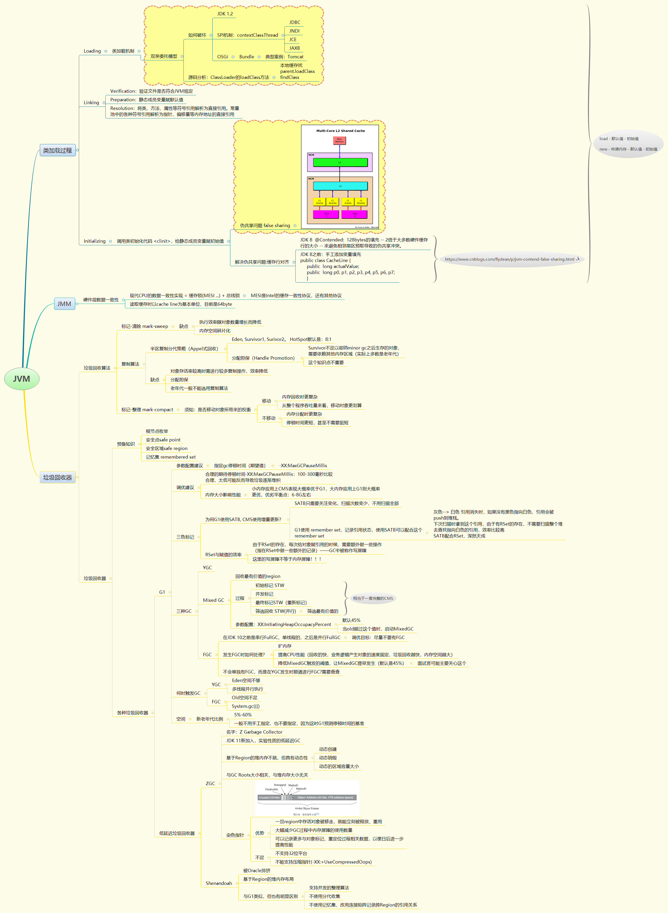
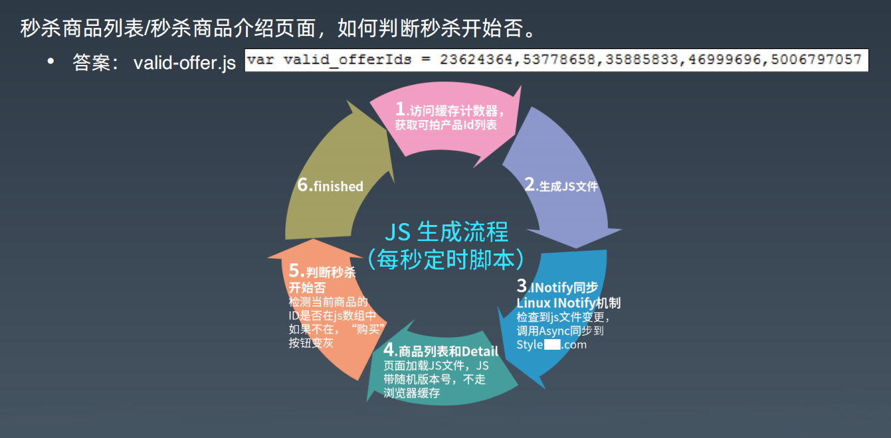
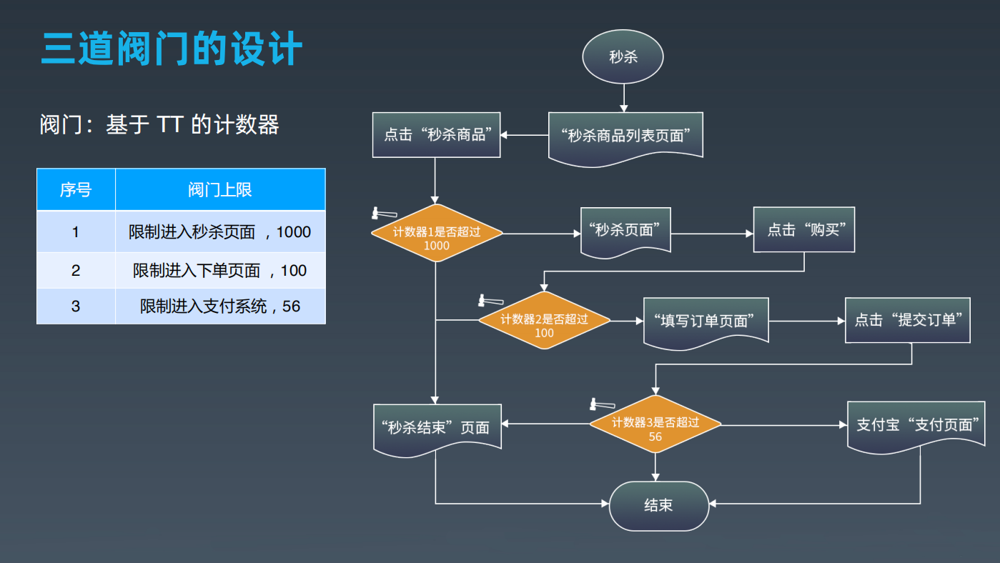
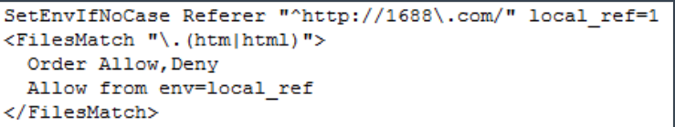

## 数据库原理

数据库一般组成

### 执行计划

### **为什么** **PrepareStatement** **更好**

- PrepareStatement 会预先提交带占位符的 SQL 到数据库进行预处理，提前生成执行计划，当给定占位符参数，真正执行 SQL 的时候，执行引擎可以直接执行，效率更好一点。
- PrepareStatement 可以防止 SQL 注入攻击。

### 关键概念

- 聚簇索引：聚簇索引的数据库记录和索引存储在一起
  - 如mysql，主键 ID 和所在的记录行存储在一个B+树中
- 非聚簇索引：非聚簇索引在叶子节点记录的就不是数据行记录，而是聚簇索引，也就是主键。
  - 通过非聚簇索引找到主键索引，再通过主键索引找到行记录的过程也被称作回表。

### 合理使用索引

不要盲目添加索引，尤其在生产环境中：

- 添加索引的alter操作会消耗较长的时间（分钟级） 
- Alter操作期间，所有数据库的增删改操作全部阻塞，对应用而言，因为连接不能释放，事实上，查询也被阻塞。

删除不用的索引，避免不必要的增删开销

使用更小的数据类型创建索引

### 数据库事务

ACID

**数据库事务日志**:进行事务操作时，事务日志文件会记录更新前的数据记录，然后再更新数据库中的记录，如果全部记录都更新成功，那么事务正常结束，如果过程中某条记录更新失败，那么整个事务全部回滚，已经更新的记录根据事务日志中记录的数据进行恢复，这样全部数据都恢复到事务提交前的状态，仍然保持数据一致性。

## JVM原理

重点：

- JVM结构
- java字节码，执行流程，编译与解释，JIT等
- 双亲委托模型
- GC算法
  - 复制算法
  - 标记-清理算法
  - 标记-整理算法
- 分代垃圾回收
- 常见垃圾回收器
  - serial/serial old
  - PS/PO
  - CMS
  - G1
  - ZGC
  - Shenandoah
- JVM参数调优
  - 启动参数分类：标准、非标准、非稳定参数
- JVM性能诊断工具
  - jps, jstat, jmap, jstack
  - jconsole, jvisualvm
- JUC

此处很多讲的比较基础，就不做详细笔记了，毕竟时间都比较宝贵，为了做笔记而做笔记就没必要了。之前自己复习了很多，JVM相关参见下图。

JVM

## 秒杀

### 高并发下面临的风险

- 网络带宽耗尽
- 服务器 Load 飙高，停止响应。
- 数据库瘫痪

### 技术挑战

- 瞬间高并发
  - 风险：带宽耗尽。
  - 服务器：崩溃，相当于D.D.O.S 攻击。
  - 要求秒杀系统必须高性能、高可用
- 秒杀器
  - 第一种：秒杀前不断刷新秒杀页面，直到秒杀开始，抢着下单。
    - 多出很多请求，增加了服务端的压力
  - 第二种：跳过秒杀页面，直接进入下单页面，下单。
    - 不符合秒杀的业务要求，作弊
- 资源的准备
  - 服务器资源
    - style服务器、图片服务器、静态服务器、交易服务器等
  - 带宽准备
    - 如图片出口带宽

### 架构设计目标

必须心中有数，知道需要考虑哪些问题！

#### 图片网络带宽

新增图片带宽：必须控制在 1.0G 左右，基于此，根据业务需求、预估可能需要多少图片，然后算出每张图片最大可以多少。

#### 网站并发  

需要结合业务需求预估单个商品预估，然后汇总出整个系统将面临的总并发量。

### 整体设计原则

#### 静态化  

- 采用 JS 自动更新技术将动态页面转化为静态页面

#### 并发控制，防秒杀器

- 如何判断秒杀是否已经开始
- 
  - 上图有两方面好处：
    - 有这个js时，页面点击秒杀按钮才能生效，没有这个js，就无法获取秒杀商品的id，那秒杀器就无法拿到商品id，即便拿到秒杀url也没用、发出请求也是空的HTTP请求、直接返回一个空的HTTP响应，不会走实际秒杀流程，不会对服务器造成压力；另外，秒杀器不断刷新页面，只要没这个js，就只是刷静态页面而已，这个请求直接打到CDN上，不会传到业务端，也不会对后端造成压力。
- 设置阀门，只放最前面的一部分人进入秒杀系统
- 
  - TT是一个计数服务案例而已。
- 秒杀详情页
  - URL随机
  - 秒杀前2秒放出，脚本生成，秒杀前
  - 1000次访问上限控制【每件商品只能放入1000人浏览】。
- 下单页面
  - 订单 ID，随机
  - 不能直接跳过秒杀 Detail 页面进入。
    - 
  - 每个秒杀商品，带预先生成的随机 Token 作 URL 参数
  - 如果秒杀过，直接跳到秒杀结束页面
  - 100 次访问上限控制【每件商品只能放入1000人下单】。

#### 简化流程

- 砍掉不重要的分支流程，如下单页面的所有数据库查询
- 以下单成功作为秒杀成功标志。支付流程只要在 1 天内完成即可。
  - 这样就可以将支付环节延后，通过调整业务流程的设计来达到平滑流量的目的

#### 前端优化

- 采用 YSLOW 原则提升页面响应速度

### 其他

#### apache 调优

KeepAlive 相关参数调优

• 其他参数调优

Ø HostnameLookups 设为 off， 对 allowfromdomain 等后的域名不进行正向和反向的 dns 解析。

• 关闭 cookies-log 日志

• 打开 Linux sendfile()

• 关闭无用的 module

Ø mod_Gzip

Ø （秒杀页面，非图片 HTML 文本所占流量比重可忽略不计，

zip 意义不大）

Ø mod_Beacon

Ø mod_hummock（等待反应过来，秒杀已经 over 了）

#### JBoss调优

Mod-jk worker 调优

JBoss AJP Connector

Tomcat APR 设定

#### 秒杀静态页面优化

图片合并

• 8 张图片合并成 1 张，CSS 偏移展示。

• 减少 HTTP 请求数，减少请求等待数。

• 减少发送 Cookies 的量。

HTML 内容压缩

图片压缩：图片 Bytes < 长X宽/2250

HTML Header Cache-Control 设置

CSS，JS 精简

• CSS，JS 精简到极致，部分直接写在页面中，减少 HTTP 请求次数。

#### 下单页面优化

数据库操作：全部砍掉

• 原下单页面要访问 8 次数据库，全部砍掉。

秒杀流程精简

• 砍掉填写或选择收货地址，放在秒杀成功后填写。

• 砍掉调用是否开通支付接口，秒杀首页文案提示必须开通。

采用内存缓存

• 秒杀 Offer 数据，支付相关信息，缓存

#### 交易系统优化

关闭 KeepAlive（分析交易系统 accesslog，用户在短时间内连续点击概率很低）

• JVM 优化

• 优化 CMS 垃圾回收器的参数

• 消灭 Top10 Bottlenecks

Ø Velocity 参数调优

Ø 采用 DBCP1.4 替换 C3P0

Ø Offer 产品参数的 XML 解析

#### 二跳页面的优化

XXXX.com 其他页面

• 前端优化： Yslow 规则调优

Ø 减少 HTTP 请求，合并 JS，CSS，图片，充分利用浏览器缓存。

• 图片压缩，公式：

• 避免发送 Cookies

交易系统优化

• 普通订单管理列表和 XXXX 秒批订单管理列表分离

• 禁止用模糊查询功能

### 应急预发

- 域名分离，独立域名，不影响XXXX原有业务。
  - Style 集群： style.XXXX.china.XXXX.com
  - 图片服务器集群：img.XXXX.china.XXXX.com
  - 静态页面集群：page.XXXX.china.XXXX.com
  - 出问题直接把 XXXX 相关域名卡掉，所有请求跳到万能出错页面。
- 机动服务器10台，备用。
- 拆东墙补西墙战略
  - 5天时间来不及采购服务器，因此 SA 待命，随时准备将非核心应用集群的冗余服务器下线，加入到秒杀集群。
- 壁虎断尾策略
  - 所有办法均失效的情况下，例如流量耗尽。
    - 非核心应用集群统统停止服务，如资讯，论坛，博客等社区系统。
    - 保住首页，Offer Detail，旺铺页面等核心应用的可用性。
- 万能出错页面：秒杀活动已经结束
  - 任何出错都 302 跳转到此页面
  - 位于另外集群
- 万幸：最终所有的预案都没有用上

