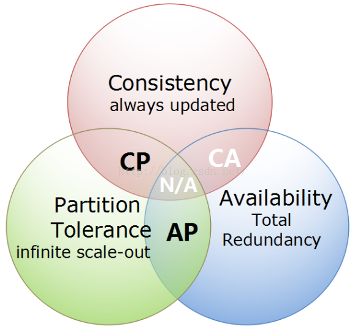
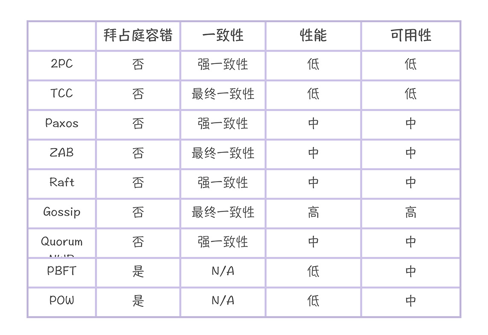
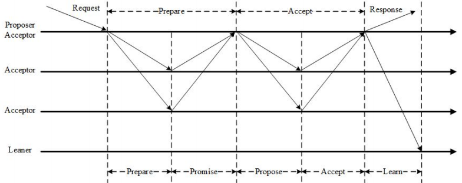
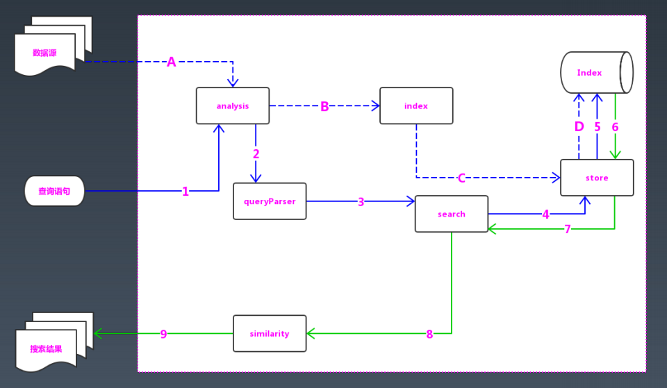
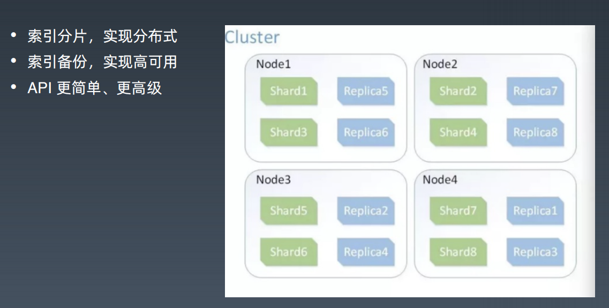

## CAP原理与NoSQL数据库框架

- Consistency 一致性
  - 强调读取到的数据都是最新的，没有过期数据
- Availability 可用性
  - 每次请求都得到响应，不会报错或是不响应
- Partition Tolerance 分区容错性
  - 部分节点失效时，系统依然可用

重点：

- CAP不可能同时保证，只能3选2
- 对分布式系统而言，P必须保证，因而只能再满足C或是A，即最常见的是CP，AP

### 一致性

常见的一致性保证：

#### 强一致性（Strict Consistency）

- 任何一次读都能读到某个数据的最近一次写的数据。
- 系统中的所有进程，看到的操作顺序，都和全局时钟下的顺序一致。

简言之，在任意时刻，所有节点中的数据是一样的。

#### 顺序一致性（Sequential Consistency）

两个要求：

- 任何一次读都能读到某个数据的最近一次写的数据。
- 系统的所有进程的顺序一致，而且是合理的。即不需要和全局时钟下的顺序一致，错的话一起错，对的话一起对。

范例：zookeeper

#### 弱一致性

数据更新后，如果能容忍后续的访问只能访问到部分或者全部访问不到，则是弱一致性。

最终一致性就属于弱一致性。

#### 最终一致性

不保证在任意时刻任意节点上的同一份数据都是相同的，但是随着时间的迁移，不同节点上的同一份数据总是在向趋同的方向变化。

简单说，就是在一段时间后，节点间的数据会最终达到一致状态。

——以上参考自：https://blog.csdn.net/chao2016/article/details/81149674

### 常见的一致性算法

引自：极客时间《分布式协议与算法实战》 https://time.geekbang.org/column/article/256765

一致性算法回头得系统整理下。

### 一致性解决方案

#### 最终一致性的常见思路
- 根据时间戳，最后写入覆盖。
- 客户端冲突解决
- 投票解决

#### 示例1：Cassandra

采用投票解决的思路。

#### 示例2: HBase

分布式文件系统，hmaster做路由选择，hregionserver做通讯、读写数据。

底层使用zookeeper选举，选出hmaster对外提供服务。

##### LSM Tree

log structed merge tree

连续写入效率高，适合写多读少。HBase有使用。

## ACID 与 BASE

ACID略

**BASE**:

- Basically Available : 基本可用。
  - 系统在出现不可预知故障时，允许损失部分可用性，如响应时间上的损失或功能上的损失
- Soft state : 弱状态（软状态）
  - 允许系统中的数据存在中间状态，并认为该中间状态的存在不会影响系统的整体可用性，即允许系统在不同节点的数据副本之间进行数据同步的过程存在延时。
- Eventually consistent：最终一致性
  - 系统中所有的数据副本，在经过一段时间的同步后，最终能够达到一个一致的状态，因此最终一致性的本质是需要系统保证数据能够达到一致，而不需要实时保证系统数据的强一致性。

## 分布式一致性与ZooKeeper

### 分布式系统脑裂

在一个分布式系统中，不同服务器获得了互相冲突的数据信息或者执行指令，导致整个集群陷入混乱，数据损坏，被称作分布式系统脑裂。

### 一致性算法

参见上面“常见的一致性算法”

### Paxos

3种角色：

- proposer
- acceptor
- learner

过程：

- prepare阶段

  - proposer提案，acceptor确认是否可以提案，获得多数认可则可以提案

- accept阶段

  - proposer收到认可后，发起自己的请求（选主，或是其他操作），acceptor收到后判断是否可以接受，给出反馈

- learn阶段

  - proposer收到多数接收提案的反馈后，确认提案通过，则将提案分发给所有learner

>注意：Proposer 生成全局唯一且递增的 Proposal ID (可使用时间戳加Server ID)，向所有Acceptors 发送 Prepare 请求，这里无需携带提案内容，只携带 Proposal ID 即可。  Acceptors 收到 Prepare 和 Propose 请求后
>- 不再接受 Proposal ID 小于等于当前请求的 Prepare 请求。
>- 不再接受 Proposal ID 小于当前请求的 Propose 请求

### ZAB协议

ZooKeeper Atomic Broadcast，简化了Paxos。还是投票的思想。

2种角色：

- leader
- follower

过程：

- 请求只发给leader，leader发给所有follower，follower告知是否可以接受
- leader接收到多数投票可以接受提案后，则提案通过，告知所有follower更新，整个集群状态更新。

#### 思想：投票 机制（quorum）

上面Paxos ZAB，都是利用投票的思想来实现。

### ZooKeeper应用场景

- 配置管理
  - 节点默认能存1M数据
- leader选举
- 集群管理
  - 树形结构，临时节点，watch
- 分布式同步
  - 利用临时节点，典型：分布式锁
- 统一命名
  - 利用有序节点特性

## 搜索引擎

### 爬虫

爬虫禁爬协议

### 文档矩阵与倒排索引

主要需要理解倒排索引。

细节略过，有需要的时候再细看。

### Lucene

> 索引有更新，就需要重新全量创建一个索引来替换原来的索引。这种方式在数据量很大时效率很低，并且由于创建一次索引的成本很高，性能也很差。Lucene 中引入了段的概念，将一个索引文件拆分为多个子文件，每个子文件叫做段，每个段都是一个独立的可被搜索的数据集，索引的修改针对段进行操作。
>
> 为了控制索引里段的数量，我们必须定期进行段合并操作

Lucene架构如上图。

### ElasticSearch

## 参考资料

- 极客时间  架构训练营