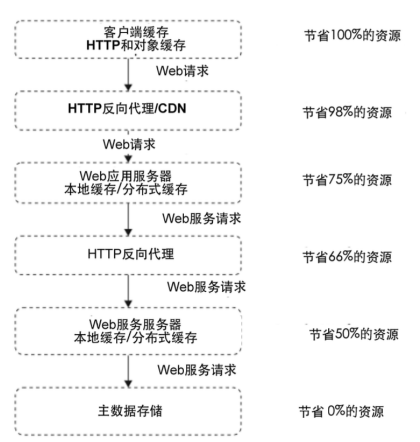
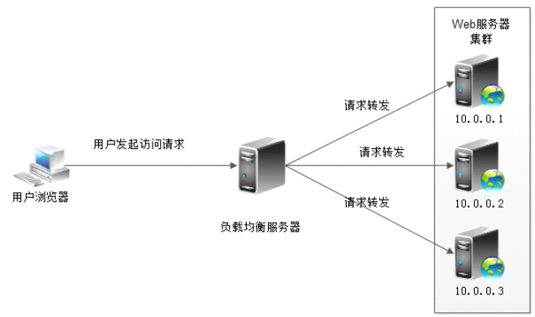

[TOC]

## 技术选型（1）：分布式缓存架构

### 1.1 缓存基本概念

缓存：存储在计算机上的一个原始数据复制集，以便于访问 – 维基百科

#### 缓存（ Cache ）和缓冲 （Buffer ）的分别？

缓存(cache)：把常用数据存储到可以快速获取的区域(缓存区)，以备重复利用，提高效率。

- 例如：从内存中读取数据时，先将常用的数据存放到缓存区，硬盘直接从缓存区读取。

缓冲(buffer)：在数据流转过程中，不同层次数据速度不一致时，利用缓冲区来缓解上下层之间速度问题。增加速度。

- 例如：将数据写入到内存时，先写入缓冲区，内存则直接从缓冲区中读取写入，减少IO次数，增加速度，降低对磁盘的损耗

### 1.2 缓存的应用场景

- CPU缓存
  - L1/L2/L3
- 操作系统缓存
  - PageCache
    - Kafka/RocketMQ持久化
- 数据库缓存
  - MySQL 5查询缓存，注意MySQL 8已经彻底去掉了缓存
- JVM编译缓存
  - JVM中code cache（属于非堆内存）保存JIT编译的本地机器码、JNI使用的本地方法代码
- CDN缓存
  - 常见用法：静态资源放到CDN，比如图片
- 代理与反向代理缓存
  - 代理缓存
  - 反向代理缓存：数据中心缓存
- 应用程序缓存
  - 本地缓存，比如google guava, caffeine, ehcache等
- 分布式对象缓存
  - redis, memcached

### 1.3 缓存数据存储

典型：JDK HashMap的数组+链表方式

### 1.4 缓存关键指标

- 缓存命中率
  - 影响命中率的指标：
    - 缓存键集合大小
      - 从统计数字上看，应用生成的唯一键越多，重用的机会越小。一定要想办法减少可能的缓存键数量。键数量越少，缓存的效率越高。
    - 缓存可使用内存空间
    - 缓存对象生存时间
      - TTL(time to live)

### 1.5 缓存方式

#### 1.5.1 通读换出 read-through

通读缓存给客户端返回缓存资源，并在请求未命中缓存时获取实际数据。

客户端连接的是通读缓存而不是生成响应的原始服务器。

示例：代理缓存，反向代理缓存，CDN

#### 1.5.2 旁路缓存 cache-aside

应用代码通常会询问对象缓存需要的对象是否存在，如果存在，它会获取并使用缓存的对象，如果不存在或已过期， 应用会连接主数据源来组装对象，并将其保存回对象缓存中以便将来使用。

示例：对象缓存，比如：

- 浏览器对象缓存
- 本地对象缓存
- 本地对象缓存构建分布式集群
  - 互联网时代这种方式已被抛弃，数据重复浪费资源，数据同步浪费网络资源
- **分布式对象缓存**
  - 目前最常用
  - redis/memcached

旁路缓存通常是一个独立的键值对（key-value）存储。

### 1.6 分布式对象缓存的一致性hash算法

参见[白话解析：一致性哈希算法 consistent hashing](http://www.zsythink.net/archives/1182)

一般采用**基于虚拟节点的一致性Hash算法**，以便减轻集群扩容或是机器宕机的影响。

### 技术栈各个层次的缓存

### 1. 7 合理使用缓存

缓存滥用的一些场景：

- 频繁修改的数据
  - 一般说来，数据的读写比在2:1以上，缓存才有意义
- 没有热点的访问
  - 如果应用系统访问数据没有热点，不遵循二八定律，即大部分数据访问不是集中在小部分数据上，那么缓存就没有意义，因为大部分数据还没有被再次访问就已经被挤出缓存了
- 数据不一致与脏读
  - 一般会对缓存的数据设置失效时间，失效后需要从数据源重新加载。应用要容忍一定时间的数据不一致。
  - ，如卖家已经编辑了商品属性，但是需要过一段时间才能被买家看到。在互联网应用中，这种延迟通常是可以接受的，但是具体应用仍需慎重对待。还有一种策略是数据更新时立即更新缓存，不过也会带来更多系统开销和事务一致性的问题。因此数据更新时通知缓存失效，删除该缓存数据，是一种更加稳妥的做法。
- 缓存雪崩
- 缓存预热warm up
- 缓存穿透
  - 解决：
    - 方案1：布隆过滤器
      - 一般会采用redis的布隆过滤器，不过guava本身也实现了布隆过滤器，看使用场景
    - 方案2：将不存在的数据也缓存起来（其 value 值为 null），并设定一个较短的失效时间

## 技术选型（2）：消息队列与异步架构

### 2.1 消息队列构建异步调用架构

#### 点对点模型

#### 发布/订阅模型

### 2.2 消息队列的好处

- 异步处理，提高性能
- 解耦
- 削峰填谷
- 伸缩性
- 失败隔离，自我修复

### 事件驱动架构

### 2.3 消息队列产品比较

可以将搜索引擎搜索结果作为项目活跃度的一个参考。

详情可以参考之前我整理的这篇文章： https://blog.csdn.net/evasnowind/article/details/109208079 此处就不展开说了。

### 2.4 引入消息队列的缺点

　#### 1. 系统可用性降低

系统引入的外部依赖越多，越容易挂掉，如果MQ出问题，整个系统可能挂掉。

#### 2. 系统复杂性提高

可能出现如下问题：

- 消息重复消费
- 消息丢失
- 消息积压
- 如何保证消息传递的顺序性
- 如何保证消息队列的高可用

#### 3. 一致性问题

A处理完直接返回成功，但是BCD中，C失败了，导致数据不一致。

## 技术选型（3）：负载均衡

#### 3.1 常见负载均衡服务器实现

- HTTP重定向负载均衡
- DNS负载均衡
- 反向代理负载均衡
- IP负载均衡
- 数据链路负载均衡

#### 3.2.常见负载均衡服务器实现的优缺点

下面各种负载均衡的具体实现、详细内容可以参考《大型网站技术架构——核心原理与案例分析》“6.2 应用服务器集群的伸缩性设计”

##### 3.2.1 HTTP重定向负载均衡

- 存在安全问题：负载均衡服务器进行转发给内网服务器时，会暴露内网服务器的IP，容易受到攻击

- 浏览器需要两次请求服务器才能完成一次访问，性能较差；重定向服务器本身的处理能力有可能成为瓶颈，整个集群的伸缩性规模有限；

- 使用HTTP返回码302重定向，有可能使搜索引擎判断为SEO作弊，降低搜索排名。

  **因此实践中很少使用这种负载均衡方案来部署。**

##### 3.2.2 基于DNS的两层负载均衡

两层负载均衡，大型互联网系统基本必备

- 第一层：DNS
- 第二层：DNS指向的是作为第二层负载均衡的服务器的IP地址

不同用户访问同一个DNS，得到不同的服务器——CDN的原理。
DNS中配置A记录，即可实现。

##### 3.2.3 反向代理负载均衡

本地有走本地，没有则将请求转发给后面的服务器，转发时会进行负载均衡。

比较常见，适合规模比较小、服务器有几台、十几台的规模）的情况，大型网站用的很少，因为性能较低、效率比较差

因为是应用层协议，使用HTTP进行负载均衡，需要进行应用层的协议转化，收到一个TCP协议包还要等待、需拿到完整的请求包、响应包（TCP/UDP攒成一个完整的HTTP报文）才能进一步操作

##### 3.2.4 IP负载均衡

在IP这一层进行负载均衡，拿到TCP数据包后，将数据包的IP立马修改为应用服务器的IP；应用服务器返回响应也要返回给这台负载均衡服务器，负载均衡服务器再将响应数据包中目标地址IP修改。

计算压力比反向代理（HTTP层）小，处理能力要大得多

问题：响应数据量

请求数据包一般比较小，但响应数据包可能会比较大（比如图片），负载均衡服务器的网卡带宽可能成为瓶颈

##### 3.2.5 数据链路层负载均衡

使用MAC地址，负载均衡服务器不用处理

技巧：负载均衡服务器与应用服务器采用相同的IP，虚拟IP，负载均衡服务器不用修改IP地址、只修改MAC地址，改为应用服务器MAC，响应数据不用经过负载均衡服务器、直接返回给用户

又被称为“三角模式”。

#### 3.3 负载均衡算法

- 轮询：适合于所有服务器硬件都相同的场景。
- 加权轮询：根据应用服务器硬件性能的情况，在轮询的基础上，按照配置的权重将请求分发到每个服务器，高性能的服务器分配更多请求
- 随机：在许多场合下，这种方案都很简单实用，因为好的随机数本身就很均衡。如果应用服务器硬件配置不同，也可以很容易的使用加权随机算法。
- 最少连接：
  - 记录每个应用服务器正在处理的连接数（请求数），将新到的请求分发到最少连接的服务器上，应该说，这是最符合负载均衡定义的算法。
  - 不常见，因为意义不大
- 源地址散列
  - 根据请求来源的IP地址进行Hash计算，得到应用服务器，该算法可以保证同一个来源的请求总在同一个服务器上处理，实现会话粘滞
  - 不常见，会话粘滞一般不会通过这个做

#### 3.4 应用服务器集群的session管理

session管理也是考虑负载均衡算法的因素

- session复制
  - 问题：要复制给所有服务器，**在实际应用几乎没人使用**
- session绑定
  - session 源地址散列，**实践中几乎不使用**，因为互联网应用除了性能还会关注高可用，如果这台服务器宕机，会导致数据丢失、无法保证高可用
- 通过cookie记录session
  - 上下文记录cookie，请求中包含cookie，会话不用依赖服务器，问题cookie不大、只能记录少量数据，且有些场景会禁用cookie，**实践中较为常用**
- 使用session服务器
  - 应用服务器不记录session，设置单独的共享session服务器，服务器宕机、扩容都不影响，**最常见的session方案**，应用服务器是无状态的，即无状态的应用服务器

## 参考资料

- 大型网站技术架构