## 文件与硬盘I/O

基本概念：

- 机械硬盘
- 固态硬盘

### B树

一个m阶的B树具有如下几个**特征**：B树中所有结点的孩子结点最大值称为B树的阶，通常用m表示。一个结点有k个孩子时，必有k-1个关键字才能将子树中所有关键字划分为k个子集。

- B树主要用于文件系统以及部分数据库索引，例如： MongoDB。而大部分关系数据库则使用B+树做索引，例如：mysql数据库；
- 从查找效率考虑一般要求B树的阶数m >= 3;
- B-树上算法的执行时间主要由读、写磁盘的次数来决定，故一次I/O操作应读写尽可能多的信息。因此B-树的结点规模一般以一个磁盘页（一般是4K）为单位。一个结点包含的关键字及其孩子个数取决于磁盘页的大小。

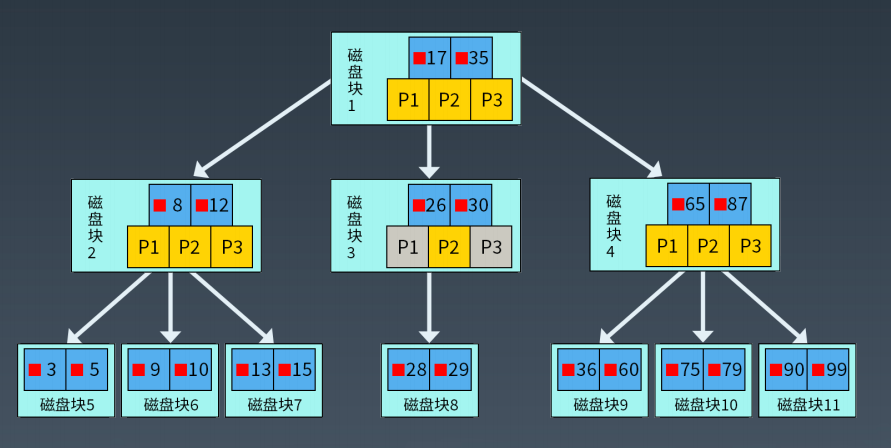

### B+树

Ｂ＋树是Ｂ树的变种，**B+树相比B树的优势**：
　　1.单一节点存储更多的元素，使得查询的IO次数更少；
　　2.所有查询都要查找到叶子节点，查询性能稳定；
　　3.所有叶子节点形成有序链表，便于范围查询。

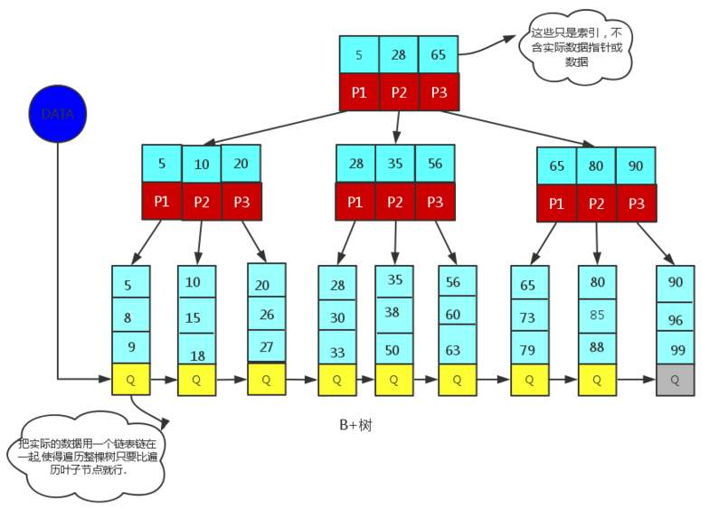

有关B树/B+树的详细内容，参见：https://blog.csdn.net/z_ryan/article/details/79685072

### LSM树 Log-Structured Merge-Tree

参见：https://blog.csdn.net/las723/article/details/93767240

不属于一个具体的数据结构，它更多是一种数据结构的设计思想。大多NoSQL数据库核心思想都是基于LSM来做的，只是具体的实现不同。

#### LSM树原理

LSM树由两个或以上的存储结构组成，比如在论文中为了方便说明使用了最简单的两个存储结构。一个存储结构常驻内存中，称为C0 tree，具体可以是任何方便健值查找的数据结构，比如红黑树、map之类，甚至可以是跳表。另外一个存储结构常驻在硬盘中，称为C1 tree，具体结构类似B树。C1所有节点都是100%满的，节点的大小为磁盘块大小。

插入一条新纪录时，首先在日志文件中插入操作日志，以便后面恢复使用，日志是以append形式插入，所以速度非常快；将新纪录的索引插入到C0中，这里在内存中完成，不涉及磁盘IO操作；当C0大小达到某一阈值时或者每隔一段时间，将C0中记录滚动合并到磁盘C1中；对于多个存储结构的情况，当C1体量越来越大就向C2合并，以此类推，一直往上合并Ck。

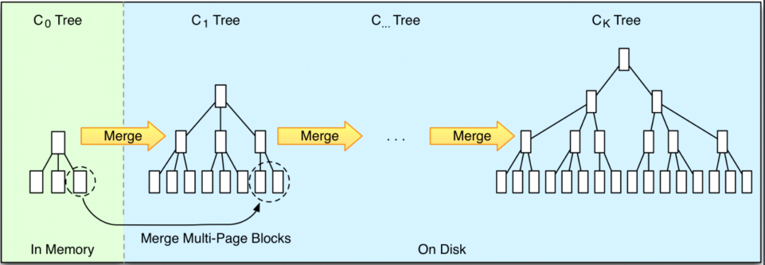

### 文件控制块

文件系统将硬盘空间以块（一般大小是4K）为单位进行划分，每个文件占据若干个块，然后再通过一个文件控制块 FCB 记录每个文件占据的硬盘数据块。

#### Linux Inode

大小固定

### RAID 独立硬盘冗余阵列

原理

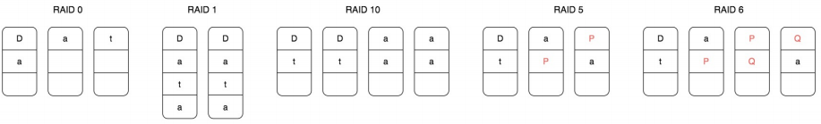

比较：

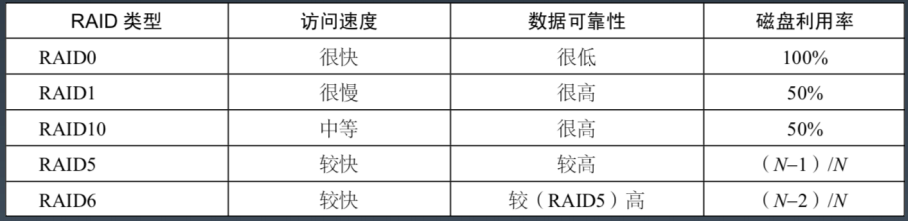

### 分布式文件系统HDFS

## 数据结构与算法

### 时间复杂度与空间复杂度

- 概念略
- 常见时间复杂度比较

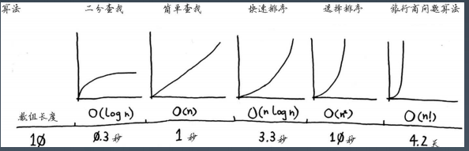

### NP问题

- P 问题：能在多项式时间复杂度内解决的问题。

- NP 问题：能在多项式时间复杂度内验证答案正确与否的问题。
- NP ?= P
- NP-hard 问题：比 NP 问题更难的问题（NP问题的解法可以规约到 NP-hard 问题的解法）
- NP 完全问题：是一个 NP-hard 问题，也是一个 NP 问题

### 常见的数据结构

简单的内容就不列出相关知识点了，这块实在太基础了~.~

#### 数组

#### 链表

#### Hash表

数组+链表，实现快速查找与删除 --> JDK HashMap基本思想，JDK 1.8有进一步优化，引入红黑树

知识点：hash冲突

#### 栈

- 后进先出

#### 队列

- 先进先出

使用：使用队列搜索最短路径

- 实际上就是使用队列来实现BFS

#### 树

##### 二叉排序树

- 左子树上所有结点的值均小于或等于它的根结点的值
- 右子树上所有结点的值均大于或等于它的根结点的值
- 左、右子树也分别为二叉排序树。

##### 平衡二叉树

- 从任何一个节点出发，左右子树深度之差的绝对值不超过1。
- 左右子树仍然为平衡二叉树。

插入/删除节点时，通过旋转二叉树来回复平衡

##### 红黑树
- 每个节点只有两种颜色：红色和黑色。
- 根节点是黑色的。
- 每个叶子节点（NIL）都是黑色的空节点。
- 从根节点到叶子节点，不会出现两个连续的红色节点。
- 从任何一个节点出发，到叶子节点，这条路径上都有相同数目的黑色节点。

#### 跳表

### 常见算法

- 穷举算法
- 递归算法
- 贪心算法
  - 背包问题
  - 迪杰斯特拉算法
- 动态规划
  - 背包问题
- 遗传算法
  - 基因编码，染色体
  - 适应函数与控制参数
  - 选择算法
  - 交叉遗传
  - **遗传算法得到的不是最优解**，但速度一般会快一些

## 网络通信协议

一次网络通信历程

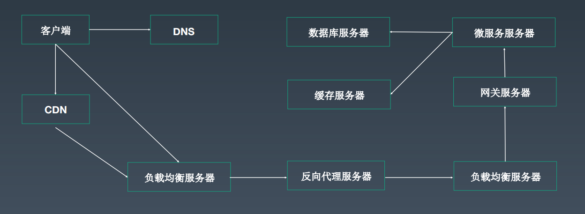

### OSI模型与TCP/IP模型比较

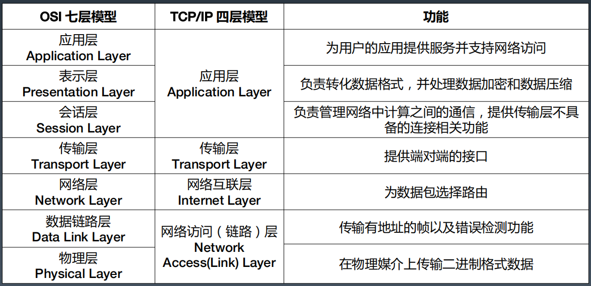

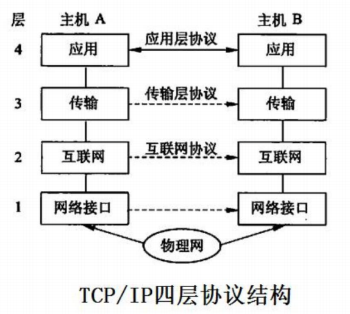

### 网络数据包格式

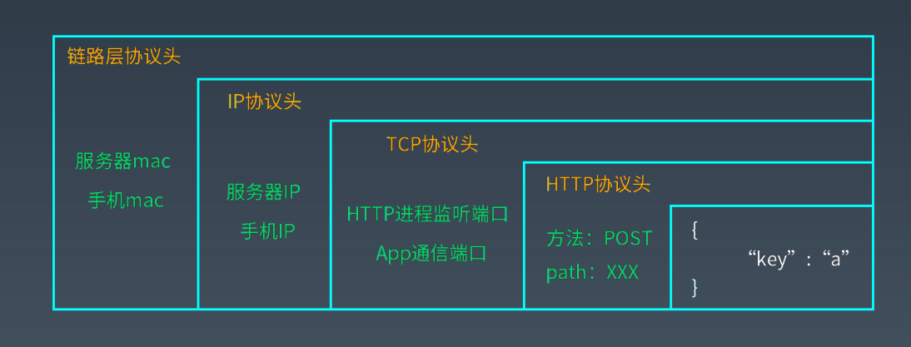

### TCP/IP模型各层详解

#### 物理层

负责数据的物理传输。

#### 链路层

将数据封装成数据帧，以帧为单位通过物理层进行通信，有了帧，就可以在帧上进行数据校验，进行流量控制。

链路层会定义帧的大小，这个大小也被称为最大传输单元（Maximum Transmission Unit）。

一个标准的以太网数据帧大小是：`1518`，头信息有14字节，尾部校验和FCS占了4字节，所以真正留给上层协议传输数据的大小就是：1518 - 14 - 4 = 1500。

MTU为何是1500参见 这篇文章：https://developer.aliyun.com/article/222535

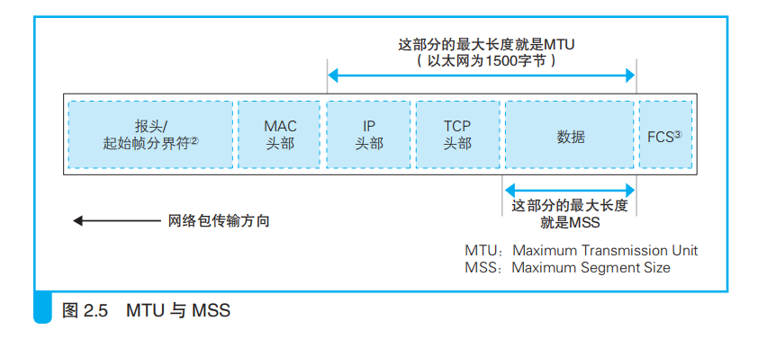

上图来自《网络是怎样连接的》。

**TCP头部长度为20-60字节，IP头部长度为20-60字节，一般而言这两者都是20字节，因此MSS长度一般为1460字节。**

数据链路层也会将封装好的帧添加一个帧头，帧头里记录的一个重要信息就是发送者和接受者的 **MAC 地址**。

#### 网络层

网络层 IP 协议使得互联网应用根据 IP 地址就能访问到目标服务器，请求离开 App 后，到达运营服务商的交换机，交换机会根据这个 IP 地址进行路由转发，可能中间会经过很多个转发节点，最后数据到达目标服务器。

网络层的数据需要交给链路层进行处理，而链路层帧的大小定义了最大传输单元，网络层的 IP 数据包必须要小于最大传输单元才能进行网络传输，这个数据包也有一个 IP 头，主要包括的就是**发送者和接受者的 IP 地址**。

#### 传输层

IP 协议不是一个可靠的通信协议，不会建立稳定的通信链路，并不会确保数据一定送达。要保证通信的稳定可靠，需要传输层协议 TCP。

TCP协议是一种面向连接的、可靠的、基于字节流的传输层协议。

TCP作为一个比较基础的通讯协议，有很多重要的机制保证了TCP协议的可靠性和强壮性：

- 使用序号，对收到的TCP报文段进行排序和检测重复的数据
- 无错传输，使用校验和检测报文段的错误
- 使用确认和计时器来检测和纠正丢包或者延时
- 流量控制，避免主机分组发送得过快而使接收方来不及完全收下
- 拥塞控制，发送方根据网络承载情况控制分组的发送量，以获得高性能同时避免拥塞崩溃
- 丢失包的重传

##### TCP建立连接3次握手

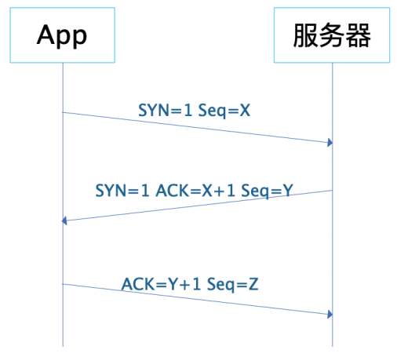

##### TCP关闭连接4次挥手

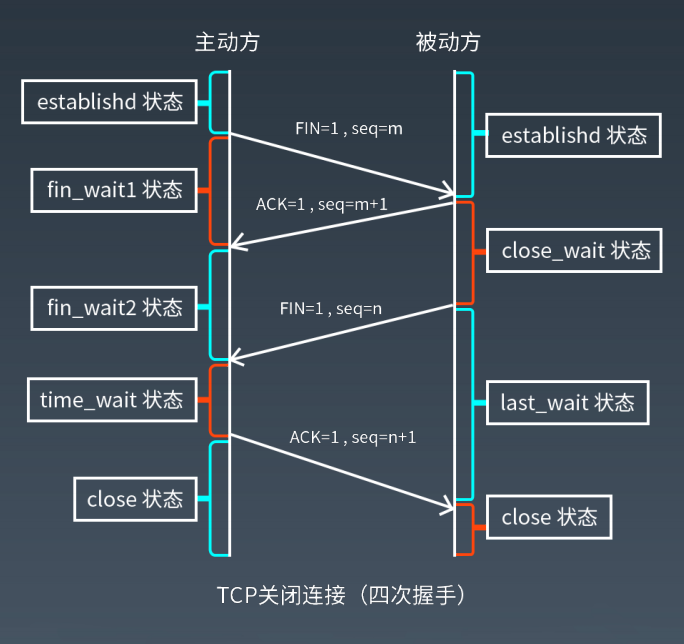

##### 4次挥手可能引起的问题

> 和服务器的通信结束之后，用来通信的套接字也就不会再使用了，这时我们就可以删除这个套接字了。不过，套接字并不会立即被删除，而是会等待一段时间之后再被删除。等待这段时间是为了防止误操作，引发误操作的原因有很多，比如，假设客户端先发起断开，4次挥手流程如下：
>
> （1）客户端发送 FIN
>
> （2）服务器返回 ACK 号 
>
> （3）服务器发送 FIN
>
> （4）客户端返回 ACK 号
>
> 如果最后客户端返回的 ACK 号丢失了，结果会如何呢？这时，服务器没有接收到 ACK 号，可能会重发一次 FIN。如果这时客户端的套接字已经删除了，会发生什么事呢？套接字被删除，那么套接字中保存的控制信息也就跟着消失了，套接字对应的端口号就会被释放出来。这时，如果别的应用程序要创建套接字，新套接字碰巧又被分配了同一个端口号 B，而服务器重发的 FIN 正好到达，会怎么样呢？本来这个 FIN 是要发给刚刚删除的那个套接字的，但新套接字具有相同的端口号，于是这个 FIN 就会错误地跑到新套接字里面，新套接字就开始执行断开操作了。之所以不马上删除套接字，就是为了防止这样的误操作。
>
> 至于具体等待多长时间，这和包重传的操作方式有关。网络包丢失之后会进行重传，这个操作通常要持续几分钟。如果重传了几分钟之后依然无效，则停止重传。在这段时间内，网络中可能存在重传的包，也就有可能发生前面讲到的这种误操作，因此需要等待到重传完全结束。协议中对于这个等待时间没有明确的规定，一般来说会等待几分钟之后再删除套接字。

以上引自《网络是怎样连接的》

#### 应用层

HTTP协议。

##### HTTP请求的7种方法

- GET
- POST
- PUT
- DELETE
- TRACE
- OPTION
- HEAD

##### HTTP响应的5种状态

- 1xx消息——请求已被服务器接收，继续处理
- 2xx成功——请求已成功被服务器接收、理解、并接受
- 3xx重定向——需要后续操作才能完成这一请求
- 4xx请求错误——请求含有词法错误或者无法被执行
- 5xx服务器错误——服务器在处理某个正确请求时发生错误

##### HTTP协议版本

- HTTP 1.0 

  - 客户端和服务器之间交换的每个请求 / 响应都会创建一个新的 TCP 连接，这意味着所有请求之前都需要进行 TCP握手连接，因此所有请求都会产生延迟

- HTTP 1.1

  - 允许客户端复用 TCP 连接，从而分摊了建立初始连接和针对多个请求缓慢启动的成本。但任意时点上每个连接只能执行一次请求 / 响应交换。
  - 由于 HTTP/1.1 只允许客户端同时进行一次HTTP 请求 / 响应交换，因此在网络层上获得并发能力的唯一方法是并行使用多个 TCP 连接。内部实现时使用了一个队列

- HTTP 2.0

  - 引入了 HTTP“流”的概念，允许将不同的 HTTP 并发地复用到同一 TCP 连接上， 使浏览器更高效地复用 TCP 连接。
  - HTTP/2 解决了单个 TCP 连接的使用效率低的问题，现在可以通过同一连接同时传输多个请求 / 响应。但是，TCP并不理解HTTP流，当多个HTTP请求复用一个TCP连接，如果前面的请求/响应没有处理完，后面的请求/响应也无法处理，也就是会出现队头堵塞现象。

- HTTP 3.0

  - 不是使用 TCP 作为会话的传输层，而是使用 QUIC （一种新的互联网传输协议）。该协议在传输层将流作为一等公民引入。多个QUIC 流共享相同的 QUIC 连接，因此不需要额外的握手和慢启动来创建新的 QUIC 流。但 QUIC 流是独立的，因此在大多数情况下，只影响一个流的丢包不会影响其他流，

    这是因为 QUIC 数据包封装在 UDP 数据包。

## 非阻塞网络IO

分类：

- 同步阻塞IO
- 同步非阻塞IO
- IO复用
- 信号驱动IO
- 异步IO

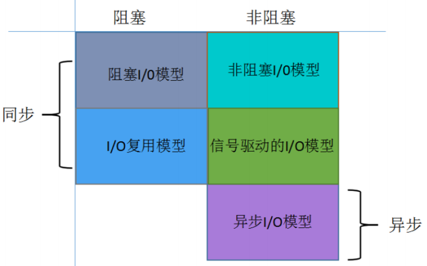

### 阻塞IO

进行 I/O 操作时，用户线程会一直阻塞，直到读操作或者写操作完成

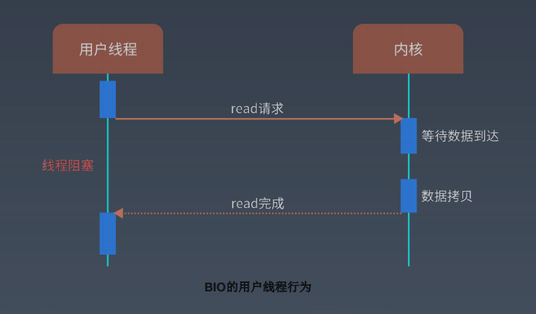

典型：ServerSocket与Socket

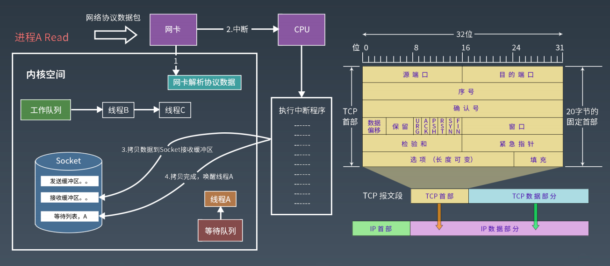

### 非阻塞IO

I/O 操作立即返回,发起线程不会阻塞等待。

非阻塞 read 操作：

• Socket 接收缓冲区有数据，读 n 个（不保证数据被读完整，因此有可能需要多次读）。

• Socket 接收缓冲区没数据，则返回失败（不会等待）。

非阻塞write： 

• Socket 发送缓冲区满，返回失败（不会等待）。

• Socket 发送缓冲区不满，写 n 个数据（不保证一次性全部写入，因此可能需要多次写）。

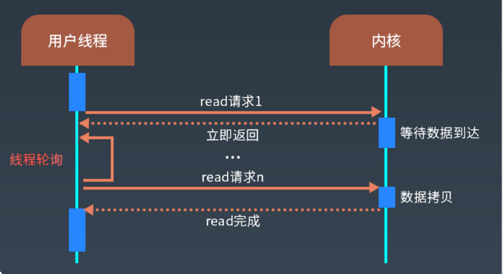

示例：JDK NIO

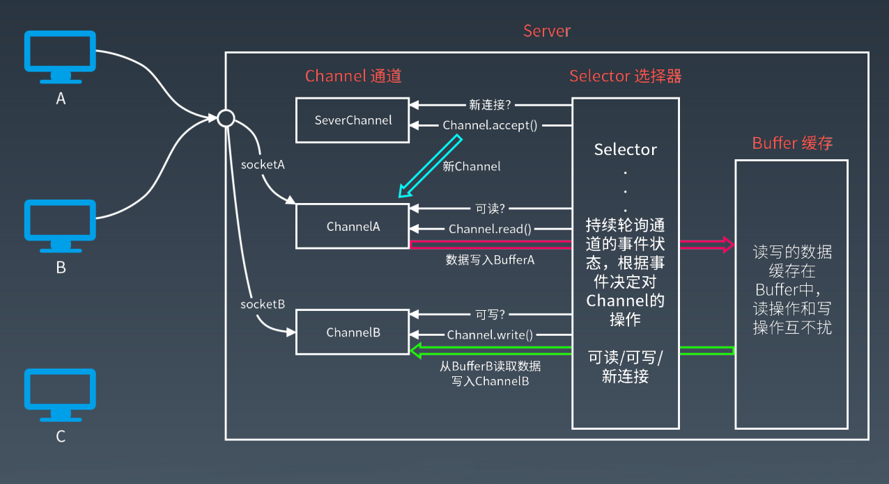

### IO多路复用内部实现

内部实现select, poll, epoll。

select是通过不断的轮询，查看是否有就绪事件。如果有的话，再把所有的流遍历一遍看是哪个流准备就绪。而poll也是采用这样的轮询，只不过poll采用的是链表存储，所以没有最大连接数的限制，epoll是even poll，和忙轮询、无差别轮询不一样，它会把哪个流发生了怎样的I/O事件通知我们，不用全都遍历一遍才知道是哪个流发生了。所以我们说epoll实际上是事件驱动（每个事件关联上fd）的，此时我们对这些流的操作都是有意义的。（复杂度降低到了O(1)），而select和poll查找复杂度都是O(n)。

#### select

- 单个进程能够监视的文件描述符（file descriptor）的数量存在最大限制，在Linux上一般为1024，可以通过修改宏定义甚至重新编译内核的方式提升这一限制，但 是这样也会造成效率的降低。
- 从流程上来看，使用select函数进行IO请求和同步阻塞模型没有太大的区别，甚至还多了添加监视socket，以及调用select函数的额外操作，效率更差。但是，使用select以后最大的优势是用户可以在一个线程内同时处理多个socket的IO请求。用户可以注册多个socket，然后不断地调用select读取被激活的socket，即可达到在同一个线程内同时处理多个IO请求的目的。而在同步阻塞模型中，必须通过多线程的方式才能达到这个目的。

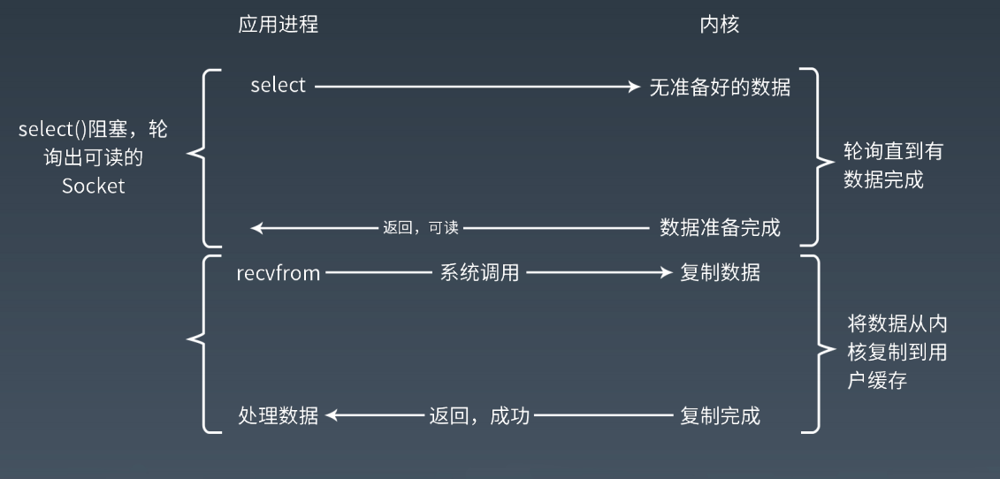

#### poll

- 没有最大数量限制（因为采用了链表存储，但是数量过大后性能也是会下降）
- 和select函数一样，poll返回后，需要轮询pollfd来获取就绪的描述符。

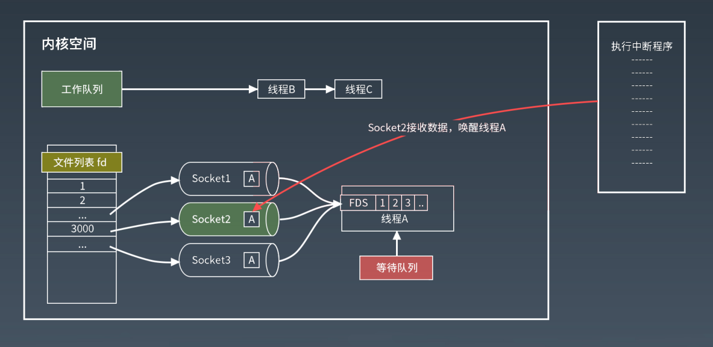

#### epoll

- epoll使用一个文件描述符管理多个描述符，将用户关系的文件描述符的事件存放到内核的一个事件表中，这样在用户空间和内核空间的copy只需一次。
- epoll事先通过epoll_ctl()来注册一 个文件描述符，一旦基于某个文件描述符就绪时，内核会采用类似callback的回调机制，迅速激活这个文件描述符，当进程调用epoll_wait() 时便得到通知。
- 如果没有大量的idle -connection或者dead-connection，epoll的效率并不会比select/poll高很多，但是当遇到大量的idle- connection，就会发现epoll的效率大大高于select/poll。

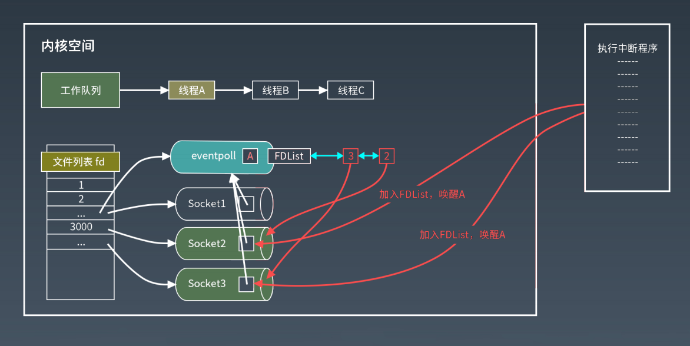