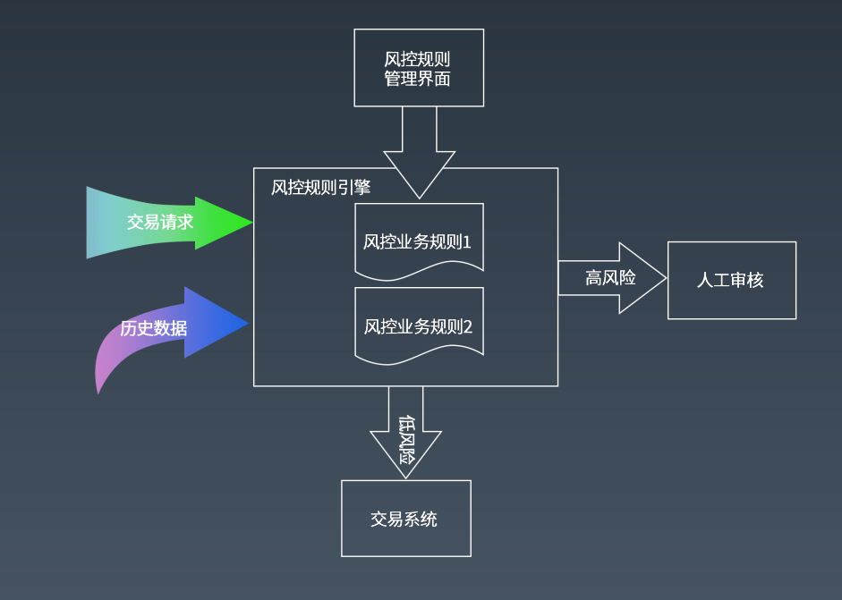

[TOC]

## 安全架构

### 常见攻击手段与防御

- XSS
  - 防御：对请求脚本进行过滤、消毒，比如文本匹配再转移，对某些 HTML 危险字符转义
- SQL注入攻击
  - 防御：
    - 请求参数：通过正则匹配，过滤请求数据中可能注入的 SQL 文。
    - SQL 预编译、参数绑定
- CSRF
  - 表单token：在页面表单中增加一个随机数 Token，每次请求的 Token 都不相同，请求提交后检查 Token 的值是否正确以确定请求提交者是否合法。
  - 验证码
  - Referer check：HTTP 请求头的 referer 域中记录着请求来源，可通过检查请求来源，验证其是否合法。但是该方法有一定局限性，referer 也并不一定总能得到
- 其他攻击与漏洞
  - Error Code:错误回显
    - 防御：专门的错误页面
  - HTML 注释
  - 文件上传
    - 防御：设置白名单，修改文件名、使用专门的存储等
  - 路径遍历：
    - 防御：将 JavaScript、CSS 等资源文件独立服务器、独立域名，其他文件不使用静态 URL 访问，动态参数不包含文件路径信息

### 其他涉及安全的内容

#### web应用防火墙

#### 网站安全漏洞扫描

## 信息加密与密钥安全管理

信息加密：

- 单项散列加密
  - MD5，但目前已经有漏洞，如果是加密密码，建议使用其他算法，如SHA256等
  - SHA
  - 。。。
- 对称加密
  - DES
  - 3DES
  - AES
- 非对称加密
  - RSA

## 反垃圾邮件

- 贝叶斯分类算法
- 布隆过滤器
  - 有误判，若在布隆过滤器里有，那可能并没有，但如果布隆过滤器返回没有，那就是肯定没有
  - 适合判断不存在的场景

## 电子商务风险控制

### 常见风险分类

- 账户风险：包括账户被黑客盗用，恶意注册账号等几种情形。
- 买家风险：买家恶意下单占用库存进行不正当竞争；黄牛利用促销抢购低价商品；此外还有良品拒收，欺诈退款以及常见于 B2B 交易的虚假询盘等。
- 卖家风险：不良卖家进行恶意欺诈的行为，例如货不对板，虚假发货，炒作信用等，此外还有发布违禁商品、侵权产品等。
- 交易风险：信用卡盗刷，支付欺诈，洗钱套现等

### 风险控制

大型电商网站都配备有专门的风控团队进行风险控制，风控的手段也包括**自动和人工两种方式，机器自动识别为高风险的交易和信息会发送给风控审核人员进行人工审核，机器自动风控的技术和方法也不断通过人工发现的新风险类型进行逐步完善。**

机器自动风控的技术手段主要有：

- 规则引擎
- 机器学习

#### 规则引擎

当交易的某些指标满足一定条件的时候，就会被认为具有高风险的欺诈可能性。比如：

- 用户来自欺诈高发地区；
- 交易金额超过某个数值；
- 和上次登录的地址距离差距很大；
- 用户登录地与收货地不符；
- 用户第一次交易；
- ……

#### 机器学习

规则引擎虽然技术简单，但是随着规则的逐渐增加，出现规则冲突，难以维护等情况，而且规则越多，性能也越差。大型互联网应用更倾向于使用机器学习模型进行风控。

## 高可用系统：可用性度量

### 可用性指标

- 网站年度可用性指标＝（1－网站不可用时间/年度总时间）×１００％
- 网站不可用时间（故障时间）＝故障修复时间点－故障发现（报告）时间点

对可用性的定性描述，两个9是基本可用，年度停机时间小于88小时；3个9较高可用，年度停机时间小于9小时；4个9是具有自动恢复能力的高可用，年度停机时间小于53分钟；5个9是极高可用性，年度停机时间小于5分钟。由于可用性影响因素很多，对于网站整体而言，达到4个9，乃至5个9的可用性，除了过硬的技术、大量的设备资金投入和工程师的责任心，还要有个好运气

### 引起故障的原因

• 硬件故障

• 软件 bug

• 系统发布

• 并发压力

• 网络攻击

• 外部灾害

## 高可用系统架构

高可用架构涉及的内容有：

### 解耦

- 高内聚、低耦合的组件设计原则
- 面向对象基本设计原则
  - SOLID原则
  - KISS原则
- 面向对象设计模式
- 领域驱动设计建模
  - DDD

### 隔离

- 业务与子系统隔离
- 微服务与中台架构
- 生产者消费者隔离
- 虚拟机与容器隔离

### 异步

- 多线程编程
- 反应式编程
- 异步通信网络编程
- 事件驱动异步架构
  - 典型：各种MQ中间件的使用，削峰填谷、异步、解耦

### 备份

- 集群设计
- 数据库复制
  - 主从复制，分库分表等都是提高系统可用性的手段

### failover（失效转移）

- 数据库主主失效转移
- 负载均衡失效转移

如何确认失效、需要转移？

- 一致性算法
  - 比如使用zookeeper的ZAB协议（临时节点+心跳来判断是否还活着），或是raft

### 幂等

典型案例：使用MQ的地方，一般需要保证幂等，避免重复消息导致数据不一致

### 事务补偿

- BASE理论

事务补偿：通过执行业务逻辑逆操作，使事务回滚到事务前状态

典型：柔性事务

比如：常见的分布式事务：XA（2PC），TCC， AT， SAGA（用的人不多）等

### 重试

远程服务可能会由于线程阻塞、垃圾回收或者网络抖动，而无法及时返还响应，调用者可以通过重试的方式修复单次调用的故障

**上游调用者超时时间要大于下游调用者超时时间之和。**

### 熔断

参见Hystrix官方wiki。

断路器模式：关闭，半开，全开

### 限流

常限流算法：

- 计数器算法
  - 固定窗口：使用计数器在周期内累加访问次数，当达到设定的限流值时，触发限流策略。下一个周期开始时，进行清零，重新计数。
    - 固定窗口算法的临界点问题：假设1min内服务器的负载能力为100，因此一个周期的访问量限制在100，然而在第一个周期的最后5秒和下一个周期的开始5秒时间段内，分别涌入100的访问量，虽然没有超过每个周期的限制量，但是整体上10秒内已达到200的访问量，已远远超过服务器的负载能力
    - 
  - 滑动窗口：将时间周期分为N个小周期，分别记录每个小周期内访问次数，并且根据时间滑动删除过期的小周期。
    - 
- 令牌桶算法
  - 
- 漏桶算法
  - 
- 自适应限流
  - 

### 降级

### 异地多活

难点：保证数据一致

## 高可用系统的运维

- 自动化测试
  - 目前大部分网站都采用 Web 自动化测试技术，使用自动测试工具或脚本完成测试。比较流行的 Web 自动化测试工具是 ThoughtWorks 开发的 Selenium。
  - 
- 自动化部署
- **持续部署三步走**
  - 持续集成：允许工程师随时向公共分支提交代码，并立即 进行自动化测试。
  - 持续交付：除了跑单元测试及软件打包，持续交付机制会将软件部署到各种测试环境中
  - 持续部署：代码在没有人工干预的情况下被测试、构建、部署并推送到生产环境。
  - 
- 预发布验证
- 代码版本控制
- 自动化发布
  - 灰度发布
- 网站运行监控
  - 监控数据采集
    - 用户行为日志采集
  - 服务器性能监控
  - 业务运行数据报告
  - 监控管理
    - 报警
    - 自动控制