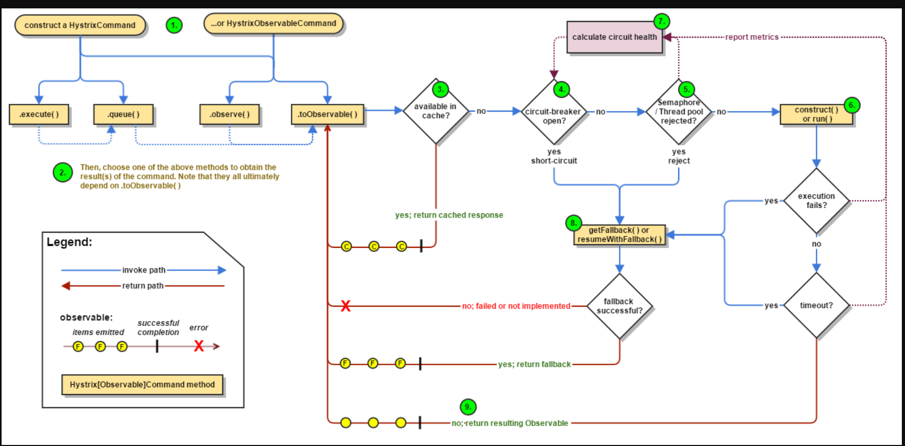

## 巨无霸应用系统的问题

- 编译、部署困难
- 代码分支管理困难
- 数据库连接耗尽
- 新增业务困难

解决：拆分，模块独立部署，降低系统耦合性

- 纵向拆分：将一个大应用拆分为多个小应用，如果新增业务较为独立，那么就直接将其设计部署为一个独立的Web应用系统。
- 横向拆分：将复用的业务拆分出来，独立部署为微服务，新增业务只需要调用这些微服务即可快速搭建一个应用系统。

## 微服务框架

### web service

关键字：WSD, SOAP

### 微服务框架需求

- 服务注册与发现
- 服务调用
- 失效转移fail over
- 负载均衡
- 高效的远程通信
- 对应用最少侵入
- 版本管理

### 典型的微服务框架  Dubbo

### Service Mesh服务网格

Service Mesh服务网格是一个基础设施层，功能在于处理服务间通信，职责是负责实现请求的可靠传递。在实践中，服务网格通常实现为轻量级网络代理，通常与应用程序部署在一起，但是对应用程序透明。

个人理解：Service Mesh的出现仍然是为了解耦，将服务间通讯的环节就从应用里面剥离出来，呈现出一个抽象层，屏蔽掉底层服务通信的细节、让开发人员专注于业务开发。Service Mesh解决了异构系统的通信问题。

Service Mesh在具体实现时，往往需要Sidecar模式，由Sidecar负责底层通信，上层服务与Sidecar进行通信。

### 微服务架构实践

#### **1. 命令与查询职责隔离（CQRS）**

在服务接口层面将查询（读操作）与命令（写操作）隔离，实现服务层的读写分离。

典型：数据库拆分，主从分离；各种缓存的使用

#### **2. 事件溯源**

将用户请求处理过程中的每次状态变化都记录到事件日志中，并按时间序列进行持久化存储。

典型：

- 各类数据库的WAL机制；
- mysql的binlog、redo log保证数据库即便崩溃后也不会丢数据；
- mysql 通过relay log主从复制；
- Redis的RDB、AOF

#### **3. 断路器**

主要为了避免服务雪崩，保证整个系统的高可用。

典型：Hystrix，工作原理参见下图，有半开、打开、关闭3种状态。

关联概念：服务雪崩、服务熔断、服务降级

#### **4. 服务重试及调用超时**

上游调用者超时时间要大于下游调用者超时时间之和。

## 微服务网关

### 基于API网关的架构

### 网关的作用

- 统一接入
  - 高性能、高并发、高可靠、负载均衡等
- 流量管控与容错
  - 限流、降级、熔断等
- 协议适配
  - HTTP, Dubbo, JSF等
- 安全防护
  - 防刷控制，黑白名单等

### 如何实现网关

管道技术

责任链设计模式。

serlvet 3实现网关
startAsync

### 开放平台网关

- 安全、审计相关功能会严格一些

#### 相关技术

- OAuth 2.0
  - 供4种授权方式：授权码、隐式授权、资源所有者密码凭据、客户端凭据
  - 互联网上使用最多、也是最安全的方式：授权码方式
- 

## 领域驱动设计 DDD

与DDD相对的，现在常见的开发模式：事务脚本

#### 事务脚本

#### 领域模型

举例如何用DDD、领域模型来优化事务脚本的开发方式？

#### 贫血模型 VS 充血模型

由于事务脚本模式中，Service、Dao 这些对象只有方法，没有数值成员变量，而方法调用时传递的数值对象，比如Contract，没有方法（或者只有一些 getter、setter 方法），因此事务脚本又被称作贫血模型。

领域模型是合并了行为和数据的领域的对象模型。通过领域模型对象的交互完成业务逻辑的实现，也就是说，设计好了领域模型对象，也就设计好了业务逻辑实现。和事务脚本被称作贫血模型相对应的，领域模型也被称为充血模型。

- 事务脚本：
  - service只有方法，没有成员变量
  - 贫血模型
- 领域模型：感觉就是DDD模式的应用
  - 包含数字、计算逻辑
  - 充血模型，真正的面向对象

充血模型更好，但开发比较困难，如何定义各种模型

DDD：根据业务、领域进行设计，而不是界面

### 领域驱动设计

领域是一个组织所做的事情以及其包含的一切，通俗地说，就是组织的业务范围和做事方式，也是软件开发的目标范围。

领域驱动设计就是从领域出发，分析领域内模型及其关系，进而设计软件系统的方法。

#### 重要概念

子域：领域是一个组织所做的事情以及其包含的一切。 这个范围就太大了，不知道该如何下手。所以通常的做法是把整个领域拆分成多个子域，比如用户、商品、订单、库存、物流、发票等。

限界上下文：在一个子域中，会创建一个概念上的领域边界，在这个边界中，任何领域对象都只表示特定于该边界内部的确切含义。这样边界便称为限界上下文。限界上下文和子域具有一对一的关系，用来控制子域的边界，保证子域内的概念统一性。通常限界上下文对应一个组件或者一个模块，或者一个微服务，一个子系统。

## 软件组件设计原则

**软件的复杂度和它的规模成指数关系**

软件需要进行模块化、组件化设计。

**组件内聚原则**

- 复用发布等同原则
- 共同封闭原则
- 共同复用原则

**组件耦合原则**

- 无循环依赖原则
- 稳定依赖原则
- 稳定抽象原则