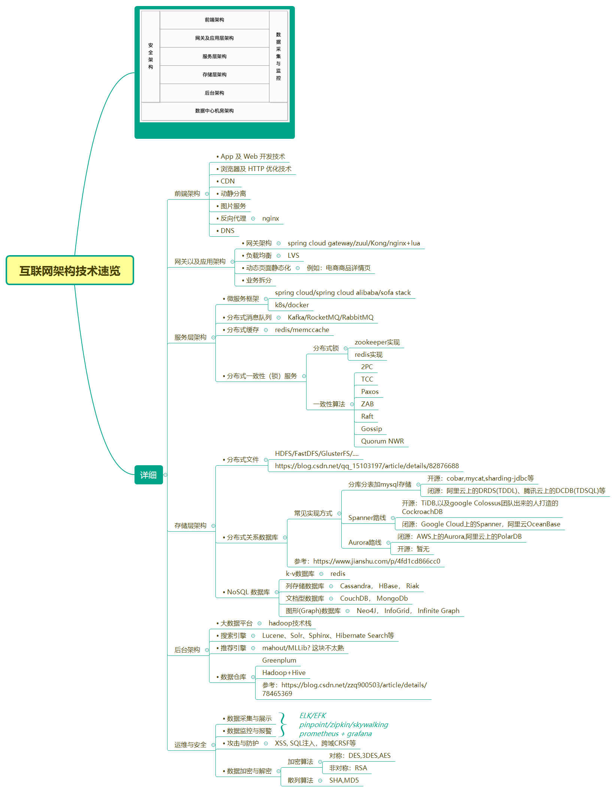

# 系统架构

[TOC]

## 大型互联网应用系统所要解决的问题

### 高并发，大流量

- 双十一
- 微博热点事件导致系统崩溃

### 高可用  

- 7x24

### 海量数据

- 微博用户信息，微博的消息、评论等都是海量数据
- 搜索引擎爬下来的网页数据

### 用户分布广泛，网络情况复杂

- 可能需要为海外用户建立海外数据中心
  - 阿里
  - 抖音
  - google

### 安全环境恶劣

- 个人隐私数据泄露严重
- 用户防范意识普遍不高：多个网站使用同一个密码
- 黑客拖库，碰撞
- 部分程序员法制意识不高
  - 由爬虫程序所引发的犯罪

### 需求快速变更，发布频繁  

- To C业务需求变化非常快，临时加需求，或是社会热点引发（如新冠导致猿辅导迅速扩张，多个app都开发了疫情相关页面）等
- 甲方对于需求阐述有时不够严谨，等做出来后又说不是他们想要的......
- 产品经理不够成熟，无法掌控产品的发展方向，被需求方牵着鼻子走，导致产品做出来功能很碎、没有系统
- ......

上述这些原因都引发各种需求变动。

### 渐进式发展  

好的互联网产品都是慢慢运营出来的，不是一开始就开发好的。那些刚建立就投入巨资，有巨大背景的网站，后来发展都很惨淡。

## 应对上述问题的技术方向

### 水平伸缩

通过增加服务器提升计算能力

示例：

- redis/mysql主从集群
- 应用服务集群

### 垂直伸缩

通过升级硬件和网络吞吐能力来实现垂直伸缩，提升单一服务器的能力

示例：

- mysql单体不够用，可以换IOE方案（IBM 小型机+Oracle+EMC存储）
  - 增加CPU/内存/使用SSD/。。。。

## 互联网架构演化

略，参见李智慧的《大型网站技术架构》

## 互联网架构模式

### 分层

将软件在横向方面进行切分

示例：

系统分层，拆分为网关、反向代理、应用服务器、缓存服务器、数据库服务器等

### 分割

在纵向方面对软件进行切分

示例：

微服务，一个服务只负责一个业务模块

### 分布式

- 分布式应用和服务
  - 示例：应用服务集群， redis缓存集群
- 分布式静态资源
  - 阿里云OSS存储
  - 图片放到CDN，反向代理
- 分布式数据和存储
- 分布式计算

### 集群

这个不解释，太常见了……

### 缓存

- CDN
- 反向代理
  - nginx
- 本地缓存
  - google guava
  - JDK HashMap
- 远程缓存
  - redis
  - memcache

### 异步

示例：

- Netty：通过NIO，以Future返回结果，异步处理
  - n多RPC/MQ以及好多项目都采用了Netty，比如：dubbo, RocketMQ(不过Kafka没用Netty)
- Kafka：内部采用异步、批量发送的方式提高吞吐量
- 各种MQ:  Kafka, RocketMQ, RabbitMQ **削峰填谷**

### 冗余

保证7x24正常运行

### 自动化

在无人值守的情况下网站可以正常运行，一切都可以自动化是网站的理想状态。目前互联网的自动化架构设计主要集中在运维方面。

示例：

- k8s可以设置pod数量，在某些pod失效、导致数量不足时，自动新建一个pod

### 安全

- 通过密码和手机校验码进行身份认证；
- 登录、交易等操作需要对网络通讯进行加密，网站服务器上存储的敏感数据如用户信息等也进行加密处理；
- 为了防止机器人程序滥用网络资源供给网站，网站使用验证码进行识别；
  - 目前安全要求高一些的，都会采用二次验证，比如手机短信
- 对于常见的用于攻击网站的XSS 攻击，SQL 注入，进行编码转换等相应处理；
- 对于垃圾信息、敏感信息进行过滤；
  - 顺手想到个知识点：垃圾邮件可以使用贝叶斯来处理
- 对转账交易等重要操作根据交易模式和交易信息进行风险控制。
  - 支付宝大脑
    - 交易模式需要通过机器学习等方式获知用户习惯
    - 可以想到的一些判断方式：结合用户所在地与交易发生地点判断
      - 需要有地理位置信息

## 如何衡量互联网系统架构

- 高性能
- 高可用
- 可伸缩
- 可扩展
  - 典型：感觉目前各种开源的中间件，一般都会设计成容易扩展的，否则很难吸引大家去使用。典型的如dubbo，利用修改后的SPI可以进行插件开发
- 安全

## 互联网架构技术一览

