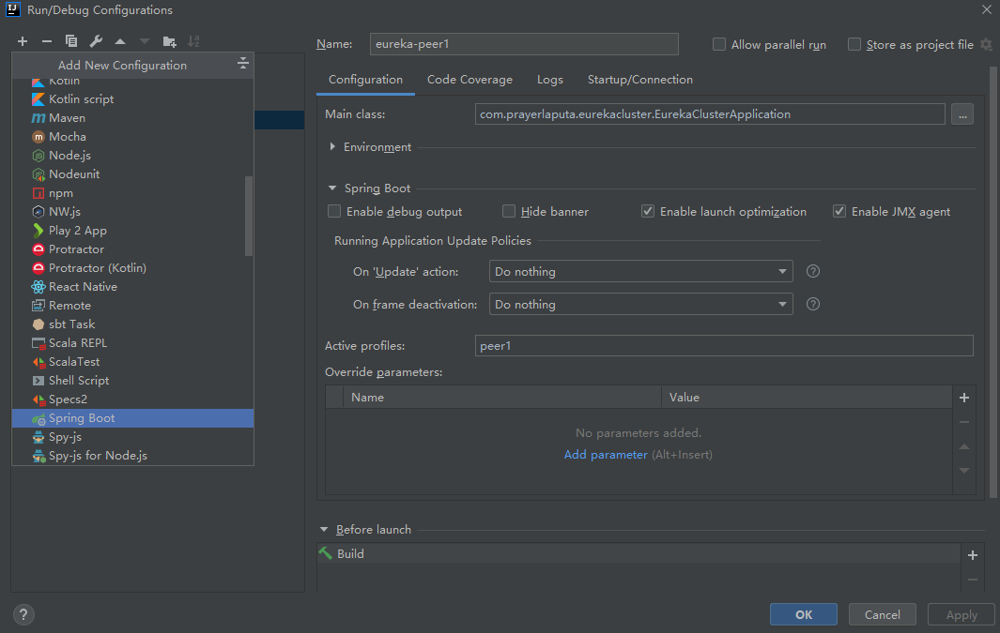
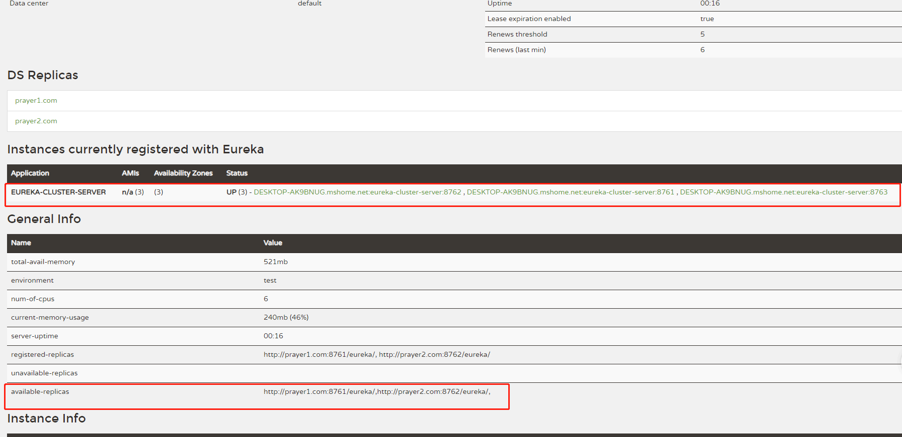

# Eureka 高可用集群配置demo  

[TOC]

本项目主要为了尝试搭建高可用eureka集群。

采用了一个项目、3份配置的方式。

搭建步骤如下：
### 1、pom中引入必要的包  
本项目主要是eureka-server端，因此必须引入`spring-cloud-starter-netflix-eureka-server`

### 2、Application类上加上`@EnableEurekaServer`

### 3、写上3个配置文件  
如下，注意`spring.application.name`3个文件要一样。
#### application-peer1.yml:  
```yaml
spring:
  application:
    name: eureka-cluster-server
  profiles:
    peer1

server:
  port: 8761

eureka:
  instance:
    #主机名，必填
    hostname: prayer1.com
  client:
    #register-with-eureka 默认值为true，即将自己注册到eureka中
    #fetch-registry 默认值为true，即从别的eureka节点获取注册信息，不用修改
    service-url:
      #此节点应向其他节点发起请求
      defaultZone: http://prayer2.com:8762/eureka/,http://prayer3.com:8763/eureka/

management:
  endpoint:
    shutdown:
      enabled: true
```


#### application-peer2.yml:  
```yaml
spring:
  application:
    name: eureka-cluster-server
  profiles:
    peer2

server:
  port: 8762

eureka:
  instance:
    #主机名，必填
    hostname: prayer2.com
  client:
    #register-with-eureka 默认值为true，即将自己注册到eureka中
    #fetch-registry 默认值为true，即从别的eureka节点获取注册信息，不用修改
    service-url:
      #此节点应向其他节点发起请求
      defaultZone: http://prayer1.com:8761/eureka/,http://prayer3.com:8763/eureka/

management:
  endpoint:
    shutdown:
      enabled: true
```

#### application-peer3.yml:  
```yaml
spring:
  application:
    name: eureka-cluster-server
  profiles:
    peer3

server:
  port: 8763

eureka:
  instance:
    #主机名，必填
    hostname: prayer3.com
  client:
    #register-with-eureka 默认值为true，即将自己注册到eureka中
    #fetch-registry 默认值为true，即从别的eureka节点获取注册信息，不用修改
    service-url:
      #此节点应向其他节点发起请求
      defaultZone: http://prayer1.com:8761/eureka/,http://prayer2.com:8762/eureka/

management:
  endpoint:
    shutdown:
      enabled: true
```

### 4、配置host
多节点配置高可用时，必须配置`eureka.instance.hostname`主机名，`eureka.client.service-url.defaultZone`中也不能使用`localhost`，必须使用host。
本处为了在本机上演示，配置了prayer1.com prayer2.com  prayer3.com 3个host
```
127.0.0.1 prayer1.com
127.0.0.1 prayer2.com
127.0.0.1 prayer3.com
```

### 5、复制spring boot启动配置  
在idea中点击`Edit Configurations`，自己新建3个



注意`active profiles`需要分别选择peer1、peer2、peer3
最终结果如下图：


### 6、启动3个实例
分别启动三个配置实例，然后就可以分别访问prayer1.com:8761/eureka/  prayer2.com:8762/eureka/  prayer3.com:8763/eureka/
有如下效果即说明搭建成功



## 多 profile运行注意事项  

如下 配置文件 不写在src/main/resources一个 application 中，而是分为 application-peer1.yml, application-peer2.yml, application-peer3.yml ; 在 idea 的虚拟机参数（VM Options）配置 是
   -Dspring.profiles.active=peer1 ， -Dspring.profiles.active=peer2 ，-Dspring.profiles.active=peer3；部署方式相同；也可以通过 mvn spring-boot:run -Dspring.profiles.active=peer1 的形式运行；
   
## 参考资料  
[springcloud-eureka高可用集群搭建](https://www.cnblogs.com/zszxz/p/12079051.html)
   
