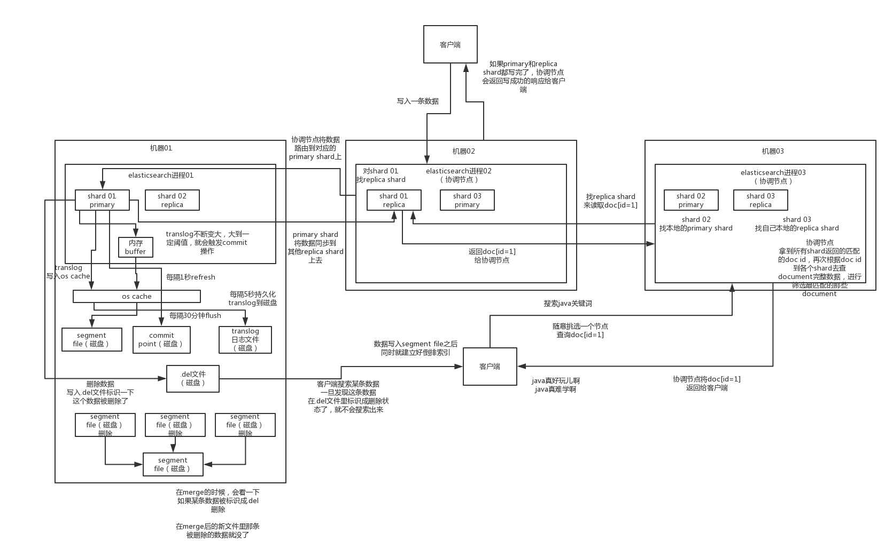

# ES基础

## 基本概念

- index
- type
  - document
    - field
- mapping

## ES集群读写原理

与Kafka底层类似，采用Qur

概念：

- shard
  - primary shard
    - 写只能在primary
  - replica shard
    - 当前primary shard死掉时，会选举、将一个replica shard提拔为primary shard
    - 读的时候primary/replica都可以，kafka则只能从leader读

下图来自中华石杉

## ES写入数据的工作原理？

1）客户端选择一个node发送请求过去，这个node就是coordinating node（协调节点）

2）coordinating node，对document进行路由，将请求转发给对应的node（有primary shard）

3）实际的node上的primary shard处理请求，然后将数据同步到replica node

4）coordinating node，如果发现primary node和所有replica node都搞定之后，就返回响应结果给客户端

## ES查询数据的工作原理？

