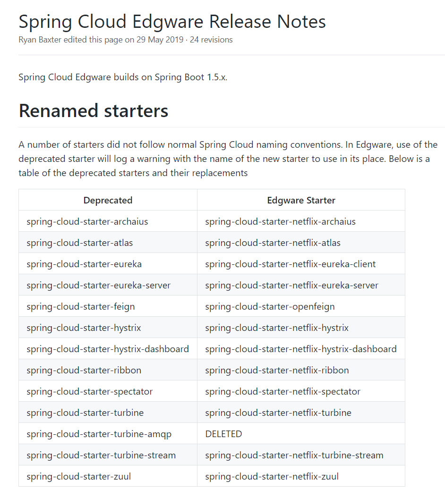

众所知周，spring cloud 1.5版本与2.x版本差异很大，官方没有做向下兼容，导致大家对于升级spring cloud版本都非常慎重。

此处，首先推荐阅读官方给出的迁移手册 [Spring Boot 2.0 Migration Guide](https://github.com/spring-projects/spring-boot/wiki/Spring-Boot-2.0-Migration-Guide)

虽然是英文的，但建议还是好好读读。

## 预备知识

废话一下：
升级操作前务必要对spring, spring boot, spring cloud版本、各自关联有清晰的认识。
建议看官网，然后也可以参考此文章[SpringBoot与SpringCloud的版本对应详细版](https://blog.csdn.net/qq32933432/article/details/89375630)

## 事前准备

首先，官方建议，若要升级到2.x，首先应该分步骤来：
- 先升级到1.5.x
- 再升级到2.0
- 再升级到2.1等更高版本

再者，建议在迁移到2.0时，先在pom中添加如下依赖：
```
<dependency>
	<groupId>org.springframework.boot</groupId>
	<artifactId>spring-boot-properties-migrator</artifactId>
	<scope>runtime</scope>
</dependency>
```

这个是官方提供用于验证原有配置是否还生效的包，项目启动时将会给出提示，并告知在新版spring cloud中，对应配置关键字是什么。

## 迁移操作。。。。

更新步骤说起来简单，即更新依赖文件中的版本号，但spring cloud涉及n多组件，升级过程中必然遇到各种坑。

### 1. 更新spring cloud, spring boot

以本人负责项目为例。
spring cloud更新前：
```
    <dependencyManagement>
        <dependencies>
            <dependency>
                <groupId>org.springframework.cloud</groupId>
                <artifactId>spring-cloud-dependencies</artifactId>
                <version>Edgware.SR4</version>
                <type>pom</type>
                <scope>import</scope>
            </dependency>
        </dependencies>
    </dependencyManagement>
```
更新后：
```
    <dependencyManagement>
        <dependencies>
            <dependency>
                <groupId>org.springframework.cloud</groupId>
                <artifactId>spring-cloud-dependencies</artifactId>
                <version>Hoxton.SR4</version>
                <type>pom</type>
                <scope>import</scope>
            </dependency>
        </dependencies>
    </dependencyManagement>
```

spring boot更新前：
```
    <parent>
        <groupId>org.springframework.boot</groupId>
        <artifactId>spring-boot-starter-parent</artifactId>
        <version>1.5.13.RELEASE</version>
        <relativePath/> <!-- lookup parent from repository -->
    </parent>
```
spring boot更新后：
```
    <parent>
        <groupId>org.springframework.boot</groupId>
        <artifactId>spring-boot-starter-parent</artifactId>
        <version>2.2.6.RELEASE</version>
        <relativePath/> <!-- lookup parent from repository -->
    </parent>
```

### 2. 更新关联的包

更新这两个包后，若有使用eureka/feign/hystrix，会因为这些包重命名、原有包在新版spring cloud中不能再使用，此处仅给出对应包名，细微之处建议仔细查看相关的官方文档，确保使用上不会问题。

E版本重命名列表参见[Spring Cloud Edgware Release Notes](https://github.com/spring-projects/spring-cloud/wiki/Spring-Cloud-Edgware-Release-Notes)



#### 2.1 eureka
mvnrepository
更新前：
下面的这两个包在mvnrepository.com上已经被标记为`deprecated`
```
        <dependency>
            <!--mvnrepository 上标记为：Spring Cloud Starter Eureka Server (deprecated, please use spring-cloud-starter-netflix-eureka-server) -->
            <groupId>org.springframework.cloud</groupId>
            <artifactId>spring-cloud-starter-eureka-server</artifactId>
        </dependency>
        <dependency>
            <!--mvnrepository 上标记为：Spring Cloud Starter Eureka (deprecated, please use spring-cloud-starter-netflix-eureka-client) -->
            <groupId>org.springframework.cloud</groupId>
            <artifactId>spring-cloud-starter-eureka</artifactId>
        </dependency>
```
更新后
```
        <dependency>
            <groupId>org.springframework.cloud</groupId>
            <artifactId>spring-cloud-starter-netflix-eureka-server</artifactId>
        </dependency>
        <dependency>
            <groupId>org.springframework.cloud</groupId>
            <artifactId>spring-cloud-starter-netflix-eureka-client</artifactId>
        </dependency>
```

#### 2.2 feign

更新前：
```
        <dependency>
            <groupId>org.springframework.cloud</groupId>
            <artifactId>spring-cloud-starter-feign</artifactId>
        </dependency>
```
更新后：
```
        <dependency>
            <groupId>org.springframework.cloud</groupId>
            <artifactId>spring-cloud-starter-openfeign</artifactId>
        </dependency>
```

注意，feign本身也有一些变化，可以参考此文章 [Spring cloud系列十八 Spring Cloud 从Dalston.SR5到Greenwich.SR1 的升级记录](https://blog.csdn.net/hry2015/article/details/89340069) ，比如:
1. feign中部分包名变化
```
org.springframework.cloud.netflix.feign.**.java -> org.springframework.cloud.openfeign.**.java
```

2. @FeignClient增加一个属性值contextId

具体变化建议查看官网，懒的话可以看下面两篇文章：
- [Spring cloud系列十八 Spring Cloud 从Dalston.SR5到Greenwich.SR1 的升级记录](https://blog.csdn.net/hry2015/article/details/89340069) 
- [享学Feign 一、原生Feign初体验，Netflix Feign or Open Feign？](https://blog.csdn.net/f641385712/article/details/104211659)


### 3. 属性变化

此处就要感谢`spring-boot-properties-migrator` 这个包了，会自动给出新版本里应该用哪个属性。
比如：
应用的上下文路径：server.context-path: authority --> server.servlet.context-path: authority
上传文件参数配置：spring.http.multipart.* -> spring.servlet.multipart.*
如原 spring.http.multipart.maxFileSize:5Mb -> spring.servlet.multipart.maxFileSize:5MB
同时这里5Mb中的Mb的**必须是大写字母**，必须是5MB，否则会抛出异常：`failed to convert java.lang.String to @org.springframework.boot.convert.DataSizeUnit org.springframework.util.unit.DataSize`

### 4. 其他包的升级

spring cloud, spring boot, spring升级后，相关联的包及建议同步升级，否则可能会无效，比如说pagehelper，druid，jedis等。既然要动依赖包，建议这次就一次性到位，本身整个项目的所有功能肯定需要回归验证一遍，建议就一起升级。
可以参考这两篇文章：
- [Spring cloud系列十八 Spring Cloud 从Dalston.SR5到Greenwich.SR1 的升级记录](https://blog.csdn.net/hry2015/article/details/89340069) 
- [Spring Cloud 升级最新 Finchley 版本，踩了所有的坑！](https://www.cnblogs.com/javastack/p/9446837.html)

# 参考资料
- [Spring Boot 2.0 Migration Guide](https://github.com/spring-projects/spring-boot/wiki/Spring-Boot-2.0-Migration-Guide)
- [SpringBoot与SpringCloud的版本对应详细版](https://blog.csdn.net/qq32933432/article/details/89375630)
- [Spring Cloud Edgware Release Notes](https://github.com/spring-projects/spring-cloud/wiki/Spring-Cloud-Edgware-Release-Notes)
- [Spring cloud系列十八 Spring Cloud 从Dalston.SR5到Greenwich.SR1 的升级记录](https://blog.csdn.net/hry2015/article/details/89340069) 
- [Spring Cloud 升级最新 Finchley 版本，踩了所有的坑！](https://www.cnblogs.com/javastack/p/9446837.html)
- [享学Feign 一、原生Feign初体验，Netflix Feign or Open Feign？](https://blog.csdn.net/f641385712/article/details/104211659)
