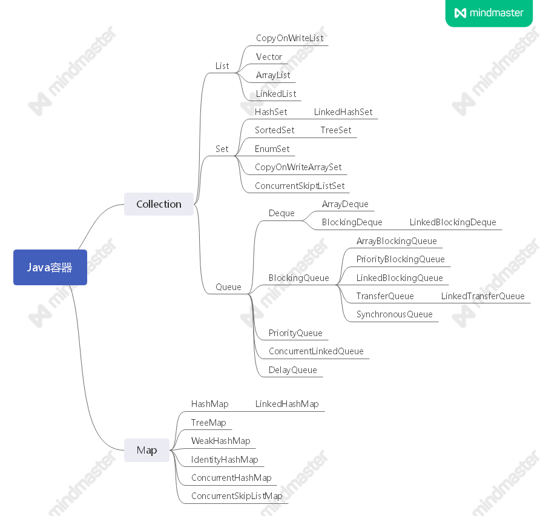

面试题分析-使用数组实现一个阻塞队列

# 1、概念  

**什么是阻塞队列？**

阻塞队列（BlockingQueue）是一个支持两个附加操作的队列。这两个附加的操作是：在队列为空时，获取元素的线程会等待队列变为非空。当队列满时，存储元素的线程会等待队列可用。阻塞队列常用于生产者和消费者的场景，生产者是往队列里添加元素的线程，消费者是从队列里拿元素的线程。阻塞队列就是生产者存放元素的容器，而消费者也只从容器里拿元素。


方法/处理方式 | 抛出异常 |  返回特殊值 | 一直阻塞 | 超时退出 
-|-|-|-|-
插入方法 | add(e) | offer(e) | put(e) | offer(e,time,unit)
移除方法 | remove() | poll() | take() | poll(time,unit)
检查方法 | element() | peek() | 不可用 | 不可用

**官方接口说明：[Interface BlockingQueue](https://docs.oracle.com/javase/8/docs/api/java/util/concurrent/BlockingQueue.html)**


### 延伸知识点：Java容器，Java Util Concurrent（JUC）



**JUC是重头戏**
- ConcurrentHashMap相关
  - JDK 7 与JDK 8的实现有什么区别？为何？
  - ...
- 类的使用
  - ReentrantLock
  - CountDownLatch
  - ...

——下期再说


# 2、怎么实现？  

## 思路1: sychronized

```
public class Test01<T> {

    private LinkedList<T> lists = new LinkedList<>();

    private int MAX_CAPACITY = 10;

    private volatile int count = 0;

    public synchronized void put(T t) {
        while (lists.size() == MAX_CAPACITY) {
            try {
                this.wait();
            } catch (InterruptedException e) {
                e.printStackTrace();
            }
        }

        lists.add(t);
        count += 1;

        this.notifyAll();
    }

    public int getCount() {
        return count;
    }

    public synchronized T get() {
        T t = null;
        while (lists.size() == 0) {
            try {
                this.wait();
            } catch (InterruptedException e) {
                e.printStackTrace();
            }
        }

        count -= 1;
        t = lists.removeFirst();
        this.notifyAll();

        return t;
    }

    public static void main(String[] args) {
        Test01 test01 = new Test01();
        for (int i = 0; i < 10; i++) {
            final int tmp = i;
            Thread t = new Thread(() -> {
                for (int j = 0; j < 10; j++) {
                    test01.put(j);
                    System.out.println("生产：" + tmp + " " + j + " count=" + test01.getCount());
                }
            }
            );
            t.start();
        }

//        try {
//            TimeUnit.SECONDS.sleep(2);
//        } catch (InterruptedException e) {
//            e.printStackTrace();
//        }

        for (int i = 0; i < 2; i++) {
            new Thread(() ->{
                for(int j = 0; j < 50; j++) {
                    System.out.println("消费：" + test01.get() + " count=" + test01.getCount());
                }

            }).start();
        }
    }
}
```

### 分析  
基本能满足需求，但是唤醒线程时，生产者、消费者都会被叫醒，增加线程争抢的成本


## 思路2： ReentrantLock与Condition

```
public class Test02<T> {

    private LinkedList<T> lists = new LinkedList<>();

    private int MAX_CAPACITY = 10;

    private Lock lock = new ReentrantLock();

    private Condition producer = lock.newCondition();
    private Condition consumer = lock.newCondition();

    private volatile int count = 0;

    public void put(T t) {
        /*
        如果不加lock/unlock，直接使用condition，将导致这个异常：

        Exception in thread "Thread-1" Exception in thread "Thread-0" Exception in thread "Thread-2" java.lang.IllegalMonitorStateException
	at java.util.concurrent.locks.AbstractQueuedSynchronizer$ConditionObject.signalAll(AbstractQueuedSynchronizer.java:1954)
	at com.prayerlaputa.juc.part2_sync.interview.blockqueue.Test02.put(Test02.java:41)
	at com.prayerlaputa.juc.part2_sync.interview.blockqueue.Test02.lambda$main$0(Test02.java:71)
	at java.lang.Thread.run(Thread.java:748)
         */
        try {
            lock.lock();
            while (lists.size() == MAX_CAPACITY) {
                try {
                    producer.await();
                } catch (InterruptedException e) {
                    e.printStackTrace();
                }
            }

            lists.add(t);
            count += 1;

            this.consumer.signalAll();
        } catch (Exception e) {
            e.printStackTrace();
        } finally {
            lock.unlock();
        }


    }

    public int getCount() {
        return count;
    }

    public T get() {
        T t = null;
        try {
            lock.lock();

            while (lists.size() == 0) {
                try {
                    consumer.await();
                } catch (InterruptedException e) {
                    e.printStackTrace();
                }
            }

            count -= 1;
            t = lists.removeFirst();
            producer.signalAll();
        } catch (Exception e) {
            e.printStackTrace();
        } finally {
            lock.unlock();
        }

        return t;
    }

    public static void main(String[] args) {
        Test02 test02 = new Test02();
        for (int i = 0; i < 10; i++) {
            final int tmp = i;
            Thread t = new Thread(() -> {
                for (int j = 0; j < 10; j++) {
                    test02.put(j);
                    System.out.println("生产：" + tmp + " " + j + " count=" + test02.getCount());
                }
            }
            );
            t.start();
        }

//        try {
//            TimeUnit.SECONDS.sleep(2);
//        } catch (InterruptedException e) {
//            e.printStackTrace();
//        }

        for (int i = 0; i < 2; i++) {
            new Thread(() ->{
                for(int j = 0; j < 50; j++) {
                    System.out.println("消费：" + test02.get() + " count=" + test02.getCount());
                }

            }).start();
        }
    }
}
```

### 涉及知识点
- JUC ReentrantLock与Condition
  - 锁的公平/非公平
  - Condition内部实现
- AQS


# 3、有什么用？  

线程池!!!
7个参数
```
    public ThreadPoolExecutor(int corePoolSize,
                              int maximumPoolSize,
                              long keepAliveTime,
                              TimeUnit unit,
                              BlockingQueue<Runnable> workQueue) {
        this(corePoolSize, maximumPoolSize, keepAliveTime, unit, workQueue,
             Executors.defaultThreadFactory(), defaultHandler);
    }
```

workQueue 工作队列
`BlockingQueue workQueue`


### 延伸  
- 阿里巴巴java开发规范为何要求不能使用默认的ThreadPoolExecutor. fix cache?
- JUC有哪些类？
- 线程池底层实现？CAS, AQS源码分析
