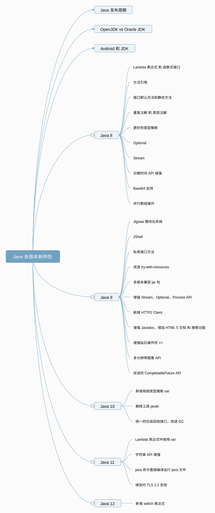

# JDK各个版本特性速览  

## JDK 1.5  

很重要的一个版本。

- 更新了Java内存模型（JMM）
  - 增强volatile语义
  - 增强final语义
- 泛型
- For-Each循环
- 注解
- 枚举
- JUC包
- lock接口

## JDK 1.6  

- Desktop类和SystemTray类
- JAXB2实现对象与XML之间的映射
- StAX
- Compiler API
- 轻量级 Http Server API
- 插入式注解处理API（Pluggable Annotation Processing API）
- 用Console开发控制台程序
- 对脚本语言的支持（如：ruby，groovy，javascript）
- Common Annotations

并发相关：sychronized锁优化：偏向锁、轻量级锁、重量级锁

## JDK 1.7  
- 二进制字面量
- 数字字面量可以出现下划线
- switch 语句可以用字符串
- 泛型实例的创建可以通过类型推断来简化
- try-with-resources 语句
- 异常处理（捕获多个异常）
- JSR203 NIO2.0（AIO）新IO的支持
- JSR292与InvokeDynamic指令
- Path接口、DirectoryStream、Files、WatchService（重要接口更新）
- fork/join framework

**JDK 8之后的更新内容，强烈推荐这篇文章：**

[聊聊 Java8 以后各个版本的新特性](https://juejin.im/post/5d5950806fb9a06b0a277412)

## JDK 1.8   

- Lambda  
- Stream  
- Optional
- Date/Time API (JSR 310)  
- JVM的PermGen空间被移除：取代它的是Metaspace（JEP 122）。

## JDK 9  

- 平台级modularity（原名：Jigsaw） 模块化系统
- Java 的 REPL 工具： jShell 命令
- 多版本兼容 jar 包（这个在处理向下兼容方面，非常好用）
- 语法改进：接口的私有方法
- 语法改进：UnderScore(下划线)使用的限制
- 底层结构：**String 存储结构变更（这个很重要）**  
- 集合工厂方法：快速创建只读集合
- 增强的 Stream API
- 全新的 HTTP 客户端 API
	- HTTP/2, WebSocket 	
- 其它特性

JVM相关：
G1是JDK 9默认GC。

## JDK 10  
- 局部变量的类型推断 var关键字  
- GC改进和内存管理 并行全垃圾回收器 G1
- 垃圾回收器接口
- 线程-局部变量管控
- 合并 JDK 多个代码仓库到一个单独的储存库中
- 新增API：ByteArrayOutputStream
- List、Map、Set新增API：copyOf(Collection）
- 新增API：java.util.Properties
- 新增API： Collectors收集器
- 其它特性

JVM相关：
- The default value for `BiasedLockingStartupDelay` has been changed to 0. （原本默认值是4000，即4s后启动偏向锁。该值貌似一直有调整，在JDK 1.6.0 update 12中，是500，参见https://www.oracle.com/technetwork/java/javase/itanium6u12-137891.html ） 即：JVM启动时延时启用偏向锁改为默认启动。参考[JDK 10 Release Notes](https://www.oracle.com/java/technologies/javase/10-relnote-issues.html)

## JDK 11  

2018年9月26日，Oracle 官方宣布 Java 11 正式发布。这是 Java 大版本周期变化后的第一个长期支持版本（LTS版本，Long-Term-Support，持续支持到2026年9月），非常值得关注。

- 本地变量类型推断
- 字符串加强
- 集合加强
- Stream 加强
- Optional 加强
- InputStream 加强
- HTTP Client API
- 化繁为简，一个命令编译运行源代码

JVM相关：
引入了实验性的**ZGC**

## 参考资料  
- [java各个版本新特性介绍](https://blog.csdn.net/qq_27256783/article/details/98869743)
- [聊聊 Java8 以后各个版本的新特性](https://juejin.im/post/5d5950806fb9a06b0a277412)

