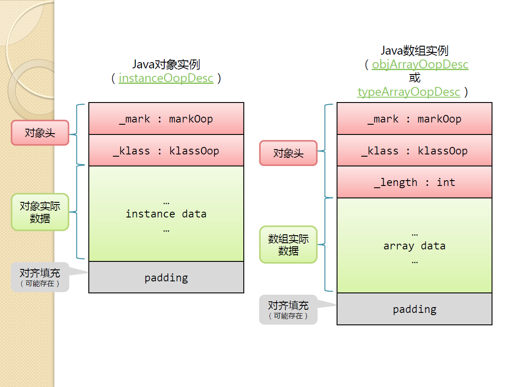
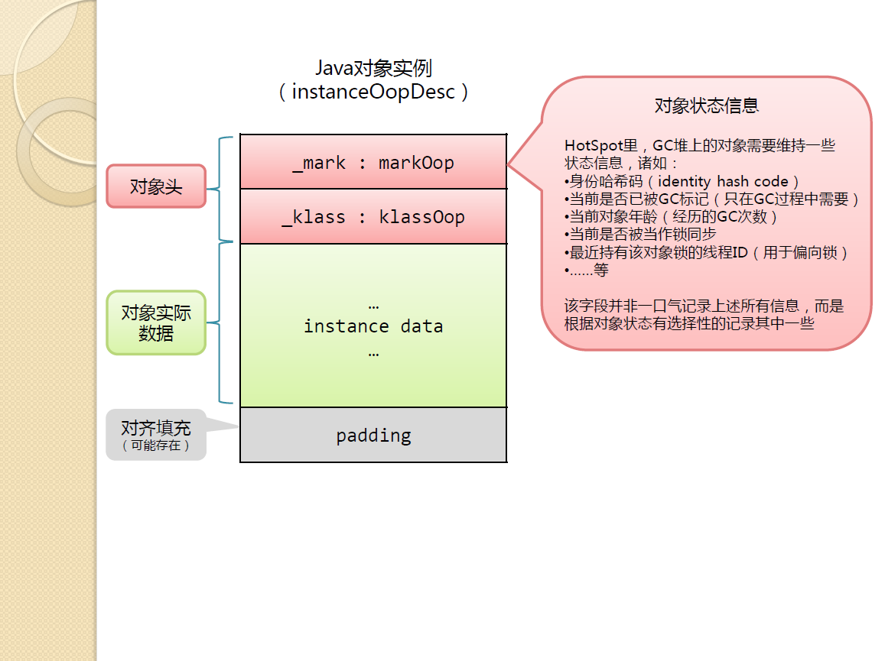
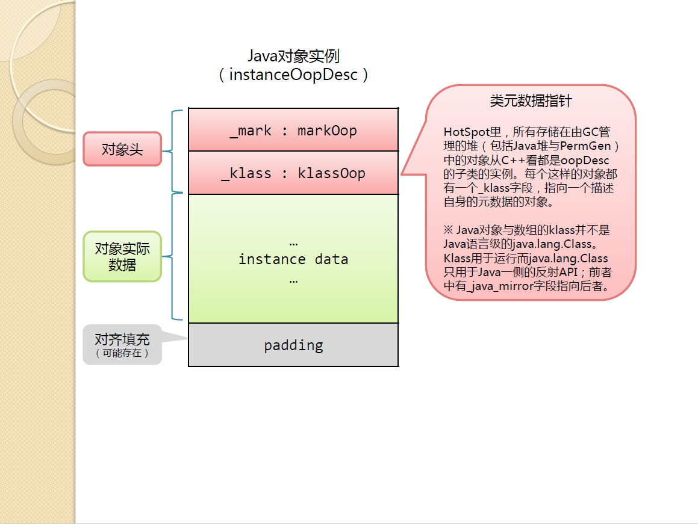
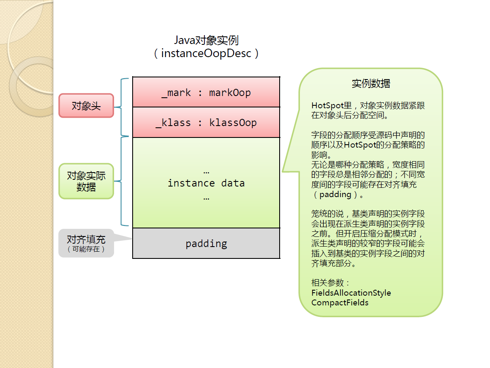
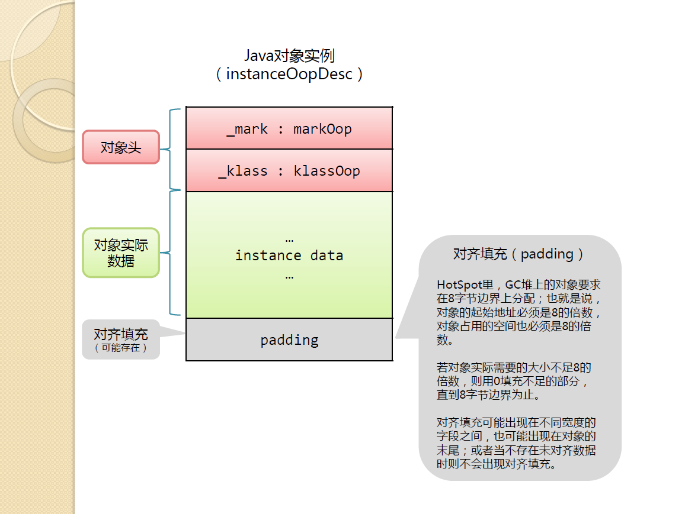
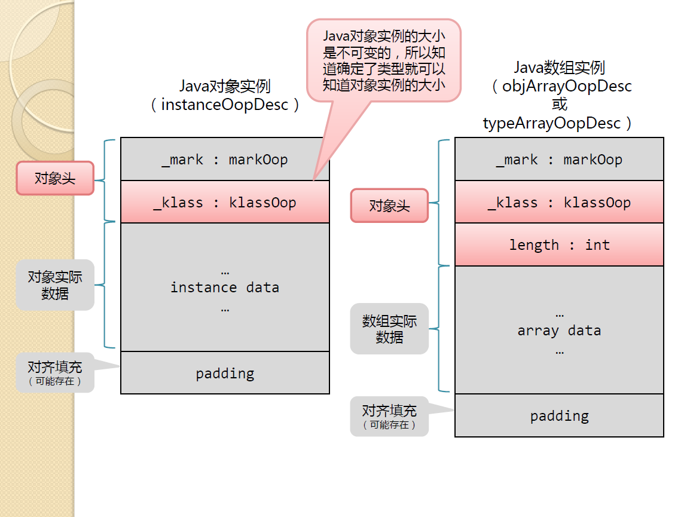
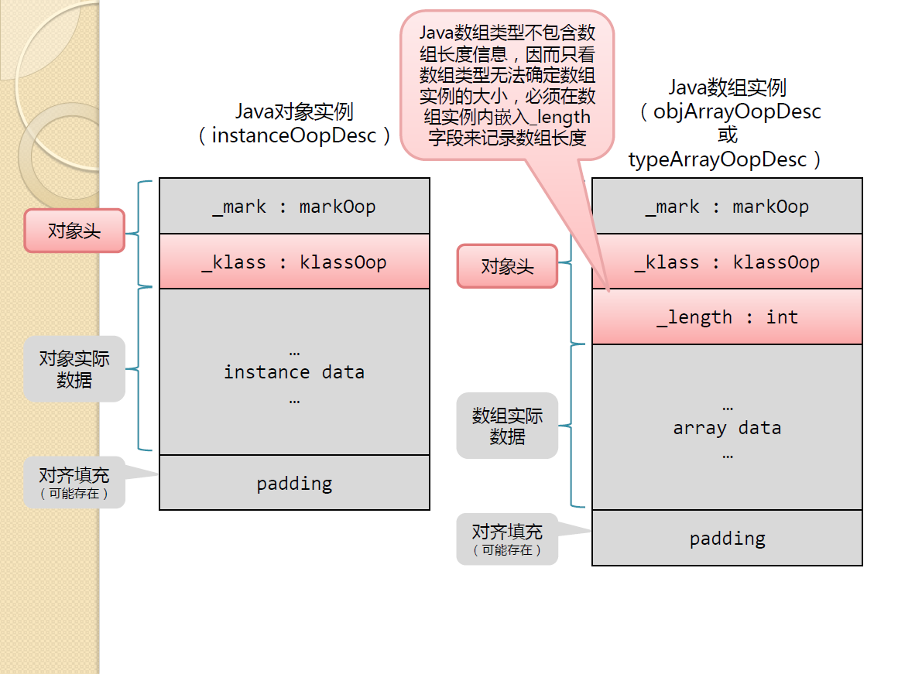
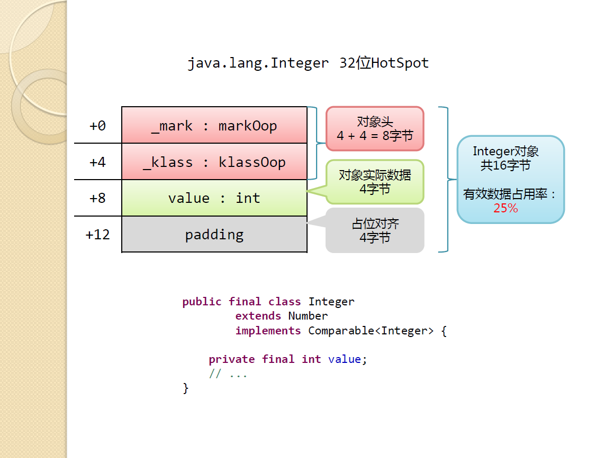
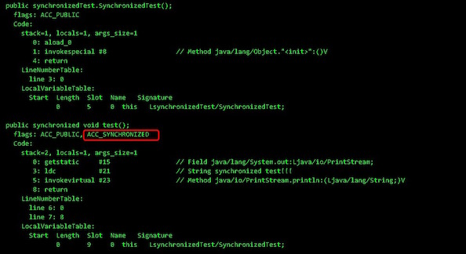
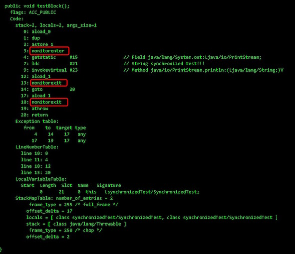

# Java并发之深入解析synchronized

## synchronized的变化

JDK 早期（JDK 版本 <=1.5），synchronized 叫做重量级锁， 因为申请锁资源必须通过kernel, 系统调用

```assembly
;hello.asm
;write(int fd, const void *buffer, size_t nbytes)

section data
    msg db "Hello", 0xA
    len equ $ - msg

section .text
global _start
_start:

    mov edx, len
    mov ecx, msg
    mov ebx, 1 ;文件描述符1 std_out
    mov eax, 4 ;write函数系统调用号 4
    int 0x80

    mov ebx, 0
    mov eax, 1 ;exit函数系统调用号
    int 0x80
```

*注：上述代码来自马士兵教育公开课资料*

在JDK 1.6中，为了优化sychronized、减少其获得锁和释放锁带来的性能消耗而引入的偏向锁和轻量级锁，以及锁的存储结构和升级过程。因此，不能简单的说，“sychronized是重量级锁、不推荐用”，那是老黄历了……一定要弄清楚来龙去脉，事实上，就笔者所看到的资料，引入锁膨胀（lock inflate）后的sychronized锁，基本与`ReentrantLock`这种锁性能是差不多的。

为了说清sychronized，必须先了解JOL。

## 预备知识：Java Object Layout (JOL)

先提出1个问题，什么Java对象布局（Java Object Layout）？

Java对象布局即Java类对象实例，在内存中的结构。

对于HotSpot虚拟机中，Java对象布局基本如下：



简要说，包含：

- 对象头
  - 包含markword，Klass指针，数组长度（若类型是数组才有）
- 实际数据
- 对齐填充（可能存在），即padding部分

每个部分作用概述：














*注：上述图片来自淘宝工程师[莫枢（撒迦）](http://rednaxelafx.iteye.com/)的《[JVM分享](https://pan.baidu.com/s/1mglvMVu)》PPT*

#### 1. Mark Word

标记字主要存储对象运行时的一部分数据。主要内容有 hashcode，GC 分代年龄，锁状态标志位，线程锁标记，偏向线程ID，偏向时间戳等。MarkWord 在32位和64位虚拟机上的大小分别位32bit 和 64bit，它的最后 2 bit 是锁标志位，用来标记当前对象的状态。64位markword 结构与状态变化如下图所示。


#### 2. Klass 指针（元数据指针）

Klass 主要指向对象所属的类信息（class metadata）。虚拟机使用它来确定当前对象属于哪个类。klass 包含类的元数据信息，像类的方法，常量池等。你可以把它当作 java 里的 java.lang.Class 对象.

#### 3. 数组长度

如果这个对象是数组类对象，那么如上图所示，会在对象头里额外的添加一个记录数组长度的字段


#### 4. 实例数据

主要存储的是对象实际的数据

#### 5. 对齐填充

hotspot vm 的自动内存管理系统要求对象起始地址比必须位 8 字节的整数倍，即对象的大小必须是 8 字节的整数倍。而对象头部分正好是 8 字节的整数倍，因此，当对象实例数据部分没有对齐时，此时需要对齐填充来补齐

### 如何查看JOL？

采用openjdk提供的jol包可以打印对象的布局。

引入方式

```xml
<!-- https://mvnrepository.com/artifact/org.openjdk.jol/jol-core -->
<dependency>
    <groupId>org.openjdk.jol</groupId>
    <artifactId>jol-core</artifactId>
    <version>0.10</version>
</dependency>
```

简单的例子：看看Integer的JOL

```java
public class IntegerObjectLayout {

    public static void main(String[] args) {
        Integer intObj = new Integer(13);
        System.out.println(ClassLayout.parseInstance(intObj).toPrintable());
    }
}
```

输出效果：

```assembly
java.lang.Integer object internals:
 OFFSET  SIZE   TYPE DESCRIPTION                               VALUE
      0     4        (object header)                           05 00 00 00 (00000101 00000000 00000000 00000000) (5)
      4     4        (object header)                           00 00 00 00 (00000000 00000000 00000000 00000000) (0)
      8     4        (object header)                           67 22 00 f8 (01100111 00100010 00000000 11111000) (-134208921)
     12     4    int Integer.value                             13
Instance size: 16 bytes
Space losses: 0 bytes internal + 0 bytes external = 0 bytes total
```




题外话：偏向锁在JDK 8中默认在JVM启动后延迟4s启动，时间由JVM参数`BiasedLockingStartupDelay`，JVM作者主要考虑到

启动JVM的时候加上`-XX:-UseBiasedLocking`参数来禁用偏向锁（在存在大量锁对象的创建并高度并发的环境下禁用偏向锁能够带来一定的性能优化）。

可以通过`java -XX:+PrintFlagsFinal`获取所有当前JVM参数。

JDK 10中已经将JVM参数`BiasedLockingStartupDelay`设置为0，即：JVM启动时延时启用偏向锁改为默认启动。参考[JDK 10 Release Notes](https://www.oracle.com/java/technologies/javase/10-relnote-issues.html)

——类似这种细节务必要去关注一下JDK版本，尤其是涉及JVM参数的场景。

## synchronized的锁膨胀过程(lock inflate)

JDK 1.6 为减少获得锁和释放锁带来的性能消耗，引入了“偏向锁”(biased locking)和“轻量级锁”。

在Java SE 1.6中，锁一共4种状态，级别从低到高依次是：

- 无锁状态
- 偏向锁状态
- 轻量级锁状态
- 重量级锁状态

一般情况下，锁可以升级，但不能降级。

*注：事实上，也有锁降级的情况，参见 [Hotspot JVM锁是否可以降级？

状态变化过程如下描述：

```
0.java应用启动的时候会有多个系统自带的线程执行synchronized代码块，必然会导致由偏向锁升级为轻量级锁，为了避免升级所带来额外的开销，
  此时jvm会关闭偏向锁，直接使用轻量级锁，默认等待4秒后再开启偏向锁，可用-XX:BiasedLockingStartupDelay参数设置时间。

1.无锁
在java应用启动后的4秒内new出来的对象，且该对象没被synchronized()锁住，此时是无锁状态。

此时对象头中的mark word(64位)存储数据如下：
25位无意义 | 31位存的是hashCode | 1位无意义 | 4位存的是对象的年龄(在年轻代每回收一次还存活则加1) | 1位存的是偏向锁状态(此时值是0) | 2位存的是锁状态(此时值是01)

2.偏向锁(用户态下即可执行)
在java应用启动后的4秒内new出来的对象，且该对象没被synchronized()锁住，此时因为开启了偏向锁，所以是偏向锁状态。
若该对象被synchronized()锁住，且大多数时间只有一个线程会使用这个锁，则会使用偏向锁，第一个获取锁的线程id会被存到mark word里面。

此时对象头中的mark word(64位)存储数据如下：
54位存获取了锁的线程id | 2位Epoch | 1位无意义 | 4位存的是对象的年龄(在年轻代每回收一次还存活则加1) | 1位存的是偏向锁状态(此时值是1) | 2位存的是锁状态(此时值是01)

3.轻量级锁，也叫自旋锁(用户态下即可执行)
当有两个线程竞争这把锁，首先撤销偏向锁升级为轻量级锁，然后两个线程的线程栈里面都创建一个lock record的记录，
最后两个线程竞争把lock record的指针存到mark word里面，谁先存成功谁获得锁，
另一个线程就不断地查看锁什么时候释放掉，再去加锁，所以叫自旋。
或者是在java应用启动后的4秒内，如果对对象加锁，由于关闭了偏向锁，所以直接使用了轻量级锁。

此时对象头中的mark word(64位)存储数据如下：
62位存的是线程栈里面lock record的指针 | 2位存的是锁状态(此时值是00)

4.重量级锁(需要切换到内核态执行，切换过程很耗时间资源)
当竞争加剧：有线程超过10次自旋或自旋线程数超过cpu核数一半(jdk1.6后jvm自己内部控制)，升级为重量级锁，
切换成内核态，向系统申请调度资源，新建一个对象objectmonitor(由c++实现的)，将竞争的线程都挂起并放到
objectmonitor中的一个队列中，然后由系统调度加锁解锁。

此时对象头中的mark word(64位)存储数据如下：
62位存的是objectmonitor的地址 | 2位存的是锁状态(此时值是10)

5.GC标志信息
当该对象没有其他引用的地方，被GC标志为可回收对象时，是GC标志状态

此时对象头中的mark word(64位)存储数据如下：
62位存的是GC需要的相关信息 | 2位存的是锁状态(此时值是11)
```

上述过程可以参考这张图


注意，有关锁这块，目前看到的是，细节变化比较多，一定要根据所使用的JDK版本，查官方文档，看版本是否有调整。

比如说，有关偏向锁，目前看到有JEP建议废弃偏向锁(https://openjdk.java.net/jeps/374)。

再比如，自旋锁，在JDK1.6中使用-XX:+UseSpinning来开启。在JDK1.7中改为内置实现了，不需要通过参数来指定。

所以一定要注意JDK版本的差异、目前使用的JDK支持什么。


## synchronized实现原理

#### 1. java代码

代码

```java
package synchronizedTest;

public class SynchronizedTest {
    // 作用于方法上
    public synchronized void test(){
        System.out.println("synchronized test!!!");
    }
    // 作用于代码块内
    public void testBlock(){
        synchronized (this) {
            System.out.println("synchronized test!!!");
        }
    }
}
```

#### 2. java字节码

这部分主要参考[synchronized之重量级锁的实现原理](https://www.jianshu.com/u/a58f78946914)

test()反编译后的代码如下图：



testBlock()反编译后的代码如下图：



从上图可以看到：
 1、synchronized方法反编译后，输出的字节码有ACC_SYNCHRONIZED标识
 2、synchronized代码块反编译后，输出的字节码有monitorenter和monitorexit语句

由此我们可以猜测
 1、synchronized的作用域不同，JVM底层实现原理也不同
 2、synchronized代码块是通过monitorenter和monitorexit来实现其语义的
 3、synchronized方法是通过ACC_SYNCRHONIZED来实现其语义的


##### 2.1 monitorenter/monitorexit实现原理

我们先看一下JVM规范是怎么定义monitorenter和monitorexit的👇👇👇
 (1) monitorenter：

> > Each object is associated with a monitor. A monitor is locked if and only if it has an owner. The thread that executes monitorenter attempts to gain ownership of the monitor associated with objectref, as follows:
> >  • If the entry count of the monitor associated with objectref is zero, the thread enters the monitor and sets its entry count to one. The thread is then the owner of the monitor.
> >  • If the thread already owns the monitor associated with objectref, it reenters the monitor, incrementing its entry count.

• If another thread already owns the monitor associated with objectref, the thread blocks until the monitor's entry count is zero, then tries again to gain ownership.

翻译过来：
 每一个对象都会和一个监视器monitor关联。监视器被占用时会被锁住，其他线程无法来获取该monitor。
 当JVM执行某个线程的某个方法内部的monitorenter时，它会尝试去获取当前对象对应的monitor的所有权。其过程如下：

1. 若monior的进入数为0，线程可以进入monitor，并将monitor的进入数置为1。当前线程成为monitor的owner（所有者）
2. 若线程已拥有monitor的所有权，允许它重入monitor，并递增monitor的进入数
3. 若其他线程已经占有monitor的所有权，那么当前尝试获取monitor的所有权的线程会被阻塞，直到monitor的进入数变为0，才能重新尝试获取monitor的所有权。

(2) monitorexit:

> > The thread that executes monitorexit must be the owner of the monitor associated with the instance referenced by objectref.
> >  The thread decrements the entry count of the monitor associated with objectref. If as a result the value of the entry count is zero, the thread exits the monitor and is no longer its owner. Other threads that are blocking to enter the monitor are allowed to attempt to do so.

翻译过来：

1. 能执行monitorexit指令的线程一定是拥有当前对象的monitor的所有权的线程。
2. 执行monitorexit时会将monitor的进入数减1。当monitor的进入数减为0时，当前线程退出monitor，不再拥有monitor的所有权，此时其他被这个monitor阻塞的线程可以尝试去获取这个monitor的所有权。

##### 2.2 ACC_SYNCRHONIZED实现原理

当JVM执行引擎执行某一个方法时，其会从方法区中获取该方法的access_flags，检查其是否有ACC_SYNCRHONIZED标识符，若是有该标识符，则说明当前方法是同步方法，需要先获取当前对象的monitor，再来执行方法。

##### 2.3 monitor

可以看出无论是synchronized代码块还是synchronized方法区，其线程安全的语义实现最终依赖一个叫monitor的东西，那么这个神秘的东西是什么呢？下面让我们来详细介绍一下。

每一个JAVA对象都会与一个监视器monitor关联，我们可以把它理解成为一把锁，当一个线程想要执行一段被synchronized圈起来的同步方法或者代码块时，该线程得先获取到synchronized修饰的对象对应的monitor。

我们的java代码里不会显示地去创造这么一个monitor对象，我们也无需创建，事实上可以这么理解：我们是通过synchronized修饰符告诉JVM需要为我们的某个对象创建关联的monitor对象。

在hotSpot虚拟机中，monitor是由ObjectMonitor实现的。其源码是用c++来实现的，位于hotSpot虚拟机源码ObjectMonitor.hpp文件中。

ObjectMonitor主要数据结构如下：


```cpp
ObjectMonitor() {
    _header       = NULL;
    _count        = 0; //monitor进入数
    _waiters      = 0,
    _recursions   = 0;  //线程的重入次数
    _object       = NULL;
    _owner        = NULL; //标识拥有该monitor的线程
    _WaitSet      = NULL; //等待线程组成的双向循环链表，_WaitSet是第一个节点
    _WaitSetLock  = 0 ;
    _Responsible  = NULL ;
    _succ         = NULL ;
    _cxq          = NULL ; //多线程竞争锁进入时的单项链表
    FreeNext      = NULL ;
    _EntryList    = NULL ; //处于等待锁block状态的线程，会被加入到该列表
    _SpinFreq     = 0 ;
    _SpinClock    = 0 ;
    OwnerIsThread = 0 ;
  }
```

① owner：初始时为NULL。当有线程占有该monitor时，owner标记为该线程的唯一标识。当线程释放monitor时，owner又恢复为NULL。owner是一个临界资源，JVM是通过CAS操作来保证其线程安全的。
 ② _cxq：竞争队列，所有请求锁的线程首先会被放在这个队列中（单向链接）。_cxq是一个临界资源，JVM通过CAS原子指令来修改_cxq队列。修改前_cxq的旧值填入了node的next字段，_cxq指向新值（新线程）。因此_cxq是一个后进先出的stack（栈）。
 ③ _EntryList：_cxq队列中有资格成为候选资源的线程会被移动到该队列中
 ④ _WaitSet：因为调用wait方法而被阻塞的线程会被放在该队列中

_cxq队列为什么是个单向链表，线程是被按照什么顺序放入_cxq队列中，_cxq队列中哪些线程是有资格成为候选资源的线程，
 ObjectMonitor的数据结构中包含三种队列：_WaitSet、_cxq和_EntryList，它们之间的关系转换可以用下图表示：

我们可以猜测对象的monitor的生成时机，可能对象创建的同时，也可能时当执行到某个对象的synchronized方法，发现当前对象没有monitor对象，而为其创建一个monitor对象。

java对象对应的monitor也是一个临界资源，其线程安全由虚拟机自身代码来保证，开发者无需考虑。

## synchronized vs Lock (CAS)

```
 在高争用 高耗时的环境下synchronized效率更高
 在低争用 低耗时的环境下CAS效率更高
 synchronized到重量级之后是等待队列（不消耗CPU）
 CAS（等待期间消耗CPU）
 
 一切以实测为准
```


## 锁消除 lock eliminate

```java
public void add(String str1,String str2){
         StringBuffer sb = new StringBuffer();
         sb.append(str1).append(str2);
}
```

我们都知道 StringBuffer 是线程安全的，因为它的关键方法都是被 synchronized 修饰过的，但我们看上面这段代码，我们会发现，sb 这个引用只会在 add 方法中使用，不可能被其它线程引用（因为是局部变量，栈私有），因此 sb 是不可能共享的资源，JVM 会自动消除 StringBuffer 对象内部的锁。

## 锁粗化 lock coarsening

```java
public String test(String str){
       
       int i = 0;
       StringBuffer sb = new StringBuffer():
       while(i < 100){
           sb.append(str);
           i++;
       }
       return sb.toString():
}
```

JVM 会检测到这样一连串的操作都对同一个对象加锁（while 循环内 100 次执行 append，没有锁粗化的就要进行 100  次加锁/解锁），此时 JVM 就会将加锁的范围粗化到这一连串的操作的外部（比如 while 虚幻体外），使得这一连串操作只需要加一次锁即可。

## 锁降级（不重要）

https://www.zhihu.com/question/63859501

其实，只被VMThread访问，降级也就没啥意义了。所以可以简单认为锁降级不存在！

## 超线程

一个ALU + 两组Registers + PC

## 参考资料

- http://openjdk.java.net/groups/hotspot/docs/HotSpotGlossary.html
- [synchronized之重量级锁的实现原理](https://www.jianshu.com/p/c3313dcf2c23)
- [Java并发编程：Synchronized底层优化（偏向锁、轻量级锁）](https://www.cnblogs.com/paddix/p/5405678.html)
- [JVM系列第12讲：JVM参数之查看JVM参数](https://www.cnblogs.com/chanshuyi/p/jvm_serial_12_jvm_param_jvm_param.html)
- [Synchronized 关键字使用、底层原理、JDK1.6 之后的底层优化以及 和ReenTrantLock 的对比](https://segmentfault.com/a/1190000016810155)
- [啃碎并发（七）：深入分析Synchronized原理](https://juejin.im/post/5b4eec7df265da0fa00a118f)
- [Synchronization and Object Locking](https://wiki.openjdk.java.net/display/HotSpot/Synchronization)
- [聊聊并发（二）——Java SE1.6 中的 Synchronized](https://www.infoq.cn/article/java-se-16-synchronized/)
- [淘宝工程师莫枢（撒迦）的《JVM分享》PPT](https://pan.baidu.com/s/1mglvMVu)
- [synchronized锁的5种状态](https://blog.csdn.net/u012485698/article/details/105850749/)
- Java并发编程的艺术  方腾飞
- 马士兵公开课材料-你以为你真的懂Synchronized
