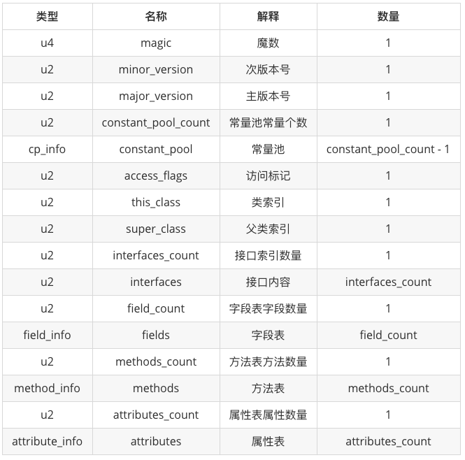
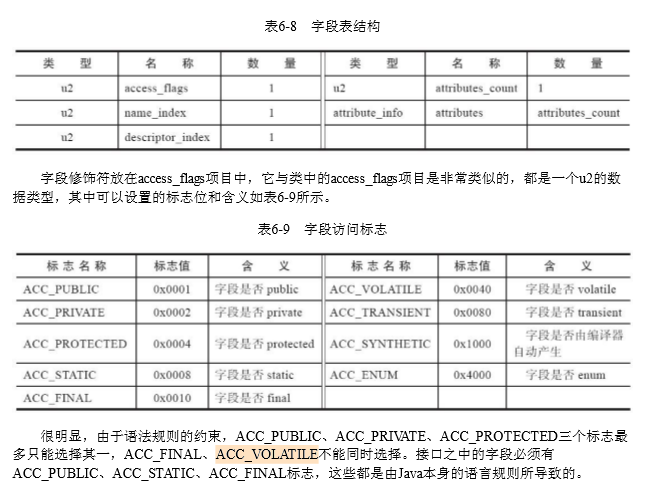
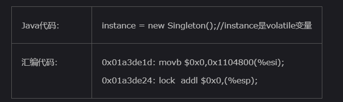

# Java并发之深入解析volatile关键字

[TOC]


从一道面试题讲起：**采用DCL实现单例模式时，是否需要加volatile关键字？为什么？**

## 有关单例模式  

我们在网上搜如何实现单例模式时，帖子往往给出多种实现：饿汉模式、懒汉模式、双重锁懒汉模式（双重锁检查，double check lock，经常简写做DCL）、静态内部类模式、枚举模式等。

此处可以参考 [深入理解单例模式：静态内部类单例原理](https://blog.csdn.net/mnb65482/article/details/80458571) 这篇文章。

顺带提一句，《Java并发编程的艺术》（方腾飞）第3章有讨论过DCL、静态内部类这两种实现方式，建议去读一读。

先说结论：**DCL实现单例，必须加volatile!**

至于为何，首先我们需要理解volatile的语义。


## volatile的语义  

目前我们正在使用的Java版本中，对于`volatile`语义的定义，主要采用 JSR-133中的定义。

> Oracle JSR-133文档：[英文原版](https://download.oracle.com/otndocs/jcp/memory_model-1.0-pfd-spec-oth-JSpec/)   [中文翻译版](http://ifeve.com/jsr133-cn/)


JSR-133在对JLS原始规范的改变中，有两处最有可能要求JVM实现也做出相应的变动：  
>加强了volatile变量的语义，需要有acquire和release语义。在原始的规范中，volatile变量的访问和非volatile变量的访问之间可以自由地重排序。
>加强了final字段的语义，无需显式地同步，不可变对象也是线程安全的。这可能需要在给final字段赋值的那些构造器的末尾加上store-store屏障。

### volatile的内存语义  

>happens-before对volatile规则的定义 : volatile变量的写，先发生于后续对这个变量的读.
>这句话的含义有两层:
>volatile 的写操作, 需要将线程本地内存值,立马刷新到 主内存的共享变量中.
>volatile 的读操作, 需要从主内存的共享变量中读取,更新本地内存变量的值.
由此引出 volatile 的内存语义.
>当写一个volatile变量时，JMM会把该线程对应的本地内存中的共享变量值刷新到主内存.
>当读一个volatile变量时，JMM会把该线程对应的本地内存置为无效。线程接下来将从主内存中读取共享变量,并更新本地内存的值.

注：引自https://www.jianshu.com/p/9e467de97216

### 通俗一点

简单来讲，目前`volatile`关键字主要的作用是：  
- 1. 在多线程访问，保证被volatile修饰变量的可见性
- 2. 禁止指令重排序


### 分析DCL代码

一个典型的DCL代码如下（没加volatile、有问题的版本）：

```java
public class SingleTon{
    //没加volatile、有问题的版本
  private static SingleTon  INSTANCE = null;
  private SingleTon(){}
  public static SingleTon getInstance(){
      if(INSTANCE == null){
          synchronized(SingleTon.class){
             if(INSTANCE == null){ 
               INSTANCE = new SingleTon();
             } 
          }
          return INSTANCE; 
    } 
  }
}
```

有问题地方是这里：

```java
INSTANCE = new SingleTon();
```

这条语句编译成字节码指令后，实际分下面3个步骤：

1. 在堆内存开辟内存空间。
2. 在堆内存中实例化SingleTon里面的各个参数。
3. 把对象指向堆内存空间。

由于JVM存在乱序执行功能，所以可能线程A在2还没执行时就先执行了3，如果此时再被切换到线程B上，由于执行了3，INSTANCE 已经非空了，会被直接拿出来用，这样的话，就会出现异常。这个就是著名的DCL失效问题。

在JSR-133（JDK 1.5中实现）之后，官方也发现了这个问题，增强了volatile，只要定义为`private volatile static SingleTon  INSTANCE = null;`就可解决DCL失效问题。volatile确保INSTANCE每次均在主内存中读取，这样虽然会牺牲一点效率，但也无伤大雅。


## volatile如何保证可见性并禁止指令重排序？  

### 基础知识  

Java程序执行：


JVM执行字节码时，可能发生指令重排序，乱序执行。上面不加volatile的DCL重排就是一个例子。


需要分多个层次来理解：

#### 1. 在Java字节码层面   

字节码文件结构



在字段表中保存着类中各种字段的信息



当字段被volatile修饰时，字段表中对应字段的访问标志将会加上`ACC_VOLATILE`。

#### 2. JVM的内存屏障  

#### as-if-serial与happen-before  

虽然会乱序执行，但会遵循as-if-serial语义和happen-before原则。  

-  as-if-serial : 不管怎么重排序（编译器和处理器为了提高并行度），（单线程）程序的执行结果不会改变。
-  happen-before : 
   -  与程序员密切相关的happens-before规则如下：
      1、程序顺序规则：一个线程中的每个操作，happens-before于线程中的任意后续操作。
      2、监视器锁规则：一个锁的解锁，happens-before于随后对这个锁的加锁。
      3、volatile变量规则：对一个volatile域的写，happens-before于任意后续对这个volatile域的读。
      4、传递性：如果A happens-before B，且B happens-before C，那么A happens-before C。

可以参考 [happens-before规则和as-if-serial语义](https://blog.csdn.net/u010571316/article/details/64906481)  。不用记各种规则，理解即可。


编译器的重排序是指，在不改变单线程程序语义的前提下，可以重新安排语句的执行顺序来优化程序的性能.

编译器的重排序和CPU的重排序的原则一样，会遵守数据依赖性原则，编译器和处理器不会改变存在数据依赖关系的两个操作的执行顺序

编译器、处理器都必须遵守这个语义。JMM层面的内存屏障为了保证内存可见性，Java编译器在生成指令序列的适当位置会插入**内存屏障**来禁止特定类型的处理器的重排序。

JVM中内存屏障有以下4种：

1. LoadLoad屏障：

   对于这样的语句Load1; LoadLoad; Load2， 
   在Load2及后续读取操作要读取的数据被访问前，保证Load1要读取的数据被读取完毕。

2. StoreStore屏障：

   对于这样的语句Store1; StoreStore; Store2，
   在Store2及后续写入操作执行前，保证Store1的写入操作对其它处理器可见。

3. LoadStore屏障：

   对于这样的语句Load1; LoadStore; Store2，
   在Store2及后续写入操作被刷出前，保证Load1要读取的数据被读取完毕。

4. StoreLoad屏障：

   对于这样的语句Store1; StoreLoad; Load2，
    在Load2及后续所有读取操作执行前，保证Store1的写入对所有处理器可见。

参考[JVM系列(三)[计算机硬件的内存模型,数据一致性问题,CPU指令乱序执行,合并写]](https://blog.csdn.net/weixin_42008012/article/details/105910949)


#### 3. Hotspot源码实现

JVM执行字节码的过程，最终会翻译成机器语言，在CPU上执行。

对于JVM内存屏障的实现，不同CPU有不同的实现。以X86为例，下面是个栗子：



有volatile变量修饰的共享变量进行写操作的时候会多第二行汇编代码，通过查IA-32架构软件开发者手册可知，lock前缀的指令在多核处理器下会引发了两件事情：

- 将当前处理器缓存行的数据会写回到系统内存。
- 这个写回内存的操作会引起在其他CPU里缓存了该内存地址的数据无效。

也就是说用`lock`指令来保证CPU中缓存的可见性。


> 在多处理器环境中，LOCK# 信号确保在声言该信号期间，处理器可以独占使用任何共享内存。（因为它会锁住总线，导致其他CPU不能访问总线，不能访问总线就意味着不能访问系统内存），但是在最近的处理器里，LOCK＃信号一般不锁总线，而是锁缓存，毕竟锁总线开销比较大。
>
> 对于Intel486和Pentium处理器，在锁操作时，总是在总线上声言LOCK#信号。但在P6和最近的处理器中，如果访问的内存区域已经缓存在处理器内部，则不会声言LOCK#信号。相反地，它会锁定这块内存区域的缓存并回写到内存，并使用缓存一致性机制来确保修改的原子性，此操作被称为“缓存锁定”，缓存一致性机制会阻止同时修改被两个以上处理器缓存的内存区域数据 。
>
> 一个处理器的缓存回写到内存会导致其他处理器的缓存无效 。IA-32处理器和Intel 64处理器使用MESI（修改，独占，共享，无效）控制协议去维护内部缓存和其他处理器缓存的一致性。在多核处理器系统中进行操作的时候，IA-32 和Intel 64处理器能嗅探其他处理器访问系统内存和它们的内部缓存。它们使用嗅探技术保证它的内部缓存，系统内存和其他处理器的缓存的数据在总线上保持一致。例如在Pentium和P6 family处理器中，如果通过嗅探一个处理器来检测其他处理器打算写内存地址，而这个地址当前处理共享状态，那么正在嗅探的处理器将无效它的缓存行，在下次访问相同内存地址时，强制执行缓存行填充。

上述内容参考自：[并发之volatile底层原理](https://www.cnblogs.com/awkflf11/p/9218414.html)

总结一下：**LOCK 用于在多处理器中执行指令时对共享内存的独占使用。它的作用是能够将当前处理器对应缓存的内容刷新到内存，并使其他处理器对应的缓存失效。另外还提供了有序的指令无法越过这个内存屏障的作用。**

Hotspot C++源码分析可以参考这篇文章[面试必问的volatile，你了解多少？](https://www.jianshu.com/p/506c1e38a922)


##### 3.1 扩展1：缓存行（cache line）
参考 [并发之volatile底层原理](https://www.cnblogs.com/awkflf11/p/9218414.html)


##### 3.2 扩展2：缓存一致性协议  
参考这篇文章 [【并发编程】MESI--CPU缓存一致性协议](https://www.cnblogs.com/z00377750/p/9180644.html)

# 参考资料

- [深入理解单例模式：静态内部类单例原理](https://blog.csdn.net/mnb65482/article/details/80458571)
- [java并发(4)深入理解volatile](https://www.jianshu.com/p/9e467de97216)
- [并发之volatile底层原理](https://www.cnblogs.com/awkflf11/p/9218414.html)
- [面试必问的volatile，你了解多少？](https://www.jianshu.com/p/506c1e38a922)
- [架构师五分钟带你读懂，Volatile的作用及原理](https://www.jianshu.com/p/d2641fdf5d44)
- [happens-before规则和as-if-serial语义](https://blog.csdn.net/u010571316/article/details/64906481)
- [并发之volatile底层原理](https://www.cnblogs.com/awkflf11/p/9218414.html)
- [【并发编程】MESI--CPU缓存一致性协议](https://www.cnblogs.com/z00377750/p/9180644.html)