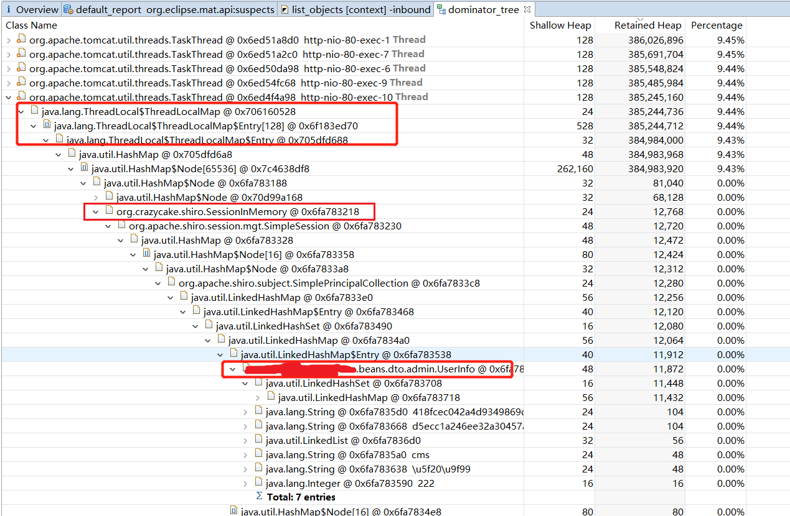

# 第三方库shiro-redis所引起的内存泄露问题分析

## 现象  

线上某系统运行不到一周，响应速度变慢，并且多次重启，排查时发现CPU占用到100%，但这段时间系统并发量并未改变，数据库、缓存等也没发现异常。


## 排查过程

1、top指令查看哪个进程占用CPU高

发现确实是该系统的java进程。

2、使用  `top -Hp 进程id`  看哪个线程，然后利用`jstack`命令查看对应线程一直在干什么

很经典的排查线上CPU 100%问题的操作步骤，注意要转十六进制 ~.~

最终发现是GC操作占用CPU。

3、此处怀疑是某处有内存泄露，使用`jmap -histo:live 进程id | head -20 ` 查看占用内存最多的对象有哪些

此处注意： 'jmap' 命令导出堆转储文件时（'jmap -dump:live,format=b,file=文件名称   进程id'） 时，会触发Full GC！！！触发Full GC可能导致线上服务不可用。因此要慎重使用，比如如果是多实例部署的话，先隔离一个实例，避免对线上产生影响。'jmap -histo:live' 这条命令则没那么恐怖的后果。

由于打印出的结果主要是对象签名，不太容易看，于是最终还是导出了一份堆转储文件，用MAT分析，下面是截图



参见标红的位置，首先可以看到是某处ThreadLocalMap一直有堆积、没有被释放。

然后进一步往下追，可以看到出问题的地方是`org.crazycake.shiro.SessionInMemory`，对应的业务对象是`UserInfo`这个自定义类的对象。


## 源码分析  

`org.crazycake.shiro.SessionInMemory` 这个类来自于`shiro-redis`包，用于在`shiro`中使用`redis`缓存`session`。出问题的代码，是`shiro-redis 3.2.0`版本中的`RedisSessionDAO` 读取session的代码，如下：

```java
@Override
protected Session doReadSession(Serializable sessionId) {
    if (sessionId == null) {
        logger.warn("session id is null");
        return null;
    }
    Session s = getSessionFromThreadLocal(sessionId);

    if (s != null) {
        return s;
    }

    logger.debug("read session from redis");
    try {
        s = (Session) valueSerializer.deserialize(redisManager.get(keySerializer.serialize(getRedisSessionKey(sessionId))));
        setSessionToThreadLocal(sessionId, s);
    } catch (SerializationException e) {
        logger.error("read session error. settionId=" + sessionId);
    }
    return s;
}


private Session getSessionFromThreadLocal(Serializable sessionId) {
    Session s = null;

    if (sessionsInThread.get() == null) {
        return null;
    }

    Map<Serializable, SessionInMemory> sessionMap = (Map<Serializable, SessionInMemory>) sessionsInThread.get();
    SessionInMemory sessionInMemory = sessionMap.get(sessionId);
    if (sessionInMemory == null) {
        return null;
    }
    Date now = new Date();
    /*
    此处有问题：仅判断了当前传入的sessionId对应的session是否过期，若过期则删除。那么，其他session呢？一直还在sessionMap中、没有被移除！
    */
    long duration = now.getTime() - sessionInMemory.getCreateTime().getTime();
    if (duration < sessionInMemoryTimeout) {
        s = sessionInMemory.getSession();
        logger.debug("read session from memory");
    } else {
        sessionMap.remove(sessionId);
    }

    return s;
}

```


有问题的地方在`getSessionFromThreadLocal`中，仅判断了当前传入的sessionId对应的session是否过期，若过期则删除；其他session一直没有做任何操作，显然，这将导致其他session一直还存在于sessionMap中、不会被释放，进而导致OOM。

`shiro-redis`的作者显然也意识到了这个问题，在`shiro-redis 3.2.3`时，此处代码修改如下：

```java
@Override
protected Session doReadSession(Serializable sessionId) {
    if (sessionId == null) {
        logger.warn("session id is null");
        return null;
    }

    //此处添加了标志位判断，用户可以关闭ThreadLocal缓存
    if (this.sessionInMemoryEnabled) {
        Session session = getSessionFromThreadLocal(sessionId);
        if (session != null) {
            return session;
        }
    }

    Session session = null;
    logger.debug("read session from redis");
    try {
        session = (Session) valueSerializer.deserialize(redisManager.get(keySerializer.serialize(getRedisSessionKey(sessionId))));
        if (this.sessionInMemoryEnabled) {
            setSessionToThreadLocal(sessionId, session);
        }
    } catch (SerializationException e) {
        logger.error("read session error. settionId=" + sessionId);
    }
    return session;
}

private Session getSessionFromThreadLocal(Serializable sessionId) {

    if (sessionsInThread.get() == null) {
        return null;
    }

    Map<Serializable, SessionInMemory> sessionMap = (Map<Serializable, SessionInMemory>) sessionsInThread.get();
    SessionInMemory sessionInMemory = sessionMap.get(sessionId);
    if (sessionInMemory == null) {
        return null;
    }
    long liveTime = getSessionInMemoryLiveTime(sessionInMemory);
    if (liveTime > sessionInMemoryTimeout) {
        sessionMap.remove(sessionId);
        return null;
    }

    logger.debug("read session from memory");
    return sessionInMemory.getSession();
}
```

## 解决

有两种解决方案：

- 1）不要使用ThreadLocal缓存session，直接从redis中获取。该方式会一定程度上降低性能，需要频繁访问redis。
- 2）getSessionFromThreadLocal()方法获取session的时候，顺便检查其他session是否超时，如果超时则移除掉，避免session的不断累积。

本人倾向于第1种，升级`shiro-redis`包到3.2.3，并且在创建`RedisSessionDAO `时，关闭`ThreadLocal`缓存功能。

如下面代码：

```java
    @Bean(name = "redisSessionDAO")
    public RedisSessionDAO getSessionDAO() {
        RedisSessionDAO redisSessionDAO = new RedisSessionDAO();
      	...
        //禁用通过ThreadLocal来存储当前session信息
        redisSessionDAO.setSessionInMemoryEnabled(false);
        return redisSessionDAO;
    }
```

第2种方案，需要修改`shiro-redis`源码，有需要的童鞋可以动手实现一下，但注意session很多时，采用检查、删除的方式可能也会有一定性能损耗，需要实际压测权衡一下哪种方案更好。


## 参考资料

- [shiro-redis引起的内存泄漏问题分析](http://www.findsrc.com/java/detail/8688)
- (一次java 内存泄漏问题的解决过程)[https://blog.csdn.net/u012954380/article/details/103007726/]