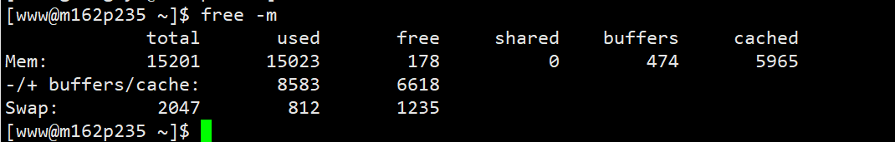
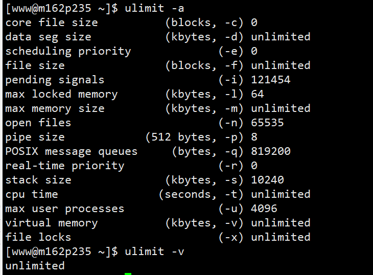

[TOC]

# 系统监控

注意，本帖只是简单汇总下常用命令，具体命令参数参见linux man手册或是参考资料中给出的帖子。

## free
free 命令能够显示系统中物理上的空闲和已用内存，还有交换内存，同时，也能显示被内核使用的缓冲和缓存

注意：
(-buffers/cache)表示真正使用的内存数， (+buffers/cache) 表示真正未使用的内存数
Swap：表示硬盘上交换分区的使用情况

## ulimit
ulimit用于显示系统资源限制的信息
  

# 参考资料
- [linux系列之常用运维命令整理笔录](https://blog.csdn.net/u014427391/article/details/102785219)
- 