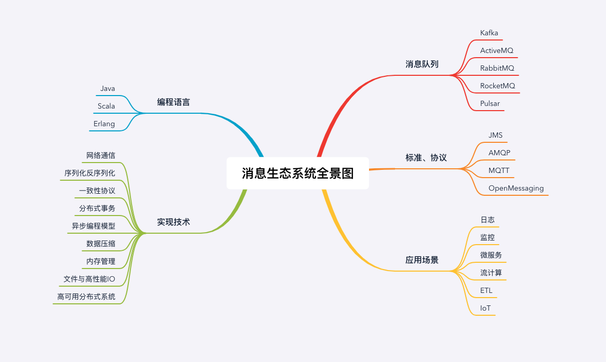

# 消息队列高手课-笔记

[TOC]

## 总览
思维导图

参考资料
- [RocketMQ 官方文档](https://rocketmq.apache.org/docs/quick-start/)
- [RocketMQ 中国开发者中心](http://rocketmq.cloud/zh-cn/)
- [Kafka 官方文档](http://kafka.apache.org/documentation/)
- [RabbitMQ 官方文档](https://www.rabbitmq.com/documentation.html)

## 01 为何需要消息队列
### 哪些问题适合使用消息队列来解决？
1. 异步处理
   - 问题：如何设计一个秒杀系统？
   - 好处：
     - 可以更快地返回结果
     - 减少等待，自然实现了步骤之间的并发，提升系统总体的性能
2. 流量控制
   - 问题：如何避免过多的请求压垮我们的秒杀系统？
   - 设计思路：使用消息队列隔离网关和后端服务，以达到流量控制和保护后端服务的目的。
3. 

### 
