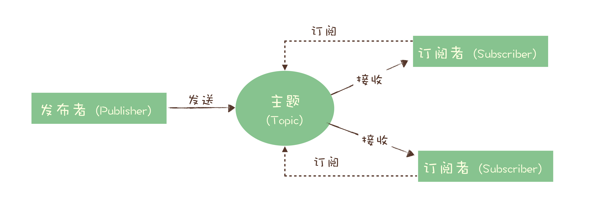
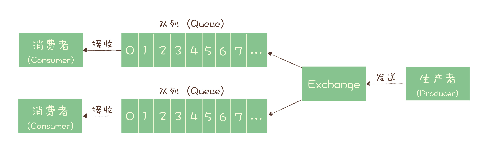

# 消息队列高手课-笔记

[TOC]

## 总览
思维导图

参考资料
- [RocketMQ 官方文档](https://rocketmq.apache.org/docs/quick-start/)
- [RocketMQ 中国开发者中心](http://rocketmq.cloud/zh-cn/)
- [Kafka 官方文档](http://kafka.apache.org/documentation/)
- [RabbitMQ 官方文档](https://www.rabbitmq.com/documentation.html)

## 01 为何需要消息队列
### 哪些问题适合使用消息队列来解决？
1. 异步处理
   - 问题：如何设计一个秒杀系统？
   - 好处：
     - 可以更快地返回结果
     - 减少等待，自然实现了步骤之间的并发，提升系统总体的性能
2. 流量控制
   - 问题：如何避免过多的请求压垮我们的秒杀系统？
   - 设计思路：使用消息队列隔离网关和后端服务，以达到流量控制和保护后端服务的目的。
3. 服务解耦
    - 问题：对于电商系统，当创建一个新订单时，需要
      - 支付系统需要发起支付流程；
      - 风控系统需要审核订单的合法性；
      - 客服系统需要给用户发短信告知用户；
      - 经营分析系统需要更新统计数据；
    - 解决：MQ
4. 作为发布 / 订阅系统实现一个微服务级系统间的观察者模式
5. 连接流计算任务和数据
6. 用于将消息广播给大量接收者

### 引入MQ所带来的问题
1. 增加延迟
2. 增加系统复杂性
3. 可能产生数据不一致

## 02 该如何选择消息队列？
### 选择标准
- 开源
- 近年来比较流行，有一定社区活跃度
- 流行的产品与周边生态系统会有一个比较好的集成和兼容
- 必备的产品特性：
  - 消息的可靠传递
  - 支持集群
  - 具备足够好的性能

### 可供选择的开源产品

现状 | 产品 | 特点  | 问题 
- |  - | - | - 
第一梯队 | RabbitMQ | 轻量级、容易部署； 支持非常灵活的路由配置； 客户端支持的编程语言非常广泛，兼容性好 | 对消息堆积的支持并不好； 与RocketMQ、Kafka相比，性能相对较差（每秒处理几万-几十万）； 实现语言是Erlang，学习曲线较为陡峭，不利于扩展或是二次开发
第一梯队 | RocketMQ | 阿里出品，性能、稳定性和可靠性经受多次双十一考验，值得信赖； 中文社区活跃，容易扩展或是二次开发； 对在线业务的响应时延做了很多的优化，大多数情况下可以做到毫秒级的响应，如果你的应用场景很在意响应时延，可尝试之； 每秒钟大概能处理几十万条消息，高出RabbitMQ一个量级 | 国产，国际上没有那么流行，周边生态系统集成和兼容程序略逊色
第一梯队 | Kafka | 设计初衷：处理海量的日志； 与周边生态系统的兼容性是最好的没有之一，尤其在大数据和流计算领域，几乎所有的相关开源软件系统都会优先支持 Kafka； Kafka 的性能，尤其是异步收发的性能，是三者中最好的，但与 RocketMQ 并没有量级上的差异，大约每秒钟可以处理几十万条消息；<> | 同步收发消息的响应时延比较高。在它的 Broker 中多处使用这种“先攒一波再一起处理”的设计。当每秒钟消息数量不怎么多的时候，Kafka 的时延反而会比较高。所以，Kafka 不太适合在线业务场景。
第二梯队 | ActiveMQ | 最老牌的开源消息队列； 目前已进入老年期，社区不活跃
第二梯队 | ZeroMQ | 严格来说 ZeroMQ 并不能称之为一个消息队列，而是一个基于消息队列的多线程网络库，如果你的需求是将消息队列的功能集成到你的系统进程中，可以考虑使用 ZeroMQ。
第二梯队 | Pulsar | 最早是由 Yahoo 开发，目前处于成长期，流行度和成熟度相对没有那么高； Pulsar 采用存储和计算分离的设计

## 03 消息模型：主题和队列有什么区别？
早期的MQ，都是按照队列模型设计：

问题：多个消费者的情况，只能多个队列
进一步解决：发布-订阅模型

队列模式和发布 - 订阅模式，最大区别：一份消息数据能不能被消费多次的问题。
现代的消息队列产品使用的消息模型大多是这种发布 - 订阅模型，当然也有例外，比如RabbitMQ

### RabbitMQ消息模型

利用exchange，变相地实现新发布 - 订阅模型中，“一份消息数据可以被多个订阅者来多次消费”这样的功能。

### RocketMQ消息模型

标准的发布 - 订阅模型

概念：
生产者、消费者和主题
队列

“请求 - 确认”机制：确保消息不会在传递过程中由于网络或服务器故障丢失。具体的做法也非常简单。
- 在生产端，生产者先将消息发送给服务端，也就是 Broker，服务端在收到消息并将消息写入主题或者队列中后，会给生产者发送确认的响应。
- 在消费端，消费者在收到消息并完成自己的消费业务逻辑（比如，将数据保存到数据库中）后，也会给服务端发送消费成功的确认，服务端只有收到消费确认后，才认为一条消息被成功消费，否则它会给消费者重新发送这条消息，直到收到对应的消费成功确认。

带来的问题：为了确保消息的有序性，在某一条消息被成功消费之前，下一条消息是不能被消费的，否则就会出现消息空洞，违背了有序性这个原则。
——没法通过水平扩展消费者的数量来提升消费端总体的消费性能。为了解决这个问题，RocketMQ 在主题下面增加了队列的概念。

订阅者：Consumer Group 消费组
不同消费组之间消费进度彼此不受影响，同一个组内的消费者是竞争消费的关系

