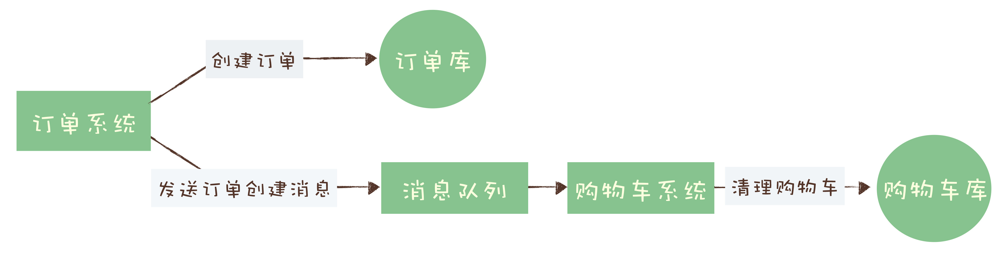
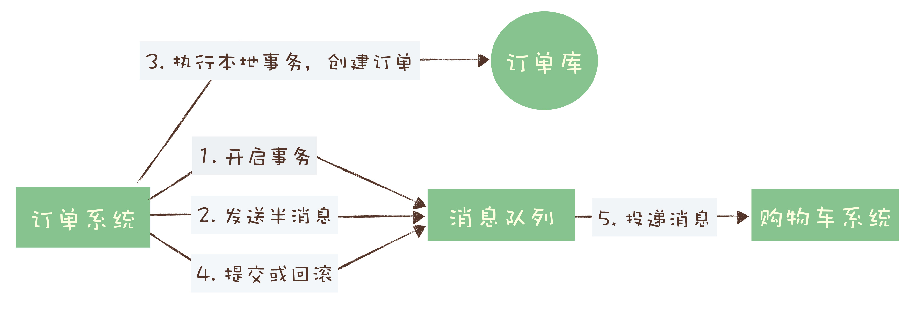
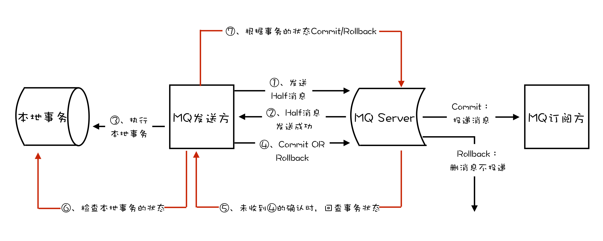
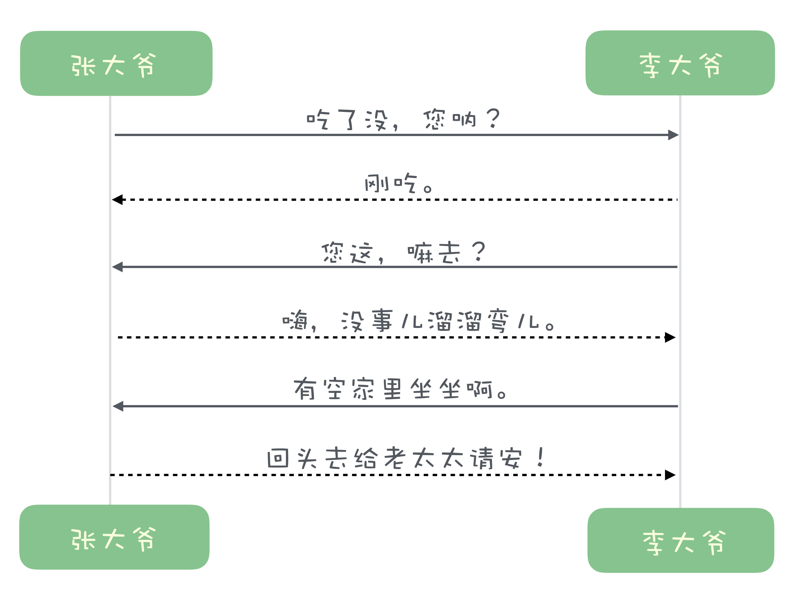
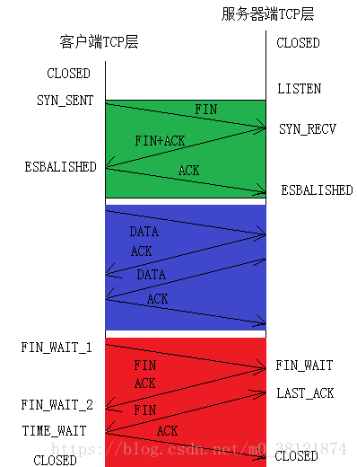
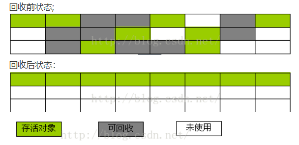
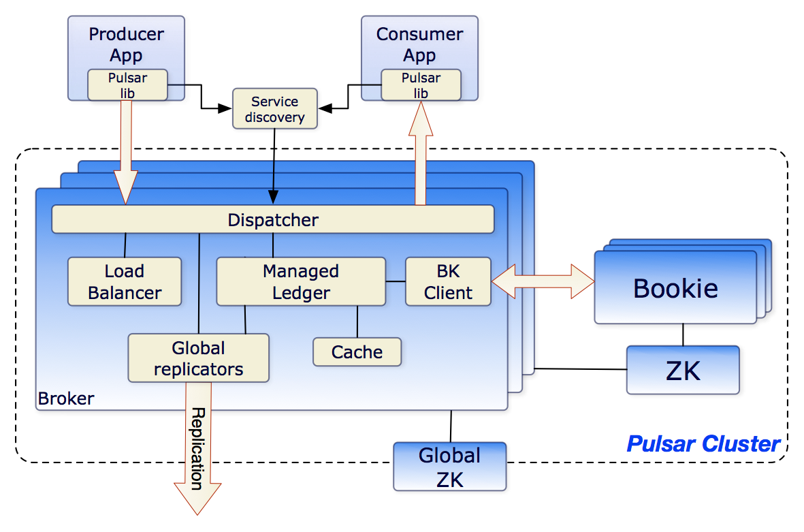

# 消息队列高手课-笔记

[TOC]

### 注：本文内容来源于极客时间《消息队列高手课》，本文只是整理汇总、个人学习之用。

## 总览
思维导图


参考资料
- [RocketMQ 官方文档](https://rocketmq.apache.org/docs/quick-start/)
- [RocketMQ 中国开发者中心](http://rocketmq.cloud/zh-cn/)
- [Kafka 官方文档](http://kafka.apache.org/documentation/)
- [RabbitMQ 官方文档](https://www.rabbitmq.com/documentation.html)

## 01 为何需要消息队列
### 哪些问题适合使用消息队列来解决？
1. 异步处理
   - 问题：如何设计一个秒杀系统？
   - 好处：
     - 可以更快地返回结果
     - 减少等待，自然实现了步骤之间的并发，提升系统总体的性能
2. 流量控制
   - 问题：如何避免过多的请求压垮我们的秒杀系统？
   - 设计思路：使用消息队列隔离网关和后端服务，以达到流量控制和保护后端服务的目的。
3. 服务解耦
    - 问题：对于电商系统，当创建一个新订单时，需要
      - 支付系统需要发起支付流程；
      - 风控系统需要审核订单的合法性；
      - 客服系统需要给用户发短信告知用户；
      - 经营分析系统需要更新统计数据；
    - 解决：MQ
4. 作为发布 / 订阅系统实现一个微服务级系统间的观察者模式
5. 连接流计算任务和数据
6. 用于将消息广播给大量接收者

### 引入MQ所带来的问题
1. 增加延迟
2. 增加系统复杂性
3. 可能产生数据不一致


## 02 该如何选择消息队列？
### 选择标准
- 开源
- 近年来比较流行，有一定社区活跃度
- 流行的产品与周边生态系统会有一个比较好的集成和兼容
- 必备的产品特性：
  - 消息的可靠传递
  - 支持集群
  - 具备足够好的性能

### 可供选择的开源产品

现状 | 产品 | 特点  | 问题 
- |  - | - | - 
第一梯队 | RabbitMQ | 轻量级、容易部署；<br/>支持非常灵活的路由配置；<br/>客户端支持的编程语言非常广泛，兼容性好 | 对消息堆积的支持并不好；<br/>与RocketMQ、Kafka相比，性能相对较差（每秒处理几万-几十万）；<br/>实现语言是Erlang，学习曲线较为陡峭，不利于扩展或是二次开发
第一梯队 | RocketMQ | 阿里出品，性能、稳定性和可靠性经受多次双十一考验，值得信赖；<br/>中文社区活跃，容易扩展或是二次开发；<br/>对在线业务的响应时延做了很多的优化，大多数情况下可以做到毫秒级的响应，如果你的应用场景很在意响应时延，可尝试之；<br/>每秒钟大概能处理几十万条消息，高出RabbitMQ一个量级 | 国产，国际上没有那么流行，周边生态系统集成和兼容程序略逊色
第一梯队 | Kafka | 设计初衷：处理海量的日志；<br/>与周边生态系统的兼容性是最好的没有之一，尤其在大数据和流计算领域，几乎所有的相关开源软件系统都会优先支持 Kafka；<br/>Kafka 的性能，尤其是异步收发的性能，是三者中最好的，但与 RocketMQ 并没有量级上的差异，大约每秒钟可以处理几十万条消息；<> | 同步收发消息的响应时延比较高。在它的 Broker 中多处使用这种“先攒一波再一起处理”的设计。当每秒钟消息数量不怎么多的时候，Kafka 的时延反而会比较高。所以，Kafka 不太适合在线业务场景。
第二梯队 | ActiveMQ | 最老牌的开源消息队列；<br/>目前已进入老年期，社区不活跃
第二梯队 | ZeroMQ | 严格来说 ZeroMQ 并不能称之为一个消息队列，而是一个基于消息队列的多线程网络库，如果你的需求是将消息队列的功能集成到你的系统进程中，可以考虑使用 ZeroMQ。
第二梯队 | Pulsar | 最早是由 Yahoo 开发，目前处于成长期，流行度和成熟度相对没有那么高；<br/>Pulsar 采用存储和计算分离的设计


## 03 消息模型：主题和队列有什么区别？
早期的MQ，都是按照队列模型设计：


问题：多个消费者的情况，只能多个队列
进一步解决：发布-订阅模型


队列模式和发布 - 订阅模式，最大区别：一份消息数据能不能被消费多次的问题。
现代的消息队列产品使用的消息模型大多是这种发布 - 订阅模型，当然也有例外，比如RabbitMQ

### RabbitMQ消息模型

利用exchange，变相地实现新发布 - 订阅模型中，“一份消息数据可以被多个订阅者来多次消费”这样的功能。

### RocketMQ消息模型

标准的发布 - 订阅模型

概念：
生产者、消费者和主题
队列

“请求 - 确认”机制：确保消息不会在传递过程中由于网络或服务器故障丢失。具体的做法也非常简单。
- 在生产端，生产者先将消息发送给服务端，也就是 Broker，服务端在收到消息并将消息写入主题或者队列中后，会给生产者发送确认的响应。
- 在消费端，消费者在收到消息并完成自己的消费业务逻辑（比如，将数据保存到数据库中）后，也会给服务端发送消费成功的确认，服务端只有收到消费确认后，才认为一条消息被成功消费，否则它会给消费者重新发送这条消息，直到收到对应的消费成功确认。

带来的问题：为了确保消息的有序性，在某一条消息被成功消费之前，下一条消息是不能被消费的，否则就会出现消息空洞，违背了有序性这个原则。
——没法通过水平扩展消费者的数量来提升消费端总体的消费性能。为了解决这个问题，RocketMQ 在主题下面增加了队列的概念。

重要概念：
订阅者：Consumer Group 消费组
不同消费组之间消费进度彼此不受影响，同一个组内的消费者是竞争消费的关系

消费位置 Consumer Offset


### Kafka 的消息模型
Kafka 的消息模型和 RocketMQ 是完全一样的，唯一的区别是，在 Kafka 中，队列这个概念的名称不一样，Kafka 中对应的名称是“分区（Partition）”，含义和功能是没有任何区别的。

### 思考题
Q1：rocketmq，一个消费组在一个主题下的多个队列并发消费就无法保证消息的顺序性。这种该如何处理?
A1：按照订单ID或者用户ID，用一致性哈希算法，计算出队列ID，指定队列ID发送，这样可以保证相同的订单/用户的消息总被发送到同一个队列上，就可以确保严格顺序了。

Q2：在介绍 RocketMQ 的消息模型时讲过，在消费的时候，为了保证消息的不丢失和严格顺序，每个队列只能串行消费，无法做到并发，否则会出现消费空洞的问题。那如果放宽一下限制，不要求严格顺序，能否做到单个队列的并行消费呢？如果可以，该如何实现？
理解：生产者允许多生产者同时生产消息，每条消息只会被主题中的某条队列接收，消费组内的消费者竞相消费所有队列，消费者会根据消费组在队列上的数来记录已消费位置，做到的就是队列上的有序，但是有可能整个topic下，是无序的。有可能图中的4要先被消费，但是另一队列中的3还没被消费。
所以如果需要有序，就需要发送到同一条队列中去了。
A2：今天的思考题，我觉得应该是，把消息队列的先进先出，改成数组的随机访问，用offset来控制消息组具体要消费哪条消息，mq不主动删除消息，消息有过期时间，如果到了过期时间，只能确认不能重新该消费，只保留最大可设置天数的消息。超过该天数则删除，还要维护客户端确认信息，如果有客户端没确认，需要有重发机制。
作者回复: 现代的消息队列大多就是这么实现的。


## 04 如何利用事务消息实现分布式事务？
很多场景下，我们“发消息”这个过程，目的往往是通知另外一个系统或者模块去更新数据，消息队列中的“事务”，主要解决的是消息生产者和消息消费者的数据一致性问题。

例子：电商系统-购物流程：商品加到购物车里，下单，支付


这个过程中有一个需要用到消息队列的步骤，订单系统创建订单后，发消息给购物车系统，将已下单的商品从购物车中删除。
——使用消息队列来异步清理购物车

### 分布式事务

常见分布式事务实现：
- 2PC：Two-phase Commit，二阶段提交
- TCC：Try-Confirm-Cancel，
- 事务消息
  - 适用场景：需要异步更新数据，并且对数据实时性要求不太高的场景。

### 消息队列是如何实现分布式事务的？
需要MQ支持。

“半消息”：包含的内容就是完整的消息内容，半消息和普通消息的唯一区别是，在事务提交之前，对于消费者来说，这个消息是不可见的

如果在步骤4提交事务时失败，如何处理？
- Kafka 直接抛出异常，用户自行处理
- RocketMQ 另一种方式

### RocketMQ 中的分布式事务实现
增加了事务反查的机制来解决事务消息提交失败的问题:
提交“半消息”后，若RocketMQ 的 Broker 没有收到提交或者回滚的请求,Broker会定期去Producer上反查这个事务对应的本地事务的状态，然后根据反查结果决定提交或者回滚这个事务
业务代码需要实现一个反查本地事务状态的接口，告知 RocketMQ 本地事务是成功还是失败。



### 思考题
RocketMQ 的这种事务消息是不是完整地实现了事务的 ACID 四个特性？如果不是，哪些特性没有实现？
评论：A:本地事物的操作1，与往消息队列中生产消息的操作2，是两个分离的操作，不符合对原子性的定义；
C:由于操作消息队列属于异步操作，在数据一致性上，只能保证数据的最终一致性。若对于时效性要求很高的系统来说，事物消息不是数据一致的；但对于时效性要求不高的系统来说，他就是数据一致的。我认为，用不同的业务视角来看问题，会有不同的答案；
I：隔离性上，由于事物消息是分两步操作的，本地事物提交后，别的事物消息就已经可以看到提交的消息了。所以，不符合隔离性的定义；
D：持久性上，rocketMq上支持事物的反查机制，但我不太清楚“半消息”是存储在磁盘中，还是内存里。若存储在磁盘中，那就支持持久性，即使事物消息提交后，发生服务突然宕机也不受影响；若存储在内存中，则无法保证持久性。

## 05 如何确保消息不会丢失?
### 检测消息丢失的方法
- 分布式链路追踪系统
  - [各大厂分布式链路跟踪系统架构对比](https://www.cnblogs.com/davidwang456/articles/9008893.html)
- 利用消息队列的有序性来验证是否有消息丢失
  - Producer 每个发出的消息附加一个连续递增的序号;Consumer 检查这个序号的连续性。
  - 可以用拦截器机制来实现这个序号检查
    - 大多数消息队列的客户端都支持拦截器机制
    - Producer发送消息前的拦截器加序号，在 Consumer 收到消息的拦截器中检测序号的连续性
  - 注意点：Kafka 和 RocketMQ不保证在 Topic 上的严格顺序，只能保证分区上的消息是有序的

### 确保消息可靠传递

- 生产阶段：Broker返回一个确认响应，表示收到消息
  - 有些消息队列在长时间没收到发送确认响应后，会自动重试，
    - 小坑：自动重试机制，是否可以可靠？这个都需要验证。
    - 你在编写发送消息代码时，需要注意，正确处理返回值或者捕获异常，就可以保证这个阶段的消息不会丢失。
      - RabbitMQ 自动重试 [rabbitmq可靠发送的自动重试机制](https://blog.csdn.net/jmdonghao/article/details/76153757)
      - kafka的例子
- 存储阶段
  - Broker进程死掉了或者服务器宕机？ 
    - 配置Broker参数，消息写入磁盘之后再给Producer回复ACK
    - Broker是集群：至少写入2个以上节点，再回复
- 消费阶段：客户端从 Broker 拉取消息后，执行用户的消费业务逻辑，成功后，才会给 Broker 发送消费确认响应。
  - 在编写消费代码时需要注意的是，不要在收到消息后就立即发送消费确认，而是应该在执行完所有消费业务逻辑之后，再发送消费确认。
    - 小坑：如果消费失败，抛出异常给RabbitMQ，若重试次数设置不当，可能导致消息重复发送
      - RabbitMQ默认重试次数为无限次

## 06 如何处理消费过程中的重复消息？
MQTT 协议中，给出了三种传递消息时能够提供的服务质量标准，这三种服务质量从低到高依次是：
- At most once: 至多一次。
  - 没什么消息可靠性保证，允许丢消息
  - 对消息可靠性要求不太高的监控场景，如每分钟上报机房问题
- At least once: 至少一次。
  - 不允许丢消息，但是允许有少量重复消息出现。
- Exactly once：恰好一次。
  - 只会被送达一次，不允许丢失也不允许重复，这个是最高的等级。

常用的绝大部分消息队列提供的服务质量都是 At least once，包括 RocketMQ、RabbitMQ 和 Kafka 都是这样。也就是说，消息队列很难保证消息不重复。

### 用幂等性解决重复消息问题
**幂等（Idempotence）**： 如果一个函数 f(x) 满足：f(f(x)) = f(x)，则函数 f(x) 满足幂等性。
一个幂等操作的特点是，其任意多次执行所产生的影响均与一次执行的影响相同。

从对系统的影响结果来说：**At least once + 幂等消费 = Exactly once。**
实现：**从业务逻辑设计上入手，将消费的业务逻辑设计成具备幂等性的操作。**

设计幂等操作的方法：
举例：将账户 X 的余额加 100 元
1. 利用数据库的唯一约束实现幂等
   - 建一张转账流水表，这个表有三个字段：转账单 ID、账户 ID 和变更金额，然后给转账单 ID 和账户 ID 这两个字段联合起来创建一个唯一约束，这样对于相同的转账单 ID 和账户 ID，表里至多只能存在一条记录。
   - 对于每个转账单每个账户只可以执行一次变更操作
   - “在转账流水表中增加一条转账记录，然后再根据转账记录，异步操作更新用户余额即可。”
2. 为更新的数据设置前置条件
   - 思路1：“将账户 X 的余额增加 100 元”这个操作并不满足幂等性，我们可以把这个操作加上一个前置条件，变为：“如果账户 X 当前的余额为 500 元，将余额加 100 元”，这个操作就具备了幂等性。
   - 思路2：更加通用的方法是，给你的数据增加一个版本号属性，每次更数据前，比较当前数据的版本号是否和消息中的版本号一致，如果不一致就拒绝更新数据，更新数据的同时将版本号 +1，一样可以实现幂等更新。
3. 记录并检查操作
   - 通用性最强，适用范围最广的实现幂等性方法：记录并检查操作，也称为“Token 机制或者 GUID（全局唯一 ID）机制”，实现的思路特别简单：在执行数据更新操作之前，先检查一下是否执行过这个更新操作。
   - 实现方法：在发送消息时，给每条消息指定一个全局唯一的 ID，消费时，先根据这个 ID 检查这条消息是否有被消费过，如果没有消费过，才更新数据，然后将消费状态置为已消费。
     - 难点：全局唯一的 ID；需要分布式事务/分布式锁

## 10 如何使用异步设计提升系统性能？

## 12 序列化与反序列化：如何通过网络传输结构化的数据？
常见的序列化实现：
- Java自带的序列化实现
- Google 的 Protobuf、Kryo、Hessian等
- JSON、XML 这些标准的数据格式

如何选择序列化需考量：
- 序列化后的数据最好是易于人类阅读的；
- 实现的复杂度是否足够低；
- 序列化和反序列化的速度越快越好；
- 序列化后的信息密度越大越好

**不会存在一种序列化实现在这四个方面都是最优的**

一些建议：
- 对于一些强业务类系统，比如说电商类、社交类的应用系统：系统特点是，业务复杂，需求变化快，但是对性能的要求没有那么苛刻
  - 推荐使用 JSON
- JSON 序列化的性能达不到系统要求，可以采用二进制序列化实现
  - 如Kryo。官文介绍，Kryo序列化机制比Java序列化机制性能提高10倍左右。spark就支持使用Kryo。
- 通用的序列化实现达不到性能要求（如MQ对这方面要求非常高）：自己实现高性能的专用序列化和反序列化
  
比对：
```
{"name":"zhangsan","age":"23","married":"true"}
```
自定义实现：
```

03   | 08 7a 68 61 6e 67 73 61 6e | 17 | 01
User |    z  h  a  n  g  s  a  n  | 23 | true
```
专用的序列化方法显然更高效，序列化出来的字节更少，在网络传输过程中的速度也更快。但缺点是，需要为每种对象类型定义专门的序列化和反序列化方法，实现起来太复杂了，大部分情况下是不划算的。

## 13 传输协议：应用程序之间对话的语言
**传输协议就是应用程序之间对话的语言。**设计传输协议，并没有太多规范和要求，只要是通信双方的应用程序都能正确处理这个协议，并且没有歧义就好了。

### 问题1：如何“断句”？
例子：`下雨天留客天天留我不留”`
断句位置不同，含义不同
```
下雨天，留客天，天留我不留。
```
略加修改：
```
下雨天，留客天。天留我不？留。
```
断句的方法：
- 加上分隔符
  - HTTP1 协议，它的分隔符是换行（\r\n）
  - 在数据传输的过程中，无论你定义什么字符作为分隔符，理论上，它都有可能会在传输的数据中出现
- 给每句话前面加一个表示这句话长度的数字，收到数据的时候，按照长度来读取
  - `03 下雨天 03 留客天 02 天留 03 我不留`

### 问题2：用双工收发协议提升吞吐量
HTTP1 协议，是这样一种单工协议：客户端与服务端建立一个连接后，客户端发送一个请求，直到服务端返回响应或者请求超时，这段时间内，这个连接通道上是不能再发送其他请求的。
- 单工通讯，效率低
  - 解决方案之一：浏览器/app，同时创建多个HTTP 连接
- 双工通讯
  - **使用 ID 来标识请求与响应对应关系**
  - TCP协议：在同一条链路中的同一时刻，通信双方可以同时写数据

单工图示

双工图示

TCP



## 14 内存管理：如何避免内存溢出和频繁的垃圾回收？
在高并发、高吞吐量的极限情况下，简单的事情就会变得没有那么简单了。
- 平时运行正常，大促时卡死甚至进程挂掉
  - 大部分的原因是，程序在设计的时候，没有针对高并发高吞吐量的情况做好内存管理。

需要先了解自动内存管理机制
### 自动内存管理机制的实现原理
- 申请内存
- 内存回收
  - 先是要找出所有可以回收的对象，将对应的内存标记为空闲，然后，还需要整理内存碎片
    - GC 算法：`标记-清除`算法
      - 在执行标记和清除过程中，必须把进程暂停，否则计算的结果就是不准确的。
      - 问题：导致程序会卡死。后续产生了许多变种的算法，这些算法更加复杂，可以减少一些进程暂停的时间，但都不能完全避免暂停进程。
    - 垃圾回收完成后，还需要进行内存碎片整理，将不连续的空闲内存移动到一起，以便空出足够的连续内存空间供后续使用。
      - 问题：由于整理过程中需要移动内存中的数据，也都不可避免地需要暂停进程
      - 

### 为什么在高并发下程序会卡死？
举例：微服务在收到一个请求后，执行一段业务逻辑，然后返回响应。
处理流程结束，创建的这些对象也就都没有用了，它们将会在**下一次垃圾回收**过程中被释放。
——直到下一次垃圾回收之前，这些已经没有用的对象会一直占用内存。
什么时候会进行垃圾回收？
有很多策略。但是无论是什么策略，如果内存不够用了，那肯定要执行一次垃圾回收的，否则程序就没法继续运行了。
- 低并发情况下：自动垃圾回收机制可以很好地发挥作用，它可以选择在系统不太忙的时候来执行垃圾回收，每次垃圾回收的对象数量也不多，相应的，程序暂停的时间非常短，短到我们都无法感知到这个暂停。
- 高并发情况下：程序会非常繁忙 -> 短时间内就会创建大量的对象 -> 对象将会迅速占满内存，由于没有内存可以使用了，垃圾回收被迫开始启动，并且，这次被迫执行的垃圾回收面临的是占满整个内存的海量对象，它执行的时间也会比较长，相应的，这个回收过程会导致进程长时间暂停。进程长时间暂停，又会导致大量的请求积压等待处理，垃圾回收刚刚结束，更多的请求立刻涌进来，迅速占满内存，再次被迫执行垃圾回收，进入了一个恶性循环。如果垃圾回收的速度跟不上创建对象的速度，还可能会产生内存溢出的现象。
  - 结果：一到大促，大量请求过来，我们的服务就卡死了。

### 高并发下的内存管理技巧
- 最有效的方法就是，优化你的代码中处理请求的业务逻辑，尽量少的创建一次性对象，特别是占用内存较大的对象。
- 对于需要频繁使用，占用内存较大的一次性对象，我们可以考虑自行回收并重用这些对象。
  - 对象池
- 使用更大内存的服务器
- 从根本上来解决这个问题:绕开自动垃圾回收机制，自己来实现内存管理。
  - 将会带来非常多的问题: 增加程序复杂度，可能会引起内存泄漏等
  - 流计算平台 Flink

## 15 Kafka如何实现高性能IO？
怎么开发一个高性能的网络应用程序？
- 全异步化的线程模型
- 高性能的异步网络传输
- 自定义的私有传输协议和序列化、反序列化

### Kafka性能优化：使用批量消息提升服务端处理能力
- Producer：在 Kafka 的客户端 SDK（软件开发工具包）中，Kafka 的 Producer 只提供了单条发送的 send() 方法，并没有提供任何批量发送的接口。
  - **异步批量发送**:当你调用 send() 方法发送一条消息之后，无论你是同步发送还是异步发送，Kafka 都不会立即就把这条消息发送出去。攒一波一起发。
- Broker：**批消息都不会被解开，一直是作为一条“批消息”来进行处理的**
- Consumer：消息同样是以批为单位进行消费

### Kafka性能优化：使用顺序读写提升磁盘 IO 性能
顺序读写性能比随机读写要好很多。Kafka 就是充分利用了磁盘的这个特性。它的存储设计非常简单，对于每个分区，它把从 Producer 收到的消息，顺序地写入对应的 log 文件中，一个文件写满了，就开启一个新的文件这样顺序写下去。消费的时候，也是从某个全局的位置开始，也就是某一个 log 文件中的某个位置开始，顺序地把消息读出来。

### Kafka性能优化：利用 PageCache 加速消息读写
PageCache: 通过将磁盘中的数据缓存到内存中，从而减少磁盘I/O操作，从而提高性能。
关键字：**缓存**
——使用缓存必备知识：缓存淘汰策略

### Kafka性能优化：ZeroCopy：零拷贝技术
在服务端，处理消费消息流程：
1. 从文件复制数据到 PageCache 中，如果命中 PageCache，这一步可以省掉
2. 从 PageCache 复制到应用程序的内存空间中，也就是我们可以操作的对象所在的内存
3. 从应用程序的内存空间复制到 Socket 的缓冲区，这个过程就是我们调用网络应用框架的 API 发送数据的过程。

Kafka：直接从 PageCache 中把数据复制到 Socket 缓冲区中
优点：
- 减少一次数据复制
- 由于不用把数据复制到用户内存空间，DMA 控制器可以直接完成数据复制，不需要 CPU 参与，速度更快


## 16 缓存策略：如何使用缓存来减少磁盘IO？
**使用内存作为缓存来加速应用程序的访问速度，是几乎所有高性能系统都会采用的方法。**
缓存的思想：把低速存储的数据，复制一份副本放到高速的存储中，用来加速数据的访问。

### 选择只读缓存还是读写缓存？
使用缓存，首先你就会面临选择读缓存还是读写缓存的问题。他们唯一的区别就是，在更新数据的时候，是否经过缓存。
Kafka 使用的 PageCache，它就是一个非常典型的读写缓存。
——在数据写到 PageCache 中后，它并不是同时就写到磁盘上了，这中间是有一个延迟的。操作系统可以保证，即使是应用程序意外退出了，操作系统也会把这部分数据同步到磁盘上。但是，如果服务器突然掉电了，这部分数据就丢失了。
**读写缓存的这种设计，它天然就是不可靠的，是一种牺牲数据一致性换取性能的设计。**
一般情况下，不推荐你来使用读写缓存。

为什么 Kafka 可以使用 PageCache 来提升它的性能呢？这是由消息队列的一些特点决定的。
- 消息队列它的读写比例大致是 1：1。这种读写比例，只读缓存既无法给写加速，读的加速效果也有限，并不能提升多少性能。
- Kafka 它并不是只靠磁盘来保证数据的可靠性，它更依赖的是，在不同节点上的多副本来解决数据可靠性问题
- PageCache 这个读写缓存是操作系统实现的，Kafka 只要按照正确的方式来使用就好了，不用自己去实现读写缓存。

不同于消息队列，我们开发的大部分业务类应用程序，读写比都是严重不均衡的，一般读的数据的频次会都会远高于写数据的频次。从经验值来看，读次数一般都是写次数的几倍到几十倍。这种情况下，使用只读缓存来加速系统才是非常明智的选择。

### 构建一个只读缓存时，应该侧重考虑哪些问题？
- 保持缓存数据一致性
  - 在分布式系统中，除非是使用事务或者一些分布式一致性算法来保证数据一致性，否则，无法保证缓存中的数据和磁盘中的数据是完全一致的。
  - 问题：如何尽量保证缓存与磁盘数据一致？
    - 在更新磁盘中数据的同时，更新一下缓存中的数据？
      - 在并发的环境中，遇到各种问题：
        - 选择同步还是异步来更新缓存呢？
          - 同步更新时，磁盘更新成功，缓存更新失败，是否要反复重试？多次重试都失败，本次更新算是成功还是失败？
          - 异步更新缓存时，更新顺序如何保证？
    - 解决：
      - 方法1：分布式事务：代价较大
      - 方法2：定时将磁盘上的数据同步到缓存中
      - 方法3：不去更新缓存，而是给缓存数据设置过期时间
      - 对于交易类系统，数据一致性很敏感的，不用缓存，或是用方法1
- 缓存置换策略
  - 缓存穿透
  - **命中率最高的置换策略，一定是根据你的业务逻辑，定制化的策略。**
  - 通用的置换算法：
    - LRU 算法
      - Kafka 使用的 PageCache，是由 Linux 内核实现的，LRU变种：LRU 2Q


## 19 数据压缩：时间换空间的游戏

## 20 RocketMQ Producer源码分析：消息生产的实现过程


## 22 Kafka和RocketMQ的消息复制实现的差异点在哪？
消息队列在收发两端，主要是依靠业务代码，配合请求确认的机制，来保证消息不会丢失的。而在服务端，一般采用**持久化和复制**的方式来保证不丢消息。
消息复制到多个节点:解决丢消息的问题，同时保证消息服务的高可用

### 消息复制面临什么问题？
- 可靠性：**需要写入的节点数量越多，可用性和数据可靠性就越好，但是写入性能就越低，这是一个天然的矛盾。**
- 一致性：消息队列对数据一致性的要求，既包括了“不丢消息”这个要求，也包括“严格顺序”的要求。如果要确保数据一致性，必须采用“主 - 从”的复制方式，即：数据先写入到主节点上，从节点只从主节点上复制数据，如果出现主从数据不一致的情况，必须以主节点上的数据为准。
- 高可用：既然必须要采用主从的复制方式，高可用需要解决的就是，当某个主节点宕机的时候，尽快再选出一个主节点来接替宕机的主节点。
  - 实现思路1：使用一个第三方的管理服务来管理这些节点，发现某个主节点宕机的时候，由管理服务来指定一个新的主节点。
    - 管理服务本身的高可用、数据一致性，如何来保证？
  - 实现思路2：消息队列选择自选举的方式，由还存活的这些节点通过投票，来选出一个新的主节点
    - 没有外部依赖，实现自我管理，但投票的实现一般比较复杂，且选举的过程是比较慢的，几秒至几十秒都有可能，在选出新的主节点前，服务一直是不可用的。


大部分复制的实现，都不会选择把消息写入全部副本再返回确认，如果只把消息写入到一部分副本就认为写入成功并返回确认，就可以解决卡死的问题，并且性能也会比写全部副本好很多。
——写入多少个副本算写入成功呢？这又是一个非常难抉择的问题。

**目前并没有一种完美的实现方案能够兼顾高性能、高可用和一致性。**

### RocketMQ 如何实现复制？

在 RocketMQ 中，复制的基本单位是 Broker，也就是服务端的进程。复制采用的也是主从方式，通常情况下配置成一主一从，也可以支持一主多从。
RocketMQ 提供了两种复制方式：
- 异步复制，消息先发送到主节点上，就返回“写入成功”，然后消息再异步复制到从节点上。
- 同步双写，消息同步双写到主从节点上，主从都写成功，才返回“写入成功”。
- 这两种方式本质上的区别是，写入多少个副本再返回“写入成功”的问题，异步复制需要的副本数是 1，同步双写需要的副本数是 2。
  

### Kafka 是如何实现复制的？


## 25 RocketMQ与Kafka中如何实现事务？

### Pulsar 的架构和其他消息队列有什么不同？
无论是 RocketMQ、RabbitMQ 还是 Kafka，消息都是存储在 Broker 的磁盘或者内存中。客户端在访问某个主题分区之前，必须先找到这个分区所在 Broker，然后连接到这个 Broker 上进行生产和消费。

在集群模式下，为了避免单点故障导致丢消息，Broker 在保存消息的时候，必须也把消息复制到其他的 Broker 上。当某个 Broker 节点故障的时候，只有那些“和这个故障节点拥有相同数据的节点”才能替代这个故障的节点。
原因就是，每一个 Broker 存储的消息数据是不一样的，或者说，每个节点上都存储了状态（数据）。这种节点称为“有状态的节点（Stateful Node）”。

Pulsar 与其他消息队列在架构上，最大的不同在于，它的 Broker 是无状态的（Stateless）。也就是说，**在 Pulsar 的 Broker 中既不保存元数据，也不存储消息。那 Pulsar 的消息存储在哪儿呢？我们来看一下 Pulsar 的架构是什么样的。**



右侧的 Bookie 和 ZK 这两个方框，这两个方框分别代表了 BookKeeper 集群和 ZooKeeper 集群。

在 Pulsar 中，ZooKeeper 集群的作用和在 Kafka 中是一样的，都是被用来存储元数据。BookKeeper 集群则被用来存储消息数据。

BookKeeper 又是什么呢？
BookKeeper 有点儿类似 HDFS，是一个分布式的存储集群，只不过它的存储单元和 HDFS 不一样，在 HDFS 中存储单元就是文件，而 BookKeeper 的存储单元是 Ledger。
这个 Ledger 又是什么呢？
Ledger 就是一段 WAL（Write Ahead Log），或者你可以简单地理解为某个主题队列的一段，它包含了连续的若干条消息，消息在 Ledger 中称为 Entry。
为了保证 Ledger 中的 Entry 的严格顺序，Pulsar 为 Ledger 增加一次性的写入限制，Broker 创建一个 Ledger 后，只有这个 Broker 可以往 Ledger 中写入 Entry，一旦 Ledger 关闭后，无论是 Broker 主动关闭，还是因为 Broker 宕机异常关闭，这个 Ledger 就永远只能读取不能写入了。如果需要继续写入 Entry，只能新建另外一个 Ledger。

请你注意一下，这种“一次性写入”的设计，它的主要目的是为了解决并发写入控制的问题
“一次性写入”的设计，只有创建 Ledger 的进程可以写入数据，Ledger 这个资源不共享，也就不需要加锁，是一种很巧妙的设计，你在遇到类似场景的时候可以借鉴。

消息数据由 BookKeeper 集群负责存储，元数据由 ZooKeeper 集群负责存储，Pulsar 的 Broker 上就不需要存储任何数据了，这样 Broker 就成为了无状态的节点。

### 存储计算分离的设计有哪些优点？

存储计算分离设计并不新鲜，它的应用其实是非常广泛的。

比如说，所有的大数据系统，包括 Map Reduce 这种传统的批量计算，和现在比较流行的 Spark、Flink 这种流计算，它们都采用的存储计算分离设计。

对于计算节点来说，它不需要存储数据，节点就变成了无状态的（Stateless）节点。一个由无状态节点组成的集群，管理、调度都变得非常简单了。
- 天然就支持水平扩展
- 负载均衡策略很灵活
- 故障转移（Failover）简单快速

对于计算节点的开发者来说，可以专注于计算业务逻辑开发，而不需要关注像数据一致性、数据可靠性、故障恢复和数据读写性能等等这些比较麻烦的存储问题，极大地降低了开发难度，提升了开发效率。

而对于存储系统来说，它需要实现的功能就很简单，系统的开发者只需要专注于解决一件事就可以了，那就是“如何安全高效地存储数据？”并且，存储系统的功能是非常稳定的，比如像 ZooKeeper、HDFS、MySQL 这些存储系统，从它们诞生到现在，功能几乎就没有变过。每次升级都是在优化存储引擎，提升性能、数据可靠性、可用性等等。

缺点：
并不是说，存储计算分离的设计能把系统面临的各种复杂的问题都解决了，其实一个问题都没解决，只是把这些问题转移到了 BookKeeper 这个存储集群上了而已。
**BookKeeper 依然要解决数据一致性、节点故障转移、选举、数据复制等等这些问题。**并且，存储计算分离之后，原来一个集群变成了两个集群，整个系统其实变得更加复杂了。
存储计算分离之后，系统的性能也会有一些损失。


不过，对于业务系统来说，采用存储计算分离的设计，它并不需要自己开发一个数据库或者 HDFS，只要用现有的成熟的存储系统就可以了，所以相当于系统的复杂度还是降低了。相比于存储计算分离带来的各种优点，损失一些性能也是可以接受的。因此，对于大部分业务系统来说，采用存储计算分离设计，都是非常划算的。