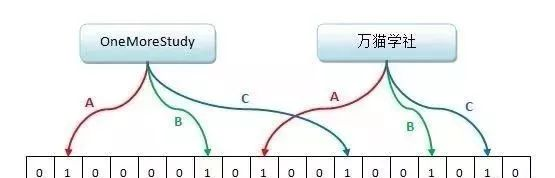

[TOC]

# 布隆过滤器
布隆过滤器（Bloom Filter）是由Howard Bloom在1970年提出的一种比较巧妙的概率型数据结构，它可以告诉你某种东西**一定不存在或者可能存在**。当布隆过滤器说，某种东西存在时，这种东西可能不存在；当布隆过滤器说，某种东西不存在时，那么这种东西一定不存在。

edis4.0版本提供了插件功能，Redis官方提供的布隆过滤器才登场。布隆过滤器作为一个插件加载到Redis Server中，就会给Redis提供了强大的布隆去重功能。

## 原理简介

## 应用
- 解决缓存击穿的问题
  - 一般情况下，先查询缓存是否有该条数据，缓存中没有时，再查询数据库。当数据库也不存在该条数据时，每次查询都要访问数据库，这就是缓存击穿。
  - 解决：把已存在数据的key存在布隆过滤器中。当有新的请求时，先到布隆过滤器中查询是否存在，如果不存在该条数据直接返回；如果存在该条数据再查询缓存查询数据库。
- 黑名单校验
  - 发现存在黑名单中的，就执行特定操作。比如：识别垃圾邮件，只要是邮箱在黑名单中的邮件，就识别为垃圾邮件。假设黑名单的数量是数以亿计的，存放起来就是非常耗费存储空间的，布隆过滤器则是一个较好的解决方案。把所有黑名单都放在布隆过滤器中，再收到邮件时，判断邮件地址是否在布隆过滤器中即可。 
