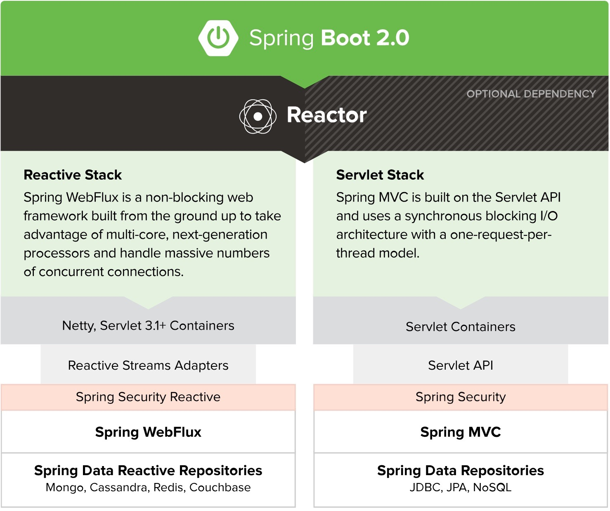

# Spring WebFlux学习笔记

## Spring WebFlux VS Spring MVC

首先看下Spring官方提供的比对

- WebFlux是一个非阻塞web框架，主要利用多核的优势，处理大量并发请求
- 响应式技术栈：Spring WebFlux + Reactor + Netty, 响应式的，异步非阻塞
- Spring MVC 构建于 Servlet API 之上，使用的是同步阻塞式 I/O 模型，即每个请求对应一个线程去处理

    - Servlet技术栈： Spring MVC + Servlet + Tomcat，命令式的，同步阻塞

两者的比较：

### WebFlux的优势

WebFlux 内部使用的是响应式编程（Reactive Programming），以 Reactor 库为基础, 基于异步和事件驱动，可以让我们在不扩充硬件资源的前提下，提升系统的吞吐量和伸缩性。

注意点：

> Reactive and non-blocking generally do not make applications run faster.

即使用WebFlux，我们无法提高一个接口的响应时间。

### WebFlux的使用场景

适合IO密集型的服务，比如微服务网关。

- 典型：Spring Cloud Gateway

注意：IO密集型可以分为磁盘IO密集型、网络IO密集型。微服务网关就属于网络 IO 密集型，使用异步非阻塞式编程模型，能够显著地提升网关对下游服务转发的吞吐量。

### 参考资料

- [一文带你了解Spring 5.0 WebFlux应用场景](https://www.cnblogs.com/quanxiaoha/p/10773773.html)

