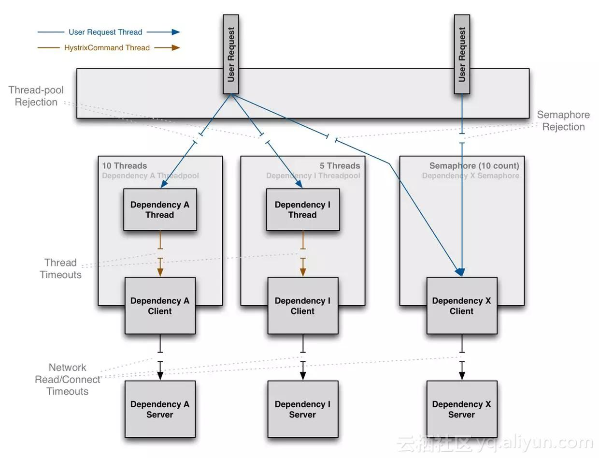

# sentinel学习笔记


## 基础

### 概念

- 资源：可以是 Java 应用程序中的任何内容，例如，由应用程序提供的服务，或由应用程序调用的其它应用提供的服务，甚至可以是一段代码。
  - 个人理解：操作系统 临界区
- 规则：围绕资源的实时状态设定的规则，可以包括流量控制规则、熔断降级规则以及系统保护规则。所有规则可以动态实时调整。

```java
public static void main(String[] args) {
    // 配置规则.
    initFlowRules();

    while (true) {
        // 1.5.0 版本开始可以直接利用 try-with-resources 特性
        try (Entry entry = SphU.entry("HelloWorld")) {
            // 被保护的逻辑
            System.out.println("hello world");
        } catch (BlockException ex) {
                // 处理被流控的逻辑
            System.out.println("blocked!");
        }
    }
}
```

注解形式：

```java
@SentinelResource("HelloWorld")
public void helloWorld() {
    // 资源中的逻辑
    System.out.println("hello world");
}
```


### 基本功能

#### 流量控制


流量控制的几个角度：

- 资源的调用关系，例如资源的调用链路，资源和资源之间的关系；
- 运行指标，例如 QPS、线程池、系统负载等；
- 控制的效果，例如直接限流、冷启动、排队等。

#### 熔断限流


原则与Hystrix一致：当调用链路中某个资源出现不稳定，例如，表现为 timeout，异常比例升高的时候，则对这个资源的调用进行限制，并让请求快速失败，避免影响到其它的资源，最终产生雪崩的效果。

##### 设计理念的差异

限制手段上：

- Hystrix
  - 线程池：
    - 常用，默认。
    - 资源和资源之间做到了最彻底的隔离。
    - 缺点：增加了线程切换的成本，需要预先给各个资源做线程池大小的分配。
  - 信号量
  - 
- Sentinel
  - 通过并发线程数进行限制
    - 没有线程切换的损耗，也不需要您预先分配线程池的大小。
    - 当线程数在特定资源上堆积到一定的数量之后，对该资源的新请求就会被拒绝。堆积的线程完成任务后才开始继续接收请求。
  - 通过响应时间对资源进行降级
    - 当依赖的资源出现响应时间过长后，所有对该资源的访问都会被直接拒绝，直到过了指定的时间窗口之后才重新恢复。

#### 系统负载保护

提供[系统维度的自适应保护能力](https://sentinelguard.io/zh-cn/docs/system-adaptive-protection.html)。

- 场景：当系统负载较高的时候，如果还持续让请求进入，可能会导致系统崩溃，无法响应。在集群环境下，网络负载均衡会把本应这台机器承载的流量转发到其它的机器上去。如果这个时候其它的机器也处在一个边缘状态的时候，这个增加的流量就会导致这台机器也崩溃，最后导致整个集群不可用。
- Sentinel 提供了对应的保护机制，让系统的入口流量和系统的负载达到一个平衡，保证系统在能力范围之内处理最多的请求。

### 基本原理


类似于Spring Cloud Gateway中的设计：filter chain

设计模式：责任链

各种slot:

- `NodeSelectorSlot` 负责收集资源的路径，并将这些资源的调用路径，以树状结构存储起来，用于根据调用路径来限流降级；
- `ClusterBuilderSlot` 则用于存储资源的统计信息以及调用者信息，例如该资源的 RT, QPS, thread count 等等，这些信息将用作为多维度限流，降级的依据；
- `StatisticSlot` 则用于记录、统计不同纬度的 runtime 指标监控信息；
- `FlowSlot` 则用于根据预设的限流规则以及前面 slot 统计的状态，来进行流量控制；
- `AuthoritySlot` 则根据配置的黑白名单和调用来源信息，来做黑白名单控制；
- `DegradeSlot` 则通过统计信息以及预设的规则，来做熔断降级；
- `SystemSlot` 则通过系统的状态，例如 load1 等，来控制总的入口流量；

## 参考资料

- [Sentinel 工作主流程](https://sentinelguard.io/zh-cn/docs/basic-implementation.html)