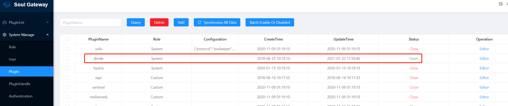
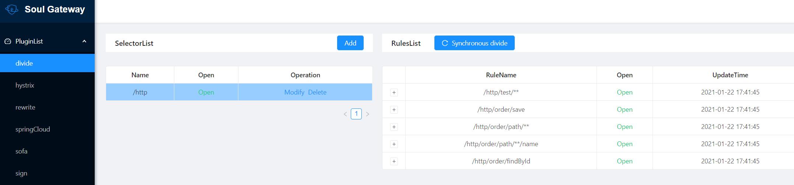
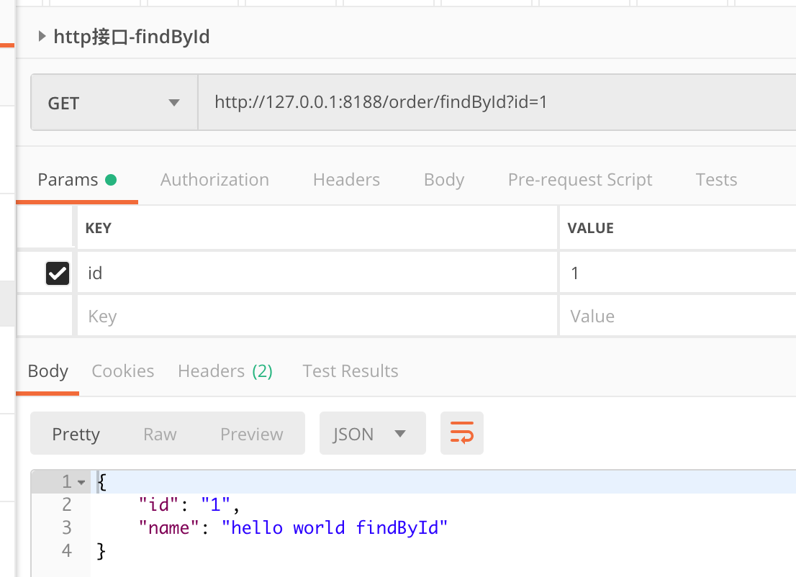
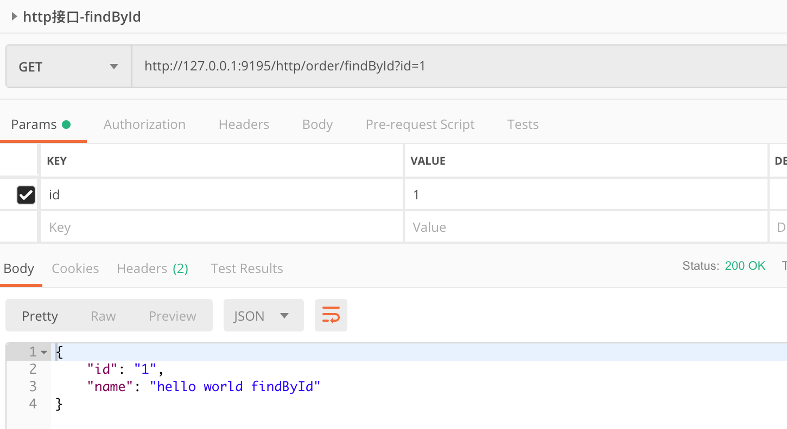

## soul源码分析（1）http插件的使用与soul插件工作流程分析

## 目标

- 演示soul网关HTTP插件的使用
- 分析soul插件的整体工作流程, 


## 1. HTTP插件的使用

1.1 在`soul-bootstrap`项目中引入如下插件，然后重新启动soul网关，启动步骤参见 [soul源码分析_0_阅读源码准备与soul基础](soul源码分析_0_阅读源码准备与soul基础.md)

```xml
  <!--if you use http proxy start this-->
   <dependency>
       <groupId>org.dromara</groupId>
       <artifactId>soul-spring-boot-starter-plugin-divide</artifactId>
        <version>${last.version}</version>
   </dependency>

   <dependency>
       <groupId>org.dromara</groupId>
       <artifactId>soul-spring-boot-starter-plugin-httpclient</artifactId>
        <version>${last.version}</version>
   </dependency>
```

1.2 将soul-client接入到你的项目中，此处以`spring-boot`项目为例给下配置方式：

- （1）在你的项目中添加`soul-spring-boot-starter-client-springmvc`依赖：

```xml
   <dependency>
         <groupId>org.dromara</groupId>
         <artifactId>soul-spring-boot-starter-client-springmvc</artifactId>
         <version>${last.version}</version>
     </dependency>
```

- （2）在你的项目文件中添加如下配置（以`YAML`格式为例）

```yaml
 soul:
     http:
       adminUrl: http://localhost:9095
       port: 你本项目的启动端口
       contextPath: /http
       appName: http
       full: false  
   # adminUrl: 为你启动的soul-admin 项目的ip + 端口，注意要加http://
   # port: 你本项目的启动端口
   # contextPath: 为你的这个mvc项目在soul网关的路由前缀，比如/order ，/product 等等，网关会根据你的这个前缀来进行路由.
   # appName：你的应用名称，不配置的话，会默认取 `spring.application.name` 的值
   # full: 设置true 代表代理你的整个服务，false表示代理你其中某几个controller
```

> SpringMVC的接入方式参见官方文档：https://dromara.org/zh-cn/docs/soul/user-http.html

- （3）在你的 `controller` 的接口上加上 `@SoulSpringMvcClient` 注解。

  - 可以把注解加到 `Controller` 类上面，里面的path属性则为前缀，如果含有 `/**` 代表你的整个接口需要被网关代理。

  此处可以参考官方示例`soul-examples-http`中的代码。

  > 简单起见本文也将以`soul-examples-http`作为后端应用。


###  运行soul-examples-http

以`soul-examples-http`作为示例。在上述工作准备完毕后，检查下`soul-admin`管理端页面中的`System Manage`->`Plugin`中`divide`插件状态、保证为开启状态，

  

  然后启动`soul-examples-http`，会发现后端程序启动时将接口注册到了`soul`中，参考下面日志：

  ```java
  .......
  2021-01-22 17:41:44.422  INFO 27980 --- [           main] trationDelegate$BeanPostProcessorChecker : Bean 'org.dromara.soul.springboot.starter.client.springmvc.SoulSpringMvcClientConfiguration' of type [org.dromara.soul.springboot.starter.client.springmvc.SoulSpringMvcClientConfiguration$$EnhancerBySpringCGLIB$$a469355d] is not eligible for getting processed by all BeanPostProcessors (for example: not eligible for auto-proxying)
  2021-01-22 17:41:44.446  INFO 27980 --- [           main] trationDelegate$BeanPostProcessorChecker : Bean 'soulHttpConfig' of type [org.dromara.soul.client.springmvc.config.SoulSpringMvcConfig] is not eligible for getting processed by all BeanPostProcessors (for example: not eligible for auto-proxying)
  2021-01-22 17:41:45.118  INFO 27980 --- [pool-1-thread-1] o.d.s.client.common.utils.RegisterUtils  : http client register success: {"appName":"http","context":"/http","path":"/http/test/**","pathDesc":"","rpcType":"http","host":"172.0.1.58","port":8188,"ruleName":"/http/test/**","enabled":true,"registerMetaData":false} 
  2021-01-22 17:41:45.157  INFO 27980 --- [pool-1-thread-1] o.d.s.client.common.utils.RegisterUtils  : http client register success: {"appName":"http","context":"/http","path":"/http/order/save","pathDesc":"Save order","rpcType":"http","host":"172.0.1.58","port":8188,"ruleName":"/http/order/save","enabled":true,"registerMetaData":false} 
  .......
  ```

此时可以在`soul`管理端看到如下信息：

  

此时就可以尝试被网关代理后的接口，务必注意端口地址哈：

- 比如我运行的`soul-examples-http`默认配置是`8188`端口
- `soul`管理端管理端`soul-admin`默认配置的端口是`9095`
- `soul`网关程序默认端口是`9195`

所以！我们想访问网关的接口就应该是：`127.0.0.1:9195/xxxx`，如`order/findById?id=1`，使用postman先直接访问后端：



测试网关：



`soul-bootstrap`打印如下日志：

```java
2021-01-22 18:12:42.467  INFO 25552 --- [-work-threads-4] o.d.soul.plugin.base.AbstractSoulPlugin  : divide selector success match , selector name :/http
2021-01-22 18:12:42.468  INFO 25552 --- [-work-threads-4] o.d.soul.plugin.base.AbstractSoulPlugin  : divide rule success match , rule name :/http/order/findById
2021-01-22 18:12:42.468  INFO 25552 --- [-work-threads-4] o.d.s.plugin.httpclient.WebClientPlugin  : The request urlPath is http://172.0.1.58:8188/order/findById?id=2, retryTimes is 0
```

说明网关正常运行。

## 2. soul插件工作流程分析

接下来我们先初步分析一个HTTP请求是如何工作的。

一般而言，我们进行源码分析，主要依据就是运行日志，再次看下接口被代理、转发时的日志：

```java
2021-01-22 18:12:42.467  INFO 25552 --- [-work-threads-4] o.d.soul.plugin.base.AbstractSoulPlugin  : divide selector success match , selector name :/http
2021-01-22 18:12:42.468  INFO 25552 --- [-work-threads-4] o.d.soul.plugin.base.AbstractSoulPlugin  : divide rule success match , rule name :/http/order/findById
2021-01-22 18:12:42.468  INFO 25552 --- [-work-threads-4] o.d.s.plugin.httpclient.WebClientPlugin  : The request urlPath is http://172.0.1.58:8188/order/findById?id=2, retryTimes is 0
```

可以看到HTTP请求被转发时，主要是`AbstractSoulPlugin`和`WebClientPlugin`在起作用。我们进入到`AbstractSoulPlugin`，依据日志内容` divide selector success match , selector name :/http`，可以找到核心逻辑是在`execute`方法。

```java
@Override
    public Mono<Void> execute(final ServerWebExchange exchange, final SoulPluginChain chain) {
        String pluginName = named();
        final PluginData pluginData = BaseDataCache.getInstance().obtainPluginData(pluginName);
        if (pluginData != null && pluginData.getEnabled()) {
            final Collection<SelectorData> selectors = BaseDataCache.getInstance().obtainSelectorData(pluginName);
            if (CollectionUtils.isEmpty(selectors)) {
                return handleSelectorIsNull(pluginName, exchange, chain);
            }
            final SelectorData selectorData = matchSelector(exchange, selectors);
            if (Objects.isNull(selectorData)) {
                return handleSelectorIsNull(pluginName, exchange, chain);
            }
            selectorLog(selectorData, pluginName);
            final List<RuleData> rules = BaseDataCache.getInstance().obtainRuleData(selectorData.getId());
            if (CollectionUtils.isEmpty(rules)) {
                return handleRuleIsNull(pluginName, exchange, chain);
            }
            RuleData rule;
            if (selectorData.getType() == SelectorTypeEnum.FULL_FLOW.getCode()) {
                //get last
                rule = rules.get(rules.size() - 1);
            } else {
                rule = matchRule(exchange, rules);
            }
            if (Objects.isNull(rule)) {
                return handleRuleIsNull(pluginName, exchange, chain);
            }
            ruleLog(rule, pluginName);
            return doExecute(exchange, chain, selectorData, rule);
        }
        return chain.execute(exchange);
    }
```

在该方法中可以看到'Mono'这种返回值，这是因为`soul`中使用了反应式编程，引入了`reactor-spring`，有关反应式编程又是一大块内容，请读者自行搜索。

在`execute`方法中，从整体来看该方法采用了模板方法模式、责任链设计模式，这块后续分析。

### 模板方法模式的使用

在框架开发开发中，经常使用模板方法模式，在父类中规定好主要流程，或是可以复用的代码逻辑，然后个性化的逻辑定义为抽象方法，由子类完成，最大限度的复用代码。

此处`execute`方法的逻辑并不复杂：

```
1. 根据当前插件名称在缓存中找到插件数据pluginData
2. if pluginData存在 且 可用 
	根据插件名称从缓存中找到对应selector
	根据selector拿到所有规则rules，找到当前请求所匹配的那个规则rule
	执行该规则（`doExecute`方法，具体逻辑取决于是哪个插件，比如HTTP的需要看DividePlugin的doExecute）
3. 执行后续的插件处理逻辑（责任链）
```

这个是父类定义好的，具体处理HTTP的逻辑在`AbstractSoulPlugin`子类`DividePlugin`中的`doExecute`方法中，大体可以看到该方法主要逻辑如下：

```
1. 获取divide规则、配置
2. 拿出请求中的IP地址，根据负责均衡规则，从divide配置中找出一个作为目标地址
3. 重写请求（改写URL、超时、重试等）
4. 继续执行后续逻辑（责任链）
```

这里又涉及到n多细节逻辑，比如：

- divide规则、配置是如何保存的？又是如何加载`soul`网关中的？
- 负载均衡策略如何实现？
- 请求是如何转发给目标服务器的？返回数据又是如何传会给请求方的？

这些等后续再分析，此处先略过。

### 责任链模式的使用

我个人理解用责任链主要是为了方便扩展，毕竟说是插件化，那插件放到链上、或是从链上移除，就可以实现插件化、可插拔。

> 你问我为啥能看出是责任链？这个真的靠经验啦，看传入参数、参数命名、return语句又调用了chain的execute方法，基本可以确定是责任链。
>
> 嗯，源码看多了自然能知道这些，所以啊，要多看优秀框架的源码，比如soul，插入广告一下 :smile:

## 总结

- 如何使用`soul`代理HTTP请求
- 如何分析开源代码：通过日志，一点点debug，追根溯源
- divide的基本处理逻辑
- soul插件处理整体分析

## TODO 

- soul中插件是如何初始化的？如何通过责任链关联起来、实现功能可插拔？
- divide规则、配置是如何保存的？又是如何加载`soul`网关中的？
- 负载均衡策略如何实现？
- 请求是如何转发给目标服务器的？返回数据又是如何传会给请求方的？