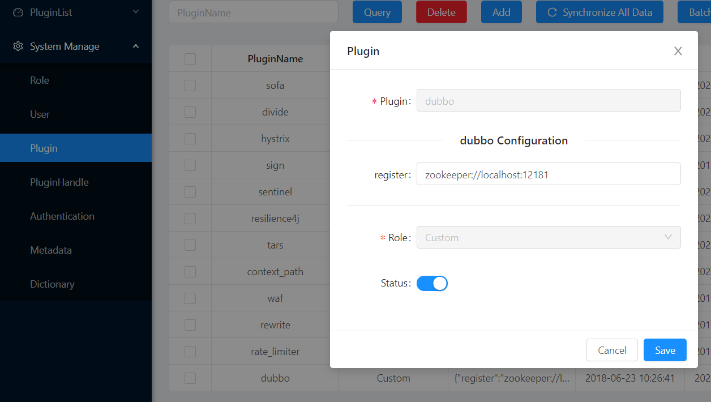
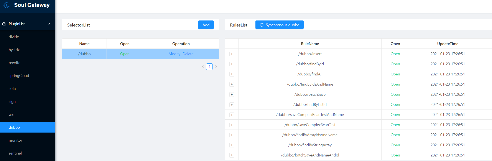

# soul源码分析（2）dubbo服务如何接入soul以及dubbo插件分析

## 说明

本文将包括如下内容：

- 如何将dubbo服务接入soul
- soul的dubbo插件源码分析

以`soul`2021.1.25代码做分析。

`apache dubbo`与`alibaba dubbo`类似，本文只会分析`apache dubbo`。

## 1. 如何将dubbo服务接入soul

### 1.1 配置soul网关、soul-admin

- （1）启动`soul-admin`后台，操作步骤可以参考本系列第一篇文章`阅读源码准备与soul基础`

- （2）在`soul-admin`后台将`dubbo`插件打开

  - 路径：`System Manage` -> `Plugin` -> 打开`dubbo`即可
  - 注意：`dubbo`服务需要事先启动一个注册中心，在打开`dubbo`插件时需要将注册中心地址填入`soul-admin`中，如下图所示。不同注册中心写法略有不同，比如`zookeeper`是`{"register":"zookeeper://localhost:2181"}`，`nacos`则是`{"register":"nacos://localhost:8848"}`。网关程序`soul-bootstrap`将会读取这里的配置、然后去找注册中心
  - 

- （2）修改`dubbo`服务，添加`soul`客户端

  - `dubbo`不同的使用方式，在引入`soul`时也略有不同，更多详情参见：https://dromara.org/zh-cn/docs/soul/user-dubbo.html

  - 此处以`spring boot`中引入`dubbo 2.7.5`为前提阐述，

    - 引入客户端依赖

      - ```xml
            <dependency>
                  <groupId>org.dromara</groupId>
                  <artifactId>soul-spring-boot-starter-client-apache-dubbo</artifactId>
                  <version>${last.version}</version>
             </dependency>
	      ```
	
    - `yml`文件添加配置：
    
      - ```yaml
            soul:
              dubbo:
                adminUrl: http://localhost:9095
                contextPath: /dubbo
                appName: dubbo
        
               # adminUrl: 为你启动的soul-admin 项目的ip + 端口，注意要加 http://
               # contextPath: 为你的这个项目在soul网关的路由前缀，比如/order ，/product 等等，网关会根据你的这个前缀来进行路由.
               # appName：你的应用名称，不配置的话，会默认取 dubbo配置中application 中的名称
        ```
    
    - dubbo服务实现类中，需要暴露到网关的方法上加上 `@SoulDubboClient` 注解，表示该接口方法注册到网关。使用可以参考官方示例代码
    
    - 重启应用，日志中包含类似如下内容则说明服务`dubbo`已发布到网关
    
      - ```java
        .......
        2021-01-23 18:19:38.330  INFO 12460 --- [pool-2-thread-1] o.d.s.client.common.utils.RegisterUtils  : dubbo client register success: {"appName":"dubbo","contextPath":"/dubbo","path":"/dubbo/findByListId","pathDesc":"","rpcType":"dubbo","serviceName":"org.dromara.soul.examples.dubbo.api.service.DubboMultiParamService","methodName":"findByListId","ruleName":"/dubbo/findByListId","parameterTypes":"java.util.List","rpcExt":"{\"group\":\"\",\"version\":\"\",\"loadbalance\":\"random\",\"retries\":2,\"timeout\":10000,\"url\":\"\"}","enabled":true} 
        .......
        ```
    
      - 注意：我在试验时，如果先改造`soul`网关、重启，但`dubbo`服务不在线的话，会抛出如下异常，所以个人建议先改造`dubbo`服务然后再改造`soul`网关：
    
        - ```java
          2021-01-23 18:12:59.584 ERROR 29832 --- [ctReadThread-22] o.d.s.p.a.d.c.ApplicationConfigCache     : init apache dubbo reference ex:Failed to check the status of the service org.dromara.soul.examples.dubbo.api.service.DubboTestService. No provider available for the service org.dromara.soul.examples.dubbo.api.service.DubboTestService from the url zookeeper://localhost:12181/org.apache.dubbo.registry.RegistryService?application=soul_proxy&dubbo=2.0.2&generic=true&interface=org.dromara.soul.examples.dubbo.api.service.DubboTestService&loadbalance=random&pid=29832&protocol=dubbo&register.ip=172.0.1.58&release=2.7.5&retries=2&side=consumer&sticky=false&timeout=10000&timestamp=1611396779579 to the consumer 172.0.1.58 use dubbo version 2.7.5
          ```
  
- （3）修改网关程序`soul-bootstrap`，引入`dubbo`相关依赖。主要包括注册中心依赖、dubbo插件依赖。

  - 注意：由于`dubbo`在2019年正式晋升为apache顶级项目，因此依赖中`dubbo`不同版本的坐标略有差异。

  - 不同注册中心的依赖也略有差异。详细参见官网：https://dromara.org/zh-cn/docs/soul/user-dubbo.html

  - 下面以`dubbo 2.7.5`、采用`zookeeper`作为注册中心为例：

  - ```xml
    
        <!--soul apache dubbo plugin start-->
        <dependency>
            <groupId>org.dromara</groupId>
            <artifactId>soul-spring-boot-starter-plugin-apache-dubbo</artifactId>
            <version>${last.version}</version>
        </dependency>
        <!--soul apache dubbo plugin end-->
     
        <dependency>
            <groupId>org.apache.dubbo</groupId>
            <artifactId>dubbo</artifactId>
            <version>2.7.5</version>
        </dependency>
        <!-- Dubbo zookeeper registry dependency start -->
       <dependency>
           <groupId>org.apache.curator</groupId>
           <artifactId>curator-client</artifactId>
           <version>${curator.version}</version>
       </dependency>
       <dependency>
           <groupId>org.apache.curator</groupId>
           <artifactId>curator-framework</artifactId>
           <version>${curator.version}</version>
       </dependency>
       <dependency>
           <groupId>org.apache.curator</groupId>
           <artifactId>curator-recipes</artifactId>
           <version>${curator.version}</version>
       </dependency>
       <!-- Dubbo zookeeper registry dependency end -->
    ```

    - 注意，你所使用的`zookeeper`版本要与上面`curator`的版本想匹配，否则就很坑。。。貌似`zookeeper 3.6`以上与之前的版本兼容性不好。——仅供参考，还是要自己亲身试验的。

    - 重启网关，显示如下日志则说明网关启动成功、并且成功注册了`dubbo`服务：

      - ```java
        .......
        2021-01-26 09:57:49.654  INFO 5228 --- [ctReadThread-27] o.d.s.p.a.d.c.ApplicationConfigCache     : init apache dubbo reference success there meteData is :MetaData(id=1352910656206540800, appName=dubbo, contextPath=null, path=/dubbo/insert, rpcType=dubbo, serviceName=org.dromara.soul.examples.dubbo.api.service.DubboTestService, methodName=insert, parameterTypes=org.dromara.soul.examples.dubbo.api.entity.DubboTest, rpcExt={"group":"","version":"","loadbalance":"random","retries":2,"timeout":10000,"url":""}, enabled=true)
        2021-01-26 09:57:49.675  INFO 5228 --- [ctReadThread-27] o.d.s.p.a.d.c.ApplicationConfigCache     : init apache dubbo reference success there meteData is :MetaData(id=1352910656470781952, appName=dubbo, contextPath=null, path=/dubbo/findById, rpcType=dubbo, serviceName=org.dromara.soul.examples.dubbo.api.service.DubboTestService, methodName=findById, parameterTypes=java.lang.String, rpcExt={"group":"","version":"","loadbalance":"random","retries":2,"timeout":10000,"url":""}, enabled=true)
        ......
        ```
    
      - 此时可以在`soul-admin` -> `PluginList` -> 'dubbo'中看到类似如下内容：
    
      - 


### 1.2 测试

还是使用`curl`命令，直接访问网关代理后的接口，测试`curl localhost:9195/dubbo/findById?id=2`，可以看到类似如下结果：

```shell
$curl localhost:9195/dubbo/findById?id=2
{"code":200,"message":"Access to success!","data":{"name":"hello world Soul Apache, findById","id":"2"}}
```

说明当前`soul`正常代理`dubbo`服务。

## 2. dubbo插件分析

### 2.1 dubbo服务如何注册到网关？

#### 2.1.1 如何开始分析

还是同样的思路，**先根据日志判断程序走了哪些代码**。

首先根据上面的代码，我们知道，当`dubbo`服务注册`soul`网关时，将会输出这样一条日志：

```java
.......
2021-01-23 18:19:38.330  INFO 12460 --- [pool-2-thread-1] o.d.s.client.common.utils.RegisterUtils  : dubbo client register success: {"appName":"dubbo","contextPath":"/dubbo","path":"/dubbo/findByListId","pathDesc":"","rpcType":"dubbo","serviceName":"org.dromara.soul.examples.dubbo.api.service.DubboMultiParamService","methodName":"findByListId","ruleName":"/dubbo/findByListId","parameterTypes":"java.util.List","rpcExt":"{\"group\":\"\",\"version\":\"\",\"loadbalance\":\"random\",\"retries\":2,\"timeout\":10000,\"url\":\"\"}","enabled":true} 
.......
```

那么很明显，我们需要先去`RegisterUtils`类中找到`dubbo client register success`所在方法，可以看到：

```java
 public static void doRegister(final String json, final String url, final RpcTypeEnum rpcTypeEnum) {
        try {
            String result = OkHttpTools.getInstance().post(url, json);
            if (AdminConstants.SUCCESS.equals(result)) {
                log.info("{} client register success: {} ", rpcTypeEnum.getName(), json);
            } else {
                log.error("{} client register error: {} ", rpcTypeEnum.getName(), json);
            }
        } catch (IOException e) {
            log.error("cannot register soul admin param, url: {}, request body: {}", url, json, e);
        }
    }
```

`OkHttpTools`点进去看下，明显就是一个工具类，使用`OkHttp`发送POST请求，将传入的json数据发出去。

我们可以在`doRegister`打断点试试，会发现此处的`url`是`http://localhost:9095/soul-client/dubbo-register`，即注册地址是`soul-admin`。当然我们从`dubbo`服务配置过程也可以知道，我们给`dubbo`服务配的就是`soul-admin`。

所以现在就清晰了，`dubbo`服务同步到`soul`网关的链路是：


接下来又产生了新问题：

- 1、`dubbo`服务的元数据注册到`soul-admin`是如何实现的？
- 2、`dubbo`插件如何工作？
- 3、`dubbo`的元数据如何从`soul-admin`同步到`soul-bootstrap`？

#### 2.1.2 `dubbo`服务的元数据注册到`soul-admin`是如何实现的？

接上面的过程，找`doRegister`方法的调用方，可以看到`ApacheDubboServiceBeanPostProcessor`：

```java

    private void handler(final ServiceBean serviceBean) {
        Class<?> clazz = serviceBean.getRef().getClass();
        if (ClassUtils.isCglibProxyClass(clazz)) {
            //如果是CGLib代理的类，则获取其带有泛型的父类
            String superClassName = clazz.getGenericSuperclass().getTypeName();
            try {
                clazz = Class.forName(superClassName);
            } catch (ClassNotFoundException e) {
                log.error(String.format("class not found: %s", superClassName));
                return;
            }
        }
        final Method[] methods = ReflectionUtils.getUniqueDeclaredMethods(clazz);
        for (Method method : methods) {
            //如果方法上加了SoulDubboClient注解，则调用doRegister方法调用、注册元数据到soul-admin
            SoulDubboClient soulDubboClient = method.getAnnotation(SoulDubboClient.class);
            if (Objects.nonNull(soulDubboClient)) {
                RegisterUtils.doRegister(buildJsonParams(serviceBean, soulDubboClient, method), url, RpcTypeEnum.DUBBO);
            }
        }
    }
```

可以看到这个`ApacheDubboServiceBeanPostProcessor`只会挑出`ServiceBean`中加了`SoulDubboClient`注解的方法，同步其元数据到`soul-admin`中。

其中`buildJsonParams`用来拼出`dubbo`服务元数据的json串，如下：

```java
 private String buildJsonParams(final ServiceBean serviceBean, final SoulDubboClient soulDubboClient, final Method method) {
     	//从 dubboConfig 取 appName，若未配置则使用 applicationName
        String appName = dubboConfig.getAppName();
        if (StringUtils.isEmpty(appName)) {
            appName = serviceBean.getApplication().getName();
        }
        //获取soul注解中的一系列信息：path, desc, rule, ruleName
        String path = dubboConfig.getContextPath() + soulDubboClient.path();
        String desc = soulDubboClient.desc();
        String serviceName = serviceBean.getInterface();
        String configRuleName = soulDubboClient.ruleName();
        //注解中ruleName值为空，则取path，否则取ruleName的值
        String ruleName = ("".equals(configRuleName)) ? path : configRuleName;
        String methodName = method.getName();
     	//获取方法参数，拼成一个字符串，多个参数用逗号隔开
        Class<?>[] parameterTypesClazz = method.getParameterTypes();
        String parameterTypes = Arrays.stream(parameterTypesClazz).map(Class::getName)
                .collect(Collectors.joining(","));
        //构造元数据对象，使用Gson序列化
        MetaDataDTO metaDataDTO = MetaDataDTO.builder()
                .appName(appName)
                .serviceName(serviceName)
                .methodName(methodName)
                .contextPath(dubboConfig.getContextPath())
                .path(path)
                .ruleName(ruleName)
                .pathDesc(desc)
                .parameterTypes(parameterTypes)
                .rpcExt(buildRpcExt(serviceBean))
                .rpcType("dubbo")
                .enabled(soulDubboClient.enabled())
                .build();
        return OkHttpTools.getInstance().getGson().toJson(metaDataDTO);

    }
```

回过头来，继续看`ApacheDubboServiceBeanPostProcessor`，可以看到该类虽然从名字看好像是一个`BeanPostProcessor`，但其类定义如下：

```java
public class ApacheDubboServiceBeanPostProcessor implements ApplicationListener<ContextRefreshedEvent> {
	.......
    
    @Override
    public void onApplicationEvent(final ContextRefreshedEvent contextRefreshedEvent) {
        if (Objects.nonNull(contextRefreshedEvent.getApplicationContext().getParent())) {
            return;
        }
        // Fix bug(https://github.com/dromara/soul/issues/415), upload dubbo metadata on ContextRefreshedEvent
        Map<String, ServiceBean> serviceBean = contextRefreshedEvent.getApplicationContext().getBeansOfType(ServiceBean.class);
        for (Map.Entry<String, ServiceBean> entry : serviceBean.entrySet()) {
            executorService.execute(() -> handler(entry.getValue()));
        }
    }
}
```

所以，实际上该类是利用了spring的事件监听机制，当监听到容器刷新后，会调用`handler`方法，即上面我们分析过的元数据注册到`soul-admin`操作。

小结下，`apache dubbo`客户端（`soul-spring-boot-starter-client-apache-dubbo`）将`dubbo`服务注册到网关的基本流程如下：

```
(1) ApacheDubboServiceBeanPostProcessor监听到ContextRefreshedEvent事件后，从spring中拿出所有ServiceBean对象，调用handler方法遍历
(2) handler方法拿到 ServiceBean 的接口或带泛型父类带 @SoulDubboClient 的方法，调用 RegisterUtils.doRegister 进行注册
(3) RegisterUtils.doRegister 使用 OkHttpTools 将JSON格式的元数据，通过POST请求发送到 soul-admin，持久化
(4) soul-admin再将元数据同步给网关程序soul-bootstrap
```

### 2.2 dubbo插件是如何工作的？

`soul`的插件机制参见[soul源码分析总结篇之插件化设计](https://blog.csdn.net/evasnowind/article/details/113180503)，此处不再赘述，接下来聊聊`dubbo`插件的处理逻辑，这个在`soul-plugin-apache-dubbo`模块中`ApacheDubboPlugin` 的`doExecute`方法：

```java
@Override
protected Mono<Void> doExecute(final ServerWebExchange exchange, final SoulPluginChain chain, final SelectorData selector, final RuleData rule) {
    String body = exchange.getAttribute(Constants.DUBBO_PARAMS);
    SoulContext soulContext = exchange.getAttribute(Constants.CONTEXT);
    assert soulContext != null;
    MetaData metaData = exchange.getAttribute(Constants.META_DATA);
    if (!checkMetaData(metaData)) {
        //元数据校验失败，打印日志，当前请求直接返回500 Internal Server Error
        assert metaData != null;
        log.error(" path is :{}, meta data have error.... {}", soulContext.getPath(), metaData.toString());
        exchange.getResponse().setStatusCode(HttpStatus.INTERNAL_SERVER_ERROR);
        Object error = SoulResultWrap.error(SoulResultEnum.META_DATA_ERROR.getCode(), SoulResultEnum.META_DATA_ERROR.getMsg(), null);
        return WebFluxResultUtils.result(exchange, error);
    }
    if (StringUtils.isNoneBlank(metaData.getParameterTypes()) && StringUtils.isBlank(body)) {
        //该请求对应的dubbo服务要求有参数，但请求中没有任何参数，则返回500 Internal Server Error
        exchange.getResponse().setStatusCode(HttpStatus.INTERNAL_SERVER_ERROR);
        Object error = SoulResultWrap.error(SoulResultEnum.DUBBO_HAVE_BODY_PARAM.getCode(), SoulResultEnum.DUBBO_HAVE_BODY_PARAM.getMsg(), null);
        return WebFluxResultUtils.result(exchange, error);
    }
    //dubbo 泛化调用
    final Mono<Object> result = dubboProxyService.genericInvoker(body, metaData, exchange);
    return result.then(chain.execute(exchange));
}
```

实际的调用`dubbo`服务过程发生在`dubboProxyService.genericInvoker`：

```java
public Mono<Object> genericInvoker(final String body, final MetaData metaData, final ServerWebExchange exchange) throws SoulException {
        // issue(https://github.com/dromara/soul/issues/471), add dubbo tag route
        String dubboTagRouteFromHttpHeaders = exchange.getRequest().getHeaders().getFirst(Constants.DUBBO_TAG_ROUTE);
        if (StringUtils.isNotBlank(dubboTagRouteFromHttpHeaders)) {
            RpcContext.getContext().setAttachment(CommonConstants.TAG_KEY, dubboTagRouteFromHttpHeaders);
        }
        ReferenceConfig<GenericService> reference = ApplicationConfigCache.getInstance().get(metaData.getPath());
        if (Objects.isNull(reference) || StringUtils.isEmpty(reference.getInterface())) {
            ApplicationConfigCache.getInstance().invalidate(metaData.getPath());
            reference = ApplicationConfigCache.getInstance().initRef(metaData);
        }

        GenericService genericService = reference.get();
    	//组织请求参数
        Pair<String[], Object[]> pair;
        if (ParamCheckUtils.dubboBodyIsEmpty(body)) {
            pair = new ImmutablePair<>(new String[]{}, new Object[]{});
        } else {
            pair = dubboParamResolveService.buildParameter(body, metaData.getParameterTypes());
        }

        CompletableFuture<Object> future = genericService.$invokeAsync(metaData.getMethodName(), pair.getLeft(), pair.getRight());
        return Mono.fromFuture(future.thenApply(ret -> {
            if (Objects.isNull(ret)) {
                ret = Constants.DUBBO_RPC_RESULT_EMPTY;
            }
            exchange.getAttributes().put(Constants.DUBBO_RPC_RESULT, ret);
            exchange.getAttributes().put(Constants.CLIENT_RESPONSE_RESULT_TYPE, ResultEnum.SUCCESS.getName());
            return ret;
        })).onErrorMap(exception -> exception instanceof GenericException ? new SoulException(((GenericException) exception).getExceptionMessage()) : new SoulException(exception));
    }
```

此处用到了`dubbo`的`泛化调用`，不清楚的小伙伴可以参考这篇文章：[Dubbo基本特性之泛化调用](https://www.cnblogs.com/flyingeagle/p/8908317.html) 。此处基本就是简单封装了下`apache dubbo`的泛化调用。

### 2.3 `dubbo`的元数据如何从`soul-admin`同步到`soul-bootstrap`？

将留到后续分析。

## 总结

- 本文从使用侧入手，梳理`dubbo`服务接入`soul`的流程，以及`dubbo`插件如何生效。

- `dubbo`服务接入`soul`总体过程

  - ```
    1. 客户端发布dubbo服务，dubbo服务注册到soul-admin
    2. soul-admin同步元数据到soul-boostrap
    3. 客户端发起HTTP请求，请求到soul-bootstrap
    4. soul-bootstrap拿到请求参数、与内存中已有的dubbo服务元数据，结合起来，发起dubbo泛化调用
    5. 将泛化调用结果返回给客户端
    ```

    

## 参考资料

- [Dubbo基本特性之泛化调用](https://www.cnblogs.com/flyingeagle/p/8908317.html)
- https://blog.csdn.net/s15810813994/article/details/112727739

