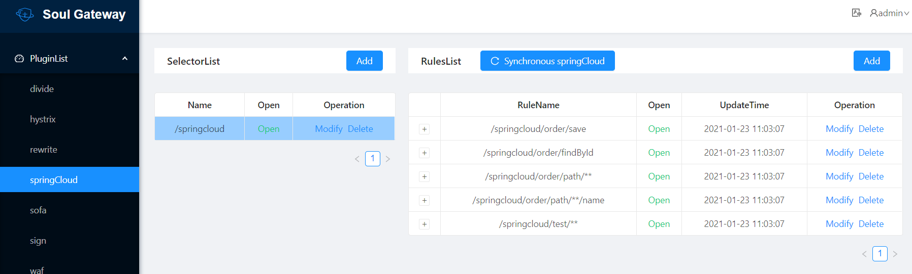

# soul源码分析（3）SpringCloud服务如何接入soul以及SpringCloud插件分析

## 说明

本文将包括如下内容：

- 如何将SpringCloud服务接入soul
- soul的SpringCloud插件源码分析

本文将以2021.1.25的soul源码进行分析。


## 1. 如何将SpringCloud服务接入soul

### 1.1 配置soul网关、soul-admin

- （1）启动`soul-admin`后台，操作步骤可以参考本系列第一篇文章`阅读源码准备与soul基础`

- （2）在`soul-admin`后台将`SpringCloud`插件打开

  - 路径：`System Manage` -> `Plugin` -> 打开`SpringCloud`即可

- （3）修改网关程序`soul-bootstrap`，引入`SpringCloud`相关依赖、添加注册中心配置。注意需要根据注册中心是哪一种、相应配置与依赖需要对应。比如下面主要以`eureka`为例。更多信息请参考官网：https://dromara.org/zh-cn/docs/soul/user-springcloud.html

  - （3）.1引入依赖如下

    ```xml
     <!--soul SpringCloud plugin start-->
      <dependency>
           <groupId>org.dromara</groupId>
           <artifactId>soul-spring-boot-starter-plugin-springcloud</artifactId>
            <version>${last.version}</version>
      </dependency>
    
      <dependency>
           <groupId>org.dromara</groupId>
           <artifactId>soul-spring-boot-starter-plugin-httpclient</artifactId>
           <version>${last.version}</version>
       </dependency>
       <!--soul SpringCloud plugin end-->
       <dependency>
            <groupId>org.springframework.cloud</groupId>
            <artifactId>spring-cloud-commons</artifactId>
            <version>2.2.0.RELEASE</version>
       </dependency>
       <dependency>
            <groupId>org.springframework.cloud</groupId>
            <artifactId>spring-cloud-starter-netflix-ribbon</artifactId>
            <version>2.2.0.RELEASE</version>
       </dependency>
    ```

  - 此处以`eureka`作为配置中心，还需要添加以下依赖：

    ```xml
    <dependency>
           <groupId>org.springframework.cloud</groupId>
           <artifactId>spring-cloud-starter-netflix-eureka-client</artifactId>
           <version>2.2.0.RELEASE</version>
      </dependency>
    ```

  - （3）.2配置文件添加`eureka`配置：

    ```yaml
     eureka:
         client:
           serviceUrl:
             defaultZone: http://localhost:8761/eureka/ # 你的eureka地址
         instance:
           prefer-ip-address: true # 注册到eureka是IP形式
    ```

  - （3）.3 重启`soul-bootstrap`

### 1.2 SpringCloud服务接入soul

下面仍然以`soul`官方提供的例子`soul-examples-springcloud`来演示操作步骤。

- （1）在`SpringCloud`应用中添加如下依赖：

  ```xml
   <dependency>
        <groupId>org.dromara</groupId>
        <artifactId>soul-spring-boot-starter-client-springcloud</artifactId>
        <version>${last.version}</version>
   </dependency>
  ```

- （2）修改`SpringCloud`的配置：

  ```yaml
  soul:
    springcloud:
      admin-url: http://localhost:9095
      context-path: /springcloud
      full: true
  # adminUrl: 为你启动的soul-admin 项目的ip + 端口，注意要加http://
  # contextPath: 为你的这个项目在soul网关的路由前缀，比如/order ，/product 等等，网关会根据你的这个前缀来进行路由.
  # full: 设置true 代表代理你的整个服务，false表示代理你其中某几个controller
  ```

  

- （3）在`SpringCloud`项目中`Controller`接口中添加注解，具体请参考示例：https://dromara.org/zh-cn/docs/soul/user-springcloud.html

- （4）启动`SpringCloud`项目，启动日志中有如下内容，则说明接口已注入到`soul`网关中。

```java
2021-01-23 11:50:44.917  INFO 14008 --- [pool-1-thread-1] o.d.s.client.common.utils.RegisterUtils  : springCloud client register success: {"appName":"springCloud-test","context":"/springcloud","path":"/springcloud/order/save","pathDesc":"","rpcType":"springCloud","ruleName":"/springcloud/order/save","enabled":true} 
2021-01-23 11:50:44.928  INFO 14008 --- [pool-1-thread-1] o.d.s.client.common.utils.RegisterUtils  : springCloud client register success: {"appName":"springCloud-test","context":"/springcloud","path":"/springcloud/order/findById","pathDesc":"","rpcType":"springCloud","ruleName":"/springcloud/order/findById","enabled":true} 
2021-01-23 11:50:44.937  INFO 14008 --- [pool-1-thread-1] o.d.s.client.common.utils.RegisterUtils  : springCloud client register success: {"appName":"springCloud-test","context":"/springcloud","path":"/springcloud/order/path/**/name","pathDesc":"","rpcType":"springCloud","ruleName":"/springcloud/order/path/**/name","enabled":true} 
2021-01-23 11:50:44.946  INFO 14008 --- [pool-1-thread-1] o.d.s.client.common.utils.RegisterUtils  : springCloud client register success: {"appName":"springCloud-test","context":"/springcloud","path":"/springcloud/order/path/**","pathDesc":"","rpcType":"springCloud","ruleName":"/springcloud/order/path/**","enabled":true} 
2021-01-23 11:50:44.955  INFO 14008 --- [pool-1-thread-1] o.d.s.client.common.utils.RegisterUtils  : springCloud client register success: {"appName":"springCloud-test","context":"/springcloud","path":"/springcloud/test/**","pathDesc":"","rpcType":"springCloud","ruleName":"/springcloud/test/**","enabled":true} 
```

此时`soul-admin`中可以看到`SpringCloud`插件中已注册的路由信息：



### 1.3 测试

以`soul-examples-springcloud`为例，使用`curl`命令直接访问`SpringCloud`后端服务：

```shell
$ curl -s http://localhost:8884/order/findById?id=2
{"id":"2","name":"hello world spring cloud findById"}
```

访问网关：

```shell
$ curl -s http://localhost:9195/springcloud/order/findById?id=2
{"id":"2","name":"hello world spring cloud findById"}
```

当然此处也可以使用`wrk`或是`ab`等工具做下压测，看通过网关访问与直接访问相比，有多少性能损耗。此处暂时略过。

## 2. SpringCloud插件源码分析

### 2.1 Spring Cloud服务怎样注册到soul网关上？

还是从日志开始，`SpringCloud`服务启动时有这条日志`client.common.utils.RegisterUtils  : springCloud client register success`，那么据此我们可以找到`RegisterUtils`这个类的`doRegister`，然后需要看到底是哪些地方调用了这个方法。不过这个工具方法调用的地方比较多，我们可以换一种思路，从`soul`源码着手。

对于`SpringCloud`，我们去`soul`源码中看对应客户端`soul-spring-boot-starter-client-springcloud`，可以看到只有一个类`SoulSpringCloudClientConfiguration`:

```java
@Configuration
public class SoulSpringCloudClientConfiguration {
    
    @Bean
    public SpringCloudClientBeanPostProcessor springCloudClientBeanPostProcessor(final SoulSpringCloudConfig soulSpringCloudConfig, final Environment env) {
        return new SpringCloudClientBeanPostProcessor(soulSpringCloudConfig, env);
    }

    @Bean
    public ContextRegisterListener contextRegisterListener(final SoulSpringCloudConfig soulSpringCloudConfig, final Environment env) {
        return new ContextRegisterListener(soulSpringCloudConfig, env);
    }
    
    @Bean
    @ConfigurationProperties(prefix = "soul.springcloud")
    public SoulSpringCloudConfig soulSpringCloudConfig() {
        return new SoulSpringCloudConfig();
    }
}
```

`SoulSpringCloudConfig`与配置相关、可以利用这个bean拿到配置文件中`springcloud.admin-url`, `springcloud.context-path`， `springcloud.full`这3个属性值，暂且不管。

`soul`的`SpringCloud`客户端主要逻辑就应该在`SpringCloudClientBeanPostProcessor`和`ContextRegisterListener`。

先看下`SpringCloudClientBeanPostProcessor`，明显是一个`Spring`后置处理器，主要逻辑其实就是筛选使用`SoulSpringCloudClient`标注的类（controller）、或是方法，将其对应的接口说明（URL、参数类型、参数名等）汇总到一起、序列化成JSON格式，然后发送给`soul-admin`。

```java
@Slf4j
public class SpringCloudClientBeanPostProcessor implements BeanPostProcessor {
	......

    @Override
    public Object postProcessAfterInitialization(@NonNull final Object bean, @NonNull final String beanName) throws BeansException {
        if (config.isFull()) {
            //全量代理，则不用走下面逻辑，直接依靠ContextRegisterListener中的监听逻辑处理即可
            return bean;
        }
        Controller controller = AnnotationUtils.findAnnotation(bean.getClass(), Controller.class);
        RestController restController = AnnotationUtils.findAnnotation(bean.getClass(), RestController.class);
        RequestMapping requestMapping = AnnotationUtils.findAnnotation(bean.getClass(), RequestMapping.class);
        if (controller != null || restController != null || requestMapping != null) {
            String prePath = "";
            SoulSpringCloudClient clazzAnnotation = AnnotationUtils.findAnnotation(bean.getClass(), SoulSpringCloudClient.class);
            if (Objects.nonNull(clazzAnnotation)) {
                if (clazzAnnotation.path().indexOf("*") > 1) {
                //如果在Controller上声明了正则、匹配所有，则此处将匹配所有这条规则同步给soul-admin后直接返回即可
                    String finalPrePath = prePath;
                    executorService.execute(() -> RegisterUtils.doRegister(buildJsonParams(clazzAnnotation, finalPrePath), url,
                            RpcTypeEnum.SPRING_CLOUD));
                    return bean;
                }
                prePath = clazzAnnotation.path();
            }
            final Method[] methods = ReflectionUtils.getUniqueDeclaredMethods(bean.getClass());
            for (Method method : methods) {
                //挨个遍历方法，标注了SoulSpringCloudClient的才同步给soul-admin
                SoulSpringCloudClient soulSpringCloudClient = AnnotationUtils.findAnnotation(method, SoulSpringCloudClient.class);
                if (Objects.nonNull(soulSpringCloudClient)) {
                    String finalPrePath = prePath;
                    executorService.execute(() -> RegisterUtils.doRegister(buildJsonParams(soulSpringCloudClient, finalPrePath), url,
                            RpcTypeEnum.SPRING_CLOUD));
                }
            }
        }
        return bean;
    }

    private String buildJsonParams(final SoulSpringCloudClient soulSpringCloudClient, final String prePath) {
		//拼接参数，序列化成json字符串
        ......
        return OkHttpTools.getInstance().getGson().toJson(registerDTO);
    }
}

```

`ContextRegisterListener`内容则更为简单，利用事件监听机制，`Spring`容器更新时扫描一次，只有当配置了所有接口都交给`soul`代理时，才会执行一次，将"匹配所有URL"的规则注册到`soul-admin`上。

```java
public class ContextRegisterListener implements ApplicationListener<ContextRefreshedEvent> {

    private final AtomicBoolean registered = new AtomicBoolean(false);

    private final String url;

    private final SoulSpringCloudConfig config;

    private final Environment env;

    /**
     * Instantiates a new Context register listener.
     *
     * @param config the soul spring cloud config
     * @param env    the env
     */
    public ContextRegisterListener(final SoulSpringCloudConfig config, final Environment env) {
        ValidateUtils.validate(config, env);
        this.config = config;
        this.env = env;
        this.url = config.getAdminUrl() + "/soul-client/springcloud-register";
    }

    @Override
    public void onApplicationEvent(final ContextRefreshedEvent contextRefreshedEvent) {
        if (!registered.compareAndSet(false, true)) {
            return;
        }
        if (config.isFull()) {
            //配置属性soul.springcloud.full=true，则将会把所有接口都注册到soul-admin上
            RegisterUtils.doRegister(buildJsonParams(), url, RpcTypeEnum.SPRING_CLOUD);
        }
    }

    private String buildJsonParams() {
        String contextPath = config.getContextPath();
        String appName = env.getProperty("spring.application.name");
        //指定所有URL都匹配
        String path = contextPath + "/**";
        //拼接参数
		......
        return OkHttpTools.getInstance().getGson().toJson(registerDTO);
    }
}
```

所以`SpringCloud`客户端注册到`soul-admin`主要就依赖的是`SpringCloudClientBeanPostProcessor`和`ContextRegisterListener`这两个类。

### 2.2 soul网关中Spring Cloud插件如何代理用户请求？

根据之前的分析[soul源码分析总结篇之插件化设计](https://blog.csdn.net/evasnowind/article/details/113180503)，`soul`服务端如何处理`SpringCloud`只需要关注于`SpringCloudPlugin`中的`doExecute`方法：

```java
public class SpringCloudPlugin extends AbstractSoulPlugin {
	......

    @Override
    protected Mono<Void> doExecute(final ServerWebExchange exchange, final SoulPluginChain chain, final SelectorData selector, final RuleData rule) {
        if (Objects.isNull(rule)) {
            //没有配置规则，直接返回即可
            return Mono.empty();
        }
        final SoulContext soulContext = exchange.getAttribute(Constants.CONTEXT);
        assert soulContext != null;
        final SpringCloudRuleHandle ruleHandle = GsonUtils.getInstance().fromJson(rule.getHandle(), SpringCloudRuleHandle.class);
        final SpringCloudSelectorHandle selectorHandle = GsonUtils.getInstance().fromJson(selector.getHandle(), SpringCloudSelectorHandle.class);
        if (StringUtils.isBlank(selectorHandle.getServiceId()) || StringUtils.isBlank(ruleHandle.getPath())) {
            //找不到规则，报错
            Object error = SoulResultWrap.error(SoulResultEnum.CANNOT_CONFIG_SPRINGCLOUD_SERVICEID.getCode(), SoulResultEnum.CANNOT_CONFIG_SPRINGCLOUD_SERVICEID.getMsg(), null);
            return WebFluxResultUtils.result(exchange, error);
        }
		//负载均衡
        final ServiceInstance serviceInstance = loadBalancer.choose(selectorHandle.getServiceId());
        if (Objects.isNull(serviceInstance)) {
            //根据servierId找不到后端服务，报错
            Object error = SoulResultWrap.error(SoulResultEnum.SPRINGCLOUD_SERVICEID_IS_ERROR.getCode(), SoulResultEnum.SPRINGCLOUD_SERVICEID_IS_ERROR.getMsg(), null);
            return WebFluxResultUtils.result(exchange, error);
        }
        //拼接参数
        final URI uri = loadBalancer.reconstructURI(serviceInstance, URI.create(soulContext.getRealUrl()));

        String realURL = buildRealURL(uri.toASCIIString(), soulContext.getHttpMethod(), exchange.getRequest().getURI().getQuery());

        exchange.getAttributes().put(Constants.HTTP_URL, realURL);
        //set time out.
        exchange.getAttributes().put(Constants.HTTP_TIME_OUT, ruleHandle.getTimeout());
        //责任链，继续执行后续逻辑，具体请求交给后续处理
        return chain.execute(exchange);
    }
    ......
}
```


## 总结

- 如何将`SpringCloud`接入`soul`
- `soul`客户端、服务端是如何处理`SpringCloud`请求的
- `soul-admin`同步数据给`soul-bootstrap`将在后续单独分析
