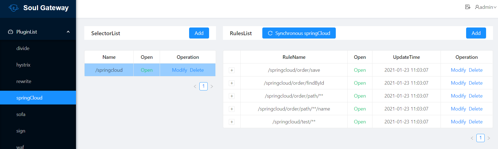

# soul源码分析（3）SpringCloud服务如何接入soul以及SpringCloud插件分析

## 说明

本文将包括如下内容：

- 如何将SpringCloud服务接入soul
- soul的SpringCloud插件源码分析

## 1. 如何将SpringCloud服务接入soul

### 1.1 配置soul网关、soul-admin

- （1）启动`soul-admin`后台，操作步骤可以参考本系列第一篇文章`阅读源码准备与soul基础`

- （2）在`soul-admin`后台将`SpringCloud`插件打开

  - 路径：`System Manage` -> `Plugin` -> 打开`SpringCloud`即可

- （3）修改网关程序`soul-bootstrap`，引入`SpringCloud`相关依赖、添加注册中心配置。注意需要根据注册中心是哪一种、相应配置与依赖需要对应。比如下面主要以`eureka`为例。更多信息请参考官网：https://dromara.org/zh-cn/docs/soul/user-springcloud.html

  - （3）.1引入依赖如下

    ```xml
     <!--soul SpringCloud plugin start-->
      <dependency>
           <groupId>org.dromara</groupId>
           <artifactId>soul-spring-boot-starter-plugin-springcloud</artifactId>
            <version>${last.version}</version>
      </dependency>
    
      <dependency>
           <groupId>org.dromara</groupId>
           <artifactId>soul-spring-boot-starter-plugin-httpclient</artifactId>
           <version>${last.version}</version>
       </dependency>
       <!--soul SpringCloud plugin end-->
       <dependency>
            <groupId>org.springframework.cloud</groupId>
            <artifactId>spring-cloud-commons</artifactId>
            <version>2.2.0.RELEASE</version>
       </dependency>
       <dependency>
            <groupId>org.springframework.cloud</groupId>
            <artifactId>spring-cloud-starter-netflix-ribbon</artifactId>
            <version>2.2.0.RELEASE</version>
       </dependency>
    ```

  - 如果是以`eureka`为配置中心，还需要添加以下依赖：

    ```xml
    <dependency>
           <groupId>org.springframework.cloud</groupId>
           <artifactId>spring-cloud-starter-netflix-eureka-client</artifactId>
           <version>2.2.0.RELEASE</version>
      </dependency>
    ```

  - （3）.2配置文件添加`eureka`配置：

    ```yaml
     eureka:
         client:
           serviceUrl:
             defaultZone: http://localhost:8761/eureka/ # 你的eureka地址
         instance:
           prefer-ip-address: true # 注册到eureka是IP形式
    ```

  - （3）.3 重启`soul-bootstrap`

### 1.2 SpringCloud服务接入soul

下面仍然以`soul`官方提供的例子`soul-examples-springcloud`来演示操作步骤。

- （1）在`SpringCloud`应用中添加如下依赖：

  ```xml
   <dependency>
        <groupId>org.dromara</groupId>
        <artifactId>soul-spring-boot-starter-client-springcloud</artifactId>
        <version>${last.version}</version>
   </dependency>
  ```

- （2）修改`SpringCloud`的配置：

  ```yaml
  soul:
    springcloud:
      admin-url: http://localhost:9095
      context-path: /springcloud
      full: true
  # adminUrl: 为你启动的soul-admin 项目的ip + 端口，注意要加http://
  # contextPath: 为你的这个项目在soul网关的路由前缀，比如/order ，/product 等等，网关会根据你的这个前缀来进行路由.
  # full: 设置true 代表代理你的整个服务，false表示代理你其中某几个controller
  ```

  

- （3）在`SpringCloud`项目中`Controller`接口中添加注解，具体请参考示例：https://dromara.org/zh-cn/docs/soul/user-springcloud.html

- （4）启动`SpringCloud`项目，启动日志中有如下内容，则说明接口已注入到`soul`网关中。

```java
2021-01-23 11:50:44.917  INFO 14008 --- [pool-1-thread-1] o.d.s.client.common.utils.RegisterUtils  : springCloud client register success: {"appName":"springCloud-test","context":"/springcloud","path":"/springcloud/order/save","pathDesc":"","rpcType":"springCloud","ruleName":"/springcloud/order/save","enabled":true} 
2021-01-23 11:50:44.928  INFO 14008 --- [pool-1-thread-1] o.d.s.client.common.utils.RegisterUtils  : springCloud client register success: {"appName":"springCloud-test","context":"/springcloud","path":"/springcloud/order/findById","pathDesc":"","rpcType":"springCloud","ruleName":"/springcloud/order/findById","enabled":true} 
2021-01-23 11:50:44.937  INFO 14008 --- [pool-1-thread-1] o.d.s.client.common.utils.RegisterUtils  : springCloud client register success: {"appName":"springCloud-test","context":"/springcloud","path":"/springcloud/order/path/**/name","pathDesc":"","rpcType":"springCloud","ruleName":"/springcloud/order/path/**/name","enabled":true} 
2021-01-23 11:50:44.946  INFO 14008 --- [pool-1-thread-1] o.d.s.client.common.utils.RegisterUtils  : springCloud client register success: {"appName":"springCloud-test","context":"/springcloud","path":"/springcloud/order/path/**","pathDesc":"","rpcType":"springCloud","ruleName":"/springcloud/order/path/**","enabled":true} 
2021-01-23 11:50:44.955  INFO 14008 --- [pool-1-thread-1] o.d.s.client.common.utils.RegisterUtils  : springCloud client register success: {"appName":"springCloud-test","context":"/springcloud","path":"/springcloud/test/**","pathDesc":"","rpcType":"springCloud","ruleName":"/springcloud/test/**","enabled":true} 
```

此时`soul-admin`中可以看到`SpringCloud`插件中已注册的路由信息：



### 1.3 测试

以`soul-examples-springcloud`为例，使用`curl`命令直接访问`SpringCloud`后端服务：

```shell
$ curl -s http://localhost:8884/order/findById?id=2
{"id":"2","name":"hello world spring cloud findById"}
```

访问网关：

```shell
$ curl -s http://localhost:9195/springcloud/order/findById?id=2
{"id":"2","name":"hello world spring cloud findById"}
```

当然此处也可以使用`wrk`或是`ab`等工具做下压测，看通过网关访问与直接访问相比，有多少性能损耗。此处暂时略过。

## 2. SpringCloud插件源码分析

TODO