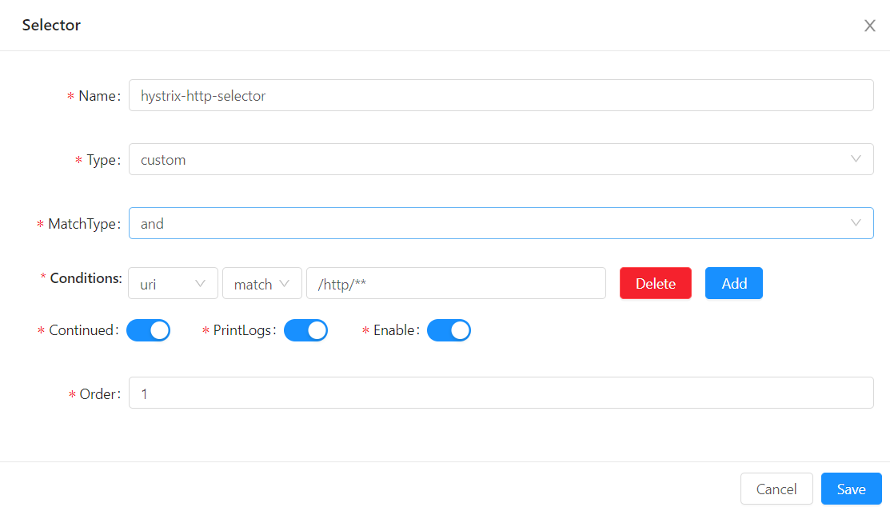
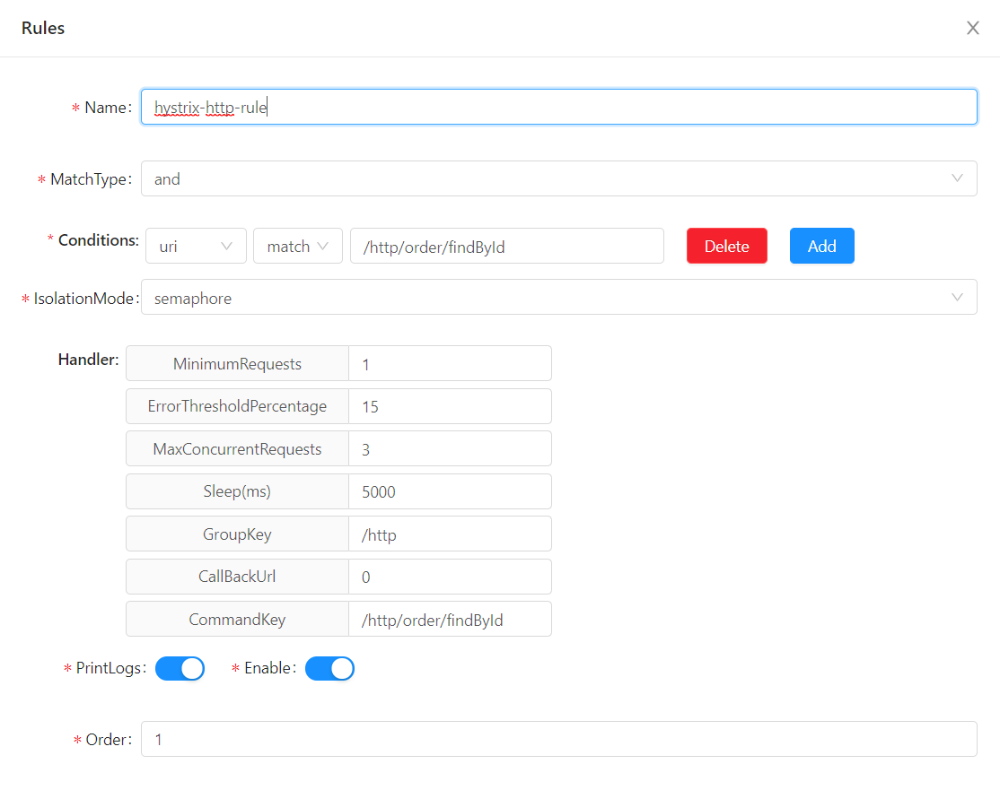

# soul源码分析（5）Hystrix插件

## 说明 

本文代码基于`soul` 2021.2.8 master分支版本。

## 准备

请先阅读`soul`官方用户文档 -> [Hystrix插件](https://dromara.org/zh/projects/soul/hystrix-plugin/)，[选择器规则详解](https://dromara.org/zh/projects/soul/selector-and-rule/)

## 目标

本文将包括如下内容：

- 如何使用Hystrix插件
- 分析`soul`相关源码

## 如何使用Hystrix？

这一点官方文档写的很清楚，要在`soul`中使用`Hystrix`插件，需要：

- 在`soul-admin`中：

  - 插件管理 -> `hystrix`，设置为开启。
  - 插件管理 -> hystrix 中添加`selector`、`rule`，此处务必阅读官方文档 [选择器规则详解](https://dromara.org/zh/projects/soul/selector-and-rule/) 
- 在`soul-bootstrap`中：
  - 添加Hystrix插件依赖，然后重启网关：
  - ```xml
   <!-- soul hystrix plugin start-->
   <dependency>
       <groupId>org.dromara</groupId>
       <artifactId>soul-spring-boot-starter-plugin-hystrix</artifactId>
        <version>${last.version}</version>
   </dependency>
   <!-- soul hystrix plugin end-->
   ```

我在本地启动时，配置如下：

1. 配置`selector`



2. 配置`rule`



方便起见，我使用了`soul`项目中的`soul-examples-http`，使用`divide`插件代理`HTTP`请求，然后采用上述`Hystrix`插件配置。试验如下。

### 1. 试验1：没有发生熔断

直接手工访问，由于并发量较小，不会触发熔断，测试如下：

```shell
$curl http://localhost:9195/http/order/findById?id=12
{"id":"12","name":"hello world findById"}
```

此时`soul-bootstrap`网关后台日志输出：

```java
2021-02-09 11:39:20.618  INFO 8976 --- [work-threads-19] o.d.soul.plugin.base.AbstractSoulPlugin  : hystrix selector success match , selector name :hystrix-http-selector
2021-02-09 11:39:20.618  INFO 8976 --- [work-threads-19] o.d.soul.plugin.base.AbstractSoulPlugin  : hystrix rule success match , rule name :hystrix-http-rule
2021-02-09 11:39:20.618  INFO 8976 --- [work-threads-19] o.d.soul.plugin.base.AbstractSoulPlugin  : divide selector success match , selector name :/http
2021-02-09 11:39:20.618  INFO 8976 --- [work-threads-19] o.d.soul.plugin.base.AbstractSoulPlugin  : divide rule success match , rule name :/http/order/findById
2021-02-09 11:39:20.618  INFO 8976 --- [work-threads-19] o.d.s.plugin.httpclient.WebClientPlugin  : The request urlPath is http://172.0.1.58:8188/order/findById?id=12, retryTimes is 0
```

### 2. 试验2：发生熔断

首先使用压测工具发起多个并发请求、造成熔断，比如我在`Windows`上使用了`sb`这个工具，在`linux`上大家也可以使用`wrk`或是其他。

```shell
$sb -u http://localhost:9195/http/order/findById?id=3 -c 20 -N 60
```

此时再手工尝试访问，会发现报如下异常：

```shell
$curl http://localhost:9195/http/order/findById?id=12
{"code":500,"message":"Internal Server Error","data":"/http/order/findById short-circuited and fallback failed."}
```

说明熔断生效，不过此处省略熔断时调用相应`callback`、我没有`hystrix-http-rule`这条`rule`中设置，所以报错了。有兴趣的小伙伴请自行试验有设置`callback`的反应。

发生熔断时的日志内容如下：

```java
2021-02-09 11:34:03.944 ERROR 8976 --- [-work-threads-1] o.d.soul.plugin.hystrix.HystrixPlugin    : hystrix execute have circuitBreaker is Open! groupKey:/http,commandKey:/http/order/findById
2021-02-09 11:34:03.946 ERROR 8976 --- [-work-threads-9] a.w.r.e.AbstractErrorWebExceptionHandler : [d26d41a5]  500 Server Error for HTTP GET "/http/order/findById?id=3"

com.netflix.hystrix.exception.HystrixRuntimeException: /http/order/findById short-circuited and fallback failed.
	at com.netflix.hystrix.AbstractCommand$22.call(AbstractCommand.java:825) ~[hystrix-core-1.5.12.jar:1.5.12]
	Suppressed: reactor.core.publisher.FluxOnAssembly$OnAssemblyException: 
Error has been observed at the following site(s):
	|_ checkpoint ⇢ org.dromara.soul.web.configuration.ErrorHandlerConfiguration$1 [DefaultWebFilterChain]
	|_ checkpoint ⇢ org.dromara.soul.web.filter.WebSocketParamFilter [DefaultWebFilterChain]
	|_ checkpoint ⇢ org.dromara.soul.web.filter.FileSizeFilter [DefaultWebFilterChain]
	|_ checkpoint ⇢ org.dromara.soul.bootstrap.filter.HealthFilter [DefaultWebFilterChain]
	|_ checkpoint ⇢ org.springframework.boot.actuate.metrics.web.reactive.server.MetricsWebFilter [DefaultWebFilterChain]
	|_ checkpoint ⇢ HTTP GET "/http/order/findById?id=3" [ExceptionHandlingWebHandler]
Stack trace:
		at com.netflix.hystrix.AbstractCommand$22.call(AbstractCommand.java:825) ~[hystrix-core-1.5.12.jar:1.5.12]
		at com.netflix.hystrix.AbstractCommand$22.call(AbstractCommand.java:804) ~[hystrix-core-1.5.12.jar:1.5.12]
		at rx.internal.operators.OperatorOnErrorResumeNextViaFunction$4.onError(OperatorOnErrorResumeNextViaFunction.java:140) ~[rxjava-1.3.8.jar:1.3.8]
		at rx.internal.operators.OnSubscribeDoOnEach$DoOnEachSubscriber.onError(OnSubscribeDoOnEach.java:87) ~[rxjava-1.3.8.jar:1.3.8]
		at rx.internal.operators.OnSubscribeDoOnEach$DoOnEachSubscriber.onError(OnSubscribeDoOnEach.java:87) ~[rxjava-1.3.8.jar:1.3.8]
		at com.netflix.hystrix.AbstractCommand$DeprecatedOnFallbackHookApplication$1.onError(AbstractCommand.java:1472) ~[hystrix-core-1.5.12.jar:1.5.12]
		at com.netflix.hystrix.AbstractCommand$FallbackHookApplication$1.onError(AbstractCommand.java:1397) ~[hystrix-core-1.5.12.jar:1.5.12]
......
```


## Hystrix插件源码分析

`soul`插件设计之前已经分析过，接下来我们直接去看`HystrixPlugin`的代码实现。跟之前分析过的`soul`插件一样，我们只需要关注`doExecute`方法即可：

```java
public class HystrixPlugin extends AbstractSoulPlugin {

    @Override
    protected Mono<Void> doExecute(final ServerWebExchange exchange, final SoulPluginChain chain, final SelectorData selector, final RuleData rule) {
        final SoulContext soulContext = exchange.getAttribute(Constants.CONTEXT);
        assert soulContext != null;
        final HystrixHandle hystrixHandle = GsonUtils.getInstance().fromJson(rule.getHandle(), HystrixHandle.class);
        //设置分组key
        if (StringUtils.isBlank(hystrixHandle.getGroupKey())) {
            hystrixHandle.setGroupKey(Objects.requireNonNull(soulContext).getModule());
        }
        //设置command key
        if (StringUtils.isBlank(hystrixHandle.getCommandKey())) {
            hystrixHandle.setCommandKey(Objects.requireNonNull(soulContext).getMethod());
        }
        //fetchCommand判断使用Hystrix信号量模式还是线程池模式
        Command command = fetchCommand(hystrixHandle, exchange, chain);
        //是否已打开的判断，以及具体的熔断逻辑
        return Mono.create(s -> {
            Subscription sub = command.fetchObservable().subscribe(s::success,
                    s::error, s::success);
            s.onCancel(sub::unsubscribe);
            if (command.isCircuitBreakerOpen()) {
                log.error("hystrix execute have circuitBreaker is Open! groupKey:{},commandKey:{}", hystrixHandle.getGroupKey(), hystrixHandle.getCommandKey());
            }
        }).doOnError(throwable -> {
            log.error("hystrix execute exception:", throwable);
            exchange.getAttributes().put(Constants.CLIENT_RESPONSE_RESULT_TYPE, ResultEnum.ERROR.getName());
            chain.execute(exchange);
        }).then();
    }
	......

}
```

`soul`中重写封装了`Hystrix Command`，基于信号量的`HystrixCommand`、基于线程池的`HystrixCommandOnThread`，都实现了`Command`接口，方便统一处理。

有关断路器、熔断、`Hystrix`细节知识就不在这里展开。 这个就得去官方wiki了解下了，尤其是这篇[How it works](https://github.com/Netflix/Hystrix/wiki/How-it-Works#CircuitBreaker)。


## 总结

- soul Hystrix插件基本使用
- Hystrix插件源码实现简要分析