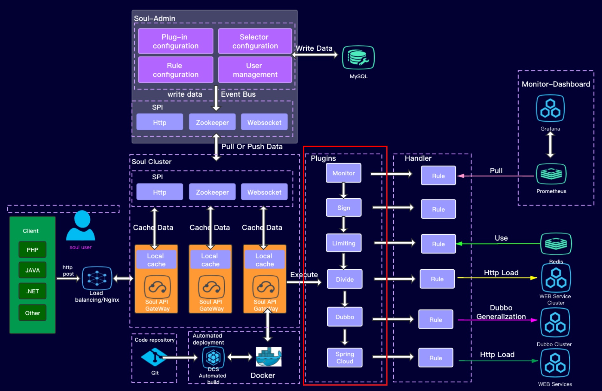
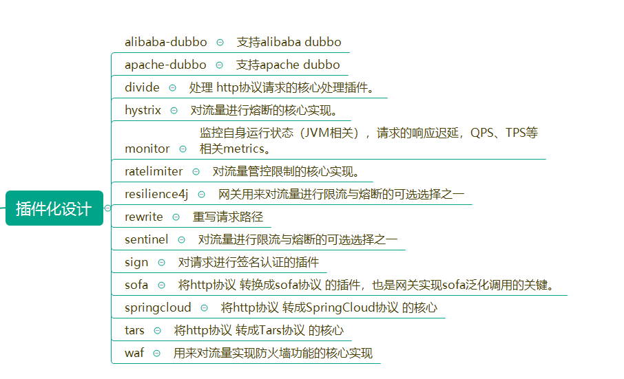
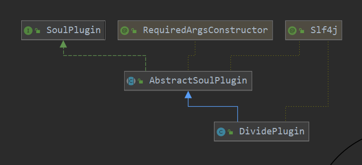
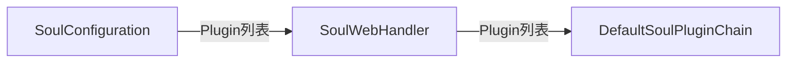

# soul源码分析总结篇之插件化设计

## 说明

如果没有看之前文章的朋友，请至少先看[阅读源码准备与soul基础](阅读源码准备与soul基础.md)

本文将包括如下内容：

- soul用插件实现了哪些功能？
- soul如何实现插件化设计？

## Soul用插件实现了哪些功能？

> 插件是Soul的灵魂。



从架构图上就可以看出，`soul`主要功能都是通过插件来实现的，比如监控、各种请求的转发（HTTP、Dubbo、SpringCloud、Sofa等）、限流与熔断、WAF等等，用户也可以自定义插件来扩展`soul`。

截止到2021.1.26，目前支持的插件如下(参见`soul`源码中的`soul-plugin`模块)：



## Soul如何实现插件化设计？

### 1. 如何实现一个插件？

回忆一下，在[http插件的使用与soul插件工作流程分析](http插件的使用与soul插件工作流程分析.md)中，有分析过，`divide`插件的工作流程，通过`divide`处理一个请求的日志我们知道，HTTP请求被转发时，主要是`AbstractSoulPlugin`和`WebClientPlugin`在起作用。`DividePlugin`插件的继承关系如下：



插件的实现采用模板方法设计模式，`AbstractSoulPlugin`作为模板、规定了插件的主要流程，具体业务逻辑由继承该类的每种子类（插件）来实现。

`AbstractSoulPlugin`的核心逻辑在`execute`方法：

```java
@Override
public Mono<Void> execute(final ServerWebExchange exchange, final SoulPluginChain chain) {
    String pluginName = named();
    final PluginData pluginData = BaseDataCache.getInstance().obtainPluginData(pluginName);
    if (pluginData != null && pluginData.getEnabled()) {
        final Collection<SelectorData> selectors = BaseDataCache.getInstance().obtainSelectorData(pluginName);
        if (CollectionUtils.isEmpty(selectors)) {
            return handleSelectorIsNull(pluginName, exchange, chain);
        }
        final SelectorData selectorData = matchSelector(exchange, selectors);
        if (Objects.isNull(selectorData)) {
            return handleSelectorIsNull(pluginName, exchange, chain);
        }
        selectorLog(selectorData, pluginName);
        final List<RuleData> rules = BaseDataCache.getInstance().obtainRuleData(selectorData.getId());
        if (CollectionUtils.isEmpty(rules)) {
            return handleRuleIsNull(pluginName, exchange, chain);
        }
        RuleData rule;
        if (selectorData.getType() == SelectorTypeEnum.FULL_FLOW.getCode()) {
            //get last
            rule = rules.get(rules.size() - 1);
        } else {
            rule = matchRule(exchange, rules);
        }
        if (Objects.isNull(rule)) {
            return handleRuleIsNull(pluginName, exchange, chain);
        }
        ruleLog(rule, pluginName);
        return doExecute(exchange, chain, selectorData, rule);
    }
    return chain.execute(exchange);
}
```

在该方法中可以看到'Mono'这种返回值，这是因为`soul`中使用了反应式编程，引入了`reactor-spring`，有关反应式编程又是一大块内容，请读者自行搜索。

此处`execute`方法的逻辑并不复杂：

```
1. 根据当前插件名称在缓存中找到插件数据pluginData
2. if pluginData存在 且 可用 
	根据插件名称从缓存中找到对应selector
	根据selector拿到所有规则rules，找到当前请求所匹配的那个规则rule
	执行该规则（`doExecute`方法，具体逻辑取决于是哪个插件，比如HTTP的需要看DividePlugin的doExecute）
3. 执行后续的插件处理逻辑（责任链）
```

每个继承了`AbstractSoulPlugin`的插件，都必须实现`doExecute`方法，以便实现自己的处理逻辑。

### 2. 插件如何串起来调用、形成插件链？

还是以`DividePlugin`为例，插件的具体执行是`AbstractSoulPlugin`的`execute`方法，那找一下调用关系（比如IDEA的'Find Usage'，或是Eclipse类似功能），可以知道是`SoulWebHandler`中的内部类`DefaultSoulPluginChain`类调用了插件链：

```java
 private static class DefaultSoulPluginChain implements SoulPluginChain {

        private int index;
        /**
        所有插件。
        请求过来之后，将遍历插件、走每个插件的处理逻辑。
        */
        private final List<SoulPlugin> plugins;

        /**
         * Instantiates a new Default soul plugin chain.
         *
         * @param plugins the plugins
         */
        DefaultSoulPluginChain(final List<SoulPlugin> plugins) {
            this.plugins = plugins;
        }

        /**
         * Delegate to the next {@code WebFilter} in the chain.
         *
         * @param exchange the current server exchange
         * @return {@code Mono<Void>} to indicate when request handling is complete
         */
        @Override
        public Mono<Void> execute(final ServerWebExchange exchange) {
            /*
            反应式编程的写法，Mono.defer会创建一个数据源
            */
            return Mono.defer(() -> {
                if (this.index < plugins.size()) {
                    SoulPlugin plugin = plugins.get(this.index++);
                    //判断是否需要跳过plugin
                    Boolean skip = plugin.skip(exchange);
                    if (skip) {
                        //跳过、递归执行后续的插件
                        return this.execute(exchange);
                    }
                    /*
				取决于plugin内部实现。
				比如AbstractSoulPlugin的execute方法会执行当前插件的处理逻辑，然后继续调用DefaultSoulPluginChain
				的execute方法（已经在 plugin.execute(exchange, this) 这条语句中，通过this这个参数把DefaultSoulPluginChain对象传递给插件）。
				通过DefaultSoulPluginChain#execute与AbstractSoulPlugin#execute这两者配合实现了责任链模式。
				*/
                    return plugin.execute(exchange, this);
                }
                return Mono.empty();
            });
        }
    }
```

为了更清晰一些，我把责任链相关代码再摘出来，大家对比看：

先看下`AbstractSoulPlugin`的`execute`有关责任链的关键代码：

```java
/**
此处为AbstractSoulPlugin的execute有关责任链的关键代码
*/
@Override
public Mono<Void> execute(final ServerWebExchange exchange, final SoulPluginChain chain) {
    String pluginName = named();
    final PluginData pluginData = BaseDataCache.getInstance().obtainPluginData(pluginName);
    if (pluginData != null && pluginData.getEnabled()) {
        .......
            return doExecute(exchange, chain, selectorData, rule);
    }
    return chain.execute(exchange);
}
```

还是以`DividePlugin`为例，其`doExecute`方法：

```java
@Override
    protected Mono<Void> doExecute(final ServerWebExchange exchange, final SoulPluginChain chain, final SelectorData selector, final RuleData rule) {
        .......
        return chain.execute(exchange);
    }
```

此处比较巧妙，通过责任链模式将所有插件的处理逻辑串起来，建议用心体会下。这种地方就很体现设计者的功底了，接口设计好、方法调用时就很清晰、很简单。建议学习、自己工作中试试。

### 3. 插件如何实例化？

继续从`DefaultSoulPluginChain`探究调用关系，可以看到`DefaultSoulPluginChain`是在`SoulWebHandler`中的`handle`方法初始化的：

```java
public final class SoulWebHandler implements WebHandler {

    private final List<SoulPlugin> plugins;

    private final Scheduler scheduler;

    /**
     * Instantiates a new Soul web handler.
     *
     * @param plugins the plugins
     */
    public SoulWebHandler(final List<SoulPlugin> plugins) {
        this.plugins = plugins;
        String schedulerType = System.getProperty("soul.scheduler.type", "fixed");
        if (Objects.equals(schedulerType, "fixed")) {
            int threads = Integer.parseInt(System.getProperty(
                    "soul.work.threads", "" + Math.max((Runtime.getRuntime().availableProcessors() << 1) + 1, 16)));
            scheduler = Schedulers.newParallel("soul-work-threads", threads);
        } else {
            scheduler = Schedulers.elastic();
        }
    }

    /**
     * Handle the web server exchange.
     处理请求逻辑
     *
     * @param exchange the current server exchange
     * @return {@code Mono<Void>} to indicate when request handling is complete
     */
    @Override
    public Mono<Void> handle(@NonNull final ServerWebExchange exchange) {
        MetricsTrackerFacade.getInstance().counterInc(MetricsLabelEnum.REQUEST_TOTAL.getName());
        Optional<HistogramMetricsTrackerDelegate> startTimer = MetricsTrackerFacade.getInstance().histogramStartTimer(MetricsLabelEnum.REQUEST_LATENCY.getName());
        return new DefaultSoulPluginChain(plugins).execute(exchange).subscribeOn(scheduler)
                .doOnSuccess(t -> startTimer.ifPresent(time -> MetricsTrackerFacade.getInstance().histogramObserveDuration(time)));
    }
}
```

而`SoulWebHandler`实现了`spring-web`包的`WebHandler`接口，用于处理web请求。

继续查找调用关系，可以看到`SoulWebHandler`初始化的：

```java
@Configuration
@ComponentScan("org.dromara.soul")
@Import(value = {ErrorHandlerConfiguration.class, SoulExtConfiguration.class, SpringExtConfiguration.class})
@Slf4j
public class SoulConfiguration {  
    
    /**
     * Init SoulWebHandler.
     * 注意此处ObjectProvider来自spring.
     * 当spring初始化soulWebHandler时，会将已有的SoulPlugin自动封装成一个List，供后面使用
     *
     * @param plugins this plugins is All impl SoulPlugin.
     * @return {@linkplain SoulWebHandler}
     */
    @Bean("webHandler")
    public SoulWebHandler soulWebHandler(final ObjectProvider<List<SoulPlugin>> plugins) {
        List<SoulPlugin> pluginList = plugins.getIfAvailable(Collections::emptyList);
        final List<SoulPlugin> soulPlugins = pluginList.stream()
                .sorted(Comparator.comparingInt(SoulPlugin::getOrder)).collect(Collectors.toList());
        soulPlugins.forEach(soulPlugin -> log.info("load plugin:[{}] [{}]", soulPlugin.named(), soulPlugin.getClass().getName()));
        return new SoulWebHandler(soulPlugins);
    }
    ......
}
```

注意在创建`SoulWebHandler`之前，先按`SoulPlugin`的`getOrder`返回值对`SoulPlugin`进行了排序，已经定义的顺序常量参见`PluginEnum`。


## 总结

综合上述信息，我们可以知道

### soul插件的初始化过程



### soul请求调用链


```sequence
Title: soul请求调用链

SoulWebHandler->DefaultSoulPluginChain: handle
DefaultSoulPluginChain->AbstractSoulPlugin: execute
AbstractSoulPlugin->插件A:execute
插件A->插件A:doExecute
插件A-->AbstractSoulPlugin:返回
AbstractSoulPlugin-->DefaultSoulPluginChain:返回
DefaultSoulPluginChain->AbstractSoulPlugin: execute
AbstractSoulPlugin->插件B:execute
插件B->插件B:doExecute
插件B-->AbstractSoulPlugin:返回
AbstractSoulPlugin-->DefaultSoulPluginChain:返回

```