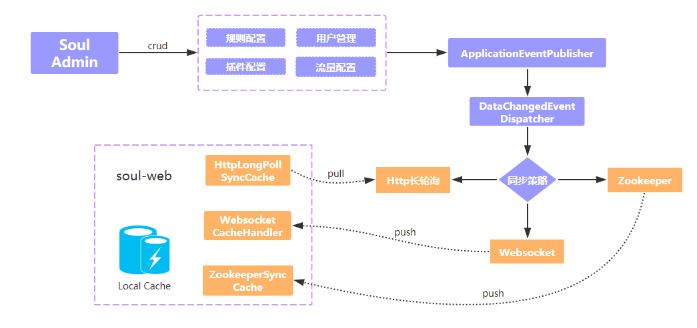

# soul源码分析总结篇之数据同步

## 说明

如果没有看之前文章的朋友，请至少先看[阅读源码准备与soul基础](阅读源码准备与soul基础.md)

本文将包括如下内容：

- `soul`中数据同步的基本设计思路
- `soul`中数据同步各种方式的总结与对比

本文内容参考了官方文档 [数据同步设计](https://dromara.org/zh/projects/soul/data-sync/) (这篇必读！！！)，以及这篇文章 [soul源码解读（十一）-- 数据同步总结](https://blog.csdn.net/baidu_27627251/article/details/113198838)

## 基本设计思路

首先，`soul-admin`将各种数据变更同步给`soul-bootstrap`时，按照我的个人理解，需要做到：

- 高可用
  - 例如要考虑断线重连
- 配置修改能立即生效，不必重启服务
- 应提供多种选择，方便不同环境下部署使用
  - 比如应该支持常见的`ZooKeeper`, `WebSocket`等
- 数据同步的关键参数可配置
  - 比如采用什么方式、同步时间间隔
- 容易扩展
  - 用户能够以较低的成本进行扩展、二次开发，加入自己的业务逻辑
- 持久化

反观目前`soul`数据同步机制的设计，我个人觉得在这几个方面做的都很不错。

回顾一下`soul`数据同步机制，其实就是一个简化的配置中心，`soul-admin`更新数据后、除了自己持久化到数据库，还将其同步到`soul-bootstrap`，而不同程序之间进行数据同步，无非`推`模式、`拉`模式这两种。具体手段当然比较多，比如借助`ZooKeeper`、`Nacos`等中间件，或者`WebSocket`直接同步，或者`HTTP长轮询`，而这几种目前`soul`都已支持（参见`soul`最新master分支代码）。

> 如下图所示，`soul-admin` 在用户发生配置变更之后，会通过 `EventPublisher` 发出配置变更通知，由 `EventDispatcher` 处理该变更通知，然后根据配置的同步策略(http、weboscket、zookeeper)，将配置发送给对应的事件处理器
>
> - 如果是 `websocket` 同步策略，则将变更后的数据主动推送给 `soul-web`，并且在网关层，会有对应的 `WebsocketCacheHandler` 处理器处理来处 `admin` 的数据推送
> - 如果是 `zookeeper` 同步策略，将变更数据更新到 `zookeeper`，而 `ZookeeperSyncCache` 会监听到 `zookeeper` 的数据变更，并予以处理
> - 如果是 `http` 同步策略，`soul-web` 主动发起长轮询请求，默认有 90s 超时时间，如果 `soul-admin` 没有数据变更，则会阻塞 http 请求，如果有数据发生变更则响应变更的数据信息，如果超过 60s 仍然没有数据变更则响应空数据，网关层接到响应后，继续发起 http 请求，反复同样的请求
>
>  

上述内容是官方文档内容。可能因为版本不断迭代、文档不完全精确，但大家体会下设计思路即可。

## 数据同步方式比较

目前`soul`支持4种数据同步方式，参见下表：

| 同步方式   | 是否需引入 额外组件 | 同步模式 推/拉模型 | 优缺点                                                       | 是否支持 增量更新 |
| ---------- | ----------------------- | ---------------------- | ------------------------------------------------------------ | --------------------- |
| WebSocket  | 否                      | 推                     | 使用简单， 双向通信， 增量更新， 但需留意 断线重连 | 是                    |
| ZooKeeper  | 是(ZooKeeper)           |                        | 强一致性， 需引入额外框架， zk基于`quorum`思想， 频繁写性能不好 | 是                    |
| HTTP长轮询 | 否                      | 拉                     |                                                              | 否                    |
| Nacos      | 是(Nacos)               | 拉                     | 强一致性， 需引入额外框架                            | 否                    |

> 注：其实`soul`的`HTTP长轮询`机制也借鉴了`Nacos`等框架的思想，可以参考这篇文章：[Nacos 原理：推+拉打造客户端配置信息的实时更新](https://blog.csdn.net/j3t9z7h/article/details/88729918)

以下内容引自 [soul源码解读（十一）-- 数据同步总结](https://blog.csdn.net/baidu_27627251/article/details/113198838)， 我偷个懒，直接抄一下~.~

>## 初始化
>
>这4种同步数据的方式都会初始化数据。
>
>- websocket bootstrap 启动之后，会发一个初始化的消息（MYSELF）给 admin，然后 amdin 会直接从数据库拉取数据到本地缓存。
>- zookeeper 会先判断 zookeeper 里面有没有数据，没有就去数据查询，缓存到本地，然后更新zookeeper。有数据的话就以zookeeper的数据为准。
>- http 会直接从数据库拉取数据到本地缓存。
>- nacos 和 zookeeper 一样的判断逻辑，没有就去数据查询，缓存到本地，然后更新nacos（需要新建namespace）。有数据的话就以nacos的数据为准。
>
>## 更新配置
>
>更新数据，都是先改数据库，然后通过 DataChangedEventDispatcher 转发事件到具体的 listener ，
>websocket 和 zookeeper 是增量更新，http 和 nacos 是全量更新。
>
>- 如果是 websocket 同步策略，则将变更后的数据主动推送给 soul-web，并且在网关层，会有对应的 WebsocketCacheHandler 处理器处理来处 admin 的数据推送。
>- 如果是 zookeeper 同步策略，将变更数据更新到 zookeeper，而 ZookeeperSyncCache 会监听到 zookeeper 的数据变更，并予以处理。
>- 如果是 http 同步策略，soul-web 主动发起长轮询请求，默认有 90s 超时时间，如果 soul-admin 没有数据变更，则会阻塞 http 请求，如果有数据发生变更则响应变更的数据信息，如果超过 60s 仍然没有数据变更则响应空数据，网关层接到响应后，继续发起 http 请求，反复同样的请求。
>- 如果是 nacos 同步策略，将变更数据更新到 nacos，NacosCacheHandler 会监听到 nacos 的数据变更，并予以处理。

### 选择哪一种

4种方式各有优缺点，看使用场景。

- 如果线上环境本身就有`ZooKeeper`或是`Nacos`，或是公司内部技术规范要求配置信息需放到配置中心，那直接采用`ZooKeeper`或是`Nacos`即可（若是配置中心是其他框架，可以自行扩展一下）；
- 如无特殊要求建议使用`WebSocket`方式，无需引入其他组件，而且支持增量更新，配置很简单，能满足平时日常需求。

## 参考资料

- 官方文档 [数据同步设计](https://dromara.org/zh/projects/soul/data-sync/) 
- [soul源码解读（十一）-- 数据同步总结](https://blog.csdn.net/baidu_27627251/article/details/113198838)
- [Nacos 原理：推+拉打造客户端配置信息的实时更新](https://blog.csdn.net/j3t9z7h/article/details/88729918)