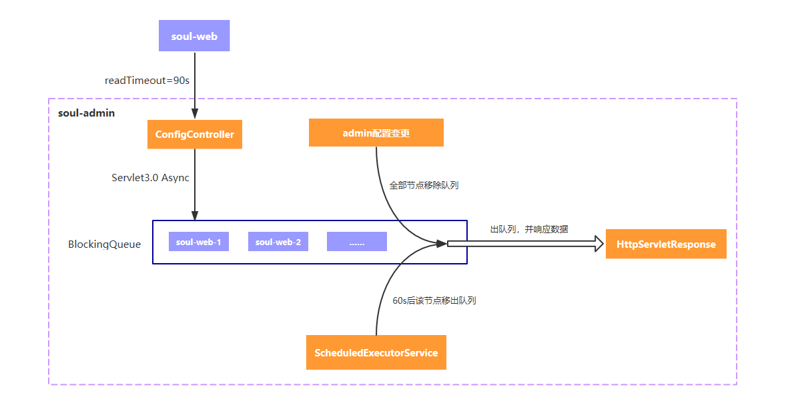
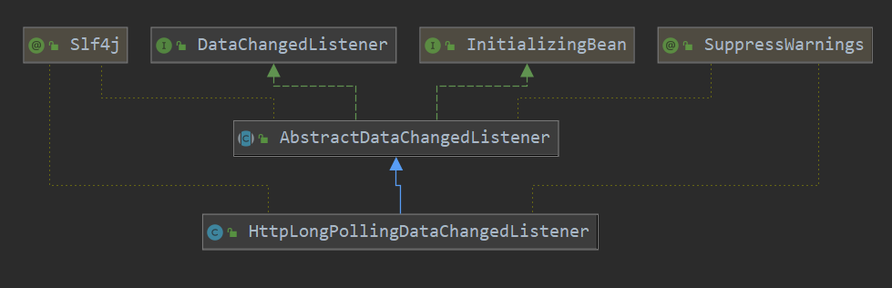
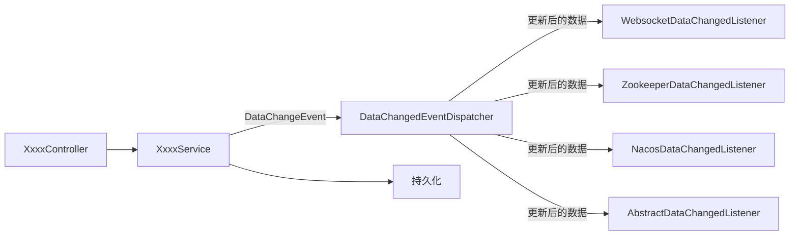
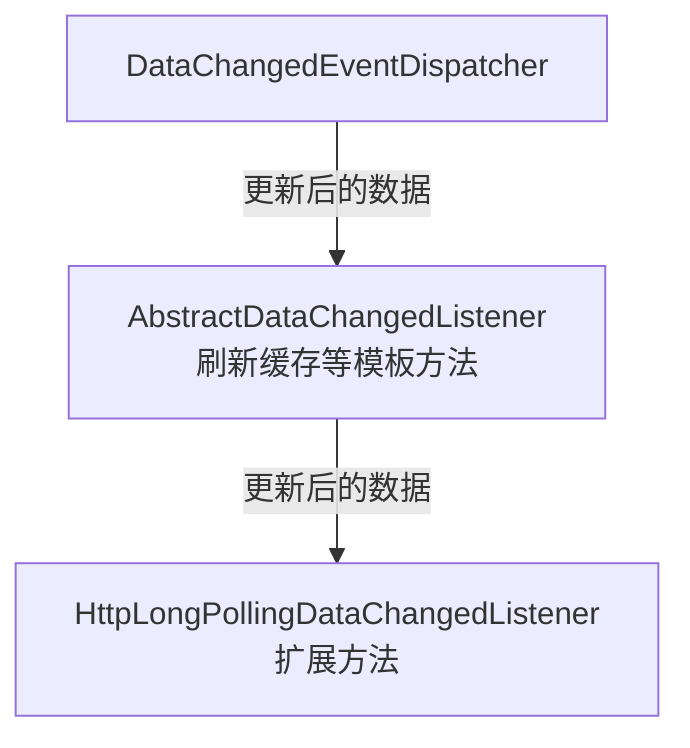
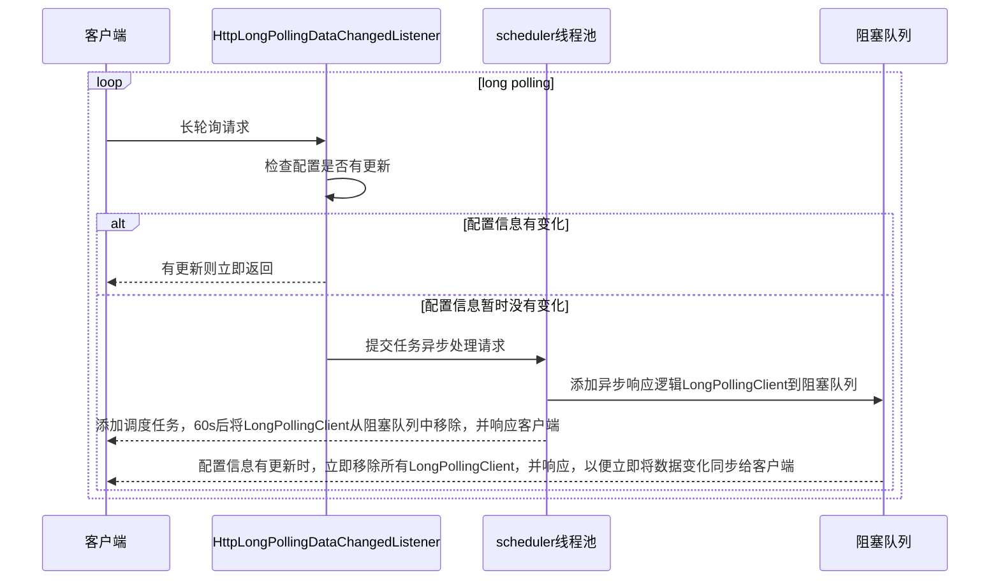

# soul源码分析数据同步篇之HTTP同步流程


## 说明 

本文代码基于`soul` 2021.2.4 master分支版本。

## 准备

请先阅读`soul`官方文档 [数据同步原理](https://dromara.org/zh-cn/docs/soul/dataSync.html)，对`soul`数据同步原理有个基本的了解。

## 如何开启HTTP同步策略

> 这个小节主要引自soul官网 [使用不同的数据同步策略](https://dromara.org/zh/projects/soul/use-data-sync/)

### soul-admin的配置

`application.yml`中添加如下配置，或是在启动参数中添加`--soul.sync.http=''`，然后重启服务：

```yaml
soul:
  sync:
    http:
       enabled: true
```

### soul-bootstrap的配置

引入如下依赖：

```xml
 <!--soul data sync start use http-->
<dependency>
   <groupId>org.dromara</groupId>
    <artifactId>soul-spring-boot-starter-sync-data-http</artifactId>
    <version>${last.version}</version>
</dependency>
```

然后修改配置文件，开启`HTTP`长轮询配置：

```yaml
soul:
    sync:
        http:
             url : http://localhost:9095
```

重启`soul-bootstrap`即可。


## HTTP长轮询原理

> 主要参考、整理官网文档 [数据同步设计](https://dromara.org/zh/projects/soul/data-sync/)

首先，还是得拿出官方图说事儿~.~   


一般客户端、服务端之间数据同步，无非推、拉两种模型。官方这张图清晰的指出`HTTP`长轮询是拉模式，另外的`WebSocket`和`ZooKeeper`则是推模式。

`HTTP`长轮询机制借鉴`Apllo`、`Nacos`等框架的思想，网关`soul-bootstrap`会发`HTTP`查询请求给`soul-admin`，查询目前最新的配置，该查询请求超时时间为90s，即读取配置信息时`soul-bootstrap`最多等待就是90s。而`soul-admin`收到查询请求后，将会异步处理，先将其放到阻塞队列中，`soul-admin`会额外创建一个60s后执行的调度任务，该任务会从阻塞队列中拿到这个请求、进行处理，保证请求肯定得到响应。另一方面，如果在60s内，管理员在`soul-admin`中更改了配置，`soul-admin`会挨个移除阻塞队列中的长轮询请求、响应数据，并告知哪个`group`发生了变更，网关`soul-bootstrap`还需要额外发起请求更新对应`group`的数据。

知道上面信息后，再回过头来看官网这张图，是不是更清晰一些了？



> 注意：因为soul一直在迭代中，官网文档、图可能有滞后，建议一切以代码为准。

这个是思路，我们接下来分析代码，会更清晰一些。

## HTTP长轮询同步流程源码分析

### soul-admin源码分析

#### 从日志分析

我个人感觉，学习开源框架源码，主要就是看官方文档、看日志输出来寻找蛛丝马迹、还有就是看初始化过程的代码。

首先，还是看日志信息：

`soul-admin`启动日志中，有关`HTTP`长轮询的部分：

```java
......
2021-02-07 10:53:53.680  INFO 5484 --- [           main] o.d.s.a.l.AbstractDataChangedListener    : update config cache[PLUGIN], old: null, updated: {group='PLUGIN', md5='fad546b10dbe417e5ded73ea359eace4', lastModifyTime=1612666433680}
2021-02-07 10:53:53.694  INFO 5484 --- [           main] o.d.s.a.l.AbstractDataChangedListener    : update config cache[RULE], old: null, updated: {group='RULE', md5='d751713988987e9331980363e24189ce', lastModifyTime=1612666433694}
2021-02-07 10:53:53.704  INFO 5484 --- [           main] o.d.s.a.l.AbstractDataChangedListener    : update config cache[SELECTOR], old: null, updated: {group='SELECTOR', md5='d751713988987e9331980363e24189ce', lastModifyTime=1612666433704}
2021-02-07 10:53:53.722  INFO 5484 --- [           main] o.d.s.a.l.AbstractDataChangedListener    : update config cache[META_DATA], old: null, updated: {group='META_DATA', md5='d751713988987e9331980363e24189ce', lastModifyTime=1612666433722}
2021-02-07 10:53:53.723  INFO 5484 --- [           main] a.l.h.HttpLongPollingDataChangedListener : http sync strategy refresh interval: 300000ms
......
```

那我们基本就可以从上面日志基本可以确定，需要看`AbstractDataChangedListener`、`HttpLongPollingDataChangedListener`。看下这两个类结构、代码即可知道这里使用了`模板方法`设计模式，主要流程由`AbstractDataChangedListener`定义，`HttpLongPollingDataChangedListener`则实现一些细节逻辑。



有关细节逻辑后面分析，我们接下来从初始化过程验证一下。

#### 从soul-admin初始化过程分析

`soul-admin`初始化类`DataSyncConfiguration`中可以看到涉及`HTTP`长轮询同步的代码如下：

```java
@Configuration
public class DataSyncConfiguration {
    ......
        
    @Configuration
    @ConditionalOnProperty(name = "soul.sync.http.enabled", havingValue = "true")
    @EnableConfigurationProperties(HttpSyncProperties.class)
    static class HttpLongPollingListener {
        @Bean
        @ConditionalOnMissingBean(HttpLongPollingDataChangedListener.class)
        public HttpLongPollingDataChangedListener httpLongPollingDataChangedListener(final HttpSyncProperties httpSyncProperties) {
            return new HttpLongPollingDataChangedListener(httpSyncProperties);
        }
    }
    ......
}
```

可以看到只有配置了`soul.sync.http.enabled`属性，才会实例化`HttpLongPollingDataChangedListener`。那结合上述`soul`官网中提到的长轮询机制，我们可以想见，这个`HttpLongPollingDataChangedListener`就应该包含调度任务、阻塞队列、对于请求的处理等逻辑。

##### HttpLongPollingDataChangedListener分析

由于采用了`模板方法`设计模式，我们要对`HttpLongPollingDataChangedListener`分析，必须先把父类`AbstractDataChangedListener`逻辑搞清。

`AbstractDataChangedListener`主要代码如下（略去了结构重复的n多内容）：

```java
@Slf4j
@SuppressWarnings("all")
public abstract class AbstractDataChangedListener implements DataChangedListener, InitializingBean {
	 //常量缓存
     protected static final ConcurrentMap<String, ConfigDataCache> CACHE = new ConcurrentHashMap<>();
    //AppAuthService, PluginService, RuleService, SelectorService, MetaDataService的引用，用于读写数据库
    ......
 
    //实现DataChangedListener接口，此处仅截取了selector相关，实际还有onAppAuthChanged、onPluginChanged等实现。实现思路跟下面selector这个完全一致，都是在执行完刷新对应缓存后、调用对应的afterXxxChanged方法。
    @Override
    public void onSelectorChanged(final List<SelectorData> changed, final DataEventTypeEnum eventType) {
        if (CollectionUtils.isEmpty(changed)) {
            return;
        }
        this.updateSelectorCache();
        this.afterSelectorChanged(changed, eventType);
    }
	//更新selector缓存后，调用该方法。
    protected void afterSelectorChanged(final List<SelectorData> changed, final DataEventTypeEnum eventType) {
    }

    //InitializingBean接口，属性赋值后、初始化之前执行
    @Override
    public final void afterPropertiesSet() {
        updateAppAuthCache();
        updatePluginCache();
        updateRuleCache();
        updateSelectorCache();
        updateMetaDataCache();
        afterInitialize();
    }
	//模板方法
    protected abstract void afterInitialize();
	//更新缓存
    protected <T> void updateCache(final ConfigGroupEnum group, final List<T> data) {
        String json = GsonUtils.getInstance().toJson(data);
        ConfigDataCache newVal = new ConfigDataCache(group.name(), json, Md5Utils.md5(json), System.currentTimeMillis());
        ConfigDataCache oldVal = CACHE.put(newVal.getGroup(), newVal);
        log.info("update config cache[{}], old: {}, updated: {}", group, oldVal, newVal);
    }
	//更新selector、rule、plugin、appAuth、metadata缓存的工具方法
  	.......
}
```

可以看到`AbstractDataChangedListener`主要是实现`DataChangedListener`接口，同时利用`模板方法`设计模式，提供了扩展的余地，在数据变化时刷新缓存、调用对应的模板方法。

之前也分析过，在`soul-admin`中利用`Spring`事件监听机制，收到`DataChangedEvent`事件后会将其发给对应的`listener`，由`listener`进一步处理：



那么在`HTTP`长轮询这里，流程就是：



上图中提到的扩展方法就是利用`AbstractDataChangedListener`提供的`afterPluginChanged`、`afterRuleChanged`等方法，实现`HTTP`长轮询逻辑、嵌入到已有的处理流程中。

还是先看下源码：

```java
@Slf4j
@SuppressWarnings("all")
public class HttpLongPollingDataChangedListener extends AbstractDataChangedListener {
	.......
    private static final ReentrantLock LOCK = new ReentrantLock();
    private final BlockingQueue<LongPollingClient> clients;
    private final ScheduledExecutorService scheduler;
    private final HttpSyncProperties httpSyncProperties;

    public HttpLongPollingDataChangedListener(final HttpSyncProperties httpSyncProperties) {
        this.clients = new ArrayBlockingQueue<>(1024);
        this.scheduler = new ScheduledThreadPoolExecutor(1,
                SoulThreadFactory.create("long-polling", true));
        this.httpSyncProperties = httpSyncProperties;
    }

    //添加一个定时任务，定时读取数据库数据、写入到本地缓存中
    @Override
    protected void afterInitialize() {
        long syncInterval = httpSyncProperties.getRefreshInterval().toMillis();
        // Periodically check the data for changes and update the cache
        scheduler.scheduleWithFixedDelay(() -> {
            log.info("http sync strategy refresh config start.");
            try {
                this.refreshLocalCache();
                log.info("http sync strategy refresh config success.");
            } catch (Exception e) {
                log.error("http sync strategy refresh config error!", e);
            }
        }, syncInterval, syncInterval, TimeUnit.MILLISECONDS);
        log.info("http sync strategy refresh interval: {}ms", syncInterval);
    }

    /*
    缓存中保存的是： group --> ConfigDataCache(包含name, json数据，md5, 存入缓存的时间错)
    group即RULE,PLUGIN这些名字，参见ConfigGroupEnum
    */
    private void refreshLocalCache() {
        this.updateAppAuthCache();
        this.updatePluginCache();
        this.updateRuleCache();
        this.updateSelectorCache();
        this.updateMetaDataCache();
    }

    /*
    关键代码1：获取请求信息，比较
    */
    public void doLongPolling(final HttpServletRequest request, final HttpServletResponse response) {
        // compareChangedGroup 会比较md5与时间戳，如果有不一样的，则单独拿出来、立即响应
        List<ConfigGroupEnum> changedGroup = compareChangedGroup(request);
        String clientIp = getRemoteIp(request);
        if (CollectionUtils.isNotEmpty(changedGroup)) {
            //立即响应，此处是使用HttpServletResponse 写入数据
            this.generateResponse(response, changedGroup);
            log.info("send response with the changed group, ip={}, group={}", clientIp, changedGroup);
            return;
        }
        /*
        监听配置变化，此处利用Servlet 3.0的异步处理机制，将当前请求的AsyncContext对象放到LongPollingClient中，
        然后交给线程池异步执行LongPollingClient，doLongPolling自己不会阻塞。
       	此处可以参考 https://blog.csdn.net/whereismatrix/article/details/52864554  这篇文章了解下Servlet 3.0的异步处理机制
        */
        final AsyncContext asyncContext = request.startAsync();
        asyncContext.setTimeout(0L);
        // 提交到线程池，异步处理。HttpConstants.SERVER_MAX_HOLD_TIMEOUT 设置了超时时间60s
        scheduler.execute(new LongPollingClient(asyncContext, clientIp, HttpConstants.SERVER_MAX_HOLD_TIMEOUT));
    }

    /*关键代码2：父类onPluginChanged方法执行（刷新缓存）后，将调用此处的afterPluginChanged。此处是新建一个DataChangeTask对象加入到处理调度任务的线程池中。
    DataChangeTask会将阻塞队列clients中的所有待处理请求弹出、返回更新后的数据。这个逻辑参见DataChangeTask类实现。
    */
    @Override
    protected void afterPluginChanged(final List<PluginData> changed, final DataEventTypeEnum eventType) {
        scheduler.execute(new DataChangeTask(ConfigGroupEnum.PLUGIN));
    }
    //此处省略afterMetaDataChanged afterAppAuthChanged等结构完全相同的代码
    ......


    private List<ConfigGroupEnum> compareChangedGroup(final HttpServletRequest request) {
        List<ConfigGroupEnum> changedGroup = new ArrayList<>(ConfigGroupEnum.values().length);
        for (ConfigGroupEnum group : ConfigGroupEnum.values()) {
            // md5,lastModifyTime
            String[] params = StringUtils.split(request.getParameter(group.name()), ',');
            if (params == null || params.length != 2) {
                throw new SoulException("group param invalid:" + request.getParameter(group.name()));
            }
            String clientMd5 = params[0];
            long clientModifyTime = NumberUtils.toLong(params[1]);
            ConfigDataCache serverCache = CACHE.get(group.name());
            // do check.
            if (this.checkCacheDelayAndUpdate(serverCache, clientMd5, clientModifyTime)) {
                changedGroup.add(group);
            }
        }
        return changedGroup;
    }
    //省略部分工具方法
    ......

    class DataChangeTask implements Runnable {
        private final ConfigGroupEnum groupKey;
        private final long changeTime = System.currentTimeMillis();

        DataChangeTask(final ConfigGroupEnum groupKey) {
            this.groupKey = groupKey;
        }

        /*
        关键代码3：
        有数据更新（plugin, selector等），则立即从阻塞队列拿出正等待处理的请求、立即返回响应给客户端
        */
        @Override
        public void run() {
            for (Iterator<LongPollingClient> iter = clients.iterator(); iter.hasNext();) {
                LongPollingClient client = iter.next();
                iter.remove();
                client.sendResponse(Collections.singletonList(groupKey));
                log.info("send response with the changed group,ip={}, group={}, changeTime={}", client.ip, groupKey, changeTime);
            }
        }
    }

    class LongPollingClient implements Runnable {
		//利用Servlet 3.0 异步处理机制，利用AsyncContext拿到HttpServletRequest， HttpServletResponse，以便响应客户端请求
        private final AsyncContext asyncContext;
        private final String ip;
        private final long timeoutTime;
        private Future<?> asyncTimeoutFuture;

        LongPollingClient(final AsyncContext ac, final String ip, final long timeoutTime) {
            this.asyncContext = ac;
            this.ip = ip;
            this.timeoutTime = timeoutTime;
        }

        @Override
        public void run() {
            /*
            关键代码4：
			scheduler执行本任务时，将会执行：
			1. 加入一个默认60s后执行的调度任务加入scheduler，该任务：
				1.1 从阻塞队列clients中移除当前LongPollingClient对象
				1.2 发送响应给客户端（即60s后自动从阻塞队列移除、并响应客户端的逻辑）
			2. 将当前LongPollingClient对象保存到阻塞队列clients中
            */
            this.asyncTimeoutFuture = scheduler.schedule(() -> {
                clients.remove(LongPollingClient.this);
                List<ConfigGroupEnum> changedGroups = compareChangedGroup((HttpServletRequest) asyncContext.getRequest());
                sendResponse(changedGroups);
            }, timeoutTime, TimeUnit.MILLISECONDS);
            clients.add(this);
        }

        void sendResponse(final List<ConfigGroupEnum> changedGroups) {
            // cancel scheduler
            if (null != asyncTimeoutFuture) {
                asyncTimeoutFuture.cancel(false);
            }
            generateResponse((HttpServletResponse) asyncContext.getResponse(), changedGroups);
            //可以透过AsyncContext的getRequest() 、 getResponse()方法取得Request、Response对象，此次对客户端的响应将暂缓至调用AsyncContext的complete()方法或dispatch()为止，前者表示回应完成，后者表示将响应调派给指定的URL 。
            asyncContext.complete();
        }
    }
}
```

#### 小结

源码分析参见上面一小节，尤其注意体会上面注释中的`关键代码1`、`关键代码2`、`关键代码3`、`关键代码4`，这些地方需要与官方这张图比较就能理解了：

这里为便于理解，我画了一张序列图：



这下应该就比较清楚了。

### soul-bootstrap源码分析

#### 从日志分析

先看`soul-bootstrap`的启动日志：

```java
......
2021-02-07 10:58:04.675  INFO 7960 --- [           main] .s.s.b.s.s.d.h.HttpSyncDataConfiguration : you use http long pull sync soul data
2021-02-07 10:58:06.558  INFO 7960 --- [           main] o.d.s.s.data.http.HttpSyncDataService    : request configs: [http://localhost:9095/configs/fetch?groupKeys=APP_AUTH&groupKeys=PLUGIN&groupKeys=RULE&groupKeys=SELECTOR&groupKeys=META_DATA]
2021-02-07 10:58:06.911  INFO 7960 --- [onPool-worker-4] o.d.s.s.d.h.refresh.SelectorDataRefresh  : clear all selector cache, old cache
2021-02-07 10:58:06.911  INFO 7960 --- [onPool-worker-2] o.d.s.s.d.h.refresh.AppAuthDataRefresh   : clear all appAuth data cache
2021-02-07 10:58:06.911  INFO 7960 --- [onPool-worker-3] o.d.s.s.d.http.refresh.MetaDataRefresh   : clear all metaData cache
2021-02-07 10:58:06.911  INFO 7960 --- [           main] o.d.s.s.d.http.refresh.RuleDataRefresh   : clear all rule cache, old cache
2021-02-07 10:58:06.929  INFO 7960 --- [           main] o.d.s.s.data.http.HttpSyncDataService    : get latest configs: [{"code":200,"message":"success","data":{"META_DATA":{"md5":"d751713988987e9331980363e24189ce","lastModifyTime":1612666433722,"data":[]},"SELECTOR":{"md5":"d751713988987e9331980363e24189ce","lastModifyTime":1612666433704,"data":[]},"PLUGIN":{"md5":"fad546b10dbe417e5ded73ea359eace4","lastModifyTime":1612666433680,"data":[{"id":"1","name":"sign","config":null,"role":1,"enabled":false},{"id":"10","name":"sentinel","config":null,"role":1,"enabled":false},{"id":"11","name":"sofa","config":"{\"protocol\":\"zookeeper\",\"register\":\"127.0.0.1:2181\"}","role":0,"enabled":false},{"id":"12","name":"resilience4j","config":null,"role":1,"enabled":false},{"id":"13","name":"tars","config":null,"role":1,"enabled":false},{"id":"14","name":"context_path","config":null,"role":1,"enabled":false},{"id":"15","name":"grpc","config":null,"role":1,"enabled":false},{"id":"2","name":"waf","config":"{\"model\":\"black\"}","role":1,"enabled":false},{"id":"3","name":"rewrite","config":null,"role":1,"enabled":false},{"id":"4","name":"rate_limiter","config":"{\"master\":\"mymaster\",\"mode\":\"standalone\",\"url\":\"192.168.1.1:6379\",\"password\":\"abc\"}","role":1,"enabled":false},{"id":"5","name":"divide","config":null,"role":0,"enabled":true},{"id":"6","name":"dubbo","config":"{\"register\":\"zookeeper://localhost:2181\"}","role":1,"enabled":false},{"id":"7","name":"monitor","config":"{\"metricsName\":\"prometheus\",\"host\":\"localhost\",\"port\":\"9190\",\"async\":\"true\"}","role":1,"enabled":false},{"id":"8","name":"springCloud","config":null,"role":1,"enabled":false},{"id":"9","name":"hystrix","config":null,"role":0,"enabled":false}]},"APP_AUTH":{"md5":"d751713988987e9331980363e24189ce","lastModifyTime":1612666433647,"data":[]},"RULE":{"md5":"d751713988987e9331980363e24189ce","lastModifyTime":1612666433694,"data":[]}}}]
......
```

显然，初始化是在`HttpSyncDataConfiguration`中，而这个类创建了`HttpSyncDataService`实例，不断轮询的逻辑就在`HttpSyncDataService`中：

```java
public class HttpSyncDataService implements SyncDataService, AutoCloseable {

  .......
    public HttpSyncDataService(final HttpConfig httpConfig, final PluginDataSubscriber pluginDataSubscriber,
                               final List<MetaDataSubscriber> metaDataSubscribers, final List<AuthDataSubscriber> authDataSubscribers) {
        this.factory = new DataRefreshFactory(pluginDataSubscriber, metaDataSubscribers, authDataSubscribers);
        this.httpConfig = httpConfig;
        this.serverList = Lists.newArrayList(Splitter.on(",").split(httpConfig.getUrl()));
        this.httpClient = createRestTemplate();
        this.start();
    }
    
        ......
            
      private void start() {
        // It could be initialized multiple times, so you need to control that.
        if (RUNNING.compareAndSet(false, true)) {
            // fetch all group configs.
            this.fetchGroupConfig(ConfigGroupEnum.values());
            int threadSize = serverList.size();
            this.executor = new ThreadPoolExecutor(threadSize, threadSize, 60L, TimeUnit.SECONDS,
                    new LinkedBlockingQueue<>(),
                    SoulThreadFactory.create("http-long-polling", true));
            // start long polling, each server creates a thread to listen for changes.
            this.serverList.forEach(server -> this.executor.execute(new HttpLongPollingTask(server)));
        } else {
            log.info("soul http long polling was started, executor=[{}]", executor);
        }
    }
    
    ......
    
   class HttpLongPollingTask implements Runnable {

        private String server;

        private final int retryTimes = 3;

        HttpLongPollingTask(final String server) {
            this.server = server;
        }

        @Override
        public void run() {
            while (RUNNING.get()) {
                for (int time = 1; time <= retryTimes; time++) {
                    try {
                        doLongPolling(server);
                    } catch (Exception e) {
                        // print warnning log.
                        if (time < retryTimes) {
                            log.warn("Long polling failed, tried {} times, {} times left, will be suspended for a while! {}",
                                    time, retryTimes - time, e.getMessage());
                            ThreadUtils.sleep(TimeUnit.SECONDS, 5);
                            continue;
                        }
                        // print error, then suspended for a while.
                        log.error("Long polling failed, try again after 5 minutes!", e);
                        ThreadUtils.sleep(TimeUnit.MINUTES, 5);
                    }
                }
            }
            log.warn("Stop http long polling.");
        }
    }
}
```

此处逻辑比较简单，`HttpSyncDataService`会创建一个线程池，启动线程去不断轮询`soul-admin`，拉取数据后进行更新本地缓存操作。此处比较简单，偷懒一下、就不进一步分析了，有兴趣的童鞋可以进一步探索下。

## 总结

主要介绍了`soul`利用`HTTP`长轮询同步数据的原理，包括：

- soul-admin如何处理长轮询（很精巧的设计，建议自己体会）
- soul-bootstrap如何处理长轮询
  - 较为简略，有兴趣可以自己探索下。

## 参考资料

- soul官方资料-数据同步设计 https://dromara.org/zh/projects/soul/data-sync/

