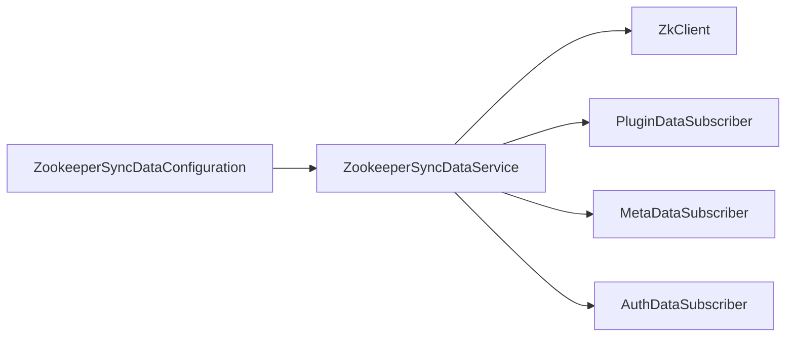
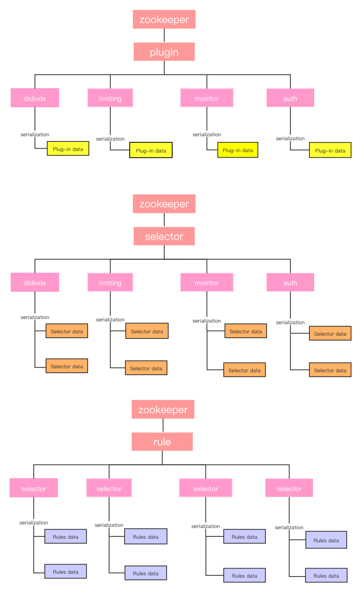
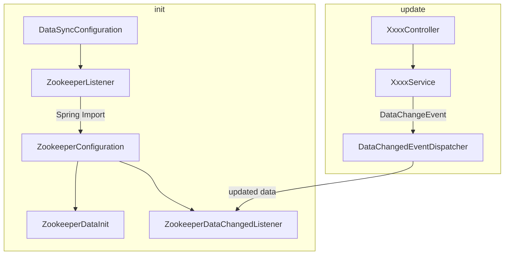

# soul源码分析数据同步篇之HTTP同步流程


## 说明 

本文代码基于`soul` 2021.2.4 master分支版本。

## 准备

请先阅读`soul`官方文档 [数据同步原理](https://dromara.org/zh-cn/docs/soul/dataSync.html)，对`soul`数据同步原理有个基本的了解。

## 如何开启HTTP同步策略

> 这个小节主要引自soul官网 [使用不同的数据同步策略](https://dromara.org/zh/projects/soul/use-data-sync/)

### soul-admin的配置

`application.yml`中添加如下配置，或是在启动参数中添加`--soul.sync.http=''`，然后重启服务：

```yaml
soul:
  sync:
    http:
       enabled: true
```

### soul-bootstrap的配置

引入如下依赖：

```xml
 <!--soul data sync start use http-->
<dependency>
   <groupId>org.dromara</groupId>
    <artifactId>soul-spring-boot-starter-sync-data-http</artifactId>
    <version>${last.version}</version>
</dependency>
```

然后修改配置文件，开启`HTTP`长轮询配置：

```yaml
soul:
    sync:
        http:
             url : http://localhost:9095
```

重启`soul-bootstrap`即可。


## HTTP长轮询原理

> 主要参考、整理官网文档 [数据同步设计](https://dromara.org/zh/projects/soul/data-sync/)

首先，还是得拿出官方图说事儿~.~   


一般客户端、服务端之间数据同步，无非推、拉两种模型。官方这张图清晰的指出`HTTP`长轮询是拉模式，另外的`WebSocket`和`ZooKeeper`则是推模式。

`HTTP`长轮询机制借鉴`Apllo`、`Nacos`等框架的思想，基本流程：

```sequence
`soul-web` -> soul-admin : 
```


## HTTP长轮询同步流程源码分析

### soul-admin源码分析

#### 从日志分析

首先，还是看日志信息：

`soul-admin`启动日志中，有关`HTTP`长轮询的部分：

```java
......
2021-02-07 10:53:53.680  INFO 5484 --- [           main] o.d.s.a.l.AbstractDataChangedListener    : update config cache[PLUGIN], old: null, updated: {group='PLUGIN', md5='fad546b10dbe417e5ded73ea359eace4', lastModifyTime=1612666433680}
2021-02-07 10:53:53.694  INFO 5484 --- [           main] o.d.s.a.l.AbstractDataChangedListener    : update config cache[RULE], old: null, updated: {group='RULE', md5='d751713988987e9331980363e24189ce', lastModifyTime=1612666433694}
2021-02-07 10:53:53.704  INFO 5484 --- [           main] o.d.s.a.l.AbstractDataChangedListener    : update config cache[SELECTOR], old: null, updated: {group='SELECTOR', md5='d751713988987e9331980363e24189ce', lastModifyTime=1612666433704}
2021-02-07 10:53:53.722  INFO 5484 --- [           main] o.d.s.a.l.AbstractDataChangedListener    : update config cache[META_DATA], old: null, updated: {group='META_DATA', md5='d751713988987e9331980363e24189ce', lastModifyTime=1612666433722}
2021-02-07 10:53:53.723  INFO 5484 --- [           main] a.l.h.HttpLongPollingDataChangedListener : http sync strategy refresh interval: 300000ms
......
```

那我们基本就可以从上面日志基本可以确定，需要看`AbstractDataChangedListener`、`HttpLongPollingDataChangedListener`。


### soul-admin源码分析


#### 从soul-admin初始化过程分析

`soul-admin`初始化类`DataSyncConfiguration`（从包名一般能猜到，初始化相关代码一般都会放到`config`包里，如果你没有这样做，得反思一下~.~），可以看到涉及`zookeeper`同步的代码如下：

```java
@Configuration
public class DataSyncConfiguration {
    ......
        
	@Configuration
    @ConditionalOnProperty(prefix = "soul.sync.zookeeper", name = "url")
    @Import(ZookeeperConfiguration.class)
    static class ZookeeperListener {
	
        @Bean
        @ConditionalOnMissingBean(ZookeeperDataChangedListener.class)
        public DataChangedListener zookeeperDataChangedListener(final ZkClient zkClient) {
            return new ZookeeperDataChangedListener(zkClient);
        }

        @Bean
        @ConditionalOnMissingBean(ZookeeperDataInit.class)
        public ZookeeperDataInit zookeeperDataInit(final ZkClient zkClient, final SyncDataService syncDataService){
            return new ZookeeperDataInit(zkClient, syncDataService);
        }
    }
    ......
}
```

可以看到只有配置了`soul.sync.zookeeper`属性，才会实例化`ZookeeperListener`， 而`ZookeeperListener`又依赖于`ZookeeperConfiguration`，`ZookeeperConfiguration`只是根据配置文件中的`zookeeper`地址、session超时时间、连接超时时间创建出一个`zkClient`供后续调用。

继续分析，`ZookeeperListener`中创建的`ZookeeperDataInit`，看源码可以发现，该类利用了`Spring Boot`的`CommandLineRunner`接口，当所有对象初始化之后，将会初始化插件、权限、元数据在`zookeeper`中的路径，同时判断`zookeeper`中对应路径中是否存在节点，如果插件、权限、元数据这3者对应的节点都不存在，则进行一次全量同步操作(` syncDataService.syncAll`)：

```java
public class ZookeeperDataInit implements CommandLineRunner {
   
    private final ZkClient zkClient;
    private final SyncDataService syncDataService;
    ......

    @Override
    public void run(final String... args) {
        String pluginPath = ZkPathConstants.PLUGIN_PARENT;
        String authPath = ZkPathConstants.APP_AUTH_PARENT;
        String metaDataPath = ZkPathConstants.META_DATA;
        //zk中没有对应节点，则进行全量同步操作、更新到zk中
        if (!zkClient.exists(pluginPath) && !zkClient.exists(authPath) && !zkClient.exists(metaDataPath)) {
            syncDataService.syncAll(DataEventTypeEnum.REFRESH);
        }
    }
    ......
}

```

全量同步方法会从数据库读取插件、权限、元数据，将其利用`Spring Event`机制发布出去：

```java
@Service("syncDataService")
public class SyncDataServiceImpl implements SyncDataService {
    ......
    @Override
    public boolean syncAll(final DataEventTypeEnum type) {
        appAuthService.syncData();
        List<PluginData> pluginDataList = pluginService.listAll();
        eventPublisher.publishEvent(new DataChangedEvent(ConfigGroupEnum.PLUGIN, type, pluginDataList));
        List<SelectorData> selectorDataList = selectorService.listAll();
        eventPublisher.publishEvent(new DataChangedEvent(ConfigGroupEnum.SELECTOR, type, selectorDataList));
        List<RuleData> ruleDataList = ruleService.listAll();
        eventPublisher.publishEvent(new DataChangedEvent(ConfigGroupEnum.RULE, type, ruleDataList));
        metaDataService.syncData();
        return true;
    }
    ......
}
```

`ZookeeperListener`中创建的另一个对象，`ZookeeperDataChangedListener`将根据上面的数据更新时间，更新`zookeeper`中的数据：

```java
public class ZookeeperDataChangedListener implements DataChangedListener {

    private final ZkClient zkClient;
	......

    @Override
    public void onAppAuthChanged(final List<AppAuthData> changed, final DataEventTypeEnum eventType) {
        ......
    }

    @SneakyThrows
    @Override
    public void onMetaDataChanged(final List<MetaData> changed, final DataEventTypeEnum eventType) {
		......
    }

    @Override
    public void onPluginChanged(final List<PluginData> changed, final DataEventTypeEnum eventType) {
    	......
    }

    @Override
    public void onSelectorChanged(final List<SelectorData> changed, final DataEventTypeEnum eventType) {
    }

    @Override
    public void onRuleChanged(final List<RuleData> changed, final DataEventTypeEnum eventType) {
       	......
    }
    ......
}
```

当然，此处看上去这个`ZookeeperDataChangedListener`好像并没有监听`DataChangedEvent`这个事件，但我们找找`DataChangedEvent`的引用关系，可以发现是`DataChangedEventDispatcher`这个类在监听事件、然后将该事件分发给对应的listener。此处逻辑可以参考上一篇[soul源码分析数据同步篇之WebSocket同步流程](https://blog.csdn.net/evasnowind/article/details/113333185) 。

至此我们基本将`soul-admin`整体流程串起来了。

#### soul-admin整体流程

首先再小结下初始化过程，涉及到的类如下图所示，其中`ZookeeperConfiguration`利用`Spring Import`机制先执行、创建出`zkClient`之后，然后`ZookeeperDataInit`才能实例化。

数据更新时，利用`Spring Event`机制，需要更新数据时只需要发布一个`DataChangeEvent`即可，该事件将会由`DataChangedEventDispatcher`统一处理，`DataChangedEventDispatcher`将会根据事件中的更新类型，调用对应`listener`，在`zookeeper`同步这里就是调用`ZookeeperDataChangedListener`对应的方法进行处理。


### soul-bootstrap源码分析

#### 从日志分析

先看`soul-bootstrap`的启动日志：

```java
......
2021-02-07 10:58:04.675  INFO 7960 --- [           main] .s.s.b.s.s.d.h.HttpSyncDataConfiguration : you use http long pull sync soul data
2021-02-07 10:58:06.558  INFO 7960 --- [           main] o.d.s.s.data.http.HttpSyncDataService    : request configs: [http://localhost:9095/configs/fetch?groupKeys=APP_AUTH&groupKeys=PLUGIN&groupKeys=RULE&groupKeys=SELECTOR&groupKeys=META_DATA]
2021-02-07 10:58:06.911  INFO 7960 --- [onPool-worker-4] o.d.s.s.d.h.refresh.SelectorDataRefresh  : clear all selector cache, old cache
2021-02-07 10:58:06.911  INFO 7960 --- [onPool-worker-2] o.d.s.s.d.h.refresh.AppAuthDataRefresh   : clear all appAuth data cache
2021-02-07 10:58:06.911  INFO 7960 --- [onPool-worker-3] o.d.s.s.d.http.refresh.MetaDataRefresh   : clear all metaData cache
2021-02-07 10:58:06.911  INFO 7960 --- [           main] o.d.s.s.d.http.refresh.RuleDataRefresh   : clear all rule cache, old cache
2021-02-07 10:58:06.929  INFO 7960 --- [           main] o.d.s.s.data.http.HttpSyncDataService    : get latest configs: [{"code":200,"message":"success","data":{"META_DATA":{"md5":"d751713988987e9331980363e24189ce","lastModifyTime":1612666433722,"data":[]},"SELECTOR":{"md5":"d751713988987e9331980363e24189ce","lastModifyTime":1612666433704,"data":[]},"PLUGIN":{"md5":"fad546b10dbe417e5ded73ea359eace4","lastModifyTime":1612666433680,"data":[{"id":"1","name":"sign","config":null,"role":1,"enabled":false},{"id":"10","name":"sentinel","config":null,"role":1,"enabled":false},{"id":"11","name":"sofa","config":"{\"protocol\":\"zookeeper\",\"register\":\"127.0.0.1:2181\"}","role":0,"enabled":false},{"id":"12","name":"resilience4j","config":null,"role":1,"enabled":false},{"id":"13","name":"tars","config":null,"role":1,"enabled":false},{"id":"14","name":"context_path","config":null,"role":1,"enabled":false},{"id":"15","name":"grpc","config":null,"role":1,"enabled":false},{"id":"2","name":"waf","config":"{\"model\":\"black\"}","role":1,"enabled":false},{"id":"3","name":"rewrite","config":null,"role":1,"enabled":false},{"id":"4","name":"rate_limiter","config":"{\"master\":\"mymaster\",\"mode\":\"standalone\",\"url\":\"192.168.1.1:6379\",\"password\":\"abc\"}","role":1,"enabled":false},{"id":"5","name":"divide","config":null,"role":0,"enabled":true},{"id":"6","name":"dubbo","config":"{\"register\":\"zookeeper://localhost:2181\"}","role":1,"enabled":false},{"id":"7","name":"monitor","config":"{\"metricsName\":\"prometheus\",\"host\":\"localhost\",\"port\":\"9190\",\"async\":\"true\"}","role":1,"enabled":false},{"id":"8","name":"springCloud","config":null,"role":1,"enabled":false},{"id":"9","name":"hystrix","config":null,"role":0,"enabled":false}]},"APP_AUTH":{"md5":"d751713988987e9331980363e24189ce","lastModifyTime":1612666433647,"data":[]},"RULE":{"md5":"d751713988987e9331980363e24189ce","lastModifyTime":1612666433694,"data":[]}}}]
......
```

此处相对就好看一些，从`ZookeeperSyncDataConfiguration : you use zookeeper sync soul data`这条日志直接可以定位到`soul-bootstrap`中的启动过程中使用`zookeeper`的位置:

```java
@Configuration
//ZookeeperSyncDataService存在时，才会实例化ZookeeperSyncDataConfiguration
@ConditionalOnClass(ZookeeperSyncDataService.class)
//配置了soul.sync.zookeeper.url属性，才会实例化ZookeeperSyncDataConfiguration
@ConditionalOnProperty(prefix = "soul.sync.zookeeper", name = "url")
//属性将放到ZookeeperConfig中，方便使用
@EnableConfigurationProperties(ZookeeperConfig.class)
@Slf4j
public class ZookeeperSyncDataConfiguration {
	//初始化ZookeeperSyncDataService
    @Bean
    public SyncDataService syncDataService(final ObjectProvider<ZkClient> zkClient, final ObjectProvider<PluginDataSubscriber> pluginSubscriber,
                                           final ObjectProvider<List<MetaDataSubscriber>> metaSubscribers, final ObjectProvider<List<AuthDataSubscriber>> authSubscribers) {
        log.info("you use zookeeper sync soul data.......");
        return new ZookeeperSyncDataService(zkClient.getIfAvailable(), pluginSubscriber.getIfAvailable(),
                metaSubscribers.getIfAvailable(Collections::emptyList), authSubscribers.getIfAvailable(Collections::emptyList));
    }

    //初始化zookeeper客户端
    @Bean
    public ZkClient zkClient(final ZookeeperConfig zookeeperConfig) {
        return new ZkClient(zookeeperConfig.getUrl(), zookeeperConfig.getSessionTimeout(), zookeeperConfig.getConnectionTimeout());
    }
}
```

明显主要逻辑在`ZookeeperSyncDataService`中，此处截取一部分代码：

```java
public class ZookeeperSyncDataService implements SyncDataService, AutoCloseable {
    ......
        
    public ZookeeperSyncDataService(final ZkClient zkClient, final PluginDataSubscriber pluginDataSubscriber,
                                    final List<MetaDataSubscriber> metaDataSubscribers, final List<AuthDataSubscriber> authDataSubscribers) {
        this.zkClient = zkClient;
        //引入插件、元数据、权限相关的订阅者
        this.pluginDataSubscriber = pluginDataSubscriber;
        this.metaDataSubscribers = metaDataSubscribers;
        this.authDataSubscribers = authDataSubscribers;
        watcherData();
        watchAppAuth();
        watchMetaData();
    }
    
    /*
    监听插件在zk中对应的数据。如果zk中对应节点不存在，则先创建。
    */
    private void watcherData() {
        //查阅
        final String pluginParent = ZkPathConstants.PLUGIN_PARENT;
        List<String> pluginZKs = zkClientGetChildren(pluginParent);
        for (String pluginName : pluginZKs) {
            watcherAll(pluginName);
        }
        zkClient.subscribeChildChanges(pluginParent, (parentPath, currentChildren) -> {
            if (CollectionUtils.isNotEmpty(currentChildren)) {
                for (String pluginName : currentChildren) {
                    watcherAll(pluginName);
                }
            }
        });
    }
    
    private void watcherAll(final String pluginName) {
        watcherPlugin(pluginName);
        watcherSelector(pluginName);
        watcherRule(pluginName);
    }
    
    /*
    主要工作如下
    */
    private void watcherPlugin(final String pluginName) {
        String pluginPath = ZkPathConstants.buildPluginPath(pluginName);
        //如果zk中没有对应路径，则创建一个zk持久节点。
        if (!zkClient.exists(pluginPath)) {
            zkClient.createPersistent(pluginPath, true);
        }
        //最终会调用pluginDataSubscriber.onSubscribe(pluginPath)，作为缓存
        cachePluginData(zkClient.readData(pluginPath));
        //调用zk客户端接口，监听zk中pluginPath节点的数据变化。
        subscribePluginDataChanges(pluginPath, pluginName);
    }
    
    /*
    watcherSelector
    watcherRule都是类似的，略。
    
    */
    ......
}
```

接下来就有一个问题，`ZookeeperSyncDataService`实例化时我们看到需要给构造方法传入`PluginDataSubscriber`等订阅者，我们知道`Spring`在识别到这个参数声明时，会将对应类型的对象注入进来，但这几个订阅者何时实例化这种细节留待后续分析。

#### soul-boostrap整体流程

综合上述分析，结合`soul-bootstrap`项目整体结构，可以看到是`soul-bootstrap`模块集成了`soul-spring-boot-starter-sync-data-zookeeper`模块，该模块又集成了`soul-sync-data-zookeeper`，即整体依赖关系：

```
soul-bootstrap
	|_ soul-spring-boot-starter-sync-data-zookeeper
		|_ soul-sync-data-zookeeper
```

而`soul-sync-data-zookeeper`会利用`@Configuration`初始化`zookeeper`同步相关的对象，这个逻辑在`ZookeeperSyncDataConfiguration`中。而`ZookeeperSyncDataConfiguration`会利用配置文件中的属性判断是否要初始化相关对象，如果已配置了`zookeeper`同步相关的属性，就会创建`zookeeper`客户端，监听`zookeeper`相关节点，监听主要利用`zookeeper`的watch机制。

涉及到的相关类：



在`zookeeper`中数据的结构可以参考`soul`官网 https://dromara.org/zh/projects/soul/data-sync/ ，示意图（引自官网）如下：






## 总结

主要介绍了`soul`利用`zookeeper`同步数据的原理，包括：

- soul-bootstrap初始化zk客户端，监听zk, 如何更新
- soul-admin初始化客户端，数据同步到zk的实现流程

## 参考资料

- soul官方资料-数据同步设计 https://dromara.org/zh/projects/soul/data-sync/

