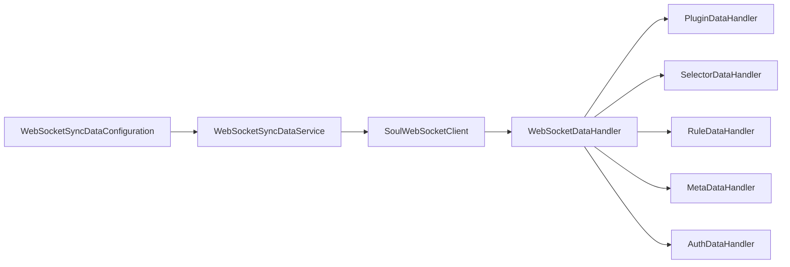
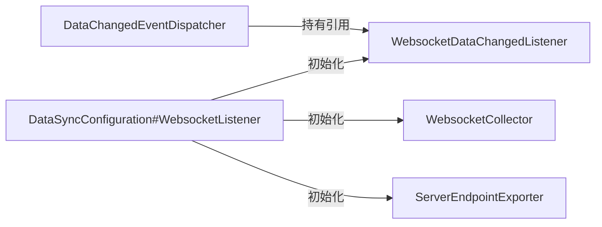
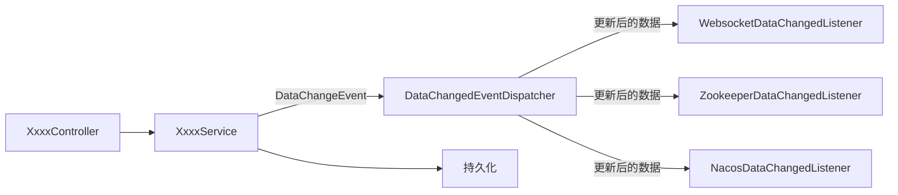

# soul源码分析数据同步篇之WebSocket同步流程


## 说明 

本文代码基于`soul` 2021.1.27 版本。

## 准备

请先阅读`soul`官方文档 [数据同步原理](https://dromara.org/zh-cn/docs/soul/dataSync.html)，对`soul`数据同步原理有个基本的了解。

## WebSocket同步流程

`WebSocket`是`soul-admin`默认的数据同步策略。当建立连接以后会全量获取一次数据，以后的数据都是增量的更新与新增，性能好。并且支持断线重连。

### 1. soul-bootstrap WebSocket客户端处理逻辑

`soul-admin`启动日志有关`WebSocket`的就一句：

```java
2021-01-27 19:54:29.694  INFO 30448 --- [0.0-9095-exec-1] o.d.s.a.l.WebSocket.WebSocketCollector   : WebSocket on open successful....
```

`soul-boostrap`启动日志有关`WebSocket`的内容相对多一些：

```java
.......

2021-01-27 19:54:27.189  INFO 31352 --- [           main] .s.d.r.c.RepositoryConfigurationDelegate : Multiple Spring Data modules found, entering strict repository configuration mode!
2021-01-27 19:54:27.196  INFO 31352 --- [           main] .s.d.r.c.RepositoryConfigurationDelegate : Bootstrapping Spring Data Redis repositories in DEFAULT mode.
2021-01-27 19:54:27.286  INFO 31352 --- [           main] .s.d.r.c.RepositoryConfigurationDelegate : Finished Spring Data repository scanning in 34ms. Found 0 Redis repository interfaces.
2021-01-27 19:54:29.294  INFO 31352 --- [           main] o.d.s.w.configuration.SoulConfiguration  : load plugin:[global] [org.dromara.soul.plugin.global.GlobalPlugin]
2021-01-27 19:54:29.294  INFO 31352 --- [           main] o.d.s.w.configuration.SoulConfiguration  : load plugin:[sign] [org.dromara.soul.plugin.sign.SignPlugin]
2021-01-27 19:54:29.294  INFO 31352 --- [           main] o.d.s.w.configuration.SoulConfiguration  : load plugin:[waf] [org.dromara.soul.plugin.waf.WafPlugin]
2021-01-27 19:54:29.294  INFO 31352 --- [           main] o.d.s.w.configuration.SoulConfiguration  : load plugin:[rate_limiter] [org.dromara.soul.plugin.ratelimiter.RateLimiterPlugin]
2021-01-27 19:54:29.294  INFO 31352 --- [           main] o.d.s.w.configuration.SoulConfiguration  : load plugin:[hystrix] [org.dromara.soul.plugin.hystrix.HystrixPlugin]
2021-01-27 19:54:29.294  INFO 31352 --- [           main] o.d.s.w.configuration.SoulConfiguration  : load plugin:[resilience4j] [org.dromara.soul.plugin.resilience4j.Resilience4JPlugin]
2021-01-27 19:54:29.294  INFO 31352 --- [           main] o.d.s.w.configuration.SoulConfiguration  : load plugin:[divide] [org.dromara.soul.plugin.divide.DividePlugin]
2021-01-27 19:54:29.294  INFO 31352 --- [           main] o.d.s.w.configuration.SoulConfiguration  : load plugin:[webClient] [org.dromara.soul.plugin.httpclient.WebClientPlugin]
2021-01-27 19:54:29.294  INFO 31352 --- [           main] o.d.s.w.configuration.SoulConfiguration  : load plugin:[divide] [org.dromara.soul.plugin.divide.WebSocket.WebSocketPlugin]
2021-01-27 19:54:29.294  INFO 31352 --- [           main] o.d.s.w.configuration.SoulConfiguration  : load plugin:[alibaba-dubbo-body-param] [org.dromara.soul.plugin.alibaba.dubbo.param.BodyParamPlugin]
2021-01-27 19:54:29.294  INFO 31352 --- [           main] o.d.s.w.configuration.SoulConfiguration  : load plugin:[sofa-body-param] [org.dromara.soul.plugin.sofa.param.BodyParamPlugin]
2021-01-27 19:54:29.295  INFO 31352 --- [           main] o.d.s.w.configuration.SoulConfiguration  : load plugin:[dubbo] [org.dromara.soul.plugin.alibaba.dubbo.AlibabaDubboPlugin]
2021-01-27 19:54:29.295  INFO 31352 --- [           main] o.d.s.w.configuration.SoulConfiguration  : load plugin:[sofa] [org.dromara.soul.plugin.sofa.SofaPlugin]
2021-01-27 19:54:29.295  INFO 31352 --- [           main] o.d.s.w.configuration.SoulConfiguration  : load plugin:[monitor] [org.dromara.soul.plugin.monitor.MonitorPlugin]
2021-01-27 19:54:29.295  INFO 31352 --- [           main] o.d.s.w.configuration.SoulConfiguration  : load plugin:[response] [org.dromara.soul.plugin.alibaba.dubbo.response.DubboResponsePlugin]
2021-01-27 19:54:29.295  INFO 31352 --- [           main] o.d.s.w.configuration.SoulConfiguration  : load plugin:[response] [org.dromara.soul.plugin.sofa.response.SofaResponsePlugin]
2021-01-27 19:54:29.295  INFO 31352 --- [           main] o.d.s.w.configuration.SoulConfiguration  : load plugin:[response] [org.dromara.soul.plugin.httpclient.response.WebClientResponsePlugin]
2021-01-27 19:54:29.496  INFO 31352 --- [           main] b.s.s.d.w.WebSocketSyncDataConfiguration : you use WebSocket sync soul data.......
2021-01-27 19:54:29.700  INFO 31352 --- [           main] o.d.s.p.s.d.w.WebSocketSyncDataService   : WebSocket connection is successful.....
2021-01-27 19:54:29.874  INFO 31352 --- [           main] o.s.b.a.e.web.EndpointLinksResolver      : Exposing 2 endpoint(s) beneath base path '/actuator'
......
```

此处启动时也输出了`soul`默认加的一些插件，比如`GlobalPlugin`、`MonitorPlugin`等等，这些等后续再分析。跟`WebSocket`相关的是这几句：

```java
2021-01-27 19:54:29.496  INFO 31352 --- [           main] b.s.s.d.w.WebSocketSyncDataConfiguration : you use WebSocket sync soul data.......
2021-01-27 19:54:29.700  INFO 31352 --- [           main] o.d.s.p.s.d.w.WebSocketSyncDataService   : WebSocket connection is successful.....
2021-01-27 19:54:29.874  INFO 31352 --- [           main] o.s.b.a.e.web.EndpointLinksResolver      : Exposing 2 endpoint(s) beneath base path '/actuator'

```

那我们现在就知道需要先从`WebSocketSyncDataConfiguration`开始看：

```java
@Configuration
//WebSocketSyncDataService这个类存在的时候@Configuration才生效
@ConditionalOnClass(WebSocketSyncDataService.class)
//通过soul.sync.WebSocket控制@Configuration是否生效
@ConditionalOnProperty(prefix = "soul.sync.WebSocket", name = "urls")
@Slf4j
public class WebSocketSyncDataConfiguration {

    //实例化WebSocketSyncDataService
    @Bean
    public SyncDataService WebSocketSyncDataService(final ObjectProvider<WebSocketConfig> WebSocketConfig, final ObjectProvider<PluginDataSubscriber> pluginSubscriber,
                                           final ObjectProvider<List<MetaDataSubscriber>> metaSubscribers, final ObjectProvider<List<AuthDataSubscriber>> authSubscribers) {
        log.info("you use WebSocket sync soul data.......");
        return new WebSocketSyncDataService(WebSocketConfig.getIfAvailable(WebSocketConfig::new), pluginSubscriber.getIfAvailable(),
                metaSubscribers.getIfAvailable(Collections::emptyList), authSubscribers.getIfAvailable(Collections::emptyList));
    }

    //将soul.sync.WebSocket对应的属性值注入到WebSocketConfig对象中，方便项目中读取配置
    @Bean
    @ConfigurationProperties(prefix = "soul.sync.WebSocket")
    public WebSocketConfig WebSocketConfig() {
        return new WebSocketConfig();
    }
}
```

接下来我们就需要去看`WebSocketSyncDataService`，幸好这个类内容也不多：

```java
public class WebSocketSyncDataService implements SyncDataService, AutoCloseable {
	......
    public WebSocketSyncDataService(final WebSocketConfig WebSocketConfig,
                                    final PluginDataSubscriber pluginDataSubscriber,
                                    final List<MetaDataSubscriber> metaDataSubscribers,
                                    final List<AuthDataSubscriber> authDataSubscribers) {
        //从配置信息中获取WebSocket服务端地址（多个url时用逗号隔开）
        String[] urls = StringUtils.split(WebSocketConfig.getUrls(), ",");
        //线程池核心数量为urls的个数，即每个WebSocket都分到一个线程做定时调度
        executor = new ScheduledThreadPoolExecutor(urls.length, SoulThreadFactory.create("WebSocket-connect", true));
        for (String url : urls) {
            try {
                //SoulWebSocketClient封装了与服务端的交互逻辑
                clients.add(new SoulWebSocketClient(new URI(url), Objects.requireNonNull(pluginDataSubscriber), metaDataSubscribers, authDataSubscribers));
            } catch (URISyntaxException e) {
                log.error("WebSocket url({}) is error", url, e);
            }
        }
        try {
            for (WebSocketClient client : clients) {
                //连接服务端
                boolean success = client.connectBlocking(3000, TimeUnit.MILLISECONDS);
                if (success) {
                    log.info("WebSocket connection is successful.....");
                } else {
                    log.error("WebSocket connection is error.....");
                }
                //定时任务，30s一次检查客户端是否已关闭，若关闭则尝试重连
                executor.scheduleAtFixedRate(() -> {
                    try {
                        if (client.isClosed()) {
                            boolean reconnectSuccess = client.reconnectBlocking();
                            if (reconnectSuccess) {
                                log.info("WebSocket reconnect is successful.....");
                            } else {
                                log.error("WebSocket reconnection is error.....");
                            }
                        }
                    } catch (InterruptedException e) {
                        log.error("WebSocket connect is error :{}", e.getMessage());
                    }
                }, 10, 30, TimeUnit.SECONDS);
            }
            /* client.setProxy(new Proxy(Proxy.Type.HTTP, new InetSocketAddress("proxyaddress", 80)));*/
        } catch (InterruptedException e) {
            log.info("WebSocket connection...exception....", e);
        }
    }
    
    //自定义关闭逻辑，支持try-with-resources写法
    @Override
    public void close() {
        for (WebSocketClient client : clients) {
            if (!client.isClosed()) {
                client.close();
            }
        }
        if (Objects.nonNull(executor)) {
            executor.shutdown();
        }
    }
}
```

接着继续看`SoulWebSocketClient`，可以看到这个类中封装了对于服务端推送数据的处理：

```java
@Slf4j
public final class SoulWebSocketClient extends WebSocketClient {
    
    private volatile boolean alreadySync = Boolean.FALSE;
    
    private final WebSocketDataHandler WebSocketDataHandler;

    public SoulWebSocketClient(final URI serverUri, final PluginDataSubscriber pluginDataSubscriber,
                               final List<MetaDataSubscriber> metaDataSubscribers, final List<AuthDataSubscriber> authDataSubscribers) {
        super(serverUri);
        this.WebSocketDataHandler = new WebSocketDataHandler(pluginDataSubscriber, metaDataSubscribers, authDataSubscribers);
    }
    
    @Override
    public void onOpen(final ServerHandshake serverHandshake) {
        if (!alreadySync) {
            send(DataEventTypeEnum.MYSELF.name());
            alreadySync = true;
        }
    }
    
    @Override
    public void onMessage(final String result) {
        handleResult(result);
    }
    
    @Override
    public void onClose(final int i, final String s, final boolean b) {
        this.close();
    }
    
    @Override
    public void onError(final Exception e) {
        this.close();
    }
    //解析服务端推送过来的数据
    @SuppressWarnings("ALL")
    private void handleResult(final String result) {
        WebSocketData WebSocketData = GsonUtils.getInstance().fromJson(result, WebSocketData.class);
        ConfigGroupEnum groupEnum = ConfigGroupEnum.acquireByName(WebSocketData.getGroupType());
        String eventType = WebSocketData.getEventType();
        String json = GsonUtils.getInstance().toJson(WebSocketData.getData());
        WebSocketDataHandler.executor(groupEnum, json, eventType);
    }
}
```

在`WebSocketDataHandler`实例化时，会先创建好针对不同类型数据的`handler`，分类参见`ConfigGroupEnum`，目前有5种类型的`handler`，分别处理`soul`的`plugin`、`selector`、`rule`、`auth`（权限）、`meta`（元数据）数据。`handler`的处理逻辑链路比较长，就不一一细分析了。

#### 小结

`soul-boostrap`的`WebSocket`客户端初始化流程基本是这么个路径：



`WebSocketDataHandler`再往下有不同类型的`handler`，如上图所示。

此处又使用了模板方法设计模式，每个`handler`都继承自`AbstractDataHandler`，自己只需要实现`AbstractDataHandler`中的抽象方法即可。

每个`handler`的处理逻辑留待后续分析。

### 2. soul-admin WebSocket服务端处理逻辑

如果对`WebSocket`不熟悉的可以先参考这篇：[springboot+WebSocket实现服务端、客户端](https://blog.csdn.net/weixin_38111957/article/details/86352677)

根据`soul-admin`启动日志，`o.d.s.a.l.WebSocket.WebSocketCollector   : websocket on open successful....` 这一句，我们先定位到`WebSocketCollector`，这个类上标注上`@ServerEndpoint("/websocket")`，是标准的`SpringBoot`集成`WebSocket`的方式，再继续找调用该类的位置，可以找到`DataSyncConfiguration` : 

```java
@Configuration
public class DataSyncConfiguration {
    ......
         /**
     * The WebsocketListener(default strategy).
     */
    @Configuration
    @ConditionalOnProperty(name = "soul.sync.websocket.enabled", havingValue = "true", matchIfMissing = true)
    @EnableConfigurationProperties(WebsocketSyncProperties.class)
    static class WebsocketListener {
        @Bean
        @ConditionalOnMissingBean(WebsocketDataChangedListener.class)
        public DataChangedListener websocketDataChangedListener() {
            return new WebsocketDataChangedListener();
        }

        @Bean
        @ConditionalOnMissingBean(WebsocketCollector.class)
        public WebsocketCollector websocketCollector() {
            return new WebsocketCollector();
        }

        @Bean
        @ConditionalOnMissingBean(ServerEndpointExporter.class)
        public ServerEndpointExporter serverEndpointExporter() {
            return new ServerEndpointExporter();
        }
    }
    ......
}
```

`ServerEndpointExporter`是`SpringBoot`集成`WebSocket`所必须的，`WebsocketCollector`对象作为`WebSocket`服务端，还有一个`WebsocketDataChangedListener`则用于监听数据变化、调用`WebsocketCollector`的发送接口将数据同步给`soul-boostrap`。

在调用看下`WebsocketDataChangedListener`的调用链，可以发现是`DataChangedEventDispatcher`：

```java
@Component
public class DataChangedEventDispatcher implements ApplicationListener<DataChangedEvent>, InitializingBean {

    private ApplicationContext applicationContext;
    private List<DataChangedListener> listeners;

    public DataChangedEventDispatcher(final ApplicationContext applicationContext) {
        this.applicationContext = applicationContext;
    }

    /*
    利用Spring事件监听机制，收到DataChangedEvent事件则拿出对应的listener、调用listener的onXXXChange方法，
    由具体的listener调用想用逻辑。
    */
    @Override
    @SuppressWarnings("unchecked")
    public void onApplicationEvent(final DataChangedEvent event) {
        for (DataChangedListener listener : listeners) {
            switch (event.getGroupKey()) {
                .......
                case PLUGIN:
                    listener.onPluginChanged((List<PluginData>) event.getSource(), event.getEventType());
                    break;
               ......
                default:
                    throw new IllegalStateException("Unexpected value: " + event.getGroupKey());
            }
        }
    }

    /*
    在Spring初始化bean的时候，如果bean实现了InitializingBean接口，会自动调用afterPropertiesSet方法。
    另外，如果该bean实现了InitializingBean接口，并且同时在配置文件中指定了init-method，系统则是先调用afterPropertieSet()方法，然后再调用init-method中指定的方法。
    */
    @Override
    public void afterPropertiesSet() {
        //此处主要是为了获取一个不可变的DataChangedListener列表，赋值给listeners
        Collection<DataChangedListener> listenerBeans = applicationContext.getBeansOfType(DataChangedListener.class).values();
        this.listeners = Collections.unmodifiableList(new ArrayList<>(listenerBeans));
    }
}
```

那么我们接下来就需要去找出何时会发出`DataChangedEvent`事件。这个还是找下`DataChangedEvent`的引用即可。以插件为例，可以在`PluginServiceImpl`里发现在`soul-admin`对插件进行修改时，除了会持久化到数据库还会发布对应的`DataChangedEvent`事件。


#### 小结

`soul-admin`的`WebSocket`服务端初始化流程：



`soul-admin`的数据同步流程：




## 扩展阅读

有关`WebSocket`可以参考这篇文章：

- [WebSocket 教程](http://www.ruanyifeng.com/blog/2017/05/WebSocket.html) 
- [java WebSocket实现Java后台消息推送](https://blog.csdn.net/qq_27409289/article/details/81814272)
- [springboot+WebSocket实现服务端、客户端](https://blog.csdn.net/weixin_38111957/article/details/86352677)

`WebSocket`基于`TCP`，实现了**浏览器与服务器全双工(full-duplex)通信**——允许服务器主动发送信息给客户端。

### WebSocket和Socket的区别

>### 1.WebSocket:
>
>  1. WebSocket通讯的建立阶段是依赖于http协议的。最初的握手阶段是http协议，握手完成后就切换到WebSocket协议，并完全与http协议脱离了。
>  2. 建立通讯时，也是由客户端主动发起连接请求，服务端被动监听。
>   3. 通讯一旦建立连接后，通讯就是“全双工”模式了。也就是说服务端和客户端都能在任何时间自由得发送数据，非常适合服务端要主动推送实时数据的业务场景。
>   4. 交互模式不再是“请求-应答”模式，完全由开发者自行设计通讯协议。
>   5. 通信的数据是基于“帧(frame)”的，可以传输文本数据，也可以直接传输二进制数据，效率高。当然，开发者也就要考虑封包、拆包、编号等技术细节。
> 
> ### 　　2.Socket:
>
>  1. 服务端监听通讯，被动提供服务；客户端主动向服务端发起连接请求，建立起通讯。
>  2. 每一次交互都是：客户端主动发起请求（request），服务端被动应答（response）。
>   3. 服务端不能主动向客户端推送数据。
>   4. 通信的数据是基于文本格式的。二进制数据（比如图片等）要利用base64等手段转换为文本后才能传输。
> 
> 引自：https://blog.csdn.net/qq_27409289/article/details/81814272

## 思考

使用`WebSocket`常见的应用场景：

> 社交聊天、弹幕、多玩家游戏、协同编辑、股票基金实时报价、体育实况更新、视频会议/聊天、基于位置的应用、在线教育、智能家居等需要高实时的场景
>
> 引自：https://www.jianshu.com/p/ac74620333e7

## 总结

- `soul`中如何使用`WebSocket`同步数据
- `WebSocket`扩展阅读材料