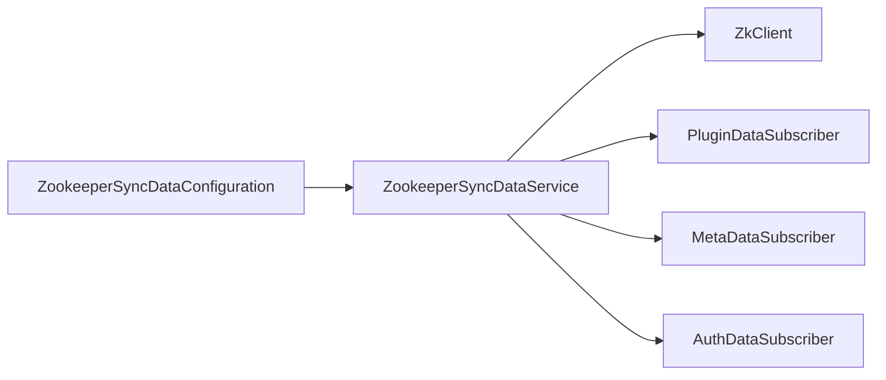
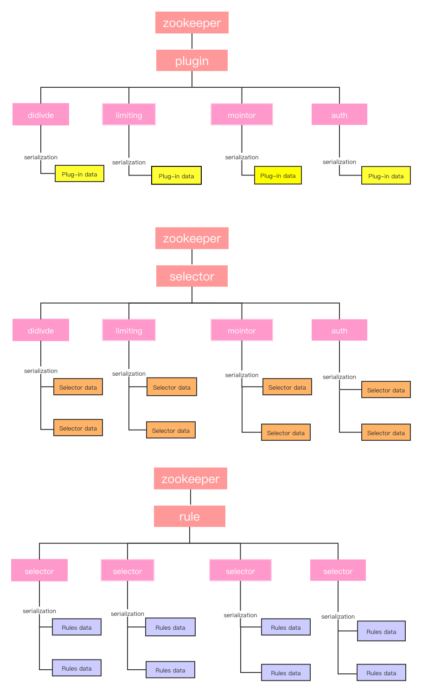
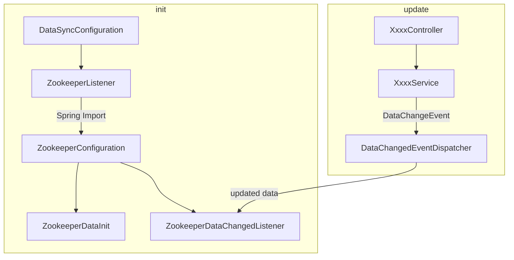

# soul源码分析数据同步篇之zookeeper同步流程


## 说明 

本文代码基于`soul` 2021.2.4 master分支版本。

## 准备

请先阅读`soul`官方文档 [数据同步原理](https://dromara.org/zh-cn/docs/soul/dataSync.html)，对`soul`数据同步原理有个基本的了解。

## 如何开启zookeeper同步策略

### soul-admin的配置

`application.yml`中添加如下配置，或是在启动参数中添加`--soul.sync.zookeeper.url=你的zk地址`，然后重启服务：

```yaml
soul:
  sync:
    zookeeper:
        url: localhost:2181
        sessionTimeout: 5000
        connectionTimeout: 2000
```

### soul-bootstrap的配置

引入如下依赖：

```xml
   <!--soul data sync start use zookeeper-->
     <dependency>
          <groupId>org.dromara</groupId>
           <artifactId>soul-spring-boot-starter-sync-data-zookeeper</artifactId>
           <version>${last.version}</version>
     </dependency>
```

然后修改配置文件，开启zk配置：

```yaml
soul:
    file:
      enabled: true
    corss:
      enabled: true
    dubbo :
      parameter: multi
    sync:
#        websocket :
#             urls: ws://localhost:9095/websocket
        zookeeper:
        	# 此处替换为你的zk地址，集群使用逗号隔开
             url: localhost:2181
             sessionTimeout: 5000
             connectionTimeout: 2000
```

重启`soul-bootstrap`即可。

## zookeeper同步流程源码分析

### soul-bootstrap源码分析

#### 从日志分析

先看`soul-bootstrap`的启动日志：

```java
......
2021-01-28 16:22:43.490  INFO 8552 --- [           main] s.b.s.d.z.ZookeeperSyncDataConfiguration : you use zookeeper sync soul data.......
2021-01-28 16:22:43.498  INFO 8552 --- [-localhost:2181] org.I0Itec.zkclient.ZkEventThread        : Starting ZkClient event thread.
2021-01-28 16:22:43.508  INFO 8552 --- [           main] org.apache.zookeeper.ZooKeeper           : Client environment:zookeeper.version=3.5.6-c11b7e26bc554b8523dc929761dd28808913f091, built on 10/08/2019 20:18 GMT
.......
.......
2021-01-28 16:22:43.510  INFO 8552 --- [           main] org.apache.zookeeper.ZooKeeper           : Client environment:os.memory.total=220MB
2021-01-28 16:22:43.517  INFO 8552 --- [           main] org.apache.zookeeper.ZooKeeper           : Initiating client connection, connectString=localhost:2181 sessionTimeout=5000 watcher=org.I0Itec.zkclient.ZkClient@72ee5d84
2021-01-28 16:22:43.522  INFO 8552 --- [           main] org.apache.zookeeper.common.X509Util     : Setting -D jdk.tls.rejectClientInitiatedRenegotiation=true to disable client-initiated TLS renegotiation
2021-01-28 16:22:43.538  INFO 8552 --- [           main] org.apache.zookeeper.ClientCnxnSocket    : jute.maxbuffer value is 4194304 Bytes
2021-01-28 16:22:43.545  INFO 8552 --- [           main] org.apache.zookeeper.ClientCnxn          : zookeeper.request.timeout value is 0. feature enabled=
2021-01-28 16:22:43.545  INFO 8552 --- [           main] org.I0Itec.zkclient.ZkClient             : Waiting for keeper state SyncConnected
2021-01-28 16:22:43.553  INFO 8552 --- [localhost:2181)] org.apache.zookeeper.ClientCnxn          : Opening socket connection to server localhost/127.0.0.1:2181. Will not attempt to authenticate using SASL (unknown error)
2021-01-28 16:22:43.556  INFO 8552 --- [localhost:2181)] org.apache.zookeeper.ClientCnxn          : Socket connection established, initiating session, client: /127.0.0.1:12406, server: localhost/127.0.0.1:2181
2021-01-28 16:22:43.574  INFO 8552 --- [localhost:2181)] org.apache.zookeeper.ClientCnxn          : Session establishment complete on server localhost/127.0.0.1:2181, sessionid = 0x100001b2cd70002, negotiated timeout = 5000
2021-01-28 16:22:43.578  INFO 8552 --- [ain-EventThread] org.I0Itec.zkclient.ZkClient             : zookeeper state changed (SyncConnected)
......
```

此处相对就好看一些，从`ZookeeperSyncDataConfiguration : you use zookeeper sync soul data`这条日志直接可以定位到`soul-bootstrap`中的启动过程中使用`zookeeper`的位置:

```java
@Configuration
//ZookeeperSyncDataService存在时，才会实例化ZookeeperSyncDataConfiguration
@ConditionalOnClass(ZookeeperSyncDataService.class)
//配置了soul.sync.zookeeper.url属性，才会实例化ZookeeperSyncDataConfiguration
@ConditionalOnProperty(prefix = "soul.sync.zookeeper", name = "url")
//属性将放到ZookeeperConfig中，方便使用
@EnableConfigurationProperties(ZookeeperConfig.class)
@Slf4j
public class ZookeeperSyncDataConfiguration {
	//初始化ZookeeperSyncDataService
    @Bean
    public SyncDataService syncDataService(final ObjectProvider<ZkClient> zkClient, final ObjectProvider<PluginDataSubscriber> pluginSubscriber,
                                           final ObjectProvider<List<MetaDataSubscriber>> metaSubscribers, final ObjectProvider<List<AuthDataSubscriber>> authSubscribers) {
        log.info("you use zookeeper sync soul data.......");
        return new ZookeeperSyncDataService(zkClient.getIfAvailable(), pluginSubscriber.getIfAvailable(),
                metaSubscribers.getIfAvailable(Collections::emptyList), authSubscribers.getIfAvailable(Collections::emptyList));
    }

    //初始化zookeeper客户端
    @Bean
    public ZkClient zkClient(final ZookeeperConfig zookeeperConfig) {
        return new ZkClient(zookeeperConfig.getUrl(), zookeeperConfig.getSessionTimeout(), zookeeperConfig.getConnectionTimeout());
    }
}
```

明显主要逻辑在`ZookeeperSyncDataService`中，此处截取一部分代码：

```java
public class ZookeeperSyncDataService implements SyncDataService, AutoCloseable {
    ......
        
    public ZookeeperSyncDataService(final ZkClient zkClient, final PluginDataSubscriber pluginDataSubscriber,
                                    final List<MetaDataSubscriber> metaDataSubscribers, final List<AuthDataSubscriber> authDataSubscribers) {
        this.zkClient = zkClient;
        //引入插件、元数据、权限相关的订阅者
        this.pluginDataSubscriber = pluginDataSubscriber;
        this.metaDataSubscribers = metaDataSubscribers;
        this.authDataSubscribers = authDataSubscribers;
        watcherData();
        watchAppAuth();
        watchMetaData();
    }
    
    /*
    监听插件在zk中对应的数据。如果zk中对应节点不存在，则先创建。
    */
    private void watcherData() {
        //查阅
        final String pluginParent = ZkPathConstants.PLUGIN_PARENT;
        List<String> pluginZKs = zkClientGetChildren(pluginParent);
        for (String pluginName : pluginZKs) {
            watcherAll(pluginName);
        }
        zkClient.subscribeChildChanges(pluginParent, (parentPath, currentChildren) -> {
            if (CollectionUtils.isNotEmpty(currentChildren)) {
                for (String pluginName : currentChildren) {
                    watcherAll(pluginName);
                }
            }
        });
    }
    
    private void watcherAll(final String pluginName) {
        watcherPlugin(pluginName);
        watcherSelector(pluginName);
        watcherRule(pluginName);
    }
    
    /*
    主要工作如下
    */
    private void watcherPlugin(final String pluginName) {
        String pluginPath = ZkPathConstants.buildPluginPath(pluginName);
        //如果zk中没有对应路径，则创建一个zk持久节点。
        if (!zkClient.exists(pluginPath)) {
            zkClient.createPersistent(pluginPath, true);
        }
        //最终会调用pluginDataSubscriber.onSubscribe(pluginPath)，作为缓存
        cachePluginData(zkClient.readData(pluginPath));
        //调用zk客户端接口，监听zk中pluginPath节点的数据变化。
        subscribePluginDataChanges(pluginPath, pluginName);
    }
    
    /*
    watcherSelector
    watcherRule都是类似的，略。
    
    */
    ......
}
```

接下来就有一个问题，`ZookeeperSyncDataService`实例化时我们看到需要给构造方法传入`PluginDataSubscriber`等订阅者，我们知道`Spring`在识别到这个参数声明时，会将对应类型的对象注入进来，但这几个订阅者何时实例化这种细节留待后续分析。

#### soul-boostrap整体流程

综合上述分析，结合`soul-bootstrap`项目整体结构，可以看到是`soul-bootstrap`模块集成了`soul-spring-boot-starter-sync-data-zookeeper`模块，该模块又集成了`soul-sync-data-zookeeper`，即整体依赖关系：

```
soul-bootstrap
	|_ soul-spring-boot-starter-sync-data-zookeeper
		|_ soul-sync-data-zookeeper
```

而`soul-sync-data-zookeeper`会利用`@Configuration`初始化`zookeeper`同步相关的对象，这个逻辑在`ZookeeperSyncDataConfiguration`中。而`ZookeeperSyncDataConfiguration`会利用配置文件中的属性判断是否要初始化相关对象，如果已配置了`zookeeper`同步相关的属性，就会创建`zookeeper`客户端，监听`zookeeper`相关节点，监听主要利用`zookeeper`的watch机制。

涉及到的相关类：



在`zookeeper`中数据的结构可以参考`soul`官网 https://dromara.org/zh/projects/soul/data-sync/ ，示意图（引自官网）如下：




### soul-admin源码分析

#### 从日志分析

首先，还是看日志信息：

`soul-admin`启动日志中，有关`zookeeper`的部分：

```java
......
2021-01-28 16:20:40.893  INFO 14776 --- [-localhost:2181] org.I0Itec.zkclient.ZkEventThread        : Starting ZkClient event thread.
2021-01-28 16:20:40.902  INFO 14776 --- [           main] org.apache.zookeeper.ZooKeeper           : Client environment:zookeeper.version=3.5.6-c11b7e26bc554b8523dc929761dd28808913f091, built on 10/08/2019 20:18 GMT
......
......
2021-01-28 16:20:40.904  INFO 14776 --- [           main] org.apache.zookeeper.ZooKeeper           : Client environment:os.memory.free=273MB
2021-01-28 16:20:40.904  INFO 14776 --- [           main] org.apache.zookeeper.ZooKeeper           : Client environment:os.memory.max=3620MB
2021-01-28 16:20:40.904  INFO 14776 --- [           main] org.apache.zookeeper.ZooKeeper           : Client environment:os.memory.total=417MB
2021-01-28 16:20:40.908  INFO 14776 --- [           main] org.apache.zookeeper.ZooKeeper           : Initiating client connection, connectString=localhost:2181 sessionTimeout=5000 watcher=org.I0Itec.zkclient.ZkClient@7a388990
2021-01-28 16:20:40.911  INFO 14776 --- [           main] org.apache.zookeeper.common.X509Util     : Setting -D jdk.tls.rejectClientInitiatedRenegotiation=true to disable client-initiated TLS renegotiation
2021-01-28 16:20:40.925  INFO 14776 --- [           main] org.apache.zookeeper.ClientCnxnSocket    : jute.maxbuffer value is 4194304 Bytes
2021-01-28 16:20:40.930  INFO 14776 --- [           main] org.apache.zookeeper.ClientCnxn          : zookeeper.request.timeout value is 0. feature enabled=
2021-01-28 16:20:40.931  INFO 14776 --- [           main] org.I0Itec.zkclient.ZkClient             : Waiting for keeper state SyncConnected
Thu Jan 28 16:20:40 CST 2021 WARN: Establishing SSL connection without server's identity verification is not recommended. According to MySQL 5.5.45+, 5.6.26+ and 5.7.6+ requirements SSL connection must be established by default if explicit option isn't set. For compliance with existing applications not using SSL the verifyServerCertificate property is set to 'false'. You need either to explicitly disable SSL by setting useSSL=false, or set useSSL=true and provide truststore for server certificate verification.
2021-01-28 16:20:40.938  INFO 14776 --- [localhost:2181)] org.apache.zookeeper.ClientCnxn          : Opening socket connection to server localhost/127.0.0.1:2181. Will not attempt to authenticate using SASL (unknown error)
2021-01-28 16:20:40.940  INFO 14776 --- [localhost:2181)] org.apache.zookeeper.ClientCnxn          : Socket connection established, initiating session, client: /127.0.0.1:12309, server: localhost/127.0.0.1:2181
2021-01-28 16:20:40.950  INFO 14776 --- [localhost:2181)] org.apache.zookeeper.ClientCnxn          : Session establishment complete on server localhost/127.0.0.1:2181, sessionid = 0x100001b2cd70001, negotiated timeout = 5000
2021-01-28 16:20:40.953  INFO 14776 --- [ain-EventThread] org.I0Itec.zkclient.ZkClient             : zookeeper state changed (SyncConnected)
......
```

看不出什么名堂，看上去都是一些`zookeeper`客户端的日志输出。

#### 从soul-admin初始化过程分析

`soul-admin`初始化类`DataSyncConfiguration`（从包名一般能猜到，初始化相关代码一般都会放到`config`包里，如果你没有这样做，得反思一下~.~），可以看到涉及`zookeeper`同步的代码如下：

```java
@Configuration
public class DataSyncConfiguration {
    ......
        
	@Configuration
    @ConditionalOnProperty(prefix = "soul.sync.zookeeper", name = "url")
    @Import(ZookeeperConfiguration.class)
    static class ZookeeperListener {
	
        @Bean
        @ConditionalOnMissingBean(ZookeeperDataChangedListener.class)
        public DataChangedListener zookeeperDataChangedListener(final ZkClient zkClient) {
            return new ZookeeperDataChangedListener(zkClient);
        }

        @Bean
        @ConditionalOnMissingBean(ZookeeperDataInit.class)
        public ZookeeperDataInit zookeeperDataInit(final ZkClient zkClient, final SyncDataService syncDataService){
            return new ZookeeperDataInit(zkClient, syncDataService);
        }
    }
    ......
}
```

可以看到只有配置了`soul.sync.zookeeper`属性，才会实例化`ZookeeperListener`， 而`ZookeeperListener`又依赖于`ZookeeperConfiguration`，`ZookeeperConfiguration`只是根据配置文件中的`zookeeper`地址、session超时时间、连接超时时间创建出一个`zkClient`供后续调用。

继续分析，`ZookeeperListener`中创建的`ZookeeperDataInit`，看源码可以发现，该类利用了`Spring Boot`的`CommandLineRunner`接口，当所有对象初始化之后，将会初始化插件、权限、元数据在`zookeeper`中的路径，同时判断`zookeeper`中对应路径中是否存在节点，如果插件、权限、元数据这3者对应的节点都不存在，则进行一次全量同步操作(` syncDataService.syncAll`)：

```java
public class ZookeeperDataInit implements CommandLineRunner {
   
    private final ZkClient zkClient;
    private final SyncDataService syncDataService;
    ......

    @Override
    public void run(final String... args) {
        String pluginPath = ZkPathConstants.PLUGIN_PARENT;
        String authPath = ZkPathConstants.APP_AUTH_PARENT;
        String metaDataPath = ZkPathConstants.META_DATA;
        //zk中没有对应节点，则进行全量同步操作、更新到zk中
        if (!zkClient.exists(pluginPath) && !zkClient.exists(authPath) && !zkClient.exists(metaDataPath)) {
            syncDataService.syncAll(DataEventTypeEnum.REFRESH);
        }
    }
    ......
}

```

全量同步方法会从数据库读取插件、权限、元数据，将其利用`Spring Event`机制发布出去：

```java
@Service("syncDataService")
public class SyncDataServiceImpl implements SyncDataService {
    ......
    @Override
    public boolean syncAll(final DataEventTypeEnum type) {
        appAuthService.syncData();
        List<PluginData> pluginDataList = pluginService.listAll();
        eventPublisher.publishEvent(new DataChangedEvent(ConfigGroupEnum.PLUGIN, type, pluginDataList));
        List<SelectorData> selectorDataList = selectorService.listAll();
        eventPublisher.publishEvent(new DataChangedEvent(ConfigGroupEnum.SELECTOR, type, selectorDataList));
        List<RuleData> ruleDataList = ruleService.listAll();
        eventPublisher.publishEvent(new DataChangedEvent(ConfigGroupEnum.RULE, type, ruleDataList));
        metaDataService.syncData();
        return true;
    }
    ......
}
```

`ZookeeperListener`中创建的另一个对象，`ZookeeperDataChangedListener`将根据上面的数据更新时间，更新`zookeeper`中的数据：

```java
public class ZookeeperDataChangedListener implements DataChangedListener {

    private final ZkClient zkClient;
	......

    @Override
    public void onAppAuthChanged(final List<AppAuthData> changed, final DataEventTypeEnum eventType) {
        ......
    }

    @SneakyThrows
    @Override
    public void onMetaDataChanged(final List<MetaData> changed, final DataEventTypeEnum eventType) {
		......
    }

    @Override
    public void onPluginChanged(final List<PluginData> changed, final DataEventTypeEnum eventType) {
    	......
    }

    @Override
    public void onSelectorChanged(final List<SelectorData> changed, final DataEventTypeEnum eventType) {
    }

    @Override
    public void onRuleChanged(final List<RuleData> changed, final DataEventTypeEnum eventType) {
       	......
    }
    ......
}
```

当然，此处看上去这个`ZookeeperDataChangedListener`好像并没有监听`DataChangedEvent`这个事件，但我们找找`DataChangedEvent`的引用关系，可以发现是`DataChangedEventDispatcher`这个类在监听事件、然后将该事件分发给对应的listener。此处逻辑可以参考上一篇[soul源码分析数据同步篇之WebSocket同步流程](https://blog.csdn.net/evasnowind/article/details/113333185) 。

至此我们基本将`soul-admin`整体流程串起来了。

#### soul-admin整体流程

首先再小结下初始化过程，涉及到的类如下图所示，其中`ZookeeperConfiguration`利用`Spring Import`机制先执行、创建出`zkClient`之后，然后`ZookeeperDataInit`才能实例化。

数据更新时，利用`Spring Event`机制，需要更新数据时只需要发布一个`DataChangeEvent`即可，该事件将会由`DataChangedEventDispatcher`统一处理，`DataChangedEventDispatcher`将会根据事件中的更新类型，调用对应`listener`，在`zookeeper`同步这里就是调用`ZookeeperDataChangedListener`对应的方法进行处理。



## 总结

主要介绍了`soul`利用`zookeeper`同步数据的原理，包括：

- soul-bootstrap初始化zk客户端，监听zk, 如何更新
- soul-admin初始化客户端，数据同步到zk的实现流程

## 参考资料

- soul官方资料-数据同步设计 https://dromara.org/zh/projects/soul/data-sync/

