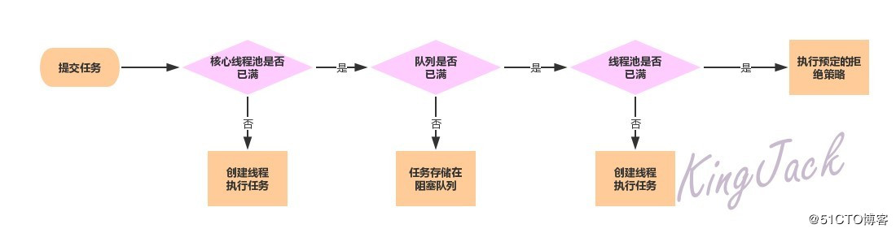

# Tomcat/dubbo对于JDK线程池的修改

## 预备知识

- 计算任务的分类

  - CPU密集型：需要线程长时间进行的复杂的运算，这种类型的任务需要少创建线程，过多的线程将会频繁引起上文切换，降低任务处理处理速度。
  - IO密集型：由于线程并不是一直在运行，可能大部分时间在等待 IO 读取/写入数据，增加线程数量可以提高并发度，尽可能多处理任务。

- JDK线程池，`java.util.concurrent.ThreadPoolExecutor` 传说中的7个参数，作用，线程池运行机制，参见下图复习

  


## 概述 

结合ThreadPoolExecutor的运行过程，可以知道ThreadPoolExecutor主要倾向于CPU密集型任务，但对于对于 `io` 密集型任务，如数据库查询，rpc 请求调用等，就不是很友好。

由于 Tomcat/Jetty 需要处理大量客户端请求任务，如果采用原生线程池，一旦接受请求数量大于线程池核心线程数，这些请求就会被放入到队列中，等待核心线程处理。这样做显然降低这些请求总体处理速度，所以两者都没采用 JDK 原生线程池。

Jetty选择自己实现线程池组件，可以定制化开发，但难度较大，而Tomcat选择扩展ThreadPoolExecutor，相对比较简单。

## Tomcat线程池源码分析  

Tomcat源码中，为扩展线程池，主要修改了：

- 自定义ThreadPoolExecutor，直接继承JDK的ThreadPoolExecutor，重写部分逻辑
- 实现TaskQueue，直接继承`LinkedBlockingQueue` ，重写 `offer` 方法。

### ThreadPoolExecutor

线程池核心方法execute()，Tomcat简单做了修改，还是将工作任务交给父类，也就是Java原生线程池处理，但增加了一个重试策略。如果原生线程池执行拒绝策略的情况，抛出 `RejectedExecutionException` 异常。这里将会捕获，然后重新再次尝试将任务加入到 `TaskQueue` ，尽最大可能执行任务。

```java
public void execute(Runnable command, long timeout, TimeUnit unit) {
        this.submittedCount.incrementAndGet();

        try {
            super.execute(command);
        } catch (RejectedExecutionException var9) {
            if (!(super.getQueue() instanceof TaskQueue)) {
                this.submittedCount.decrementAndGet();
                throw var9;
            }

            TaskQueue queue = (TaskQueue)super.getQueue();

            try {
                //拒绝后，再尝试入队，还不行则抛出异常
                if (!queue.force(command, timeout, unit)) {
                    this.submittedCount.decrementAndGet();
                    throw new RejectedExecutionException(sm.getString("threadPoolExecutor.queueFull"));
                }
            } catch (InterruptedException var8) {
                this.submittedCount.decrementAndGet();
                throw new RejectedExecutionException(var8);
            }
        }
    }
```


需要注意 `submittedCount` 变量。这是 Tomcat 线程池内部一个重要的参数，它是一个 `AtomicInteger` 变量，将会实时统计已经提交到线程池中，但还没有执行结束的任务。也就是说 `submittedCount` 等于线程池队列中的任务数加上线程池工作线程正在执行的任务。

### TaskQueue


```java

public class TaskQueue extends LinkedBlockingQueue<Runnable> {
	......
        //tomcat-util-10.0.0-M6.jar
    public boolean offer(Runnable o) {
        if (this.parent == null) {
            //1.若没有给出tomcat线程池对象，则调用父类方法
            return super.offer(o);
        } else if (this.parent.getPoolSize() == this.parent.getMaximumPoolSize()) {
            //2.若当前线程数已达到最大线程数，则放入阻塞队列
            return super.offer(o);
        } else if (this.parent.getSubmittedCount() <= this.parent.getPoolSize()) {
            //3.若当前已提交任务数量小于等于最大线程数，说明此时有空闲线程。此时将任务放入队列中，立刻会有空闲线程来处理该任务
            return super.offer(o);
        } else {
            //4.若当前线程数小于最大线程数，发返回false，此时线程池将会创建新线程！！！
            return this.parent.getPoolSize() < this.parent.getMaximumPoolSize() ? false : super.offer(o);
        }
    }
}

```

核心在最后一个三元判断中，这里需要结合Java的ThreadPoolExecutor一起看：

```java

 public void execute(Runnable command) {
        if (command == null)
            throw new NullPointerException();
        /*
         * Proceed in 3 steps:
         *
         * 1. If fewer than corePoolSize threads are running, try to
         * start a new thread with the given command as its first
         * task.  The call to addWorker atomically checks runState and
         * workerCount, and so prevents false alarms that would add
         * threads when it shouldn't, by returning false.
         *
         * 2. If a task can be successfully queued, then we still need
         * to double-check whether we should have added a thread
         * (because existing ones died since last checking) or that
         * the pool shut down since entry into this method. So we
         * recheck state and if necessary roll back the enqueuing if
         * stopped, or start a new thread if there are none.
         *
         * 3. If we cannot queue task, then we try to add a new
         * thread.  If it fails, we know we are shut down or saturated
         * and so reject the task.
         */
        int c = ctl.get();
        if (workerCountOf(c) < corePoolSize) {
            if (addWorker(command, true))
                return;
            c = ctl.get();
        }
     	//如果阻塞队列返回false，将会走else分支，去创建新的线程
        if (isRunning(c) && workQueue.offer(command)) {
            int recheck = ctl.get();
            if (! isRunning(recheck) && remove(command))
                reject(command);
            else if (workerCountOf(recheck) == 0)
                addWorker(null, false);
        }
        else if (!addWorker(command, false))
            reject(command);
    }
```

由此，即可看出Tomcat通过扩展的方式改变了线程池运行机制。


## Dubbo线程池源码分析

dubbo中也采用了与Tomcat一样的思路去修改Java线程池，可以参考源码中的EagerThreadPool，也是同样的修改：

- 自定义ThreadPoolExecutor，直接继承JDK的ThreadPoolExecutor，重写部分逻辑
- 实现TaskQueue，直接继承`LinkedBlockingQueue` ，重写 `offer` 方法。

`EagerThreadPoolExecutor`源码总共就这么一丢丢，重写的逻辑是：

- execute方法添加一次重试
- 加上有关`submittedTaskCount`这个变量的维护，该变量表示当前正在被执行的任务数量

```java
public class EagerThreadPoolExecutor extends ThreadPoolExecutor {

    /**
     * task count
     */
    private final AtomicInteger submittedTaskCount = new AtomicInteger(0);

    public EagerThreadPoolExecutor(int corePoolSize,
                                   int maximumPoolSize,
                                   long keepAliveTime,
                                   TimeUnit unit, TaskQueue<Runnable> workQueue,
                                   ThreadFactory threadFactory,
                                   RejectedExecutionHandler handler) {
        super(corePoolSize, maximumPoolSize, keepAliveTime, unit, workQueue, threadFactory, handler);
    }

    /**
     * @return current tasks which are executed
     */
    public int getSubmittedTaskCount() {
        return submittedTaskCount.get();
    }

    @Override
    protected void afterExecute(Runnable r, Throwable t) {
        submittedTaskCount.decrementAndGet();
    }

    @Override
    public void execute(Runnable command) {
        if (command == null) {
            throw new NullPointerException();
        }
        // do not increment in method beforeExecute!
        submittedTaskCount.incrementAndGet();
        try {
            super.execute(command);
        } catch (RejectedExecutionException rx) {
            // retry to offer the task into queue.
            final TaskQueue queue = (TaskQueue) super.getQueue();
            try {
                if (!queue.retryOffer(command, 0, TimeUnit.MILLISECONDS)) {
                    submittedTaskCount.decrementAndGet();
                    throw new RejectedExecutionException("Queue capacity is full.", rx);
                }
            } catch (InterruptedException x) {
                submittedTaskCount.decrementAndGet();
                throw new RejectedExecutionException(x);
            }
        } catch (Throwable t) {
            // decrease any way
            submittedTaskCount.decrementAndGet();
            throw t;
        }
    }
}
```


`TaskQueue`同样是继承自`LinkedBlockingQueue`，也只是改了一丢丢：

```java
public class TaskQueue<R extends Runnable> extends LinkedBlockingQueue<Runnable> {

    private static final long serialVersionUID = -2635853580887179627L;

    private EagerThreadPoolExecutor executor;

    public TaskQueue(int capacity) {
        super(capacity);
    }

    public void setExecutor(EagerThreadPoolExecutor exec) {
        executor = exec;
    }

    @Override
    public boolean offer(Runnable runnable) {
        if (executor == null) {
            throw new RejectedExecutionException("The task queue does not have executor!");
        }

        int currentPoolThreadSize = executor.getPoolSize();
        // have free worker. put task into queue to let the worker deal with task.
        if (executor.getSubmittedTaskCount() < currentPoolThreadSize) {
            return super.offer(runnable);
        }

        // return false to let executor create new worker.
        if (currentPoolThreadSize < executor.getMaximumPoolSize()) {
            return false;
        }

        // currentPoolThreadSize >= max
        return super.offer(runnable);
    }

    /**
     * retry offer task
     *
     * @param o task
     * @return offer success or not
     * @throws RejectedExecutionException if executor is terminated.
     */
    public boolean retryOffer(Runnable o, long timeout, TimeUnit unit) throws InterruptedException {
        if (executor.isShutdown()) {
            throw new RejectedExecutionException("Executor is shutdown!");
        }
        return super.offer(o, timeout, unit);
    }
}
```

重点还是在offer方法的实现，开发者都写了注释，我就不废话了 :) 真的是和tomcat一毛一样的思路。

收工。


## 参考资料  

- [原生线程池这么强大，Tomcat 为何还需扩展线程池？](https://zhuanlan.zhihu.com/p/94679167)


