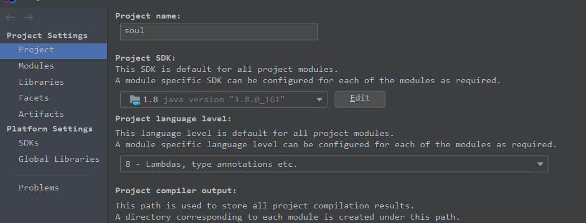
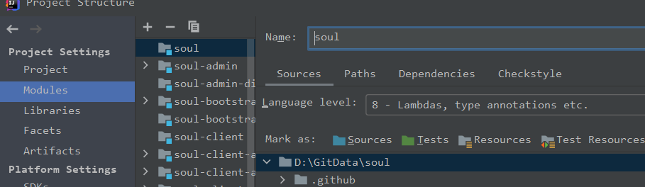

## 源码分析之API网关soul（1）阅读源码的准备


## 目标

- fork代码
- 本地编译成功
- 启动网关

## fork代码

github fork到自己的repo，然后在本地：

> git clone https://github.com/evasnowind/soul
>
> cd soul
>
> git fetch origin 2.2.1:2.2.1
>
> git checkout 2.2.1 

由于目前master分支在不断迭代、开发中，个人建议可以先拉取一个稳定的版本，方便阅读。我个人的话目前使用的master最新代码（截止到2021.1.15），因此本文以及后续文章主要针对目前master分支代码。

## 本地编译

可以使用如下命令，跳过单元测试、加快编译：

```shell
mvn clean install -Dmaven.test.skip=true -Dmaven.javadoc.skip=true -Drat.skip=true -Dcheckstyle.skip=true
```

编译成功如果是用IDEA，注意检查IDEA所用的JDK版本，需要检查`Project Structure`中的`Project`和`Modules`：



  

如果高于JDK，可能会报`Caused by: java.lang.NoClassDefFoundError: org/w3c/dom/ls/DocumentLS`异常。

## 启动网关

soul网关需要启动2个模块：soul-admin, soul-boostrap，前者管理元数据，后者是实际的网关模块。

- 先启动soul-admin
  - 进入soul-admin模块，修改启动配置：
    - 主要需要修改application.yml中数据库配置，只要改为你的数据库地址、账号、密码即可。注意不用自己执行soul的数据库脚本，在启动时soul-admin将自己运行该脚本，执行创建数据库、创建表等操作。
  - 运行SoulAdminBootstrap即可。
- 然后启动soul-boostrap
  - 进入soul-boostrap模块
  - 运行SoulBootstrapApplication即可。

如果上述启动时遇到端口冲突，注意两个模块需要同步修改、保证两边一致。

`soul-admin`运行成功日志效果如下：

```text
2021-01-15 23:17:09.937  INFO 16320 --- [           main] o.s.b.a.w.s.WelcomePageHandlerMapping    : Adding welcome page: class path resource [static/index.html]
2021-01-15 23:17:11.029  INFO 16320 --- [           main] d.s.w.p.DocumentationPluginsBootstrapper : Context refreshed
2021-01-15 23:17:11.070  INFO 16320 --- [           main] d.s.w.p.DocumentationPluginsBootstrapper : Found 1 custom documentation plugin(s)
2021-01-15 23:17:11.175  INFO 16320 --- [           main] s.d.s.w.s.ApiListingReferenceScanner     : Scanning for api listing references
2021-01-15 23:17:11.613  INFO 16320 --- [           main] .d.s.w.r.o.CachingOperationNameGenerator : Generating unique operation named: batchEnabledUsingPOST_1
2021-01-15 23:17:11.630  INFO 16320 --- [           main] .d.s.w.r.o.CachingOperationNameGenerator : Generating unique operation named: syncDataUsingPOST_1
2021-01-15 23:17:11.705  INFO 16320 --- [           main] .d.s.w.r.o.CachingOperationNameGenerator : Generating unique operation named: detailRuleUsingGET_1
2021-01-15 23:17:11.744  INFO 16320 --- [           main] .d.s.w.r.o.CachingOperationNameGenerator : Generating unique operation named: batchEnabledUsingPOST_2
2021-01-15 23:17:11.757  INFO 16320 --- [           main] .d.s.w.r.o.CachingOperationNameGenerator : Generating unique operation named: detailUsingGET_1
2021-01-15 23:17:11.879  INFO 16320 --- [           main] o.s.b.w.embedded.tomcat.TomcatWebServer  : Tomcat started on port(s): 19095 (http) with context path ''
2021-01-15 23:17:11.889  INFO 16320 --- [           main] o.dromara.soul.admin.SoulAdminBootstrap  : Started SoulAdminBootstrap in 14.366 seconds (JVM running for 18.608)
2021-01-15 23:17:18.438  INFO 16320 --- [)-192.168.1.104] o.a.c.c.C.[Tomcat].[localhost].[/]       : Initializing Spring DispatcherServlet 'dispatcherServlet'
2021-01-15 23:17:18.438  INFO 16320 --- [)-192.168.1.104] o.s.web.servlet.DispatcherServlet        : Initializing Servlet 'dispatcherServlet'
2021-01-15 23:17:18.475  INFO 16320 --- [)-192.168.1.104] o.s.web.servlet.DispatcherServlet        : Completed initialization in 36 ms
```

`soul-bootstrap`运行成功日志如下：

```text
2021-01-15 23:19:02.362  INFO 25800 --- [           main] org.dromara.soul.web.logo.SoulLogo       : 


                 _  
                | | 
 ___  ___  _   _| | 
/ __|/ _ \| | | | |
\__ \ (_) | |_| | |
|___/\___/ \__,_|_|
                    
                   

 :: Soul :: (v2.0.2)


  .   ____          _            __ _ _
 /\\ / ___'_ __ _ _(_)_ __  __ _ \ \ \ \
( ( )\___ | '_ | '_| | '_ \/ _` | \ \ \ \
 \\/  ___)| |_)| | | | | || (_| |  ) ) ) )
  '  |____| .__|_| |_|_| |_\__, | / / / /
 =========|_|==============|___/=/_/_/_/
 :: Spring Boot ::        (v2.2.2.RELEASE)

2021-01-15 23:19:02.696  INFO 25800 --- [           main] o.d.s.b.SoulBootstrapApplication         : Starting SoulBootstrapApplication on BR-IT-A00639 with PID 25800 (D:\GitData\soul\soul-bootstrap\target\classes started by chenglong.yu in D:\GitData\soul)
2021-01-15 23:19:02.697  INFO 25800 --- [           main] o.d.s.b.SoulBootstrapApplication         : The following profiles are active: local
2021-01-15 23:19:05.744  INFO 25800 --- [           main] .s.d.r.c.RepositoryConfigurationDelegate : Multiple Spring Data modules found, entering strict repository configuration mode!
2021-01-15 23:19:05.751  INFO 25800 --- [           main] .s.d.r.c.RepositoryConfigurationDelegate : Bootstrapping Spring Data Redis repositories in DEFAULT mode.
2021-01-15 23:19:05.837  INFO 25800 --- [           main] .s.d.r.c.RepositoryConfigurationDelegate : Finished Spring Data repository scanning in 39ms. Found 0 Redis repository interfaces.
2021-01-15 23:19:10.048  INFO 25800 --- [           main] o.d.s.w.configuration.SoulConfiguration  : load plugin:[global] [org.dromara.soul.plugin.global.GlobalPlugin]
2021-01-15 23:19:10.049  INFO 25800 --- [           main] o.d.s.w.configuration.SoulConfiguration  : load plugin:[sign] [org.dromara.soul.plugin.sign.SignPlugin]
2021-01-15 23:19:10.049  INFO 25800 --- [           main] o.d.s.w.configuration.SoulConfiguration  : load plugin:[waf] [org.dromara.soul.plugin.waf.WafPlugin]
2021-01-15 23:19:10.049  INFO 25800 --- [           main] o.d.s.w.configuration.SoulConfiguration  : load plugin:[rate_limiter] [org.dromara.soul.plugin.ratelimiter.RateLimiterPlugin]
2021-01-15 23:19:10.049  INFO 25800 --- [           main] o.d.s.w.configuration.SoulConfiguration  : load plugin:[hystrix] [org.dromara.soul.plugin.hystrix.HystrixPlugin]
2021-01-15 23:19:10.049  INFO 25800 --- [           main] o.d.s.w.configuration.SoulConfiguration  : load plugin:[resilience4j] [org.dromara.soul.plugin.resilience4j.Resilience4JPlugin]
2021-01-15 23:19:10.049  INFO 25800 --- [           main] o.d.s.w.configuration.SoulConfiguration  : load plugin:[divide] [org.dromara.soul.plugin.divide.DividePlugin]
2021-01-15 23:19:10.049  INFO 25800 --- [           main] o.d.s.w.configuration.SoulConfiguration  : load plugin:[webClient] [org.dromara.soul.plugin.httpclient.WebClientPlugin]
2021-01-15 23:19:10.050  INFO 25800 --- [           main] o.d.s.w.configuration.SoulConfiguration  : load plugin:[divide] [org.dromara.soul.plugin.divide.websocket.WebSocketPlugin]
2021-01-15 23:19:10.050  INFO 25800 --- [           main] o.d.s.w.configuration.SoulConfiguration  : load plugin:[alibaba-dubbo-body-param] [org.dromara.soul.plugin.alibaba.dubbo.param.BodyParamPlugin]
2021-01-15 23:19:10.050  INFO 25800 --- [           main] o.d.s.w.configuration.SoulConfiguration  : load plugin:[dubbo] [org.dromara.soul.plugin.alibaba.dubbo.AlibabaDubboPlugin]
2021-01-15 23:19:10.050  INFO 25800 --- [           main] o.d.s.w.configuration.SoulConfiguration  : load plugin:[monitor] [org.dromara.soul.plugin.monitor.MonitorPlugin]
2021-01-15 23:19:10.050  INFO 25800 --- [           main] o.d.s.w.configuration.SoulConfiguration  : load plugin:[response] [org.dromara.soul.plugin.alibaba.dubbo.response.DubboResponsePlugin]
2021-01-15 23:19:10.050  INFO 25800 --- [           main] o.d.s.w.configuration.SoulConfiguration  : load plugin:[response] [org.dromara.soul.plugin.httpclient.response.WebClientResponsePlugin]
2021-01-15 23:19:10.407  INFO 25800 --- [           main] b.s.s.d.w.WebsocketSyncDataConfiguration : you use websocket sync soul data.......
2021-01-15 23:19:10.776  INFO 25800 --- [           main] o.d.s.p.s.d.w.WebsocketSyncDataService   : websocket connection is successful.....
2021-01-15 23:19:11.022  INFO 25800 --- [           main] o.s.b.a.e.web.EndpointLinksResolver      : Exposing 2 endpoint(s) beneath base path '/actuator'
2021-01-15 23:19:14.597  INFO 25800 --- [           main] o.s.b.web.embedded.netty.NettyWebServer  : Netty started on port(s): 19195
2021-01-15 23:19:14.603  INFO 25800 --- [           main] o.d.s.b.SoulBootstrapApplication         : Started SoulBootstrapApplication in 13.414 seconds (JVM running for 17.745)
```


