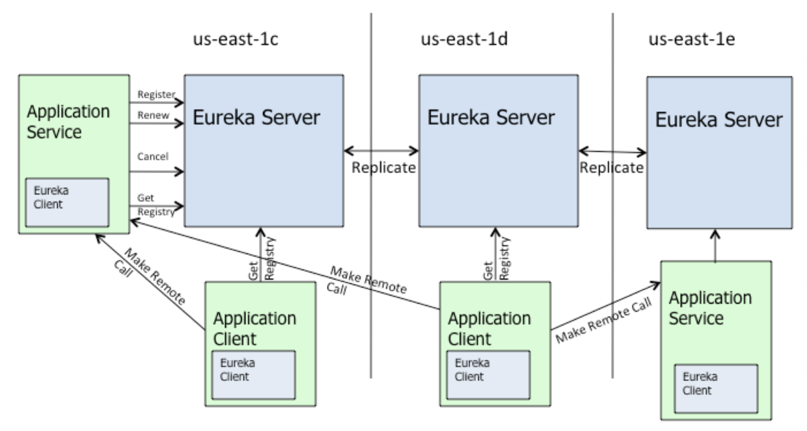

# 源码分析之Eureka服务端源码解析


[TOC]


## 说明

若无特别说明，本文所涉及的代码版本为spring boot/cloud 2.2.6。

## eureka server基本功能

- 接受服务注册
- 接受服务心跳
- 服务剔除
- 服务下线
- 集群同步
- 获取注册表中服务实例信息

需要注意的是，Eureka Server同时也是一个Eureka Client，在不禁止Eureka Server的客户端行为时，它会向它配置文件中的其他Eureka Server进行拉取注册表、服务注册和发送心跳等操作

eureka架构放一张图，镇楼



### 启动eureka-server注册相关bean

与eureka-client类似，eureka-server启动也是依赖spring factories机制初始化、并将对象加载到spring容器中。

以`spring-cloud-netflix-eureka-server-2.2.2.REALEASE.jar`为例，打开该包中的spring.factories，可以看到

```text
org.springframework.boot.autoconfigure.EnableAutoConfiguration=\
  org.springframework.cloud.netflix.eureka.server.EurekaServerAutoConfiguration
```

即启动时自动加载EurekaServerAutoConfiguration类，而该类的功能是向spring的bean工厂添加eureka-server相关功能的bean。

EurekaServerAutoConfiguration上有一个注解：@ConditionalOnBean(EurekaServerMarkerConfiguration.Marker.class)，意思是：只有在Spring容器里有Marker这个类的实例时，才会加载EurekaServerAutoConfiguration，这个就是控制是否开启Eureka Server的关键。

### 开启eureka server

在使用eureka-server时，我们所加的`@EnableEurekaServer`注解，实现如下：

```java
@Target(ElementType.TYPE)
@Retention(RetentionPolicy.RUNTIME)
@Documented
@Import(EurekaServerMarkerConfiguration.class)
public @interface EnableEurekaServer {
}
```

此处利用spring提供的`@Import`注解，将`EurekaServerMarkerConfiguration`动态注入到spring 容器中，这也刚好提供了上面spring factories里`EurekaServerAutoConfiguration`实例化的前提：必须有`EurekaServerMarkerConfiguration`。

即启动时初始化顺序：

- 添加`EnableEurekaServer`注解后，通过@Import引入`EurekaServerMarkerConfiguration`
- 利用spring factories，加载`EurekaServerAutoConfiguration`


### 开启注册

在spring-cloud-netflix-eureka-server:2.2.2.RELEASE中，`EurekaServerAutoConfiguration`声明如下：

```java
@Configuration(proxyBeanMethods = false)
@Import(EurekaServerInitializerConfiguration.class)
@ConditionalOnBean(EurekaServerMarkerConfiguration.Marker.class)
@EnableConfigurationProperties({ EurekaDashboardProperties.class,
		InstanceRegistryProperties.class })
@PropertySource("classpath:/eureka/server.properties")
public class EurekaServerAutoConfiguration implements WebMvcConfigurer {
    ......
}
```

其中，通过@Import引入的`EurekaServerInitializerConfiguration`类声明如下：

```java
@Configuration(proxyBeanMethods = false)
public class EurekaServerInitializerConfiguration
		implements ServletContextAware, SmartLifecycle, Ordered {
    ......
}
    
```

SmartLifecycle的作用是：初始化完之后，执行public void start()方法。

而`EurekaServerInitializerConfiguration`中start()方法：

- 启动一个线程；
- 上下文初始化
- 利用spring的事件机制，发布一个EurekaRegistryAvailableEvent事件
- 更改running状态
- 利用spring的事件机制，发布一个EurekaServerStartedEvent事件

在这个start() 上下文初始化这一步，还会从相邻eureka节点注册表，方法调用路径如下：

```text
EurekaServerInitializerConfiguration#start()
	EurekaServerBoostrap#contextInitialized(ServletContext context)
		EurekaServerBoostrap#initEurekaServerContext()
			// Copy registry from neighboring eureka node  此处进行复制相邻eureka注册表的操作
			int registryCount = this.registry.syncUp();
```


在EurekaServerAutoConfiguration中会实例化`EurekaServerContext`，代码如下：

```java
	@Bean
	@ConditionalOnMissingBean
	public EurekaServerContext eurekaServerContext(ServerCodecs serverCodecs,
			PeerAwareInstanceRegistry registry, PeerEurekaNodes peerEurekaNodes) {
		return new DefaultEurekaServerContext(this.eurekaServerConfig, serverCodecs,
				registry, peerEurekaNodes, this.applicationInfoManager);
	}
```

`DefaultEurekaServerContext`中初始化代码如下：

```java
    @PostConstruct
    @Override
    public void initialize() {
        logger.info("Initializing ...");
        //启动一个只拥有一个线程的线程池，第一次进去会更新一下集群其他节点信息。
        peerEurekaNodes.start();
        try {
		//调用PeerAwareInstanceRegistryImpl的init方法
            registry.init(peerEurekaNodes);
        } catch (Exception e) {
            throw new RuntimeException(e);
        }
        logger.info("Initialized");
    }
```

在spring-cloud-netflix-eureka-server中，`PeerAwareInstanceRegistryImpl`的继承/实现关系参见下图：


eureka server围绕注册表管理的，也就是上面的InstanceRegistry。

### 注册表管理核心类 InstanceRegistry

参考上图，依次说明如下：

- InstanceRegistry
  - 有两种InstanceRegistry，参考如下：
  - com.netflix.eureka.registry.InstanceRegistry是euraka server中注册表管理的核心接口。职责是在内存中管理注册到Eureka Server中的服务实例信息。实现类有PeerAwareInstanceRegistryImpl。
  - org.springframework.cloud.netflix.eureka.server.InstanceRegistry 对PeerAwareInstanceRegistryImpl进行了继承和扩展，使其适配Spring cloud的使用环境，主要的实现由PeerAwareInstanceRegistryImpl提供。
- LeaseManager
  - 对注册到Eureka Server中的服务实例租约进行管理，方法有：服务注册，下线，续约，剔除。此接口管理的类目前是InstanceInfo。InstanceInfo代表服务实例信息。
- LookupService
  - 提供服务实例的检索查询功能。
- PeerAwareInstanceRegistryImpl
  - 增加了对peer节点的同步复制操作。使得eureka server集群中注册表信息保持一致。


### 服务注册

Eureka Client在发起服务注册时会将自身的服务实例元数据封装在InstanceInfo中，然后将InstanceInfo发送到Eureka Server。Eureka Server在接收到Eureka Client发送的InstanceInfo后将会尝试将其放到本地注册表中以供其他Eureka Client进行服务发现。

EurekaServerAutoConfiguration中定义了 public FilterRegistrationBean jerseyFilterRegistration ，表明eureka-server使用了Jersey实现 对外的RESTful接口。注册一个 Jersey 的 filter ，配置好相应的Filter 和 url映射。

在com.netflix.eureka.resources包下，是Eureka Server对于Eureka client的REST请求的定义。看ApplicationResource类（这是一类请求，应用类的请求），类似于应用@Controller注解：@Produces({"application/xml", "application/json"})，接受xml和json。

例如ApplicationResource类中，有如下方法（添加实例接口）：

```java
    @POST
    @Consumes({"application/json", "application/xml"})
    public Response addInstance(InstanceInfo info,
                                @HeaderParam(PeerEurekaNode.HEADER_REPLICATION) String isReplication) {
        ......
         //registry是PeerAwareInstanceRegistry类型
        registry.register(info, "true".equals(isReplication));
        ......
    }
```

上面的`registry.register`方法，可以追溯到`PeerAwareInstanceRegistryImpl `的方法：public void register(final InstanceInfo info, final boolean isReplication) ，中有一句：super.register(info, leaseDuration, isReplication); 
 将会进入：`com.netflix.eureka.registry.AbstractInstanceRegistry`的 register方法

 在register方法中，服务实例的InstanceInfo保存在Lease中，Lease在AbstractInstanceRegistry中统一通过ConcurrentHashMap保存在内存中。在服务注册过程中，会先获取一个读锁，防止其他线程对registry注册表进行数据操作，避免数据的不一致。然后从resgitry查询对应的InstanceInfo租约是否已经存在注册表中，根据appName划分服务集群，使用InstanceId唯一标记服务实例。

- 如果租约存在，比较两个租约中的InstanceInfo的最后更新时间lastDirtyTimestamp，保留时间戳大的服务实例信息InstanceInfo。

- 如果租约不存在，意味这是一次全新的服务注册，将会进行自我保护的统计，创建新的租约保存InstanceInfo。接着将租约放到resgitry注册表中。

之后将进行一系列缓存操作并根据覆盖状态规则设置服务实例的状态，缓存操作包括将InstanceInfo加入用于统计Eureka Client增量式获取注册表信息的recentlyChangedQueue和失效responseCache中对应的缓存。最后设置服务实例租约的上线时间用于计算租约的有效时间，释放读锁并完成服务注册。

流程图如下：


### 接收服务心跳请求

在Eureka Client完成服务注册之后，它需要定时向Eureka Server发送心跳请求(默认30秒一次)，维持自己在Eureka Server中租约的有效性。

此代码实现在com.netflix.eureka.resources.InstanceResource中，参见此方法：

```java
@PUT
public Response renewLease(
            @HeaderParam(PeerEurekaNode.HEADER_REPLICATION) String isReplication,
            @QueryParam("overriddenstatus") String overriddenStatus,
            @QueryParam("status") String status,
            @QueryParam("lastDirtyTimestamp") String lastDirtyTimestamp) {
    ......
    boolean isSuccess = registry.renew(app.getName(), id, isFromReplicaNode);
    ......
}
```

registry类型为`PeerAwareInstanceRegistry`，追溯后会发现最终实现是在`AbstractInstanceRegistry`#renew方法。

renew方法是对Eureka Client位于注册表中的租约的续租操作，不像register方法需要服务实例信息，仅根据服务实例的服务名和服务实例id即可更新对应租约的有效时间。

```java
public boolean renew(String appName, String id, boolean isReplication) {
        RENEW.increment(isReplication);
     //根据appName获取服务集群的租约集合
        Map<String, Lease<InstanceInfo>> gMap = registry.get(appName);
        Lease<InstanceInfo> leaseToRenew = null;
        if (gMap != null) {
            leaseToRenew = gMap.get(id);
        }
        if (leaseToRenew == null) {
            RENEW_NOT_FOUND.increment(isReplication);
            logger.warn("DS: Registry: lease doesn't exist, registering resource: {} - {}", appName, id);
            return false;
        } else {
            InstanceInfo instanceInfo = leaseToRenew.getHolder();
            if (instanceInfo != null) {
                // touchASGCache(instanceInfo.getASGName());
                //查看服务实例状态
                InstanceStatus overriddenInstanceStatus = this.getOverriddenInstanceStatus(
                        instanceInfo, leaseToRenew, isReplication);
                if (overriddenInstanceStatus == InstanceStatus.UNKNOWN) {
                    logger.info("Instance status UNKNOWN possibly due to deleted override for instance {}"
                            + "; re-register required", instanceInfo.getId());
                    RENEW_NOT_FOUND.increment(isReplication);
                    return false;
                }
                if (!instanceInfo.getStatus().equals(overriddenInstanceStatus)) {
                    logger.info(
                            "The instance status {} is different from overridden instance status {} for instance {}. "
                                    + "Hence setting the status to overridden status", instanceInfo.getStatus().name(),
                                    instanceInfo.getOverriddenStatus().name(),
                                    instanceInfo.getId());
                    instanceInfo.setStatusWithoutDirty(overriddenInstanceStatus);

                }
            }
             //统计每分钟续租次数
            renewsLastMin.increment();
             //更新租约
            leaseToRenew.renew();
            return true;
        }
    }
```

 此方法中不关注InstanceInfo，仅关注于租约本身以及租约的服务实例状态。如果根据服务实例的appName和instanceInfoId查询出服务实例的租约，并且根据#getOverriddenInstanceStatus方法得到的instanceStatus不为InstanceStatus.UNKNOWN，那么更新租约中的有效时间，即更新租约Lease中的lastUpdateTimestamp，达到续约的目的；如果租约不存在，那么返回续租失败的结果。

下图给出了eureka服务端接收心跳、租约更新流程。


### 服务剔除

如果Eureka Client在注册后，既没有续约，也没有下线(服务崩溃或者网络异常等原因)，那么服务的状态就处于不可知的状态，不能保证能够从该服务实例中获取到回馈，所以需要服务剔除此方法定时清理这些不稳定的服务，该方法会批量将注册表中所有过期租约剔除。

  剔除是定时任务，默认60秒执行一次。延时60秒，间隔60秒
          evictionTimer.schedule(evictionTaskRef.get(),
                  serverConfig.getEvictionIntervalTimerInMs(),
                  serverConfig.getEvictionIntervalTimerInMs());
                  
  从上面eureka server启动来看，剔除的任务，是线程启动的，执行的是下面的方法。
  `com.netflix.eureka.registry.AbstractInstanceRegistry`#evict

```java

//isLeaseExpirationEnabled在
public boolean isLeaseExpirationEnabled在() {
    if (!isSelfPreservationModeEnabled()) {
        //此处获取自我保护模式开关状态，最终对应于EurekaServerConfigBean类中的enableSelfPreservation配置项，
        // The self preservation mode is disabled, hence allowing the instances to expire.
        return true;
    }
    return numberOfRenewsPerMinThreshold > 0 && getNumOfRenewsInLastMin() > numberOfRenewsPerMinThreshold;
}

public void evict(long additionalLeaseMs) {
    logger.debug("Running the evict task");

    if (!isLeaseExpirationEnabled()) {
        logger.debug("DS: lease expiration is currently disabled.");
        return;
    }

    // We collect first all expired items, to evict them in random order. For large eviction sets,
    // if we do not that, we might wipe out whole apps before self preservation kicks in. By randomizing it,
    // the impact should be evenly distributed across all applications.
    List<Lease<InstanceInfo>> expiredLeases = new ArrayList<>();
    /*
    遍历注册表register，依次判断租约是否过期。一次性获取所有的过期租约。
    */
    for (Entry<String, Map<String, Lease<InstanceInfo>>> groupEntry : registry.entrySet()) {
        Map<String, Lease<InstanceInfo>> leaseMap = groupEntry.getValue();
        if (leaseMap != null) {
            for (Entry<String, Lease<InstanceInfo>> leaseEntry : leaseMap.entrySet()) {
                Lease<InstanceInfo> lease = leaseEntry.getValue();
                if (lease.isExpired(additionalLeaseMs) && lease.getHolder() != null) {
                    expiredLeases.add(lease);
                }
            }
        }
    }

    // To compensate for GC pauses or drifting local time, we need to use current registry size as a base for
    // triggering self-preservation. Without that we would wipe out full registry.
    //获取注册表租约总数
    int registrySize = (int) getLocalRegistrySize();
    //计算注册表租约的阈值 （总数乘以 续租百分比），得出要续租的数量
    int registrySizeThreshold = (int) (registrySize * serverConfig.getRenewalPercentThreshold());
    //总数减去要续租的数量，就是理论要剔除的数量        
    int evictionLimit = registrySize - registrySizeThreshold;
	//求 上面理论剔除数量，和过期租约总数的最小值。就是最终要提出的数量。
    int toEvict = Math.min(expiredLeases.size(), evictionLimit);
    if (toEvict > 0) {
        logger.info("Evicting {} items (expired={}, evictionLimit={})", toEvict, expiredLeases.size(), evictionLimit);

        Random random = new Random(System.currentTimeMillis());
        for (int i = 0; i < toEvict; i++) {
            // Pick a random item (Knuth shuffle algorithm)
            int next = i + random.nextInt(expiredLeases.size() - i);
            Collections.swap(expiredLeases, i, next);
            Lease<InstanceInfo> lease = expiredLeases.get(i);

            String appName = lease.getHolder().getAppName();
            String id = lease.getHolder().getId();
            EXPIRED.increment();
            logger.warn("DS: Registry: expired lease for {}/{}", appName, id);
            //执行 服务下线将服务从注册表清除掉。
            internalCancel(appName, id, false);
        }
    }
}

```

#### 剔除的限制

  1.自我保护期间不清除。
  2.分批次清除。
  3.服务是逐个随机剔除，剔除均匀分布在所有应用中，防止在同一时间内同一服务集群中的服务全部过期被剔除，造成在大量剔除服务时，并在进行自我保护时，促使程序崩溃。

#### 剔除服务的定时任务

 剔除服务是个定时任务，用EvictionTask执行，默认60秒执行一次，延时60秒执行。定时剔除过期服务。

代码：

```text
EurekaServerInitializerConfiguration#start()
	eurekaServerBootstrap.contextInitialized(EurekaServerInitializerConfiguration.this.servletContext);
		EurekaServerBoostrap#initEurekaServerContext()
			registry.openForTraffic(this.applicationInfoManager, registryCount);
				PeerAwareInstanceRegistryImpl#openForTraffic
					AbstractInstanceRegistry#postInit()
```

 

服务剔除将会遍历registry注册表，找出其中所有的过期租约，然后根据配置文件中续租百分比阀值和当前注册表的租约总数量计算出最大允许的剔除租约的数量(当前注册表中租约总数量减去当前注册表租约阀值)，分批次剔除过期的服务实例租约。对过期的服务实例租约调用AbstractInstanceRegistry#internalCancel服务下线的方法将其从注册表中清除掉。

#### 自我保护机制

自我保护机制主要在Eureka Client和Eureka Server之间存在网络分区的情况下发挥保护作用，在服务器端和客户端都有对应实现。假设在某种特定的情况下(如网络故障)，Eureka Client和Eureka Server无法进行通信，此时Eureka Client无法向Eureka Server发起注册和续约请求，Eureka Server中就可能因注册表中的服务实例租约出现大量过期而面临被剔除的危险，然而此时的Eureka Client可能是处于健康状态的(可接受服务访问)，如果直接将注册表中大量过期的服务实例租约剔除显然是不合理的。

针对这种情况，Eureka设计了“自我保护机制”。在Eureka Server处，如果出现大量的服务实例过期被剔除的现象，那么该Server节点将进入自我保护模式，保护注册表中的信息不再被剔除，在通信稳定后再退出该模式；在Eureka Client处，如果向Eureka Server注册失败，将快速超时并尝试与其他的Eureka Server进行通信。“自我保护机制”的设计大大提高了Eureka的可用性。

有关自我保护机制的流程图：


### 服务下线

 Eureka Client在应用销毁时，会向Eureka Server发送服务下线请求，清除注册表中关于本应用的租约，避免无效的服务调用。在服务剔除的过程中，也是通过服务下线的逻辑完成对单个服务实例过期租约的清除工作。

对应代码：com.netflix.eureka.resources.InstanceResource 的

```java
    @DELETE
    public Response cancelLease(
            @HeaderParam(PeerEurekaNode.HEADER_REPLICATION) String isReplication) {
        ......
        boolean isSuccess = registry.cancel(app.getName(), id, "true".equals(isReplication));
        ......
    }
```

继续追踪：

```text
InstanceResource#cancelLease
	PeerAwareInstanceRegistryImpl#cancel //此方法中还有将取消操作复制给其他eureka节点的逻辑
		AbstractInstanceRegistry#cancel
			AbstractInstanceRegistry#internalCancel
```

最终实现代码如下：

```java
protected boolean internalCancel(String appName, String id, boolean isReplication) {
    try {
        //先获取读锁，防止被其他线程修改
        read.lock();
        CANCEL.increment(isReplication);
        //根据appName获取服务实例集群。
        Map<String, Lease<InstanceInfo>> gMap = registry.get(appName);
        Lease<InstanceInfo> leaseToCancel = null;
        //  在内存中取消实例 id的服务
        if (gMap != null) {
            leaseToCancel = gMap.remove(id);
        }
        //添加到最近下线服务的统计队列
        recentCanceledQueue.add(new Pair<Long, String>(System.currentTimeMillis(), appName + "(" + id + ")"));
        InstanceStatus instanceStatus = overriddenInstanceStatusMap.remove(id);
        if (instanceStatus != null) {
            logger.debug("Removed instance id {} from the overridden map which has value {}", id, instanceStatus.name());
        }
        // 往下判断leaseToCancel是否为空，租约不存在，返回false
        if (leaseToCancel == null) {
            CANCEL_NOT_FOUND.increment(isReplication);
            logger.warn("DS: Registry: cancel failed because Lease is not registered for: {}/{}", appName, id);
            return false;
        } else {
            //若存在，设置租约下线时间
            leaseToCancel.cancel();
            InstanceInfo instanceInfo = leaseToCancel.getHolder();
            String vip = null;
            String svip = null;
            if (instanceInfo != null) {
                //获取持有租约的服务信息，标记服务实例为instanceInfo.setActionType(ActionType.DELETED);
                instanceInfo.setActionType(ActionType.DELETED);
                //添加到租约变更记录队列
                recentlyChangedQueue.add(new RecentlyChangedItem(leaseToCancel));//用于eureka client的增量拉取注册表信息。
                instanceInfo.setLastUpdatedTimestamp();
                vip = instanceInfo.getVIPAddress();
                svip = instanceInfo.getSecureVipAddress();
            }
            invalidateCache(appName, vip, svip);
            logger.info("Cancelled instance {}/{} (replication={})", appName, id, isReplication);
        }
    } finally {
        read.unlock();
    }

    synchronized (lock) {
        if (this.expectedNumberOfClientsSendingRenews > 0) {
            // Since the client wants to cancel it, reduce the number of clients to send renews.
            this.expectedNumberOfClientsSendingRenews = this.expectedNumberOfClientsSendingRenews - 1;
            updateRenewsPerMinThreshold();
        }
    }

    return true;
}
```

上述代码主要功能： 首先通过registry根据服务名和服务实例id查询关于服务实例的租约Lease是否存在，统计最近请求下线的服务实例用于Eureka Server主页展示。如果租约不存在，返回下线失败；如果租约存在，从registry注册表中移除，设置租约的下线时间，同时在最近租约变更记录队列中添加新的下线记录，以用于Eureka Client的增量式获取注册表信息。


### 集群同步 

 如果Eureka Server是通过集群的方式进行部署，那么为了维护整个集群中Eureka Server注册表数据的一致性，势必需要一个机制同步Eureka Server集群中的注册表数据。

Eureka Server集群同步包含两个部分：

- Eureka Server在启动过程中从它的peer节点中拉取注册表信息，并将这些服务实例的信息注册到本地注册表中；
- Eureka Server每次对本地注册表进行操作时，同时会将操作同步到它的peer节点中，达到集群注册表数据统一的目的。

#### 启动拉取别的peer

Eureka Server启动类中，`EurekaServerAutoConfiguration `通过@Import注解加载`EurekaServerInitializerConfiguration`

```text
EurekaServerInitializerConfiguration#start()
	eurekaServerBootstrap.contextInitialized(...)
		EurekaServerBootstrap#initEurekaServerContext()
			PeerAwareInstanceRegistryImpl#syncUp();
```

代码实现：

```java
public int syncUp() {
        // Copy entire entry from neighboring DS node
        int count = 0;

        for (int i = 0; ((i < serverConfig.getRegistrySyncRetries()) && (count == 0)); i++) {
            if (i > 0) {
                try {
                    Thread.sleep(serverConfig.getRegistrySyncRetryWaitMs());
                } catch (InterruptedException e) {
                    logger.warn("Interrupted during registry transfer..");
                    break;
                }
            }
            Applications apps = eurekaClient.getApplications();
            for (Application app : apps.getRegisteredApplications()) {
                for (InstanceInfo instance : app.getInstances()) {
                    try {
                        if (isRegisterable(instance)) {
                            register(instance, instance.getLeaseInfo().getDurationInSecs(), true);
                            count++;
                        }
                    } catch (Throwable t) {
                        logger.error("During DS init copy", t);
                    }
                }
            }
        }
        return count;
    }
```

 看循环：意思是，如果是i第一次进来，为0，不够等待的代码，直接执行下面的拉取服务实例。
  将自己作为一个eureka client，拉取注册表。并通过register(instance, instance.getLeaseInfo().getDurationInSecs(), true)注册到自身的注册表中。

Eureka Server也是一个Eureka Client，在启动的时候也会进行DiscoveryClient的初始化，会从其对应的Eureka Server中拉取全量的注册表信息。在Eureka Server集群部署的情况下，Eureka Server从它的peer节点中拉取到注册表信息后，将遍历这个Applications，将所有的服务实例通过AbstractRegistry#register方法注册到自身注册表中。

EurekaServerBootstrap#initEurekaServerContext()中有如下代码：

```text
		。。。
		// Copy registry from neighboring eureka node
		int registryCount = this.registry.syncUp();
		this.registry.openForTraffic(this.applicationInfoManager, registryCount);
		。。。
```

当执行完上面的syncUp逻辑后，在下面的openForTraffic，**开启此server接受别的client注册，拉取注册表等操作。而在它首次拉取其他peer节点时，是不允许client的通信请求的。**

```java
    public void openForTraffic(ApplicationInfoManager applicationInfoManager, int count) {
        // Renewals happen every 30 seconds and for a minute it should be a factor of 2.
        this.expectedNumberOfClientsSendingRenews = count;
        updateRenewsPerMinThreshold();
        logger.info("Got {} instances from neighboring DS node", count);
        logger.info("Renew threshold is: {}", numberOfRenewsPerMinThreshold);
        this.startupTime = System.currentTimeMillis();
        //如果count=0，没有拉取到注册表信息，将此值设为true，表示其他peer来取空的实例信息，意味着，将不允许client从此server获取注册表信息。如果count>0，将此值设置为false，允许client来获取注册表。	
        if (count > 0) {
            this.peerInstancesTransferEmptyOnStartup = false;
        }
        DataCenterInfo.Name selfName = applicationInfoManager.getInfo().getDataCenterInfo().getName();
        boolean isAws = Name.Amazon == selfName;
        if (isAws && serverConfig.shouldPrimeAwsReplicaConnections()) {
            logger.info("Priming AWS connections for all replicas..");
            primeAwsReplicas(applicationInfoManager);
        }
        logger.info("Changing status to UP");
        applicationInfoManager.setInstanceStatus(InstanceStatus.UP);
        super.postInit();
    }
```

#### Server之间注册表信息的同步复制

**为了保证Eureka Server集群运行时注册表信息的一致性，每个Eureka Server在对本地注册表进行管理操作时，会将相应的操作同步到所有peer节点中。**

在外部调用server的restful方法时，在com.netflix.eureka.resources包下的ApplicationResource资源中，查看每个服务的操作。比如服务注册public Response addInstance(，此方法中有
  registry.register(info, "true".equals(isReplication));点进去实现类：replicateToPeers(Action.Register, info.getAppName(), info.getId(), info, null, isReplication);这是一种情况。

在PeerAwareInstanceRegistryImpl类中，其他操作，如cancel，renew等中都有replicateToPeers，
 此方法中有个peerEurekaNodes，代表一个可同步数据的eureka Server的集合，如果注册表有变化，向此中的peer节点同步。

 replicateToPeers方法，它将遍历Eureka Server中peer节点，向每个peer节点发送同步请求。

```java
private void replicateToPeers(Action action, String appName, String id,
                                  InstanceInfo info /* optional */,
                                  InstanceStatus newStatus /* optional */, boolean isReplication) {
        Stopwatch tracer = action.getTimer().start();
        try {
            if (isReplication) {
                numberOfReplicationsLastMin.increment();
            }
            // If it is a replication already, do not replicate again as this will create a poison replication
            if (peerEurekaNodes == Collections.EMPTY_LIST || isReplication) {
                return;
            }

            for (final PeerEurekaNode node : peerEurekaNodes.getPeerEurekaNodes()) {
                // If the url represents this host, do not replicate to yourself.
                if (peerEurekaNodes.isThisMyUrl(node.getServiceUrl())) {
                    continue;
                }
                replicateInstanceActionsToPeers(action, appName, id, info, newStatus, node);
            }
        } finally {
            tracer.stop();
        }
    }
```

 此replicateInstanceActionsToPeers方法中，类PeerEurekaNode的实例node的各种方法，cancel，register，等，用了batchingDispatcher.process(，作用是将同一时间段内，相同服务实例的相同操作将使用相同的任务编号，在进行同步复制的时候，将根据任务编号合并操作，**减少同步操作的数量和网络消耗，但是同时也造成了同步复制的延时性，不满足CAP中的C（强一致性）。
 所以Eureka，只满足AP。**

```java
//示例：PeerEurekaNode
public void cancel(final String appName, final String id) throws Exception {
    long expiryTime = System.currentTimeMillis() + maxProcessingDelayMs;
    batchingDispatcher.process(
        taskId("cancel", appName, id),
        new InstanceReplicationTask(targetHost, Action.Cancel, appName, id) {
            @Override
            public EurekaHttpResponse<Void> execute() {
                return replicationClient.cancel(appName, id);
            }

            @Override
            public void handleFailure(int statusCode, Object responseEntity) throws Throwable {
                super.handleFailure(statusCode, responseEntity);
                if (statusCode == 404) {
                    logger.warn("{}: missing entry.", getTaskName());
                }
            }
        },
        expiryTime
    );
}
```


 通过Eureka Server在启动过程中初始化本地注册表信息和Eureka Server集群间的同步复制操作，最终达到了集群中Eureka Server注册表信息一致的目的。

### 获取注册表中服务实例信息

Eureka Server中获取注册表的服务实例信息主要通过两个方法实现：

- AbstractInstanceRegistry#getApplicationsFromMultipleRegions从多地区获取全量注册表数据
- AbstractInstanceRegistry#getApplicationDeltasFromMultipleRegions从多地区获取增量式注册表数据。

##### 1、全量

 上面讲到从节点复制注册信息的时候，用方法public int syncUp() ，一行Applications apps = eurekaClient.getApplications();点进去实现类，有一行getApplicationsFromAllRemoteRegions(); 下面getApplicationsFromMultipleRegions，作用从多个地区中获取全量注册表信息，并封装成Applications返回，它首先会将本地注册表registry中的所有服务实例信息提取出来封装到Applications中，再根据是否需要拉取Region的注册信息，将远程拉取过来的Application放到上面的Applications中。最后得到一个全量的Applications。

##### 2、增量

在前面提到接受服务注册，接受心跳等方法中，都有recentlyChangedQueue.add(new RecentlyChangedItem(lease));作用是将新变动的服务放到最近变化的服务实例信息队列中，用于记录增量是注册表信息。getApplicationDeltasFromMultipleRegions，实现了从远处eureka server中获取增量式注册表信息的能力。

 在EurekaServer对外restful中，在com.netflix.eureka.resources下，    
 @GET
     public Response getApplication(@PathParam("version") String version,
                                    @HeaderParam("Accept") final String acceptHeader,
                                    @HeaderParam(EurekaAccept.HTTP_X_EUREKA_ACCEPT) String eurekaAccept) {
                                    
 其中有一句：String payLoad = responseCache.get(cacheKey);在responseCache初始化的时候，它的构造方法ResponseCacheImpl(EurekaServerConfig serverConfig, ServerCodecs serverCodecs, AbstractInstanceRegistry registry) {中，Value value = generatePayload(key);点进去有一句：registry.getApplicationDeltasFromMultipleRegions(key.getRegions()));**从远程获取delta增量注册信息。但是这个只是向client提供，不向server提供，因为server可以通过每次变更自动同步到peer。**

 获取增量式注册表信息将会从recentlyChangedQueue中获取最近变化的服务实例信息。recentlyChangedQueue中统计了近3分钟内进行注册、修改和剔除的服务实例信息，在服务注册AbstractInstanceRegistry#registry、接受心跳请求AbstractInstanceRegistry#renew和服务下线AbstractInstanceRegistry#internalCancel等方法中均可见到recentlyChangedQueue对这些服务实例进行登记，用于记录增量式注册表信息。#getApplicationsFromMultipleRegions方法同样提供了从远程Region的Eureka Server获取增量式注册表信息的能力。


## 参考资料

- [spring cloud公开课资料](https://github.com/bjmashibing/InternetArchitect/tree/master/20%20%E6%9E%B6%E6%9E%84%E5%B8%88%E4%B8%89%E6%9C%9F%20SpringCloud%E5%BE%AE%E6%9C%8D%E5%8A%A1%E6%9E%B6%E6%9E%84/%E5%B8%B8%E8%80%81%E5%B8%88%E7%BD%91%E7%BA%A6%E8%BD%A6%E9%A1%B9%E7%9B%AE%E9%A2%84%E4%B9%A0%E8%B5%84%E6%96%99/%E6%8C%89%E7%BB%84%E4%BB%B6%E5%8C%BA%E5%88%86)