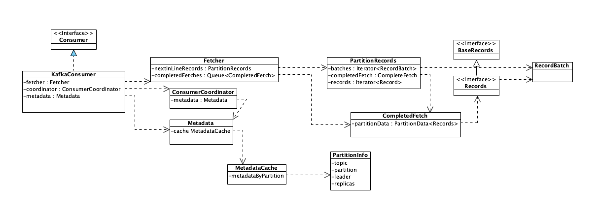

# 源码分析之Kafka Consumer消费消息的过程

[TOC]


## 说明

本文基于Apache Kafka 2.5.1（2020.09.10拉取最新代码）

## Consumer如何使用？

阅读源码前的首先要做到熟悉相关组件的概念、基本使用。而最靠谱的资料就是官方文档。

建议阅读官方文档（https://kafka.apache.org/documentation/）后，自己练习、使用kafka之后再开始阅读源码。

KafkaConsumer的JavaDoc（参见https://kafka.apache.org/10/javadoc/?org/apache/kafka/clients/consumer/KafkaConsumer.html）本身就给出了不少有用信息，下面仅列出一些关键点：

- Cross-Version Compatibility
    客户端支持0.10.0以及以上版本，如果调用不支持的特性，会抛出UnsupportedVersionException
- Offsets and Consumer Position
    position: 有待读取的下一条记录的偏移量
    commited position: 已被保存、归档的最后一条记录的偏移量，可以用于恢复数据。
- Consumer Groups and Topic Subscriptions

    - 一个partition内的消息只会投递给group中的一个consumer
    - 以下场景将触发group rebalance
		- 一个consumer挂掉
		- 新加入一个consumer
		- 新的partition加入一个topic
		- 一个新的topic匹配已有的订阅正则(subscribed regx)
	- [`ConsumerRebalanceListener`](https://kafka.apache.org/10/javadoc/org/apache/kafka/clients/consumer/ConsumerRebalanceListener.html) 可以监听rebalance
- Detecting Consumer Faillures
    - 调用poll(long)方法时consumer会自动加入到group中，consumer会发心跳给服务器端，超时时间`session.timeout.ms`
    - consumer可能遇到活锁：锁检测机制  `session.timeout.ms`
    - poll方法相关配置：
        - max.poll.interval.ms
        - max.poll.records

### 代码示例

```java
//代码1：
Properties props = new Properties();
props.put("bootstrap.servers", "localhost:9092");
props.put("group.id", "test");
props.put("enable.auto.commit", "true");
props.put("auto.commit.interval.ms", "1000");
props.put("key.deserializer", "org.apache.kafka.common.serialization.StringDeserializer");
props.put("value.deserializer", "org.apache.kafka.common.serialization.StringDeserializer");
KafkaConsumer<String, String> consumer = new KafkaConsumer<>(props);
consumer.subscribe(Arrays.asList("foo", "bar"));
while (true) {
    ConsumerRecords<String, String> records = consumer.poll(100);
    for (ConsumerRecord<String, String> record : records)
        System.out.printf("offset = %d, key = %s, value = %s%n", record.offset(), record.key(), record.value());
}
```

#### 主要流程

1. 设置配置信息，包括broker地址，consumer group id, 自动提交消费的位置，序列化配置
2. 创建KafkaConsumer对象
3. 订阅2个topic: foo, bar
4. 循环拉取并打印

以下将重点解读KafkaConsumer消费流程中的3个问题：

1. **订阅主题的过程是如何实现的？**
2. **consumer如何与coordinator协商，确定消费哪些partition?**
3. **拉取消息的过程是如何实现的？**

## 订阅主题的过程是如何实现的？

仍以上面代码示例为例，跟踪源码中的subscribe方法，最终会看到KafkaConsumer中的如下代码：

```java
//代码2：
@Override
public void subscribe(Collection<String> topics, ConsumerRebalanceListener listener) {
    acquireAndEnsureOpen();
    try {
        maybeThrowInvalidGroupIdException();
        if (topics == null)
            throw new IllegalArgumentException("Topic collection to subscribe to cannot be null");
        if (topics.isEmpty()) {
            // treat subscribing to empty topic list as the same as unsubscribing
            this.unsubscribe();
        } else {
            for (String topic : topics) {
                if (topic == null || topic.trim().isEmpty())
                    throw new IllegalArgumentException("Topic collection to subscribe to cannot contain null or empty topic");
            }

            throwIfNoAssignorsConfigured();
            fetcher.clearBufferedDataForUnassignedTopics(topics);
            log.info("Subscribed to topic(s): {}", Utils.join(topics, ", "));
            if (this.subscriptions.subscribe(new HashSet<>(topics), listener))
                metadata.requestUpdateForNewTopics();
        }
    } finally {
        release();
    }
}
```

基本流程如下：

1. 加轻量级锁（通过CAS方式加锁）
2. 参数校验
   1. 注意：如果传入topic集合为空，则直接走unsubscribe的逻辑
3. 重置订阅状态subscriptions，更新元数据metadata中的topic信息
   1. 订阅状态维护：订阅的 topic 和 patition 的消费位置等状态信息
   2. 元数据metada维护：Kafka 集群元数据的一个子集，包括集群的 Broker 节点、Topic 和 Partition 在节点上分布，Coordinator 给 Consumer 分配的 Partition 信息。


### 经典思路：主动检测不支持的情况并抛出异常，避免系统产生不可预期的行为

KafkaConsumer的[Javadoc](https://kafka.apache.org/10/javadoc/?org/apache/kafka/clients/consumer/KafkaConsumer.html)明确声明了，consumer不是线程安全的，被并发调用时会出现不可预期的结果。为了避免这种情况发生，Kafka 做了主动的检测并抛出异常，而不是放任系统产生不可预期的情况。

> Kafka“主动检测不支持的情况并抛出异常，避免系统产生不可预期的行为”这种模式，对于增强的系统的健壮性是一种非常有效的做法。如果你的系统不支持用户的某种操作，正确的做法是，检测不支持的操作，直接拒绝用户操作，并给出明确的错误提示，而不应该只是在文档中写上“不要这样做”，却放任用户错误的操作，产生一些不可预期的、奇怪的错误结果。
>
> 引自：极客时间：消息队列高手课

具体代码就是上面的代码2中的`acquireAndEnsureOpen() `，具体实现如下：

```java
/**
     * Acquire the light lock and ensure that the consumer hasn't been closed.
     * @throws IllegalStateException If the consumer has been closed
     */
private void acquireAndEnsureOpen() {
    acquire();
    //KafkaConsumer成员变量，初始值为false，调用close(Duration)方法后才会置为true
    if (this.closed) {
        release();
        throw new IllegalStateException("This consumer has already been closed.");
    }
}

//变量声明
private static final long NO_CURRENT_THREAD = -1L;

private void acquire() {
    //拿到当前线程的线程id
    long threadId = Thread.currentThread().getId();
    /*if threadId与当前正执行的线程的id不一致（并发，多线程访问）&& threadId对应的线程没有争抢到锁
    	 then 抛出异常
   	举例：
   		现在有两个KafkaConsumer线程，线程id分别是thread1, thread2，要执行acquire()方法。
		thread1先启动，执行完上面这条语句、赋值threadId后， thread1栈帧中threadId=thread1，此时CPU线程调度、执行thread2，
		thread2也走到if语句时，在thread2的栈帧中，threadId已经赋值为thread2，走到这里，currentThread作为成员变量，初始值为NO_CURRENT_THREAD（-1），因此必然不相等，继续走第二判断条件，即利用AtomicInteger的CAS操作，将当前线程id threadId(thread2)赋值给currentThread这个AtomicInteger，必然返回true，因此会继续执行，使得refcount加1；
		接着，此时执行thread1，那么再继续执行if，threadId(thread1) != currentThread.get() (thread2)能满足，但是currentThread的CAS赋值将会失败，因此此时currentThread的值并不是NO_CURRENT_THREAD。
		
		refcount用于记录重入锁的情况，参见release()方法，当refcount=0时，currentThread将重新赋值为NO_CURRENT_THREAD，保证彻底解锁。
    */
    if (threadId != currentThread.get() && !currentThread.compareAndSet(NO_CURRENT_THREAD, threadId))
        throw new ConcurrentModificationException("KafkaConsumer is not safe for multi-threaded access");
    refcount.incrementAndGet();
}

/**
     * Release the light lock protecting the consumer from multi-threaded access.
     */
private void release() {
    if (refcount.decrementAndGet() == 0)
        currentThread.set(NO_CURRENT_THREAD);
}
```

此处通过AtomicLong currentThread, AtomicInteger refcount 这两个变量来实现轻量级锁的机制非常经典，建议学习、理解、运用。具体分析我已经写在了上述源码中供大家参考。

### 有关元数据更新

元数据更新调用的是`metadata.requestUpdateForNewTopics();`，里面内容是：

```java
public synchronized int requestUpdateForNewTopics() {
    // Override the timestamp of last refresh to let immediate update.
    this.lastRefreshMs = 0;
    this.needPartialUpdate = true;
    this.requestVersion++;
    return this.updateVersion;
}
```

可以看到，内部并没有更新元数据的操作，只是设置了几个标志位。但我们知道，在消息消息前，我们必须获取元数据，比如broker节点信息、topic和partition的分布，否则根本不知道从哪里获取数据。那么此时，我们就可以根据这几个标志位来去找相应代码。不过从KafkaConsumer的JavaDoc提供的信息也能获知，是在拉取消息时将会根据这些标志位来更新元数据。具体逻辑请看接下来的分析。

## 拉取消息的过程是如何实现的？

我们已经知道，拉取消息是调用KafkaConsumer的poll(Duration)方法，主要流程的序列图参考下图


注：引自 极客时间  消息队列高手课

poll源码如下，主要流程在：

1. **updateAssignmentMetadataIfNeeded(): 更新元数据**
2. **pollForFetches()：拉取消息**

```java
@Override
public ConsumerRecords<K, V> poll(final Duration timeout) {
    return poll(time.timer(timeout), true);
}

/**
     * @throws KafkaException if the rebalance callback throws exception
     */
private ConsumerRecords<K, V> poll(final Timer timer, final boolean includeMetadataInTimeout) {
    //加锁，保证只有1个线程读取数据
    acquireAndEnsureOpen();
    try {
        //记录开始时间
        this.kafkaConsumerMetrics.recordPollStart(timer.currentTimeMs());

        if (this.subscriptions.hasNoSubscriptionOrUserAssignment()) {
            //没有订阅信息，抛异常
            throw new IllegalStateException("Consumer is not subscribed to any topics or assigned any partitions");
        }

        do {
            //这个地方没太看懂
            client.maybeTriggerWakeup();

            if (includeMetadataInTimeout) {
                // try to update assignment metadata BUT do not need to block on the timer for join group
                updateAssignmentMetadataIfNeeded(timer, false);
            } else {
                /*
				updateAssignmentMetadataIfNeeded方法有3个作用：
                    - discovery coordinator if necessary
                    - join group if necessary
                    - refresh metadata and fetch position if necessary
				*/
                while (!updateAssignmentMetadataIfNeeded(time.timer(Long.MAX_VALUE), true)) {
                    log.warn("Still waiting for metadata");
                }
            }

            final Map<TopicPartition, List<ConsumerRecord<K, V>>> records = pollForFetches(timer);
            if (!records.isEmpty()) {
                // before returning the fetched records, we can send off the next round of fetches
                // and avoid block waiting for their responses to enable pipelining while the user
                // is handling the fetched records.
                //
                // NOTE: since the consumed position has already been updated, we must not allow
                // wakeups or any other errors to be triggered prior to returning the fetched records.
                if (fetcher.sendFetches() > 0 || client.hasPendingRequests()) {
                    client.transmitSends();
                }

                return this.interceptors.onConsume(new ConsumerRecords<>(records));
            }
        } while (timer.notExpired());

        return ConsumerRecords.empty();
    } finally {
        release();
        this.kafkaConsumerMetrics.recordPollEnd(timer.currentTimeMs());
    }
}

boolean updateAssignmentMetadataIfNeeded(final Timer timer, final boolean waitForJoinGroup) {
    if (coordinator != null && !coordinator.poll(timer, waitForJoinGroup)) {
        return false;
    }
	/*
	Set the fetch position to the committed position (if there is one) or reset it using the offset reset policy the user has configured.
	更新position或是根据用户配置重置position
	*/
    return updateFetchPositions(timer);
}


```

### updateAssignmentMetadataIfNeeded() 更新元数据

updateAssignmentMetadataIfNeeded方法有3个作用（此处代码最近有更新，可以看看github中代码更新记录）：

- discovery coordinator if necessary
- join group if necessary
- refresh metadata and fetch position if necessary

#### Coordinator#poll()  维持心跳，更新元数据

updateAssignmentMetadataIfNeeded调用了coordinator.poll() 方法，即ConsumerCoordinator#poll(Timer timer, boolean waitForJoinGroup)，源码如下

```java
public boolean poll(Timer timer, boolean waitForJoinGroup) {
    maybeUpdateSubscriptionMetadata();

    invokeCompletedOffsetCommitCallbacks();
	//先忽略细节逻辑，第一次启动时，将执行此处
    if (subscriptions.hasAutoAssignedPartitions()) {
        if (protocol == null) {
            throw new IllegalStateException("User configured " + ConsumerConfig.PARTITION_ASSIGNMENT_STRATEGY_CONFIG +
                                            " to empty while trying to subscribe for group protocol to auto assign partitions");
        }
		/*
		此处是发送心跳逻辑
		*/
        pollHeartbeat(timer.currentTimeMs());
        
        if (coordinatorUnknown() && !ensureCoordinatorReady(timer)) {
            return false;
        }

        if (rejoinNeededOrPending()) {
            if (subscriptions.hasPatternSubscription()) {
                
                if (this.metadata.timeToAllowUpdate(timer.currentTimeMs()) == 0) {
                    this.metadata.requestUpdate();
                }

                /*
                在此处会根据当前needFullUpdate needPartialUpdate等状态，
                执行元数据更新逻辑，具体的逻辑则是由ConsumerNetworkClient#poll方法执行。
                */
                if (!client.ensureFreshMetadata(timer)) {
                    return false;
                }

                maybeUpdateSubscriptionMetadata();
            }

            if (!ensureActiveGroup(waitForJoinGroup ? timer : time.timer(0L))) {
                return false;
            }
        }
    } else {
        if (metadata.updateRequested() && !client.hasReadyNodes(timer.currentTimeMs())) {
            client.awaitMetadataUpdate(timer);
        }
    }

    maybeAutoCommitOffsetsAsync(timer.currentTimeMs());
    return true;
}
```


#### ConsumerNetworkClient#poll() 封装所有网络通信

ConsumerNetworkClient封装了 consumer和 kafka cluster 之间所有的网络通信的实现，完全异步实现、没有自己维护线程。其中：

 - 所有待发送请求Request都会被存放到ConsumerNetworkClient的成员变量`UnsentRequests unsent`中。
    - 注：UnsentRequests 是用`ConcurrentMap<Node, ConcurrentLinkedQueue<ClientRequest>> unsent`定义一个Map来保存所有待发送请求，作为关键字的Node中包含了kafka节点的id、host、port、rack等信息。
	- 返回的Response将存放在ConsumerNetworkClient的成员变量pendingCompletion 中。

每次调用ConsumerNetworkClient# poll() 方法的时候，在当前线程（而不是ConsumerNetworkClient自己维护线程）中发送所有待发送的 Request，处理所有收到的 Response。

这种异步设计的优劣：

- 优点：占用线程少，吞吐量高
- 不足：增加代码复杂度

```java
public void poll(Timer timer, PollCondition pollCondition, boolean disableWakeup) {
        // 调用handler
        firePendingCompletedRequests();

        lock.lock();
        try {
            // Handle async disconnects prior to attempting any sends
            handlePendingDisconnects();

            /*
            遍历unsent中已保存的所有请求，并调用KafkaClient#send，发送请求
            */
            long pollDelayMs = trySend(timer.currentTimeMs());

            if (pendingCompletion.isEmpty() && (pollCondition == null || pollCondition.shouldBlock())) {
                // if there are no requests in flight, do not block longer than the retry backoff
                long pollTimeout = Math.min(timer.remainingMs(), pollDelayMs);
                /*
                KafkaClient中维护着一个在途请求映射表，参见InFlightRequests类。NetworkClient#send方法
                在发送网络请求时，将会在在途请求映射表加入一条记录。注意是为了避免请求超时导致请求一直等待、
                占用内存、进而导致内存不足
                */
                if (client.inFlightRequestCount() == 0)
                    pollTimeout = Math.min(pollTimeout, retryBackoffMs);
                client.poll(pollTimeout, timer.currentTimeMs());
            } else {
                client.poll(0, timer.currentTimeMs());
            }
            timer.update();

            checkDisconnects(timer.currentTimeMs());
            if (!disableWakeup) {
                maybeTriggerWakeup();
            }
            
            maybeThrowInterruptException();

            trySend(timer.currentTimeMs());

            failExpiredRequests(timer.currentTimeMs());
			//清理unsent
            unsent.clean();
        } finally {
            lock.unlock();
        }

        // called without the lock to avoid deadlock potential if handlers need to acquire locks
        firePendingCompletedRequests();

        metadata.maybeThrowAnyException();
    }
```


#### KafkaConsumer#updateFetchPositions() 更新消费位置

Kafka Consumer 在消费过程中是需要维护消费位置的，Consumer 每次从当前消费位置拉取一批消息，这些消息都被正常消费后，Consumer 会给 Coordinator 发一个提交位置的请求，然后消费位置会向后移动，完成一批消费过程。

而consumer发起提交位置的请求，还是在`updateAssignmentMetadataIfNeeded()`方法中，毕竟位置信息也是服务端broker的一个元数据。在``updateAssignmentMetadataIfNeeded`方法实现中，最后一句调用`KafkaConsumer#updateFetchPositions(timer);`，而这个方法又会调用coordinator.refreshCommittedOffsetsIfNeeded()方法。调用链路如下：

```sequence
KafkaConsumer -> KafkaConsumer' : updateAssignmentMetadataIfNeeded()
KafkaConsumer' -> KafkaConsumer'': updateFetchPositions()
KafkaConsumer'' -> ConsumerCoordinator : refreshCommittedOffsetsIfNeeded()
ConsumerCoordinator -> ConsumerCoordinator : fetchCommittedOffsets()
ConsumerCoordinator -> ConsumerCoordinator' : sendOffsetFetchRequest()
ConsumerCoordinator' -> ConsumerNetworkClient : send()
```

注：同一个类内部的方法调用，用类名头部加了'’'区分了下，主要是为了在Typora里画图方便。不支持可参考images/kafka-consumer-refresh-position-sequence-diagram.png 图片。


### pollForFetchs() 拉取消息

源码如下

```java
private Map<TopicPartition, List<ConsumerRecord<K, V>>> pollForFetches(Timer timer) {
  	// 省略部分代码        
    // 如果缓存里面有未读取的消息，直接返回这些消息
    final Map<TopicPartition, List<ConsumerRecord<K, V>>> records = fetcher.fetchedRecords();
    if (!records.isEmpty()) {
        return records;
    }

	/* 
	构造拉取消息请求，并发送。
	注意，该方法内部，将调用ConsumerNetworkClient#send方法，而这个send方法将会把 
	kafka节点信息 --> 请求  存放到ConsumerNetworkClient#unsent成员变量中
	*/
    fetcher.sendFetches();

    // 省略部分代码
    // 发送网络请求拉取消息，等待直到有消息返回或者超时
    client.poll(pollTimer, () -> {
        // since a fetch might be completed by the background thread, we need this poll condition
        // to ensure that we do not block unnecessarily in poll()
        return !fetcher.hasAvailableFetches();
    });
	//省略部分代码
    //返回拉取到的消息
    return fetcher.fetchedRecords();
}
```

主要逻辑如下：

1. 如果缓存里面有未读取的消息，直接返回这些消息；

2. 构造拉取消息请求，并发送；

3. 发送网络请求并拉取消息，等待直到有消息返回或者超时；

4. 返回拉到的消息。

   1. fetcher.fetchedRecords会将返回的Response反序列化，返回给调用者。

   

具体发送操作由fetcher.sendFetches();实现，主要包括如下步骤：

1. 构造拉取消息请求Request对象
2. 调用ConsumerNetworkClient#send方法**异步发送Request**
   1. 这个send方法将会把kafka节点信息 --> 请求  存放到ConsumerNetworkClient#unsent成员变量中
3. 注册一个回调类来处理返回的Response
   1. Response暂时被存放在Fetcher#completedFetches成员变量中

当调用ConsumerNetworkClient#poll方法时，才会遍历unsent，将其中的请求发出去，并处理收到的Response。

## KafkaConsumer相关类图



上图引自：极客时间 消息队列高手课

