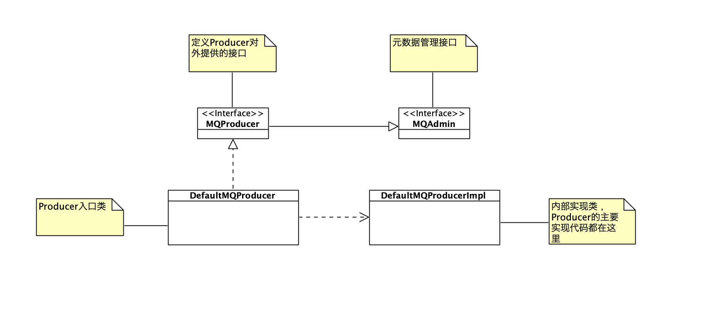
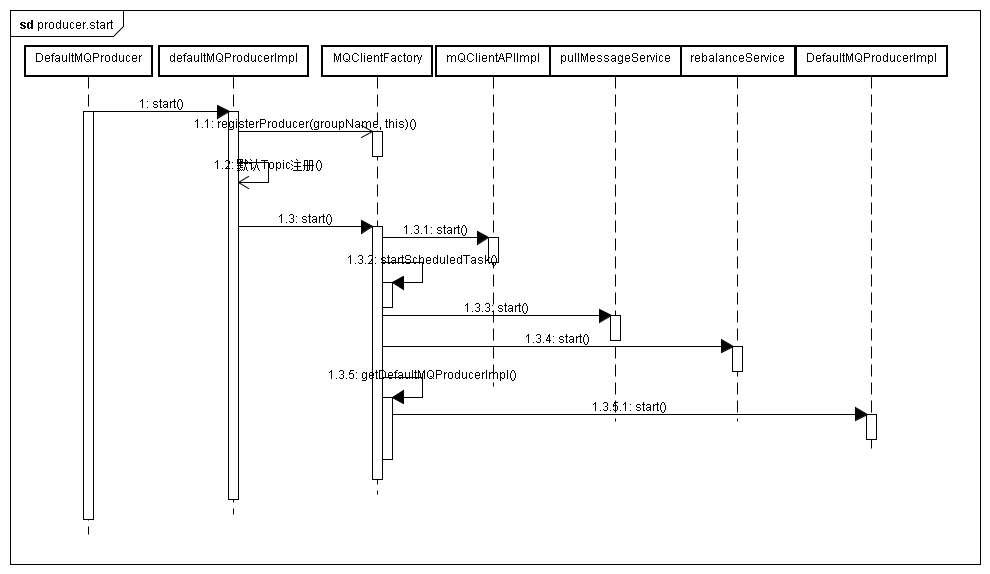

# 源码分析之RocketMQ Producer消息生产的实现及其设计模式分析  

## 说明  

本文所涉及的RocketMQ版本为4.7.1。


## 类关系

RocketMQ Producer的核心类、接口关系如下：



引自：极客时间-消息队列高手课 https://time.geekbang.org/column/article/132889

此处的设计使用了门面模式（Facade Pattern），接口 MQProducer 就是这个模式中的门面。

类 DefaultMQProducer 实现了接口 MQProducer，它里面的方法实现大多没有任何的业务逻辑，只是封装了对其他实现类的方法调用；

producer的主要实现逻辑都在DefaultMQProducerImpl 中。

接口 MQAdmin 定义了一些元数据管理的方法，在消息发送过程中会用到。

## 启动流程

一个典型的启动过程可以参考rocketmq源码中单元测试部分的代码，比如在DefaultMQProducerTest中的 `init()`方法：

```java
public void init() throws Exception {
        String producerGroupTemp = producerGroupPrefix + System.currentTimeMillis();
        producer = new DefaultMQProducer(producerGroupTemp);
        producer.setNamesrvAddr("127.0.0.1:9876");
        producer.setCompressMsgBodyOverHowmuch(16);
    //省略构造消息代码
		......
        producer.start();
    //省略测试相关代码
		......
    }
```

创建DefaultMQProducer、初始化部分配置参数后，就调用DefaultMQProducer#start()，而该方法实际调用的是DefaultMQProducerImpl#start()，该方法简略代码如下：

```java
public void start(final boolean startFactory) throws MQClientException {
        switch (this.serviceState) {
            case CREATE_JUST:
                this.serviceState = ServiceState.START_FAILED;
                //省略检查配置参数、异常处理的代码
				......
			// 获取MQClientInstance的实例mQClientFactory，没有则自动创建新的实例
                this.mQClientFactory = MQClientManager.getInstance().getOrCreateMQClientInstance(this.defaultMQProducer, rpcHook);
			 // 在mQClientFactory中注册自己
                boolean registerOK = mQClientFactory.registerProducer(this.defaultMQProducer.getProducerGroup(), this);
                //省略异常处理
                ......
                   //启动mQClientFactory
                if (startFactory) {
                    mQClientFactory.start();
                }

              	//更新状态
                this.serviceState = ServiceState.RUNNING;
                break;
            case RUNNING:
            case START_FAILED:
            case SHUTDOWN_ALREADY:
                //省略异常处理
                ......
            default:
                break;
        }
		//给所有broker发送心跳
        this.mQClientFactory.sendHeartbeatToAllBrokerWithLock();
		//启动调度任务，用于扫描是否有在途请求超时，该任务将把这些请求移除、抛出异常，避免一直占用内容
        this.timer.scheduleAtFixedRate(new TimerTask() {
            @Override
            public void run() {
                try {
                    RequestFutureTable.scanExpiredRequest();
                } catch (Throwable e) {
                    log.error("scan RequestFutureTable exception", e);
                }
            }
        }, 1000 * 3, 1000);
    }
```

整个启动过程简要汇总如下：

```
1. 通过单例实现的MQClientManager 获取MQClientInstance 的实例 mQClientFactory，没有则自动创建新的实例
2. 在mQClientFactory中注册自己（Producer对象）
3. 启动mQClientFactory
4. 给所有broker发送心跳
5. 启动扫描在途请求的定时任务
```

其中`3. 启动mQClientFactory` ，即调用MQClientInstance#start()方法，该方法流程如下：

```
判断当前状态，处于CREATE_JUST状态（还没启动）下：
    if (null == this.clientConfig.getNamesrvAddr()) {
    //拉取name server地址信息
    this.mQClientAPIImpl.fetchNameServerAddr();
    }
    // 步骤1. 启动请求响应通道（MQClientAPIImpl对象）
    this.mQClientAPIImpl.start();
    // 步骤2. 启动各种调度任务
    this.startScheduledTask();
    // 步骤3. 启动拉取消息服务
    this.pullMessageService.start();
    // 步骤4. 启动rebalance服务
    this.rebalanceService.start();
    // 步骤5. 启动producer
    this.defaultMQProducer.getDefaultMQProducerImpl().start(false);
```

其中：

- 步骤1：mQClientAPIImpl 是类 MQClientAPIImpl 的实例，封装了客户端与 Broker 通信的方法；

- 步骤2：调度任务包括：
  - 更新name server地址任务
  - 更新topic路由信息的任务
  - 发送心跳给所有broker的任务
  - 持久化所有consumer偏移量
  - 调整线程池


### 重要的类及其职责

- DefaultMQProducerImpl：Producer 的内部实现类，Producer 发消息的实现逻辑，主要都在这个类中。

- MQClientInstance：封装了客户端一些通用的业务逻辑，无论是 Producer 还是 Consumer，最终需要与服务端交互时，都需要调用这个类中的方法；

- MQClientAPIImpl：封装了客户端服务端的 RPC，对调用者隐藏了网络通信的具体实现；

- NettyRemotingClient：RocketMQ 各进程之间网络通信的底层实现类。


### 序列图

上述启动过程可以参考这张图



注：上图引自 http://www.uml.org.cn/zjjs/202003194.asp?artid=23079


## 发送消息过程

还是以RocketMQ自带的测试用例为例进行阅读。

RocketMQ发送消息有3种方式：

- 单向发送（Oneway）：发送消息后立即返回，不处理响应，不关心是否发送成功；
- 同步发送（Sync）：发送消息后等待响应；
- 异步发送（Async）：发送消息后立即返回，在提供的回调方法中处理响应。

### 异步发送消息

3种发送大体流程一致，异步发送有细微差别。此处我们分析异步发送消息流程，参见DefaultMQProducerTest#testSendMessageAsync()方法。

```java
public void testSendMessageAsync() throws RemotingException, MQClientException, InterruptedException {
   		......
		producer.send(message, messageQueueSelector, null, sendCallback, 1000);
    	......
    }
```

此处我们分析DefaultMQProducer#send(Message msg, MessageQueueSelector selector, Object arg, SendCallback sendCallback, long timeout)

具体实现还是在DefaultMQProducerImpl中：

```java
@Deprecated
    public void send(final Message msg, final MessageQueueSelector selector, final Object arg,
        final SendCallback sendCallback, final long timeout)
        throws MQClientException, RemotingException, InterruptedException {
        final long beginStartTime = System.currentTimeMillis();
        ExecutorService executor = this.getAsyncSenderExecutor();
        try {
            executor.submit(new Runnable() {
                @Override
                public void run() {
                    long costTime = System.currentTimeMillis() - beginStartTime;
                    if (timeout > costTime) {
                        try {
                            try {
                                sendSelectImpl(msg, selector, arg, CommunicationMode.ASYNC, sendCallback,
                                    timeout - costTime);
                            } catch (MQBrokerException e) {
                                throw new MQClientException("unknownn exception", e);
                            }
                        } catch (Exception e) {
                            sendCallback.onException(e);
                        }
                    } else {
                        sendCallback.onException(new RemotingTooMuchRequestException("call timeout"));
                    }
                }

            });
        } catch (RejectedExecutionException e) {
            throw new MQClientException("exector rejected ", e);
        }
    }
```

此处rocketmq使用一个线程池发送消息，提到线程池我们就得留意一下这个线程池的配置。进一步追踪，可以看到该线程池默认采用LinkedBlockingQueue作为工作队列。当然也可以调用setAsyncSenderExecutor方法传入自己定义线程池，来替换默认的线程池。

实际发送消息的操作由`sendSelectImpl`方法来执行，该方法如下：

```java
private SendResult sendSelectImpl(
        Message msg,
        MessageQueueSelector selector,
        Object arg,
        final CommunicationMode communicationMode,
        final SendCallback sendCallback, final long timeout
    ) throws MQClientException, RemotingException, MQBrokerException, InterruptedException {
    	//省略校验消息、寻找topic发送信息的代码
      	......
            MessageQueue mq = null;
            try {
                List<MessageQueue> messageQueueList =
                    mQClientFactory.getMQAdminImpl().parsePublishMessageQueues(topicPublishInfo.getMessageQueueList());
                Message userMessage = MessageAccessor.cloneMessage(msg);
                String userTopic = NamespaceUtil.withoutNamespace(userMessage.getTopic(), mQClientFactory.getClientConfig().getNamespace());
                userMessage.setTopic(userTopic);

                mq = mQClientFactory.getClientConfig().queueWithNamespace(selector.select(messageQueueList, userMessage, arg));
            } catch (Throwable e) {
                throw new MQClientException("select message queue throwed exception.", e);
            }
			//省略计时逻辑
    		......
          	
            if (mq != null) {
                return this.sendKernelImpl(msg, mq, communicationMode, sendCallback, null, timeout - costTime);
            } else {
                throw new MQClientException("select message queue return null.", null);
            }
        }
		......
    }
```

选择哪个队列发送由 MessageQueueSelector#select 方法决定。此处使用了策略模式，来解决不同场景下需要使用不同的队列选择算法问题。目前RocketMQ （此处以4.7.1版本为例）提供了3种策略，当然我们也可以自己根据接口实现选择策略。

- 哈希选择策略 SelectMessageQueueByHash
- 随机选择策略 SelectMessageQueueByRandom
- 同机房选择策略 electMessageQueueByMachineRoom

如果要保证key消息的严格顺序，需要使用哈希选择策略，或者提供一个自己实现的选择策略。

#### sendKernelImpl

sendKernelImpl主要流程如下：

```
获取broker地址信息
消息压缩
执行CheckForbiddenHook
执行SendMessageHook（executeSendMessageHookBefore）
构造发送消息头 RequestHeader 和上下文 SendMessageContext
调用方法 MQClientAPIImpl#sendMessage()，将消息发送给队列所在的 Broker。
	此处还会根据发送消息类型（异步，同步/单向），略做区分
执行SendMessageHook（executeSendMessageHookAfter）
```


MQClientAPIImpl的sendMessage()方法将会执行后续序列化和网络传输等步骤，然后将响应结果返回。

异步发送的时候，发送的逻辑都是在 Executor 的异步线程中执行的，所以不会阻塞当前线程，当服务端返回响应或者超时之后，Producer 会调用 Callback 方法来给业务代码返回结果。


#### 为何异步发送消息的send方法被弃用了？

我们上述分析可以看到，异步发送消息，目前还是会用到DefaultMQProducerImpl的这个方法：

```java
/**
     * It will be removed at 4.4.0 cause for exception handling and the wrong Semantics of timeout. A new one will be
     * provided in next version
     *
*/
@Deprecated
public void send(final Message msg, final MessageQueueSelector selector, final Object arg,
    final SendCallback sendCallback, final long timeout) {
    final SendCallback sendCallback, final long timeout)
        throws MQClientException, RemotingException, InterruptedException {
        final long beginStartTime = System.currentTimeMillis();
        ExecutorService executor = this.getAsyncSenderExecutor();
        try {
            executor.submit(new Runnable() {
                @Override
                public void run() {
                    long costTime = System.currentTimeMillis() - beginStartTime;
                    if (timeout > costTime) {
                        try {
                            try {
                                sendSelectImpl(msg, selector, arg, CommunicationMode.ASYNC, sendCallback,
                                    timeout - costTime);
                            } catch (MQBrokerException e) {
                                throw new MQClientException("unknownn exception", e);
                            }
                        } catch (Exception e) {
                            sendCallback.onException(e);
                        }
                    } else {
                        sendCallback.onException(new RemotingTooMuchRequestException("call timeout"));
                    }
                }

            });
        } catch (RejectedExecutionException e) {
            throw new MQClientException("exector rejected ", e);
        }
}
```

然而，可以看到这个方法已经被标记为`@Deprecated`。那么为何呢？

原因（只是引用极客时间 消息队列高手课老师的答案，我没查资料）

- 超时时间的计算不准确:在run方法里进行时间判断（if (timeout > costTime)）实际上已经是开始执行当前线程的时间，而之前的排队时间没有算
- 这个异步方法还有提升空间，可以直接结合Netty、不必用到Executor
- 异常处理应该统一，而不应该是有的异常抛出，而有的异常通过回调方法返回客户端。

### 同步发送和单向发送

异步发送通过在线程池中调用 sendSelectImpl()，将发送消息操作异步进行；

单向发送和同步发送的实现则是直接在当前线程中调用方法 sendSelectImpl()。

使用同步发送的时候，当前线程会阻塞等待服务端的响应，直到收到响应或者超时方法才会返回，所以在业务代码调用同步发送的时候，只要返回成功，消息就一定发送成功了。


## 在途请求的处理

在`启动流程`中，我们可以看到，在producer启动时，启动了一个定时任务，扫描在途请求，如果超时就将该请求移除、抛出异常并返回。

DefaultMQProducerImpl#start()用serviceState来记录和管理自身服务状态，可以看做是一个状态机，由于我们是在启动producer，可以看到除了CREATE_JUST可以执行启动流程，其他状态都会抛异常。


## 设计模式汇总

### 门面模式（Facade Pattern）

RocketMQ Producer的核心类、接口的设计，接口 MQProducer 就是这个模式中的门面。

### 状态模式（State Pattern）

DefaultMQProducerImpl#start()用serviceState来记录和管理自身服务状态，是状态模式 (State Pattern) 这种设计模式的变种实现。

> 与标准的状态模式不同的是，它没有使用状态子类，而是使用分支流程（switch-case）来实现不同状态下的不同行为，在管理比较简单的状态时，使用这种设计会让代码更加简洁。这种模式非常广泛地用于管理有状态的类，推荐你在日常开发中使用。
>
> 引自：消息队列高手课

### 单例模式（Singleton Pattern）

MQClientInstance 是 RocketMQ 客户端中的顶层类，大多数情况下，可以简单地理解为每个客户端对应类 MQClientInstance 的一个实例。

这个类的实现是单例的。

### 策略模式（Strategry Pattern）

MessageQueueSelector采用了策略模式，来决定选择哪个队列发送消息。

## 参考资料

- 极客时间 消息队列高手课
- http://www.uml.org.cn/zjjs/202003194.asp?artid=23079