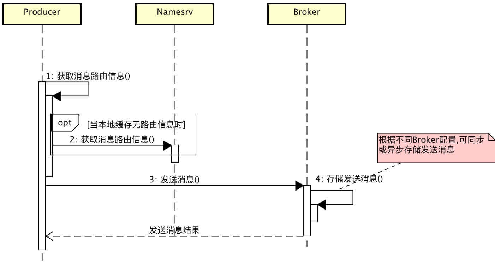
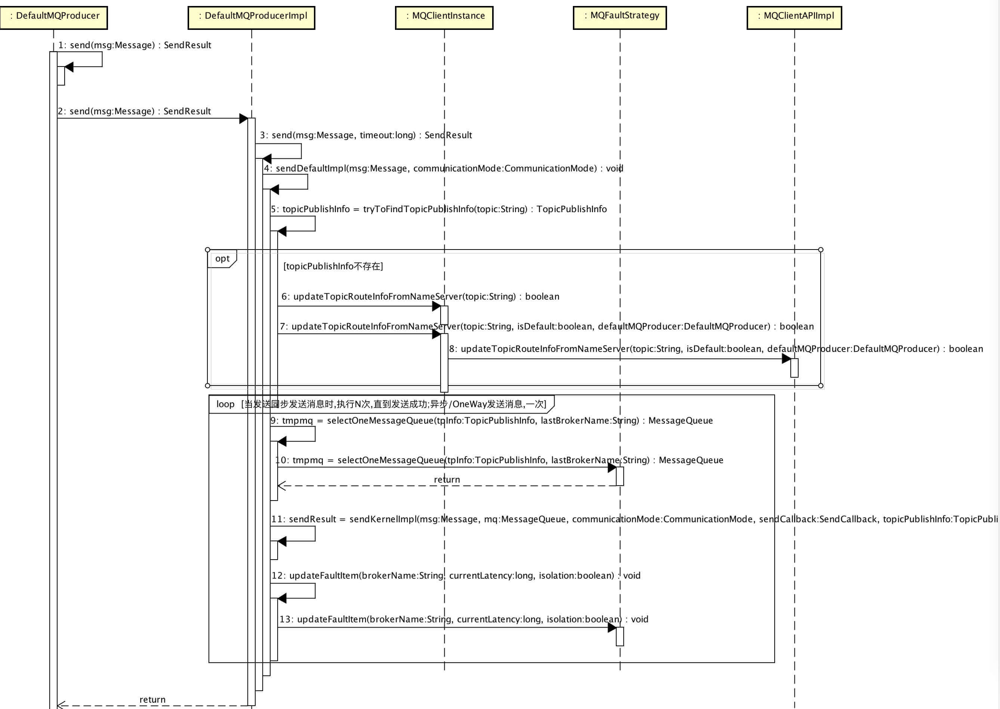
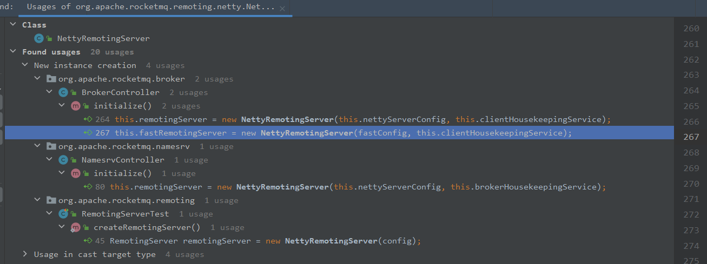
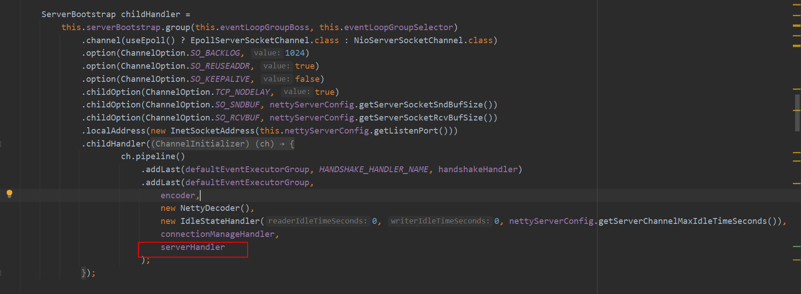
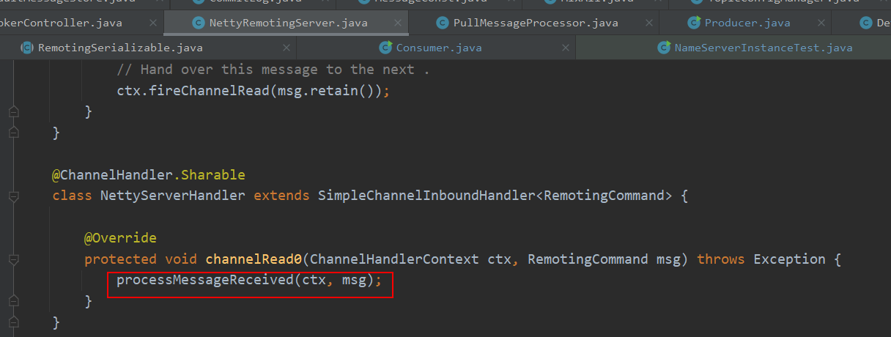
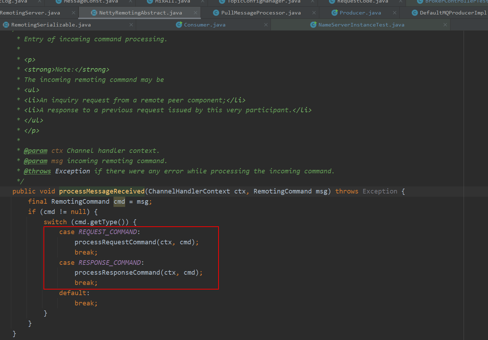
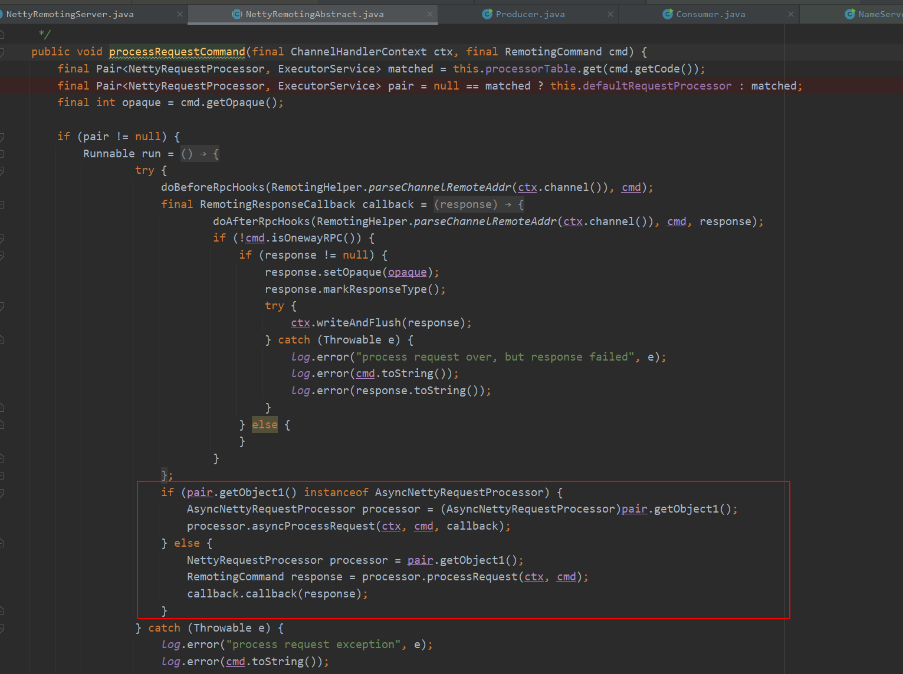
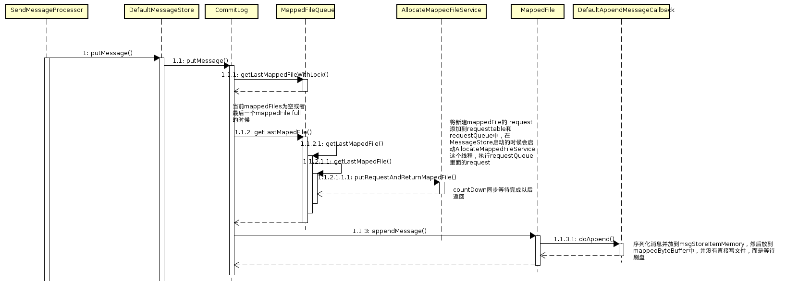

# 源码分析之RocketMQ发送消息与接收消息


## 说明

本文主要是本人学习、整理的笔记，涉及的内容可能来自网上，我会尽量注明来源。

我本人阅读的rocketmq代码版本为4.7.1。

## producer发送消息

有关producer生产消息，之前参考极客时间 消息队列高手课，写过一篇学习笔记，参考这里[源码分析之RocketMQ Producer生产消息的实现及其设计模式分析](https://blog.csdn.net/evasnowind/article/details/108509720)

此处再给出一些参考图片与资料

### producer发送消息总体过程



此图来自：http://www.iocoder.cn/RocketMQ/message-send-and-receive/

### producer发送消息序列图




### producer发送消息简要说明

下面引自：https://www.cnblogs.com/sunshine-2015/p/6291116.html 并做了一定扩充：

发送主要逻辑在DefaultMQProducerImpl.sendDefaultImpl

1. 检查service状态，生成一个随机的invokeId等操作

2. 获取topicRouteInfo
   DefaultMQProducerImpl.tryToFindTopicPublishInfo
         ->  MQClientInstance.updateTopicRouteInfoFromNameServer

   ​			获取路由信息通过netty发起RPC请求，而这个请求过程参见NettyRemoteClient.java  NettyRemotingAbstract.java
   ​    	此处使用了模板方法模式

```
private final ConcurrentHashMap<String/* group */, MQProducerInner> producerTable：放置所有的producer
updateTopicRouteInfoFromNameServer
- 获取topicRouteInfo
- 然后遍历producerTable，更新所有producer的topicRouteInfo
- 遍历consumerTable，更新所有的consumer的topicSubscribeInfo
- 加入topicRouteTable
```

​			-> MQClientAPIImpl.getTopicRouteInfoFromNameServer
​					通过netty向nameServer发出请求，请求topicRouteInfo

2. 选取一个messageQueue
   从messageQueueList取一个MessageQueue

3. netty发送消息
   DefaultMQProducer.sendKernelImpl，

   发送消息时，每个消息带有一个唯一id，看上去该id有两部分组成：
   	FIX_STRING、COUNTER两个拼接出来，包含有IP、时间戳、当前客户端计数等，以便保证唯一。具体逻辑积参见MessageClientIDSetter#createUniqID()

   

## broker接收消息

### 如何通过Netty接收数据

rocketmq采用Netty传输网络数据。在rocketmq broker端，NettyRemotingServer类封装了Netty相关操作，可以看到该类在BrokerController、NamesrvController中都有用到。



在NettyRemotingServer启动方法start()中，可以看到，在服务端使用了Netty的ServerBootstrap，且给这个ServerBootstrap添加了一个自定义的NettyServerHandler。



NettyServerHandler的定义：



该方法定义在NettyRemotingAbstract中：



然后就到了这里：




### broker接收消息流程

broker处理消息的整体流程可以参考下面这张图：



注：上图来自https://www.cnblogs.com/sunshine-2015/p/6291116.html

broker接收到消息后，对消息进行处理的是SendMessageProcessor。该类对接收到的消息进行如下操作：

//由于rocketmq使用Netty传输网络数据，在SendMessageProcessor拿到的是一个ChannelHandlerContext对象。
下面描述引自：https://www.cnblogs.com/sunshine-2015/p/6291116.html 并扩充了一些内容

```text
1. 构造SendMessageContext
2. 执行beforeHook
3. 发送消息
   - 构造MessageExtBrokerInner
   - 保存消息DefaultMessageStore.putMessage
     - 各种检查操作：如从节点不容许写入、消息不能过长、消息附加属性不能过长等
     - CommitLog.putMessage
       - 从mapedFileQueue中取出一个mapedFile,appendMessag使用directBuffer的方式写入commitLog
       - 同步或者异步刷盘
       - 同步双写
4. 执行afterHook
```


在第3步的开始，有一个对RETRY类型的消息处理。如果超过最大消费次数，则topic修改成"%DLQ%" + 分组名，即加入 死信队列(Dead Letter Queue)。

而上述broker接收消息过程中，消息持久化的过程主要CommitLog#putMessage这里，接下来将单独写一篇解析，本文先这样。


## 参考资料

- [RocketMQ 源码分析 —— Message 发送与接收](http://www.iocoder.cn/RocketMQ/message-send-and-receive/)

- [再说rocketmq消息存储](http://www.mamicode.com/info-detail-1794355.html)

- [RocketMQ源码 — 三、 Producer消息发送过程](https://www.cnblogs.com/sunshine-2015/p/6291116.html)


