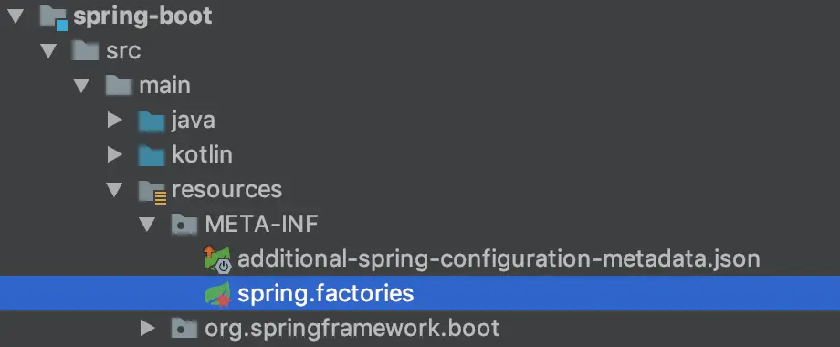

# 源码分析之Spring Boot如何利用Spring Factories机制进行自动注入

## 前言

本文所涉及spring/spring boot代码，请参考spring boot 2.2.6对应版本。

我们在刚学习spring boot时，有没有一个困惑：spring boot能够自动实例化很多第三方的依赖库？比如eureka、druid等。这个就涉及到spring boot的扩展机制spring factories。

简单来将，spring factories类似与Java SPI机制，利用该机制，我们能够自定义实现一些SDK或是spring boot starter，其实例化过程由我们来实现，使用方只需要在项目中引入包、不需要或是只需做很少的配置。

## Spring Factories的核心

spring factories机制核心在spring-core包中定义的SpringFactoriesLoader类，该类的公有方法只有2个：

```java
/*
根据接口类获取其实现类的实例，这个方法返回的是对象列表。
Load and instantiate the factory implementations of the given type from "META-INF/spring.factories", using the given class loader.
The returned factories are sorted through AnnotationAwareOrderComparator.
If a custom instantiation strategy is required, use loadFactoryNames(java.lang.Class<?>, java.lang.ClassLoader) to obtain all registered factory names.
*/
public static <T> List<T> loadFactories(Class<T> factoryType, @Nullable ClassLoader classLoader)
    
/*
根据接口获取其接口类的名称，这个方法返回的是类名的列表。
Load the fully qualified class names of factory implementations of the given type from "META-INF/spring.factories", using the given class loader.
*/
public static List<String> loadFactoryNames(Class<?> factoryType, @Nullable ClassLoader classLoader)
```

而上面这两个方法，最终都会调用一个SpringFactoriesLoader的私有方法loadSpringFactories，从指定的ClassLoader中获取spring.factories文件，并解析得到类名列表。具体代码如下：

```java
private static Map<String, List<String>> loadSpringFactories(@Nullable ClassLoader classLoader) {
		MultiValueMap<String, String> result = cache.get(classLoader);
		if (result != null) {
			return result;
		}

		try {
			Enumeration<URL> urls = (classLoader != null ?
					classLoader.getResources(FACTORIES_RESOURCE_LOCATION) :
					ClassLoader.getSystemResources(FACTORIES_RESOURCE_LOCATION));
			result = new LinkedMultiValueMap<>();
			while (urls.hasMoreElements()) {
				URL url = urls.nextElement();
				UrlResource resource = new UrlResource(url);
				Properties properties = PropertiesLoaderUtils.loadProperties(resource);
				for (Map.Entry<?, ?> entry : properties.entrySet()) {
					String factoryTypeName = ((String) entry.getKey()).trim();
					for (String factoryImplementationName : StringUtils.commaDelimitedListToStringArray((String) entry.getValue())) {
						result.add(factoryTypeName, factoryImplementationName.trim());
					}
				}
			}
			cache.put(classLoader, result);
			return result;
		}
		catch (IOException ex) {
			throw new IllegalArgumentException("Unable to load factories from location [" +
					FACTORIES_RESOURCE_LOCATION + "]", ex);
		}
	}
```

**该代码作用：遍历整个ClassLoader中所有jar包下的spring.factories文件。**spring.factories文件的位置：jar包下META-INF/spring.factories。

有没有感觉很熟悉？Java SPI的读取目录在`META-INF/services`下，其实大家写代码都是相互参考、然后形成一个约定俗成习惯的。

我们可以在自己的jar中配置spring.factories文件，不会影响到其它地方的配置，也不会被别人的配置覆盖。


## 示例  ：spring-boot的spring.factories

举个例子，spring boot start的实现中，如下所示：



spring-boot的spring.factories具体内容如下：

```
# PropertySource Loaders
org.springframework.boot.env.PropertySourceLoader=\
org.springframework.boot.env.PropertiesPropertySourceLoader,\
org.springframework.boot.env.YamlPropertySourceLoader

# Run Listeners
org.springframework.boot.SpringApplicationRunListener=\
org.springframework.boot.context.event.EventPublishingRunListener

# Error Reporters
org.springframework.boot.SpringBootExceptionReporter=\
org.springframework.boot.diagnostics.FailureAnalyzers

# Application Context Initializers
org.springframework.context.ApplicationContextInitializer=\
org.springframework.boot.context.ConfigurationWarningsApplicationContextInitializer,\
org.springframework.boot.context.ContextIdApplicationContextInitializer,\
org.springframework.boot.context.config.DelegatingApplicationContextInitializer,\
org.springframework.boot.rsocket.context.RSocketPortInfoApplicationContextInitializer,\
org.springframework.boot.web.context.ServerPortInfoApplicationContextInitializer

# Application Listeners
org.springframework.context.ApplicationListener=\
org.springframework.boot.ClearCachesApplicationListener,\
org.springframework.boot.builder.ParentContextCloserApplicationListener,\
org.springframework.boot.cloud.CloudFoundryVcapEnvironmentPostProcessor,\
org.springframework.boot.context.FileEncodingApplicationListener,\
org.springframework.boot.context.config.AnsiOutputApplicationListener,\
org.springframework.boot.context.config.ConfigFileApplicationListener,\
org.springframework.boot.context.config.DelegatingApplicationListener,\
org.springframework.boot.context.logging.ClasspathLoggingApplicationListener,\
org.springframework.boot.context.logging.LoggingApplicationListener,\
org.springframework.boot.liquibase.LiquibaseServiceLocatorApplicationListener

# Environment Post Processors
org.springframework.boot.env.EnvironmentPostProcessor=\
org.springframework.boot.cloud.CloudFoundryVcapEnvironmentPostProcessor,\
org.springframework.boot.env.SpringApplicationJsonEnvironmentPostProcessor,\
org.springframework.boot.env.SystemEnvironmentPropertySourceEnvironmentPostProcessor,\
org.springframework.boot.reactor.DebugAgentEnvironmentPostProcessor

# Failure Analyzers
org.springframework.boot.diagnostics.FailureAnalyzer=\
org.springframework.boot.diagnostics.analyzer.BeanCurrentlyInCreationFailureAnalyzer,\
org.springframework.boot.diagnostics.analyzer.BeanDefinitionOverrideFailureAnalyzer,\
org.springframework.boot.diagnostics.analyzer.BeanNotOfRequiredTypeFailureAnalyzer,\
org.springframework.boot.diagnostics.analyzer.BindFailureAnalyzer,\
org.springframework.boot.diagnostics.analyzer.BindValidationFailureAnalyzer,\
org.springframework.boot.diagnostics.analyzer.UnboundConfigurationPropertyFailureAnalyzer,\
org.springframework.boot.diagnostics.analyzer.ConnectorStartFailureAnalyzer,\
org.springframework.boot.diagnostics.analyzer.NoSuchMethodFailureAnalyzer,\
org.springframework.boot.diagnostics.analyzer.NoUniqueBeanDefinitionFailureAnalyzer,\
org.springframework.boot.diagnostics.analyzer.PortInUseFailureAnalyzer,\
org.springframework.boot.diagnostics.analyzer.ValidationExceptionFailureAnalyzer,\
org.springframework.boot.diagnostics.analyzer.InvalidConfigurationPropertyNameFailureAnalyzer,\
org.springframework.boot.diagnostics.analyzer.InvalidConfigurationPropertyValueFailureAnalyzer

# FailureAnalysisReporters
org.springframework.boot.diagnostics.FailureAnalysisReporter=\
org.springframework.boot.diagnostics.LoggingFailureAnalysisReporter

```


## spring boot如何利用spring.factories进行注入

一个spring boot项目，在启动类上会有`@SpringBootApplication`注解，该注解实现：

```java
@Target(ElementType.TYPE)
@Retention(RetentionPolicy.RUNTIME)
@Documented
@Inherited
@SpringBootConfiguration
@EnableAutoConfiguration
@ComponentScan(excludeFilters = { @Filter(type = FilterType.CUSTOM, classes = TypeExcludeFilter.class),
		@Filter(type = FilterType.CUSTOM, classes = AutoConfigurationExcludeFilter.class) })
public @interface SpringBootApplication {
    ...
}
```

其中，`@EnableAutoConfiguration`注解定义大体如下：

```java
@Target(ElementType.TYPE)
@Retention(RetentionPolicy.RUNTIME)
@Documented
@Inherited
@AutoConfigurationPackage
@Import(AutoConfigurationImportSelector.class)
public @interface EnableAutoConfiguration {
    ...
}
```

其中`@Import(AutoConfigurationImportSelector.class)` 很关键，@Import注解通过快速导入的方式实现把实例加入spring的IOC容器中，可以用于导入第三方包。AutoConfigurationImportSelector实现了ImportSelector接口，任何实现ImportSelector的类，都会在启动时被spring-context包`ConfigurationClassParser`中的`processImports`进行实例化，并执行`selectImports`方法。

AutoConfigurationImportSelector的selectImports以及相关的方法实现如下：

```java
/*
这部分是AutoConfigurationImportSelector的代码
*/
public String[] selectImports(AnnotationMetadata annotationMetadata) {
    if (!isEnabled(annotationMetadata)) {
        return NO_IMPORTS;
    }
    AutoConfigurationMetadata autoConfigurationMetadata = AutoConfigurationMetadataLoader
        .loadMetadata(this.beanClassLoader);
    AutoConfigurationEntry autoConfigurationEntry = getAutoConfigurationEntry(autoConfigurationMetadata,
                                                                              annotationMetadata);
    return StringUtils.toStringArray(autoConfigurationEntry.getConfigurations());
}

protected AutoConfigurationEntry getAutoConfigurationEntry(AutoConfigurationMetadata autoConfigurationMetadata,
			AnnotationMetadata annotationMetadata) {
    if (!isEnabled(annotationMetadata)) {
        return EMPTY_ENTRY;
    }
    AnnotationAttributes attributes = getAttributes(annotationMetadata);
    List<String> configurations = getCandidateConfigurations(annotationMetadata, attributes);
    configurations = removeDuplicates(configurations);
    Set<String> exclusions = getExclusions(annotationMetadata, attributes);
    checkExcludedClasses(configurations, exclusions);
    configurations.removeAll(exclusions);
    configurations = filter(configurations, autoConfigurationMetadata);
    fireAutoConfigurationImportEvents(configurations, exclusions);
    return new AutoConfigurationEntry(configurations, exclusions);
}

protected List<String> getCandidateConfigurations(AnnotationMetadata metadata, AnnotationAttributes attributes) {
        List<String> configurations = SpringFactoriesLoader.loadFactoryNames(getSpringFactoriesLoaderFactoryClass(),
                                                                             getBeanClassLoader());
        Assert.notEmpty(configurations, "No auto configuration classes found in META-INF/spring.factories. If you "
                        + "are using a custom packaging, make sure that file is correct.");
        return configurations;
	}

protected Class<?> getSpringFactoriesLoaderFactoryClass() {
    return EnableAutoConfiguration.class;
}


/*
下面是AutoConfigurationMetadataLoader中的代码
*/
protected static final String PATH = "META-INF/spring-autoconfigure-metadata.properties";
static AutoConfigurationMetadata loadMetadata(ClassLoader classLoader) {
		return loadMetadata(classLoader, PATH);
	}

static AutoConfigurationMetadata loadMetadata(ClassLoader classLoader, String path) {
    try {
        Enumeration<URL> urls = (classLoader != null) ? classLoader.getResources(path)
            : ClassLoader.getSystemResources(path);
        Properties properties = new Properties();
        while (urls.hasMoreElements()) {
            properties.putAll(PropertiesLoaderUtils.loadProperties(new UrlResource(urls.nextElement())));
        }
        return loadMetadata(properties);
    }
    catch (IOException ex) {
        throw new IllegalArgumentException("Unable to load @ConditionalOnClass location [" + path + "]", ex);
    }
}
```

可以看到，AutoConfigurationImportSelector的selectImports方法主要是用于加载类，但为了获取哪些类需要加载，则是通过SpringFactoriesLoader去加载对应的spring.factories。大体调用链路：

```
AutoConfigurationImportSelector#selectImports()
  	-> AutoConfigurationImportSelector#getAutoConfigurationEntry()
  		-> AutoConfigurationImportSelector#getCandidateConfigurations()
  			-> SpringFactoriesLoader#loadFactoryNames()
```

最终执行的是 `loadFactoryNames(EnableAutoConfiguration.class, 当前classloader)`， 结合上面`Spring Factories的核心`这一小节，可以获知，SpringFactoriesLoader将会根据EnableAutoConfiguration接口，去所有`spring.factories`找`EnableAutoConfiguration.class`所对应的`values`，并返回。


## 常见扩展点

上面已经提到，spring factories需要给出一个spring.factories文件，该文件规定了bean注入的扩展点。

常见扩展点如下：

```
# Auto Configure（这个扩展是使用的最多的，特别是是一些公共SDK，会这借助这扩展实现Bean的自动注入）
org.springframework.boot.autoconfigure.EnableAutoConfiguration

# PropertySource Loaders
org.springframework.boot.env.PropertySourceLoader

# Run Listeners
org.springframework.boot.SpringApplicationRunListener

# Error Reporters
org.springframework.boot.SpringBootExceptionReporter

# Application Context Initializers
org.springframework.context.ApplicationContextInitializer

# Application Listeners
org.springframework.context.ApplicationListener

# Environment Post Processors
org.springframework.boot.env.EnvironmentPostProcessor

# Failure Analyzers
org.springframework.boot.diagnostics.FailureAnalyzer

# FailureAnalysisReporters
org.springframework.boot.diagnostics.FailureAnalysisReporter
```


## 参考资料  

- [Spring Boot的扩展机制之Spring Factories](https://blog.csdn.net/lvoyee/article/details/82017057)
- [Spring Boot扩展机制 - Spring Factories](https://www.jianshu.com/p/4f03b9911e0c)

