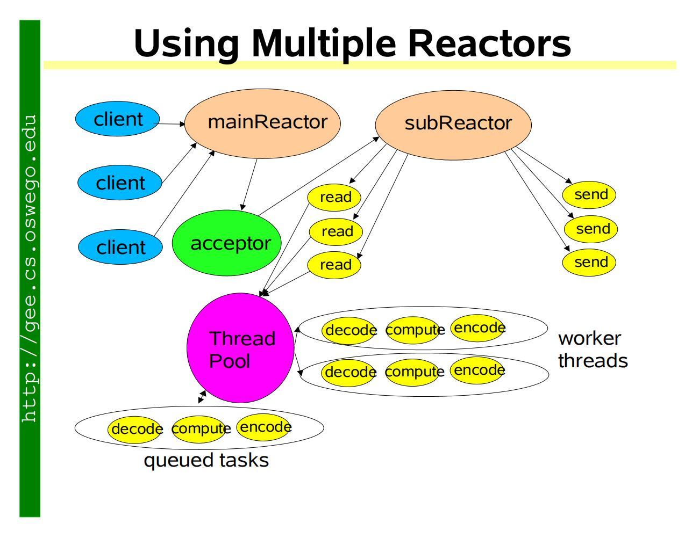
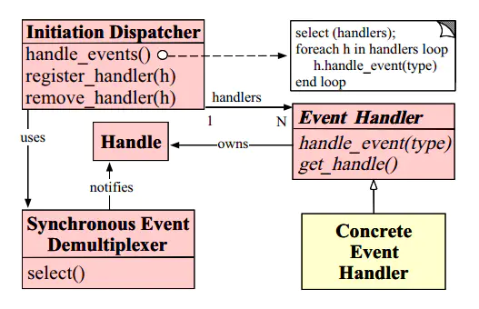
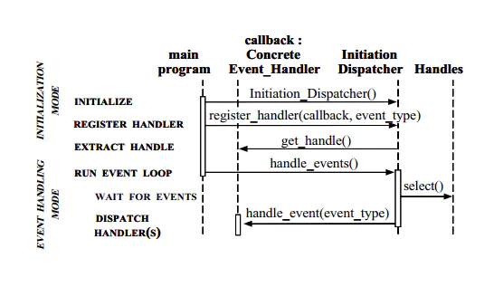
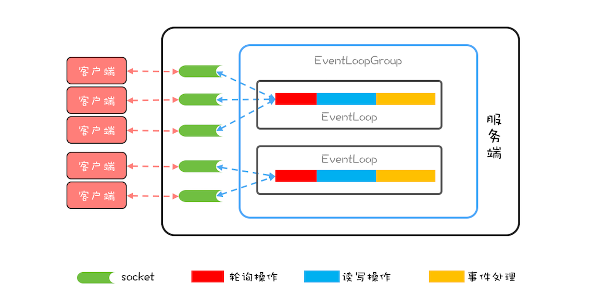

# 源码分析之Netty线程模型  


## 不得不说的Reactor模式

提到Netty，就必须先说一下Reactor模式，源头应该是Doug Lea大神（学java的如果不知道这位神的请自己反思一下……）的`Scalable IO in Java`所提出的`Multiple Reactors`模式，参见下图



如果想知道为何出现Reactor模式，需要将IO发展过程，都说一下可能才会比较清晰，此处就不一一展开，有兴趣的童鞋可以参考这篇帖子：[Reactor模式](https://www.cnblogs.com/crazymakercircle/p/9833847.html)

那么，**什么是Reactor模式呢？**

> Reactor模式是事件驱动模型，有一个或多个并发输入源，有一个Service Handler，有多个Request Handlers；这个Service Handler会同步的将输入的请求（Event）多路复用的分发给相应的Request Handler。从结构上，这有点类似生产者消费者模式，即有一个或多个生产者将事件放入一个Queue中，而一个或多个消费者主动的从这个Queue中Poll事件来处理；而Reactor模式则并没有Queue来做缓冲，每当一个Event输入到Service Handler之后，该Service Handler会主动的根据不同的Event类型将其分发给对应的Request Handler来处理。
>
> 
>
> 该图为Reactor模型，实现Reactor模式需要实现以下几个类：
>
> 1）EventHandler：事件处理器，可以根据事件的不同状态创建处理不同状态的处理器；
>
> 2）Handle：可以理解为事件，在网络编程中就是一个Socket，在数据库操作中就是一个DBConnection；
>
> 3）InitiationDispatcher：用于管理EventHandler，分发event的容器，也是一个事件处理调度器，Tomcat的Dispatcher就是一个很好的实现，用于接收到网络请求后进行第一步的任务分发，分发给相应的处理器去异步处理，来保证吞吐量；
>
> 4）Demultiplexer：阻塞等待一系列的Handle中的事件到来，如果阻塞等待返回，即表示在返回的Handle中可以不阻塞的执行返回的事件类型。这个模块一般使用操作系统的select来实现。在Java NIO中用Selector来封装，当Selector.select()返回时，可以调用Selector的selectedKeys()方法获取Set<SelectionKey>，一个SelectionKey表达一个有事件发生的Channel以及该Channel上的事件类型。
>
> Reactor时序图 如下：
>
> 
>
> 1）初始化InitiationDispatcher，并初始化一个Handle到EventHandler的Map。
>
> 2）注册EventHandler到InitiationDispatcher中，每个EventHandler包含对相应Handle的引用，从而建立Handle到EventHandler的映射（Map）。
>
> 3）调用InitiationDispatcher的handle_events()方法以启动Event Loop。在Event Loop中，调用select()方法（Synchronous Event Demultiplexer）阻塞等待Event发生。
>
> 4）当某个或某些Handle的Event发生后，select()方法返回，InitiationDispatcher根据返回的Handle找到注册的EventHandler，并回调该EventHandler的handle_events()方法。
>
> 5）在EventHandler的handle_events()方法中还可以向InitiationDispatcher中注册新的Eventhandler，比如对AcceptorEventHandler来，当有新的client连接时，它会产生新的EventHandler以处理新的连接，并注册到InitiationDispatcher中。
>
> 引自：https://www.jianshu.com/p/188ef8462100


## Reactor的程序实现


```

void Reactor::handle_events(){
  //通过同步事件多路选择器提供的
  //select()方法监听网络事件
  select(handlers);
  //处理网络事件
  for(h in handlers){
    h.handle_event();
  }
}
// 在主程序中启动事件循环
while (true) {
  handle_events();
```


## Netty中的线程模型

为了实现高性能的IO，Netty的线程模型参考了Reactor模式，但没有完全照搬。

Netty 中最核心的概念是事件循环（EventLoop），其实也就是 Reactor 模式中的 Reactor，负责监听网络事件并调用事件处理器进行处理。程序实现上，EventLoop其实就是指上一小节中的整个while(true)循环

在4.x版本Netty中：

- 网络连接 --> EventLoop ：稳定的 n:1关系，这里的稳定指的是关系一旦确定就不再发生变化。
- EventLoop  --> Java线程 ： 1:1关系
- 所以**一个网络连接只会对应一个Java线程**
  - 最大的好处就是对于一个网络连接的事件处理是单线程的，这样就避免了各种并发问题。

顺便提一句，**Java线程与linux操作系统的线程是1:1关系**，这个可以参考经典的 The C10K Problem那篇文章。

Netty线程模型可以参考这张图



引自：极客时间-《Java并发编程实战》

如图，Netty中，EventLoopGroup由一组 EventLoop 组成。实际使用中，一般都会创建两个 EventLoopGroup，一个称为 bossGroup，一个称为 workerGroup。

之所以会有2个EventLoopGroup，原因在于socket处理网络请求的机制。socket 处理 TCP 网络连接请求，是在一个独立的 socket 中，每当有一个 TCP 连接成功建立，都会创建一个新的 socket，之后对 TCP 连接的读写都是由新创建处理的 socket 完成的。也就是说**处理 TCP 连接请求和读写请求是通过两个不同的 socket 完成的。**

在 Netty 中，bossGroup 就用来处理连接请求的，而 workerGroup 是用来处理读写请求的。bossGroup 处理完连接请求后，会将这个连接提交给 workerGroup 来处理， workerGroup 里面有多个 EventLoop，新的连接会交给哪个 EventLoop 来处理由负载均衡算法决定，目前Netty使用的是**轮询算法**。

### 题外话

Netty 3.x与Netty 4.x 区别较大，有兴趣可以参考这篇文章：[netty3与netty4的区别](https://cloud.tencent.com/developer/article/1120234)


## 使用Netty实现Echo服务

下面给出一个具体例子，来看看实际编码是怎么用Netty的。

学习编程语言时，我们往往会先写个HelloWorld，而在网络通信里，这个“HelloWorld”程序就是Echo服务，也就是A发送任意一个消息给B，B将原封不动的把这条消息返回给A。

学习如何使用Netty，最典型、最权威的当属Netty自己提供的范例，我们可以在Netty源码中找到这些例子，参见https://github.com/netty/netty项目中的example文件夹。

注：一般比较完备的开源项目，都会在代码中给出使用范例，至少有单元测试供大家学习参考。

### 关键点

- 如果 NettybossGroup 只监听一个端口，那 bossGroup 只需要 1 个 EventLoop 就可以了，多了纯属浪费。
- 默认情况下，Netty 会创建“2*CPU 核数”个 EventLoop，由于网络连接与 EventLoop 有稳定的关系，所以事件处理器在处理网络事件的时候是不能有阻塞操作的，否则很容易导致请求大面积超时。如果实在无法避免使用阻塞操作，那可以通过线程池来异步处理。

### Server端

```java
public final class EchoServer {

    static final boolean SSL = System.getProperty("ssl") != null;
    static final int PORT = Integer.parseInt(System.getProperty("port", "8007"));

    public static void main(String[] args) throws Exception {
        // Configure SSL.
        final SslContext sslCtx;
        if (SSL) {
            SelfSignedCertificate ssc = new SelfSignedCertificate();
            sslCtx = SslContextBuilder.forServer(ssc.certificate(), ssc.privateKey()).build();
        } else {
            sslCtx = null;
        }

        // Configure the server.
        EventLoopGroup bossGroup = new NioEventLoopGroup(1);
        EventLoopGroup workerGroup = new NioEventLoopGroup();
        final EchoServerHandler serverHandler = new EchoServerHandler();
        try {
            ServerBootstrap b = new ServerBootstrap();
            b.group(bossGroup, workerGroup)
             .channel(NioServerSocketChannel.class)
             .option(ChannelOption.SO_BACKLOG, 100)
             .handler(new LoggingHandler(LogLevel.INFO))
             .childHandler(new ChannelInitializer<SocketChannel>() {
                 @Override
                 public void initChannel(SocketChannel ch) throws Exception {
                     ChannelPipeline p = ch.pipeline();
                     if (sslCtx != null) {
                         p.addLast(sslCtx.newHandler(ch.alloc()));
                     }
                     //p.addLast(new LoggingHandler(LogLevel.INFO));
                     p.addLast(serverHandler);
                 }
             });

            // Start the server.
            ChannelFuture f = b.bind(PORT).sync();

            // Wait until the server socket is closed.
            f.channel().closeFuture().sync();
        } finally {
            // Shut down all event loops to terminate all threads.
            bossGroup.shutdownGracefully();
            workerGroup.shutdownGracefully();
        }
    }
}

@Sharable
public class EchoServerHandler extends ChannelInboundHandlerAdapter {

    @Override
    public void channelRead(ChannelHandlerContext ctx, Object msg) {
        ctx.write(msg);
    }

    @Override
    public void channelReadComplete(ChannelHandlerContext ctx) {
        ctx.flush();
    }

    @Override
    public void exceptionCaught(ChannelHandlerContext ctx, Throwable cause) {
        // Close the connection when an exception is raised.
        cause.printStackTrace();
        ctx.close();
    }
}

```

```java
/**
正常情况下每个 Channel自己的 ChannelPipeline管理的同一个ChannelHandler Class对象的实例都是直接new的一个新实例，也就是原型模式，而不是单例模式。
@Sharable 表示当前handler将被用于多个ChannelPipeline（单例模式）
*/
@Sharable
public class EchoServerHandler extends ChannelInboundHandlerAdapter {

    @Override
    public void channelRead(ChannelHandlerContext ctx, Object msg) {
        ctx.write(msg);
    }

    @Override
    public void channelReadComplete(ChannelHandlerContext ctx) {
        ctx.flush();
    }

    @Override
    public void exceptionCaught(ChannelHandlerContext ctx, Throwable cause) {
        // Close the connection when an exception is raised.
        cause.printStackTrace();
        ctx.close();
    }
}
```

### Client端

```java 
public final class EchoClient {

    static final boolean SSL = System.getProperty("ssl") != null;
    static final String HOST = System.getProperty("host", "127.0.0.1");
    static final int PORT = Integer.parseInt(System.getProperty("port", "8007"));
    static final int SIZE = Integer.parseInt(System.getProperty("size", "256"));

    public static void main(String[] args) throws Exception {
        // Configure SSL.git
        final SslContext sslCtx;
        if (SSL) {
            sslCtx = SslContextBuilder.forClient()
                .trustManager(InsecureTrustManagerFactory.INSTANCE).build();
        } else {
            sslCtx = null;
        }

        // Configure the client.
        EventLoopGroup group = new NioEventLoopGroup();
        try {
            Bootstrap b = new Bootstrap();
            b.group(group)
             .channel(NioSocketChannel.class)
             .option(ChannelOption.TCP_NODELAY, true)
             .handler(new ChannelInitializer<SocketChannel>() {
                 @Override
                 public void initChannel(SocketChannel ch) throws Exception {
                     ChannelPipeline p = ch.pipeline();
                     if (sslCtx != null) {
                         p.addLast(sslCtx.newHandler(ch.alloc(), HOST, PORT));
                     }
                     //p.addLast(new LoggingHandler(LogLevel.INFO));
                     p.addLast(new EchoClientHandler());
                 }
             });

            // Start the client.
            ChannelFuture f = b.connect(HOST, PORT).sync();

            // Wait until the connection is closed.
            f.channel().closeFuture().sync();
        } finally {
            // Shut down the event loop to terminate all threads.
            group.shutdownGracefully();
        }
    }
}
```

```java
public class EchoClientHandler extends ChannelInboundHandlerAdapter {

    private final ByteBuf firstMessage;

    /**
     * Creates a client-side handler.
     */
    public EchoClientHandler() {
        firstMessage = Unpooled.buffer(EchoClient.SIZE);
        for (int i = 0; i < firstMessage.capacity(); i ++) {
            firstMessage.writeByte((byte) i);
        }
    }

    @Override
    public void channelActive(ChannelHandlerContext ctx) {
        ctx.writeAndFlush(firstMessage);
    }

    @Override
    public void channelRead(ChannelHandlerContext ctx, Object msg) {
        ctx.write(msg);
    }

    @Override
    public void channelReadComplete(ChannelHandlerContext ctx) {
       ctx.flush();
    }

    @Override
    public void exceptionCaught(ChannelHandlerContext ctx, Throwable cause) {
        // Close the connection when an exception is raised.
        cause.printStackTrace();
        ctx.close();
    }
}
```

## 参考资料

- [你真的了解Netty中@Sharable？](https://www.jianshu.com/p/5e90e0a70446)
- 极客时间-java并发编程实战
- Scalable IO in Java, Doug Lea
- [Reactor模式详解＋源码实现](https://www.jianshu.com/p/188ef8462100)

