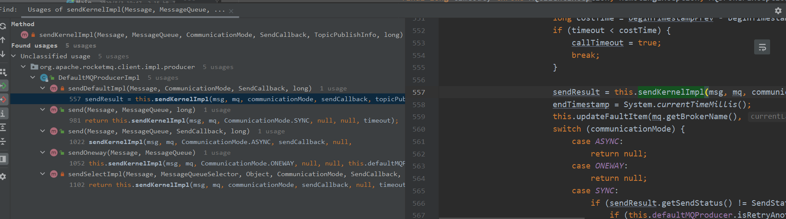

# 源码分析之rocketmq和kafka如何处理消息压缩


## 消息压缩

mq在传递消息时，在面对大数据量的情况下，网卡可能会被打满，那这种情况下可以压缩消息、减小消息体积，进一步提高mq的吞吐量。

比如在rocketmq kafka中都有压缩消息。

## rocketmq producer如何压缩消息

以`DefaultMQProducerImpl`为例，可以看到压缩消息的逻辑在`sendKernelImpl`方法中，这个工具方法的引用情况如下：



`sendKernelImpl`方法中，拿到消息的字节流后，将会尝试对消息进行压缩

```
private SendResult sendKernelImpl(final Message msg,
                                      final MessageQueue mq,
                                      final CommunicationMode communicationMode,
                                      final SendCallback sendCallback,
                                      final TopicPublishInfo topicPublishInfo,
                                      final long timeout) throws MQClientException, RemotingException, MQBrokerException, InterruptedException {
	...
	 if (this.tryToCompressMessage(msg)) {
         sysFlag |= MessageSysFlag.COMPRESSED_FLAG;
         msgBodyCompressed = true;
     }
    ...
}
```

```java
private boolean tryToCompressMessage(final Message msg) {
        if (msg instanceof MessageBatch) {
            //batch dose not support compressing right now
            return false;
        }
        byte[] body = msg.getBody();
        if (body != null) {
            if (body.length >= this.defaultMQProducer.getCompressMsgBodyOverHowmuch()) {
                try {
                    byte[] data = UtilAll.compress(body, zipCompressLevel);
                    if (data != null) {
                        msg.setBody(data);
                        return true;
                    }
                } catch (IOException e) {
                    log.error("tryToCompressMessage exception", e);
                    log.warn(msg.toString());
                }
            }
        }

        return false;
    }
```

可以看到，默认情况下，rocketmq在消息长度>=4k时（`body.length >= this.defaultMQProducer.getCompressMsgBodyOverHowmuch()`），将调用工具类对消息进行压缩，压缩算法为zip（使用`java.util.zip.Deflater`），压缩级别默认为5（可以通过设置属性`rocketmq.message.compressLevel`来修改）。


## kafka如何压缩消息


